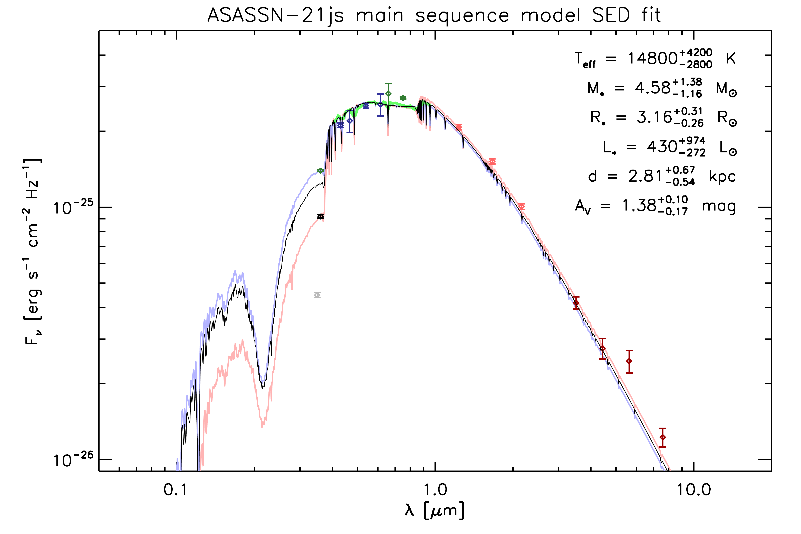
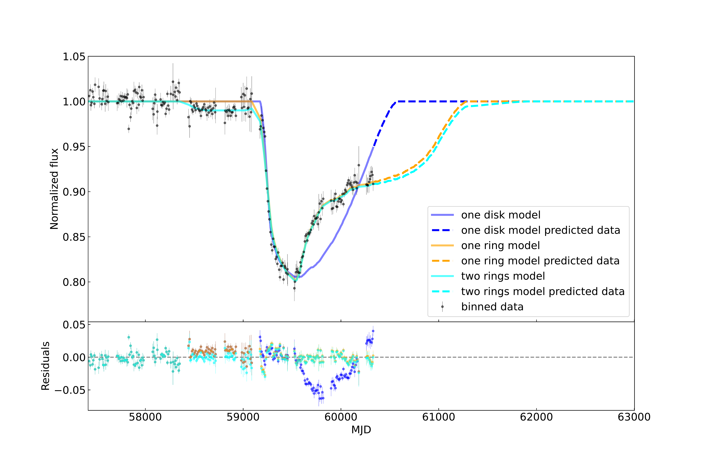

$\newcommand{\ensuremath}{}$
$\newcommand{\xspace}{}$
$\newcommand{\object}[1]{\texttt{#1}}$
$\newcommand{\farcs}{{.}''}$
$\newcommand{\farcm}{{.}'}$
$\newcommand{\arcsec}{''}$
$\newcommand{\arcmin}{'}$
$\newcommand{\ion}[2]{#1#2}$
$\newcommand{\textsc}[1]{\textrm{#1}}$
$\newcommand{\hl}[1]{\textrm{#1}}$
$\newcommand{\footnote}[1]{}$
$\newcommand{\kms}{km~s^{-1}}$
$\newcommand{\mum}{\mum}$
$\newcommand{\Msun}{M_\odot}$
$\newcommand{\Teff}{T_{\rm{eff}}}$
$\newcommand{\Av}{A_{\rm{V}}}$
$\newcommand{\arraystretch}{1.5}$

# ASASSN-21js: A multi-year transit of a ringed disc

<mark>Appeared on: 2024-08-14</mark> -  _9 pages, 4 figures, 6 tables, repository for paper at: this https URL_

T. H. Pramono, M. A. Kenworthy, <mark>R. v. Boekel</mark>

**Abstract:**            The early-type star ASASSN-21js started to fade in 2021, as was detected by the All Sky Automated Survey for Supernovae, undergoing a multi-year eclipse that is still underway. We interpret this event as being due to a structured disc of material transiting in front of the star. The disc is in orbit around a substellar object with the mass and luminosity of a brown dwarf or smaller. We want to determine the expected duration and ending date of the eclipse. We modelled a tilted and inclined azimuthally symmetric ring system around an unseen companion and calculated the resulting time-varying light curve as the object transited in front of the star. We made an initial estimate of the ring parameters and used these as inputs to an MCMC algorithm to determine the geometric properties of the rings with associated uncertainties. The model most consistent with the light curve to date is a two-ring system at high inclination with respect to the line of sight that has a semi-major axis of 71.6 stellar radii. With an estimate of the stellar radius, the transverse velocity is around 0.7 km/s, which if bound to the star is an orbit with a semi-major axis of around 13000 au, placing it in the Oort cloud of the parent star. The transit is ongoing and will finish around MJD 61526 (May 1 2027). We encourage the community to continue observing this object in order to understand its properties.         

**Figure 1. -** SED fit to the literature photometry and spectroscopy of ASASSN-21js. Data taken from (1) [Drew, Gonzalez-Solares and Greimel (2014)](), (2) [Evans, Irwin and Helmer (2002)](), (3) [Skrutskie, Cutri and Stiening (2006)](), (4) [Benjamin, Churchwell and Babler (2003)](), [Churchwell, Babler and Meade (2009)](), (5) \citet[][submitted to PASA]{2024arXiv240202015O}, (6) [Vallenari and Brown (2023)](). (*fig:stellar_SED_fit*)

**Figure 2. -** Plot of different models fitted to the data, which has been binned to 9 day intervals. (*fig:model_combine*)

**Figure 3. -** Corner plot for the two ring model system. (*fig:two_ring_corner*)

