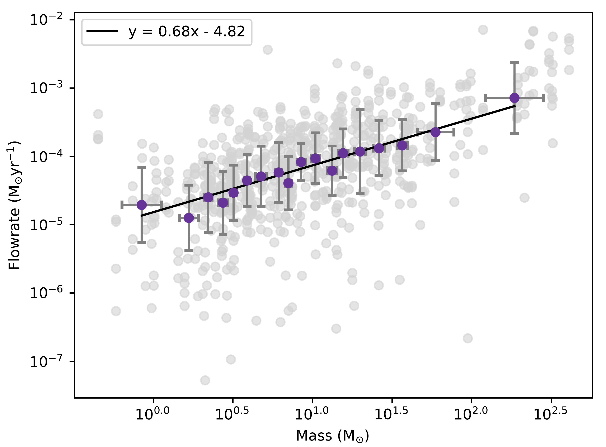
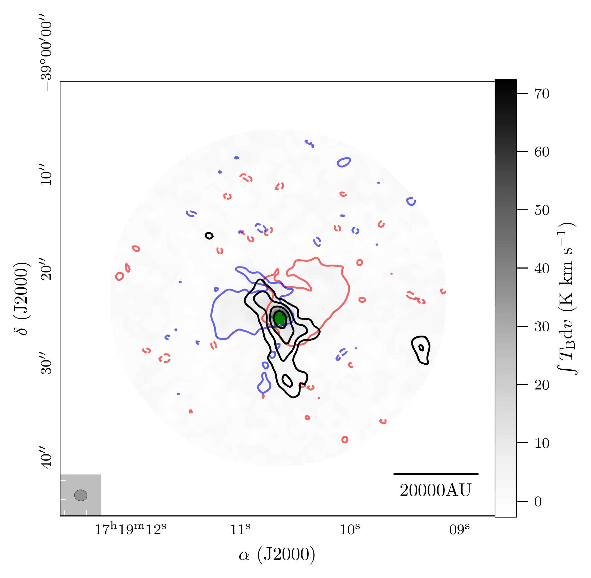
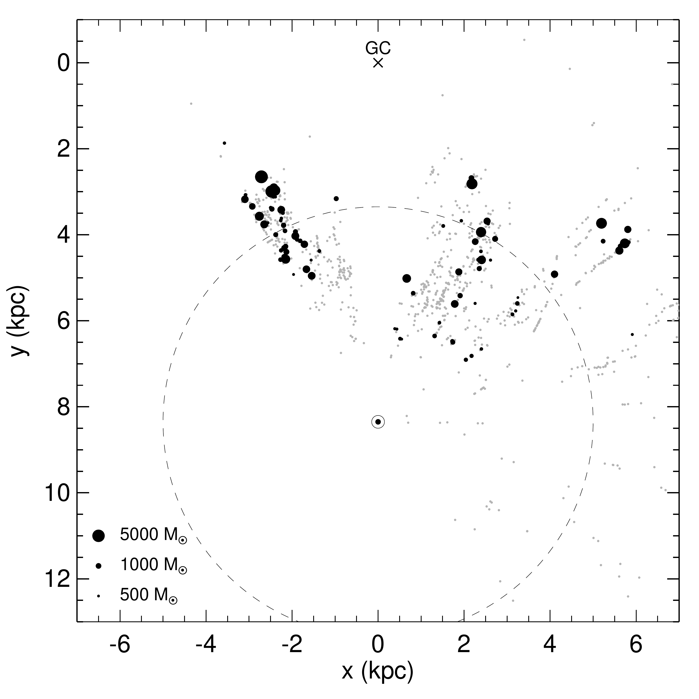

$\newcommand{\ensuremath}{}$
$\newcommand{\xspace}{}$
$\newcommand{\object}[1]{\texttt{#1}}$
$\newcommand{\farcs}{{.}''}$
$\newcommand{\farcm}{{.}'}$
$\newcommand{\arcsec}{''}$
$\newcommand{\arcmin}{'}$
$\newcommand{\ion}[2]{#1#2}$
$\newcommand{\textsc}[1]{\textrm{#1}}$
$\newcommand{\hl}[1]{\textrm{#1}}$
$\newcommand{\footnote}[1]{}$
$\newcommand{\HII}{H{\sc ii}}$
$\newcommand{\flowrate}{10^{-4}~M_{\sun}\mathrm{yr}^{-1}}$

# Dynamical Accretion Flows

<mark>Appeared on: 2024-08-16</mark> -  _11 pages, 11 figures, accepted for publication in A&A_

M. R. A. Wells, et al. -- incl., <mark>H. Beuther</mark>

**Abstract:** Investigation of the flow of material along filamentary structures towards the central core can help provide insight into high-mass star formation and evolution. Our main motivation is to answer the question: what are the properties of accretion flows in star-forming clusters? We use data from the ALMA Evolutionary Study of High Mass Protocluster Formation in the Galaxy (ALMAGAL) survey to study 100 ALMAGAL regions at $\sim$ 1 $\arcsec$ resolution located between $\sim$ 2 and 6 kpc distance. Making use of the ALMAGAL $\sim$ 1.3mm line and continuum data we estimate flow rates onto individual cores. We focus specifically on flow rates along filamentary structures associated with these cores. Our primary analysis is centered around position velocity cuts in $H_2$ CO (3 $_{0,3}$ - 2 $_{0,2}$ ) which allow us to measure the velocity fields, surrounding these cores. Combining this work with column density estimates we derive the flow rates along the extended filamentary structures associated with cores in these regions. We select a sample of 100 ALMAGAL regions covering four evolutionary stages from quiescent to protostellar, Young Stellar Objects (YSOs), and $\HII$ regions (25 each). Using dendrogram and line analysis, we identify a final sample of 182 cores in 87 regions. In this paper, we present 728 flow rates for our sample (4 per core), analysed in the context of evolutionary stage, distance from the core, and core mass. On average, for the whole sample, we derive flow rates on the order of $\sim$ $\flowrate$ with estimated uncertainties of $\pm$ 50 \% . We see increasing differences in the values among evolutionary stages, most notably between the less evolved (quiescent/protostellar) and more evolved (YSO/ $\HII$ region) sources and we also see an increasing trend as we move further away from the centre of these cores. We also find a clear relationship between the calculated flow rates and core masses $\sim$ M $^{2/3}$ which is in line with the result expected from the tidal-lobe accretion mechanism. The significance of these relationships is tested with Kolmogorov-Smirnov and Mann-Whitney U tests. Overall, we see increasing trends in the relationships between the flow rate and the three investigated parameters; evolutionary stage, distance from the core, and core mass.

**Figure 8. -** Scatter plot of the results of the whole sample showing flow rate vs. core mass in grey. The purple points are the average flow rate/mass values per bin, with the associated errors. Here, each bin contains the same number of cores. A line of best fit is shown in black. (*fig:coremass*)

**Figure 3. -** 0th moment map of SO ($6_5$ - $5_4$) in grey-scale for source AG348.5792-0.9197 overlaid with continuum contours in black (levels 3,6,9 $\sigma_{cont}$). A green star to show the peak intensity position of the core. Red and blue contours show the "wings" of the spectral line emission, from 3 to 20 kms$^{-1}$ either side, with respect to the region velocity of rest. (*fig:outflow*)

**Figure 1. -** Source distribution for the regions in our ALMAGAL sub-sample is shown as black dots. The size of the markers scales with the masses of the ALMAGAL clumps. Grey dots are the rest of the ALMAGAL survey and the dashed line is a heliocentric distance circle at 5 kpc. (*fig:survey*)

