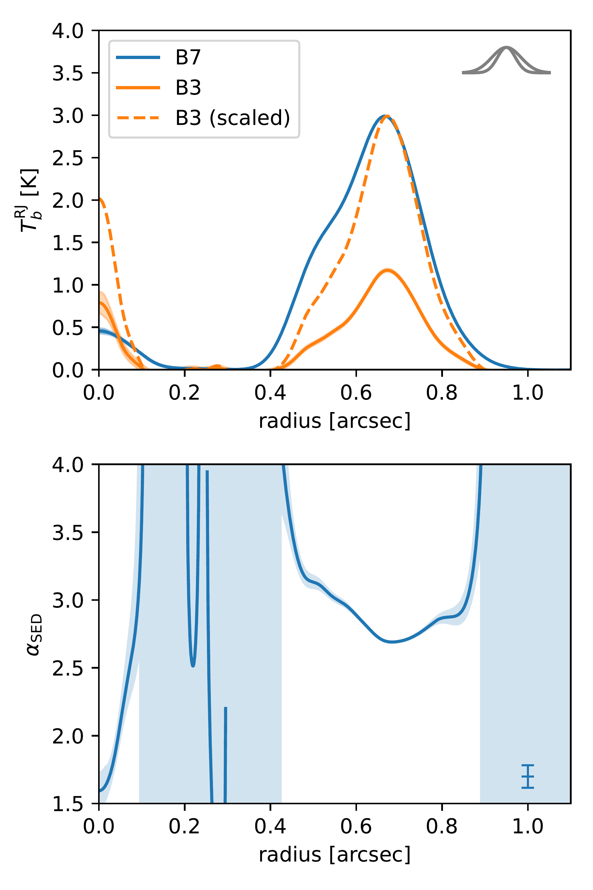
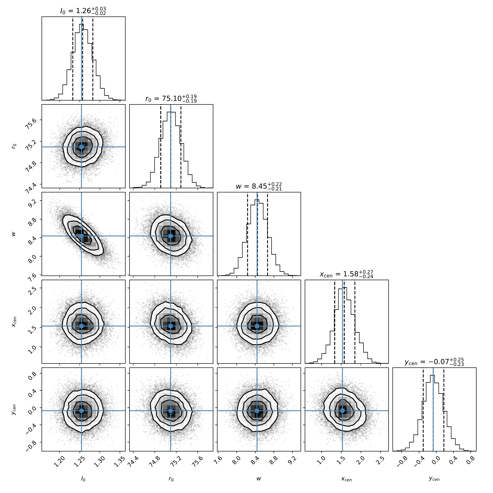
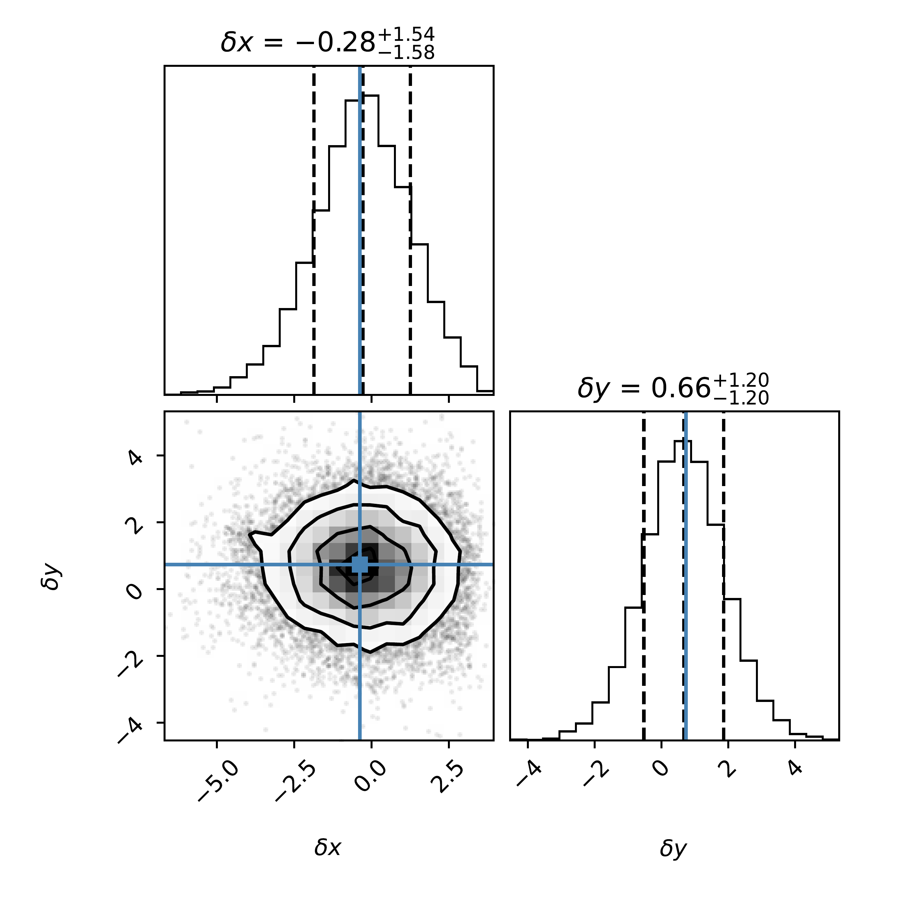

$\newcommand{\ensuremath}{}$
$\newcommand{\xspace}{}$
$\newcommand{\object}[1]{\texttt{#1}}$
$\newcommand{\farcs}{{.}''}$
$\newcommand{\farcm}{{.}'}$
$\newcommand{\arcsec}{''}$
$\newcommand{\arcmin}{'}$
$\newcommand{\ion}[2]{#1#2}$
$\newcommand{\textsc}[1]{\textrm{#1}}$
$\newcommand{\hl}[1]{\textrm{#1}}$
$\newcommand{\footnote}[1]{}$
$\newcommand{\vdag}{(v)^\dagger}$
$\newcommand$
$\newcommand$

# Asymmetric dust accumulation of the PDS 70 disk revealed by ALMA Band 3 observations

<mark>Appeared on: 2024-08-20</mark> -  _submitted_

K. D. (土井聖明), et al. -- incl., <mark>M. Benisty</mark>

**Abstract:** The PDS 70 system, hosting two planets within its disk, is an ideal target for examining the effect of planets on dust accumulation, growth, and ongoing planet formation.Here, we present high-resolution ( $0\farcs07 = 8  \mathrm{au}$ ) dust continuum observations of the PDS 70 disk in ALMA Band 3 (3.0 mm).While previous Band 7 observations showed a dust ring with slight asymmetry, our Band 3 observations reveal a more prominent asymmetric peak in the northwest direction, where the intensity is 2.5 times higher than in other directions and the spectral index is at the local minimum with $\alpha_{\mathrm{SED}} \sim 2.2$ .This indicates that a substantial amount of dust is accumulated both radially and azimuthally in the peak.We also detect point-source emission around the stellar position in the Band 3 image, which is likely to be free-free emission.We constrain the eccentricity of the outer ring to be $e<0.04$ from the position of the central star and the outer ring.From the comparison with numerical simulations, we constrain the mass of PDS 70c to be less than 4.9 Jupiter masses if the gas turbulence strength $\alpha_{\mathrm{turb}} = 10^{-3}$ .Then, we discuss the formation mechanism of the disk structures and further planet formation scenarios in the disk.

**Figure 2. -** 
      Top: The radial profile of the intensity in Band 7 (blue) and Band 3 (orange).
      The dashed line represents the Band 3 profile scaled to match the peak intensity of Band 7 for comparison of the radial morphology.
      The Gaussian in the upper right corner shows the major and minor axes of the beam after deprojection.
      Bottom: The radial profile of the spectral index.
      The shaded area represents the $1\sigma$ error range due to thermal noise.
      The error bar in the lower right corner indicates the $1\sigma$ error range due to the absolute flux calibration uncertainty.
     (*fig:PDS70_radial*)

**Figure 6. -** 
    The corner plot of MCMC fitting for the ring of PDS 70 in Band 3. The dashed lines in the top panels show the 16th, 50th, and 84th percentiles of the marginal distributions. The blue lines show the parameters that maximize the joint probability. (*fig:MCMC_B3_ring*)

**Figure 3. -** 
    The corner plot of the difference in the center position between the ring and the central source in Band 3.
    It shows that the center of the ring and the central source are consistent.
     (*fig:MCMC_B3_center_shift*)

