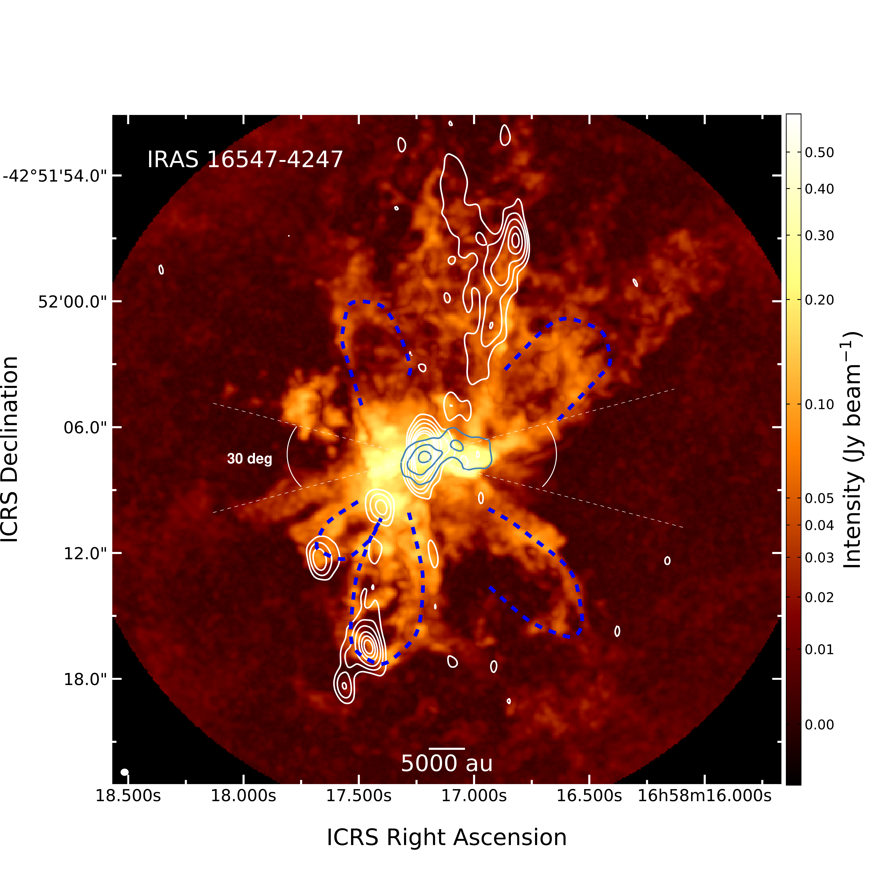
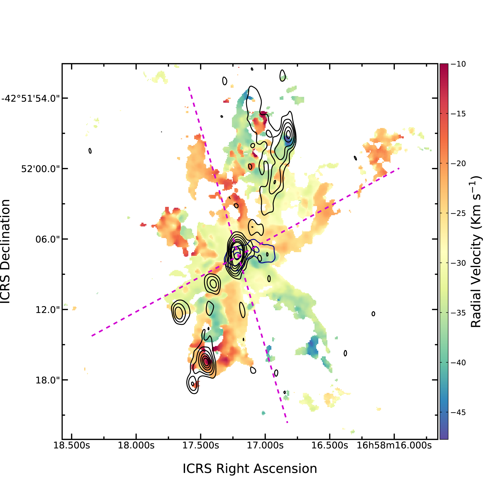
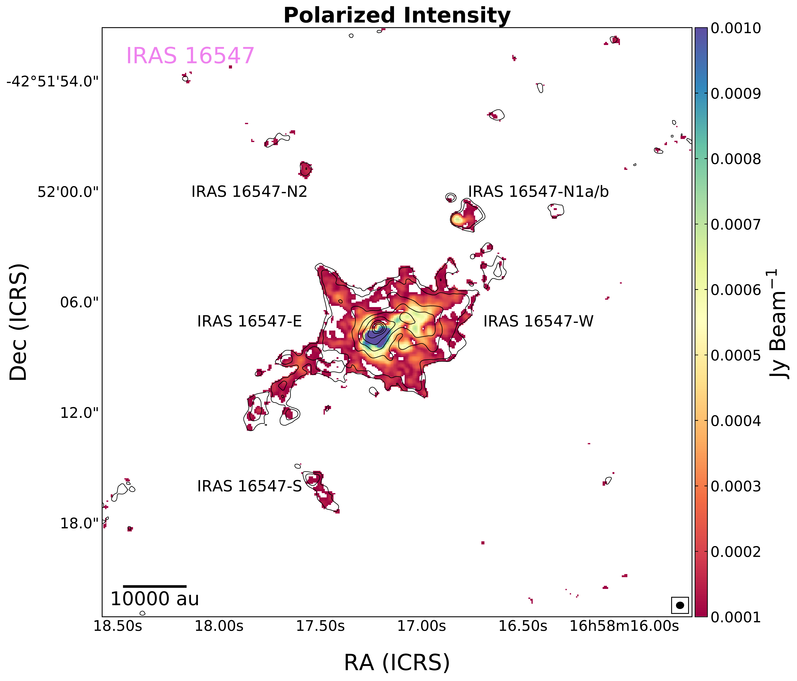
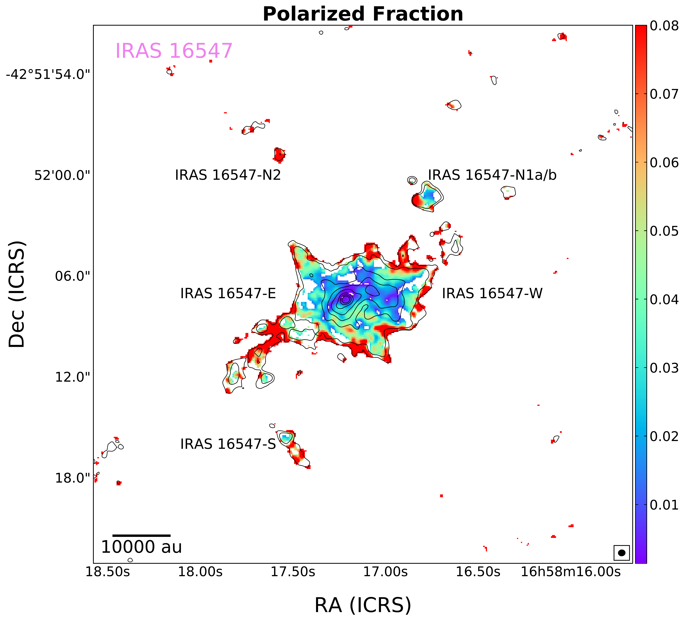

$\newcommand{\ensuremath}{}$
$\newcommand{\xspace}{}$
$\newcommand{\object}[1]{\texttt{#1}}$
$\newcommand{\farcs}{{.}''}$
$\newcommand{\farcm}{{.}'}$
$\newcommand{\arcsec}{''}$
$\newcommand{\arcmin}{'}$
$\newcommand{\ion}[2]{#1#2}$
$\newcommand{\textsc}[1]{\textrm{#1}}$
$\newcommand{\hl}[1]{\textrm{#1}}$
$\newcommand{\footnote}[1]{}$
$\newcommand{\vdag}{(v)^\dagger}$
$\newcommand$
$\newcommand$
$\newcommand{\dechms}[4]{#1^{\rm h}#2^{\rm m}#3\mbox{^{\rm s}\mskip-7.6mu. }#4}$
$\newcommand{\intdms}[3]{#1^{\circ}#2'#3"}$
$\newcommand{\decdms}[4]{-#1^{\circ}#2'#3\mbox{"\mskip-7.6mu. }#4}$

# Magnetic Fields in Massive Star-forming Regions (MagMaR) IV: Tracing the Magnetic Fields in the O-type protostellar system IRAS 16547$-$4247

<mark>Appeared on: 2024-08-20</mark> -  _Accepted by the Astrophysical Journal, 13 pages_

L. A. Zapata, et al. -- incl., <mark>H. Beuther</mark>, <mark>S. Li</mark>

**Abstract:** The formation of the massive stars, and in particular, the role that the magnetic fields play in their early evolutionary phase is still farfrom being completely understood. Here, we present Atacama Large Millimeter/Submillimeter Array (ALMA) 1.2 mm full polarizedcontinuum, and H $^{13}$ CO $^+$ (3 $-$ 2), CS(5 $-$ 4), and HN $^{13}$ C(3 $-$ 2) line observations with a high angular resolution( $\sim$ 0.4 $"$ or 1100 au). In the 1.2 mm continuum emission, we reveal a dusty envelope surrounding the massive protostars, IRAS16547-E and IRAS16547-W,with dimensions of $\sim$ 10,000 au. This envelope has a bi-conical structure likely carved by the powerful thermal radio jet present in region.The magnetic fields vectors follow very-well the bi-conical envelope. The polarization fraction is $\sim$ 2.0 \% in this region.Some of these vectors seem to converge to IRAS 16547-E, and IRAS 16547-W, the most massive protostars. Moreover, the velocityfields revealed from the spectral lines H $^{13}$ CO $^+$ (3 $-$ 2), and HN $^{13}$ C(3 $-$ 2) show velocity gradients with agood correspondence with the magnetic fields, that maybe are tracing the cavities of molecular outflows or maybe in some parts infall.We derived a magnetic field strength in some filamentary regions that goes from 2 to 6.1 mG.  We also find that the CS(5 $-$ 4) molecularline emission reveals multiple outflow cavities or bow-shocks with different orientations, some of which seem to follow the NW-SE radio thermal jet.

**Figure 4. -** \scriptsize ALMA magnetic field vectors overlaid onto the resulting 1.2 mm continuum emission (Stokes I) from IRAS 16547$-$4247.
The white vector segments trace the polarization percentage.  The vector segment is displayed more or less per every beam,
using only data with a 2$\sigma$ cut in the debiasing process. The black contours are from $-$0.5, 0.5, 1, 5, 10, 20, 40, and 60 times 0.2 mJy Beam$^{-1}$ the RMS-noise of the image.
The red contours are from $-$5, 5, 10, 20, 40, 60, 80, and 180 times the RMS-noise of the
VLA 3.6 cm continuum emission, which is 20 $\mu$Jy Beam$^{-1}$.   The 3.6 cm continuum emission delineates the radio thermal jet  with  a NW-SE
orientation reported by [Garay, et. al (2003)](), [Rodríguez, Moran and Franco-Hernández (2008)](). The synthesized beam (half-power contour) of the ALMA continuum image is shown in the bottom-right corner.
The scale bar in the right represent the peak flux of the ALMA 1.2 mm continuum emission. The dashed lines trace more or less the bi-conical dusty envelope revealed in this study.
The white circle traces the primary beam or the FWHM of 22.7$"$. The yellow dots trace the positions of the sources reported in Table   \ref{table1}. (*fig:fig1*)

**Figure 3. -** \scriptsize Upper: ALMA moment 8 map of the CS(5$-$4) from IRAS 16547$-$4247 overlaid onto the resulting 1.2 mm continuum emission (grey contours),
and the VLA 3.6 cm continuum emission (white contours). The grey contours are from 50, 125, and 375 times 0.2 mJy Beam$^{-1}$.
The white contours are from $-$5, 5, 10, 20, 40, 60, 80, and 180 times the RMS-noise of the VLA 3.6 cm continuum emission, which is 20 $\mu$Jy Beam$^{-1}$.
The 3.6 cm continuum emission delineates a radio free-free jet  with NW-SE  orientation reported by [Garay, et. al (2003)](), [Rodríguez, Moran and Franco-Hernández (2008)]().
The synthesized beam (half-power contour) of the ALMA continuum image is shown in the bottom-right corner.
The scale bar in the right represents the peak flux of the ALMA CS line emission. The blue dashed curves trace more or less the multiple bow-shocks and outflow cavities revealed by this molecule.
 The white lines show that aperture angle of the outflow is more than 150$^\circ$ in the north and south sides.
 Lower: Same as the upper image but with the ALMA moment 1 map of the CS(5$-$4). The scale bar in the right represents the radial velocity of the ALMA CS line emission.
  The magenta dashed lines mark the orientation of the CO(3$-$2) ouflows reported by [Higuchi, Saigo and Chibueze (2015)]().
 (*fig:fig5*)

**Figure 5. -** \scriptsize Left Panel: ALMA Polarization Intensity map overlaid with the 1.2 mm continuum emission from IRAS 16547$-$4247.
Right Panel: Same as the left panel, but showing the ALMA Polarization Fraction. In both panels, the black contours are from $-$0.5, 0.5, 1, 5, 10, 20, 40,  and 60
times 0.2 mJy Beam$^{-1}$ the RMS-noise of the image.  The synthesized beam (half-power contour) of the ALMA continuum
 image is shown in the bottom-right corner. The scale bar in the right represents the de-biased polarization intensity, and polarization fraction.
 These maps were constructed with a threshold of 2$\sigma$ for the polarization.   (*fig:fig2*)

