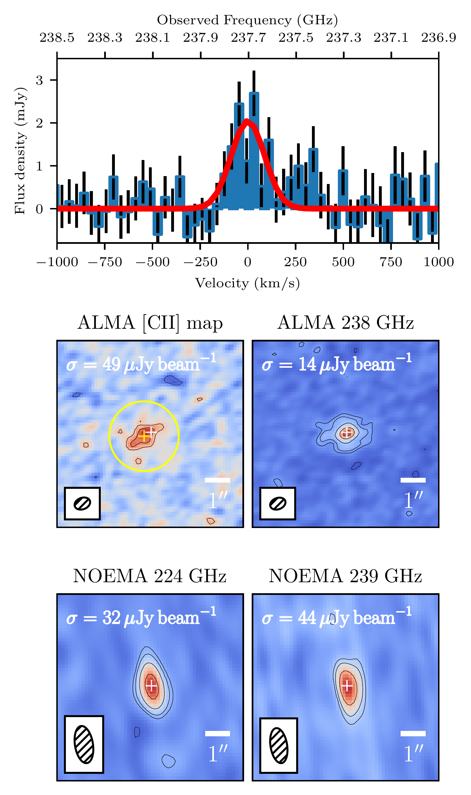
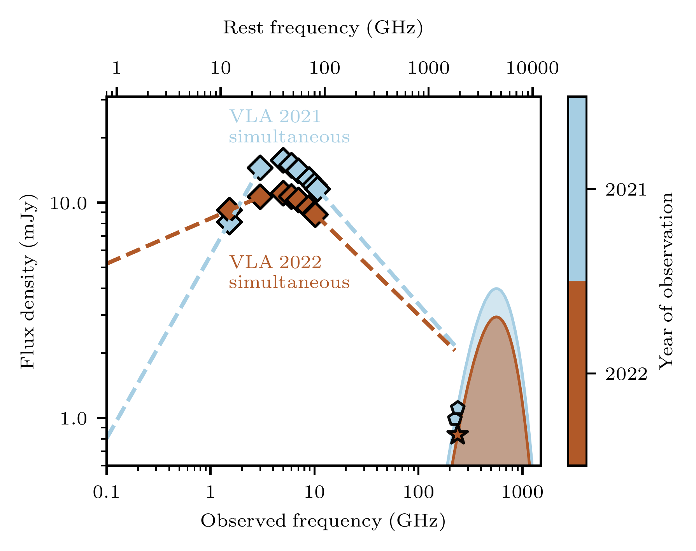
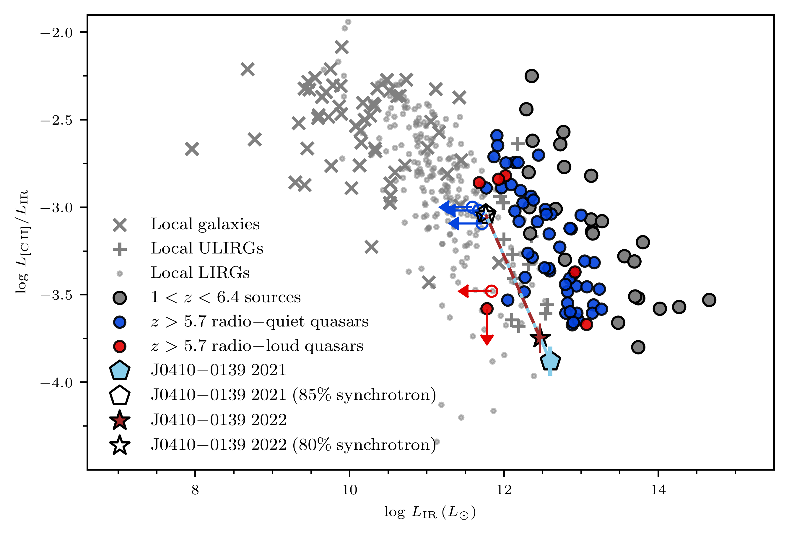

$\newcommand{\ensuremath}{}$
$\newcommand{\xspace}{}$
$\newcommand{\object}[1]{\texttt{#1}}$
$\newcommand{\farcs}{{.}''}$
$\newcommand{\farcm}{{.}'}$
$\newcommand{\arcsec}{''}$
$\newcommand{\arcmin}{'}$
$\newcommand{\ion}[2]{#1#2}$
$\newcommand{\textsc}[1]{\textrm{#1}}$
$\newcommand{\hl}[1]{\textrm{#1}}$
$\newcommand{\footnote}[1]{}$
$\newcommand{\vdag}{(v)^\dagger}$
$\newcommand$
$\newcommand$
$\newcommand{\blazar}{J0410--0139}$
$\newcommand{\lya}{\ensuremath{\text{Ly}\alpha}}$
$\newcommand{\nv}{\ensuremath{\text{N} \textsc{v}}}$
$\newcommand{\lyaew}{\mathrm{EW}(\lya + \nv)}$
$\newcommand{\hi}{\ensuremath{\text{H} \textsc{i}}}$
$\newcommand{\kms}{{\rm km s}\ensuremath{^{-1}}}$
$\newcommand\aliii{\ensuremath{\text{Al \textsc{iii}}}}$
$\newcommand\siiii{\ensuremath{\text{Si \textsc{iii]}}}}$
$\newcommand\siiv{\ensuremath{\text{Si \textsc{iv}}}}$
$\newcommand\civ{\ensuremath{\text{C \textsc{iv}}}}$
$\newcommand\mgii{\ensuremath{\text{Mg \textsc{ii}}}}$
$\newcommand\heii{\ensuremath{\text{He \textsc{ii}}}}$
$\newcommand\feii{\ensuremath{\text{Fe \textsc{ii}}}}$
$\newcommand\feiii{\ensuremath{\text{Fe \textsc{iii}}}}$
$\newcommand\cii{\ensuremath{\text{[C \textsc{ii]}}}}$
$\newcommand\ciii{\ensuremath{\text{C \textsc{iii]}}}}$
$\newcommand\ciilong{\ensuremath{\text{[C \textsc{ii]}}_{158 \mu\text{m}}}}$
$\newcommand\heii{\ensuremath{\text{He \textsc{ii}}}}$
$\newcommand\oiiibr{\ensuremath{\text{O \textsc{iii]}}}}$
$\newcommand\halpha{\ensuremath{\text{H}\alpha}}$
$\newcommand{\km}{{\rm km}}$
$\newcommand{\kmsdeg}{{\rm km s^{-1} deg^{-1}}}$
$\newcommand{\kmskpc}{{\rm km s^{-1} kpc^{-1}}}$
$\newcommand{\mas}{{\rm mas}}$
$\newcommand{\masyr}{{\rm mas/yr}}$
$\newcommand{\kpc}{{\rm kpc}}$
$\newcommand{\kpcdeg}{{\rm kpc deg^{-1}}}$
$\newcommand{\mpc}{{\rm Mpc}}$
$\newcommand{\hmpc}{{h^{-1} \rm Mpc}}$
$\newcommand{\hkpc}{{h^{-1} \rm kpc}}$
$\newcommand{\lnu}{{\rm erg s^{-1} Hz^{-1}}}$

# [CII] properties and Far-Infrared variability of a $z=7$ blazar

<mark>Appeared on: 2024-08-23</mark> -  _Version after addressing referee report. See also companion paper: arXiv:2407.07236_

E. Ba{ñ}ados, et al. -- incl., <mark>Y. Khusanova</mark>, <mark>F. Walter</mark>

**Abstract:** We present millimeter observations of the host galaxy of the most distant blazar known, VLASS J041009.05 $-$ 013919.88 (hereafter J0410--0139) at $z=7$ , using ALMA and NOEMA observations. The ALMA data reveal a $(2.02\pm 0.36)\times 10^{42}$ erg s $^{-1}$ $\cii$ 158 $\mu$ m emission line at $z=6.9964$ with a $\cii$ -inferred star-formation rate of $58\pm 9 M_\odot $ yr $^{-1}$ .We estimate a dynamical mass of $M_{\rm dyn,\cii}=(4.6\pm 2.0)\times 10^9 M_\odot$ , implying a black hole mass to host a dynamical mass ratio of $0.15^{+0.08}_{-0.05}$ .The 238 GHz continuum (rest-frame IR) decreased by $\sim33\%$ from the NOEMA to the ALMA observations taken $\sim$ 10 months apart.  The VLA 3--10 GHz radio flux densities showed a $\sim37\%$ decrease in a similar time frame, suggesting a causal connection. At face value, $\blazar$ would have the lowest $\cii$ -to-IR luminosity ratio of a $z>5.7$ quasar reported to date ( $\sim10^{-4}$ ). However, if only $<20\%$ of the measured IR luminosity were due to thermal emission from dust, the $\cii$ -to-IR luminosity ratio would be typical of (U)LIRGS, and the star formation rates derived from $\cii$ and IR luminosities would be consistent.These results provide further evidence that synchrotron emission significantly contributes to the observed rest-frame IR emission of $\blazar$ , similar to what has been reported in some radio-loud AGN at $z<1$ .

**Figure 1. -** \small**ALMA and NOEMA observations of $\blazar$**. _Top:_ Continuum-subtracted \cii spectrum, extracted from a $1$\farcs$5$ radius aperture (yellow circle in the next panel). The red line is a Gaussian fit to the data (a second Gaussian can be fitted at $\sim300$ km s$^{-1}$, but we found this not to be statistically significant; see Section \ref{sec:ciiprop}). The \cii measured properties, luminosity, and star-formation rate are listed in Table \ref{tab:properties}. The \cii line is not detected in the NOEMA data.
_Middle:_ ALMA \cii(left) and continuum (right) maps. The beam size for these observations is $0$\farcs$49\times 0$\farcs$68$.  The \cii map is the average over 247 $\kms$(1.2$\times$ FWHM of the spectrum shown in the top panel).
The yellow circle is the $1$\farcs$5$ radius aperture centered on the \cii centroid (yellow cross) used to extract the \cii spectrum.
_Bottom:_ NOEMA continuum maps at 224 (left) and 239 (right) GHz, with beam sizes: $0$\farcs$78\times 1$\farcs$63$(left) and $0$\farcs$72\times 1$\farcs$53$(right). The source is unresolved in the NOEMA observations.
The optical position of the quasar is shown with a white cross on each panel, which is consistent with the peak of the ALMA and NOEMA continuum, but the peak of the \cii map is offset by $0$\farcs$35$(yellow cross in \cii map).
All contour plots are shown at $\pm[3, 5, 10, 20, 30]\sigma$(dashed contours represent negative values). The $\sigma$ for each map is at the top left corner of each panel.
 (*fig:alma_noema*)

**Figure 3. -** \small**Spectral energy distribution (SED) in the radio and (sub)mm regime of $\blazar$**. The data points are color-coded by year of observation for visualization purposes. Only the observations taken at a similar epoch in 2021 and 2022 are shown (see Fig. 2 in  ([Bañados, Momjian and Connor 2024]())  for the full SED and other epochs). The VLA 2021 and 2022 observations were taken in the same observing block, yielding a quasi-simultaneous view of the SED  (within 15 minutes in the rest frame).
The VLA 2021 and NOEMA observations are taken 6.5 days apart in the source's rest frame, while the VLA 2022 and ALMA observations are 2.8 days apart. The dashed lines are power-law extrapolations from the VLA low and high-frequency measurements. The pentagons and star show the NOEMA and ALMA measurements, respectively (see also Fig. \ref{fig:alma_noema}). The $\sim 238 $GHz continuum decreased by $\sim$33\% from the NOEMA 2021 to ALMA 2022 measurements. The VLA flux densities above 3 GHz decreased on average by $\sim 37\%$ from 2021 to 2022 (see Sect. \ref{sec:variability}), strongly suggesting that the differences between the NOEMA and ALMA data are due to the variability of the synchrotron emission.
In contrast, we show models of modified black-body emission (with typical dust temperatures of $T_{\rm d}=47 $K and emissivity index of $\beta=1.6$) with the colored curves. By failing to account for the IR contribution of the synchrotron emission, single-epoch measurements of cold gas in the host galaxy would be very different---and incorrect.
 (*fig:sed*)

**Figure 4. -** **Ratio of [CII] to IR luminosities ($8-1000 \mu$m) vs. IR luminosities.  ** The local galaxies and the high-redshift sources that are _not_ quasars are compiled as in [Bañados, Decarli and Walter (2015)](), including data from [Malhotra, Kaufman and Hollenbach (2001)](), [Luhman, Satyapal and Fischer (2003)](), [Díaz-Santos, Armus and Charmandaris (2013)](), [Cormier and Lebouteiller (2014)](). The $z>5.7$ radio-quiet quasars are from [Venemans, Walter and Neeleman (2020)]() and Wang et al. (2024). The  FIR ($42.5-122.5 \mu$m) luminosities from [Venemans, Walter and Neeleman (2020)]() are converted as $L_{\rm TIR}= 1.41\times L_{\rm FIR}$.
The $z>5.7$ radio-loud quasars are from [Khusanova, Bañados and Mazzucchelli (2022)]() and [Bañados, Schindler and Venemans (2023)](). The open circles are sources undetected in both \cii and IR continuum.
The red star and blue pentagon correspond to the properties of $\blazar$ using the IR properties derived from NOEMA in 2021 and ALMA in 2022, respectively. At face value, these measurements would place $\blazar$ as the lowest data point in $L_{\rm \cii}/L_{\rm IR}$ among the $z>5.7$ quasars. However, we argue that the IR luminosity is contaminated by synchrotron emission, as evidenced by variability. The open star and pentagons show the location of $\blazar$, consistent with local (U)LIRGs, if we require that the SFR derived from IR luminosity matches the one derived from \cii line. In this case, the measured IR luminosity is dominated by synchrotron radiation: $\sim 85\%$ in 2021 and $\sim 80\%$ in 2022.
 (*fig:ciidefilcit*)

