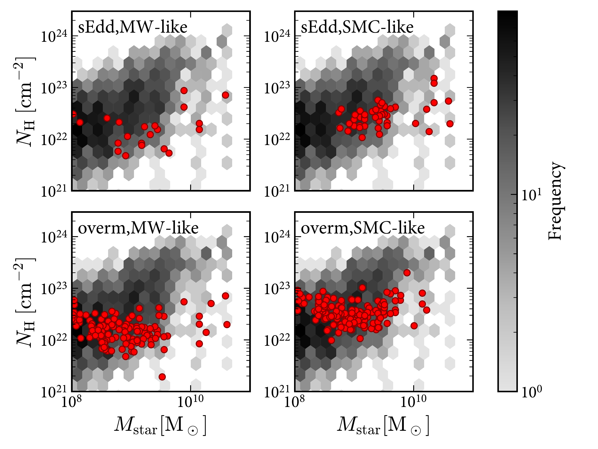
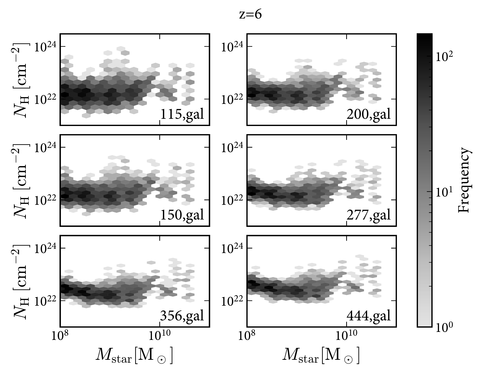
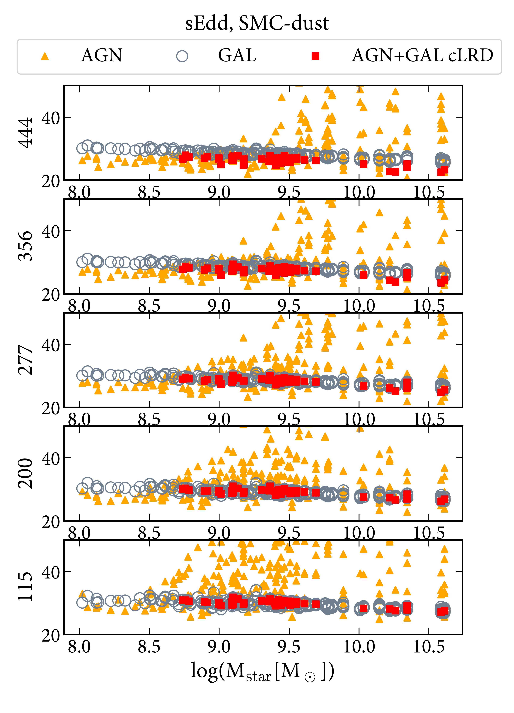
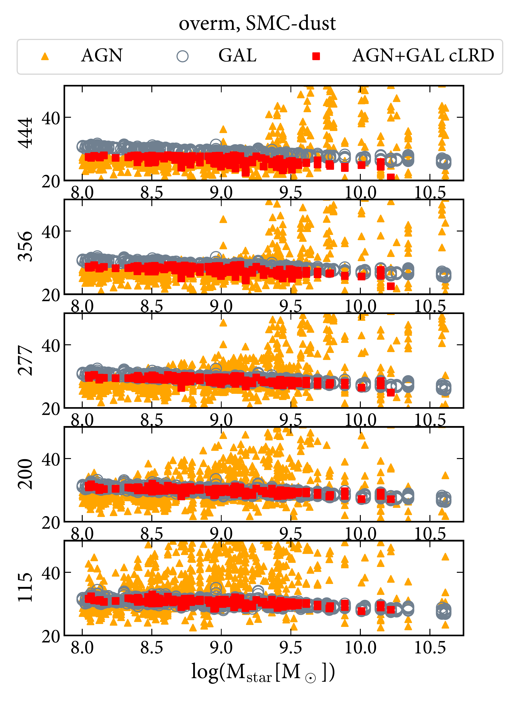
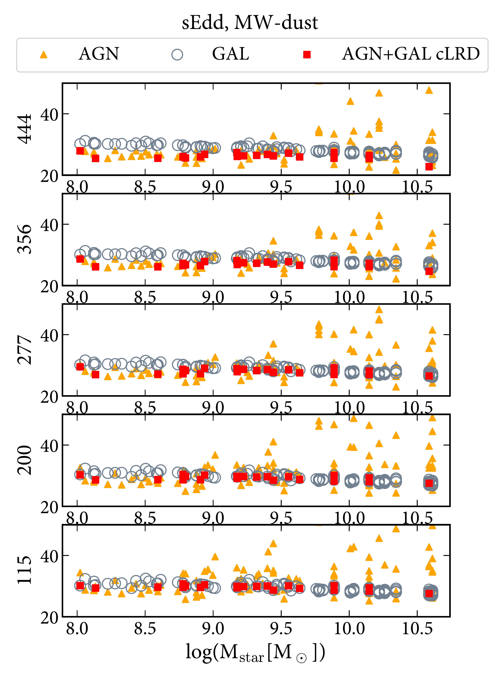
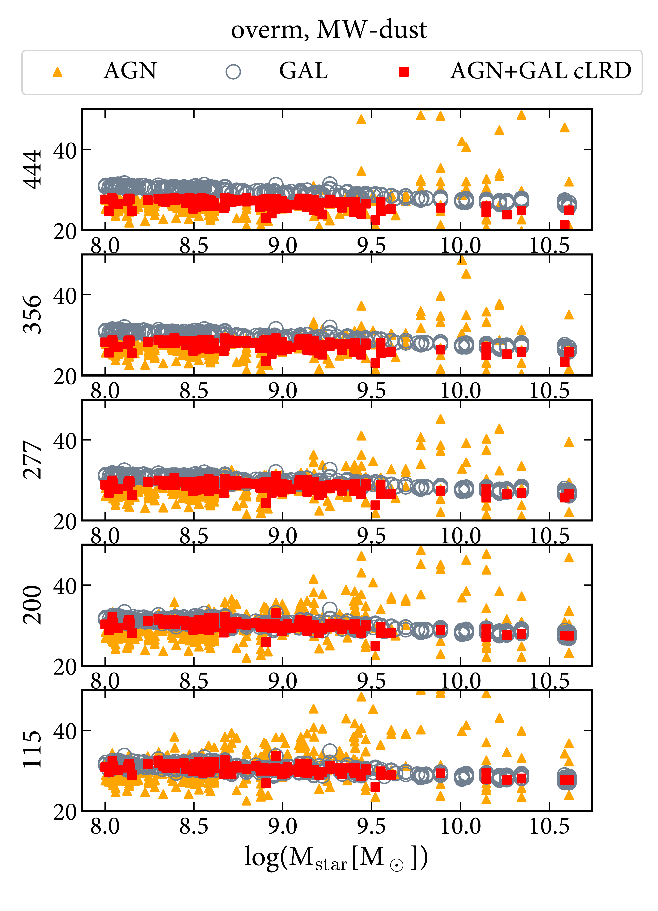
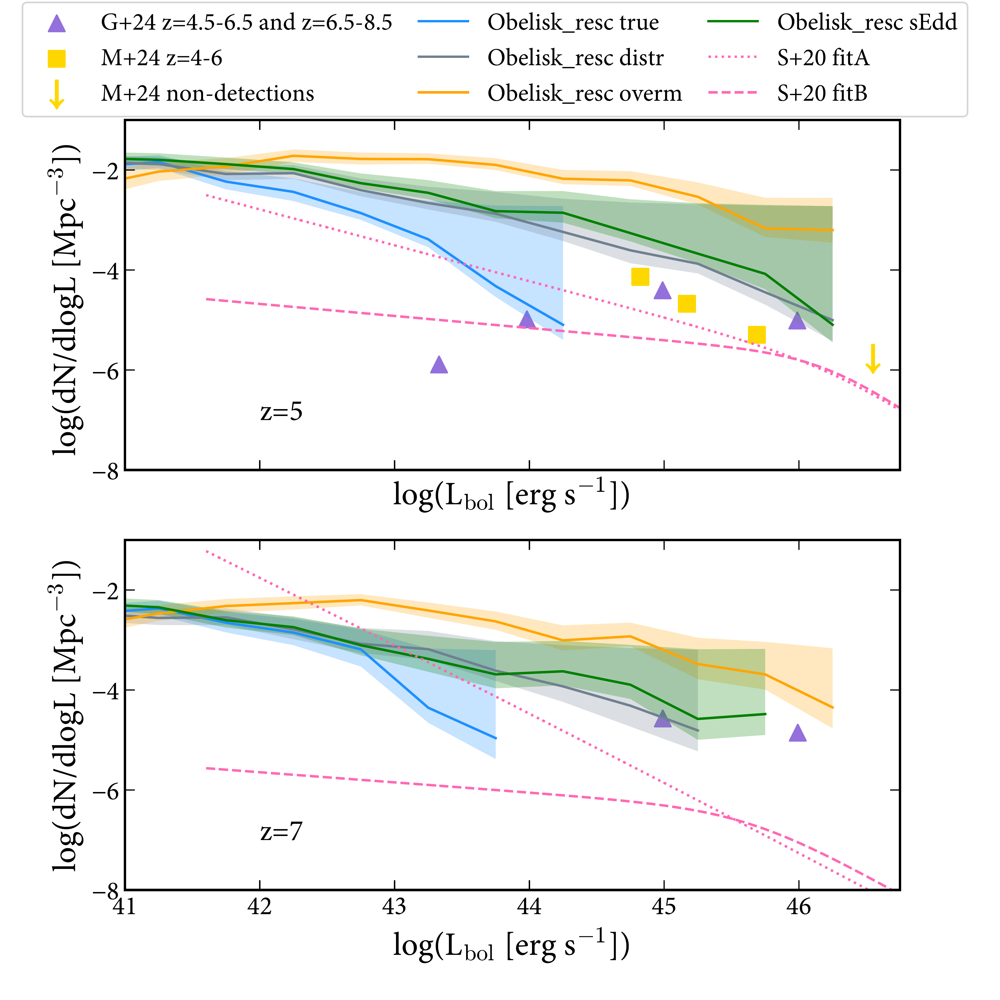

$\newcommand{\ensuremath}{}$
$\newcommand{\xspace}{}$
$\newcommand{\object}[1]{\texttt{#1}}$
$\newcommand{\farcs}{{.}''}$
$\newcommand{\farcm}{{.}'}$
$\newcommand{\arcsec}{''}$
$\newcommand{\arcmin}{'}$
$\newcommand{\ion}[2]{#1#2}$
$\newcommand{\textsc}[1]{\textrm{#1}}$
$\newcommand{\hl}[1]{\textrm{#1}}$
$\newcommand{\footnote}[1]{}$
$\newcommand{\mv}[1]{{\textcolor{orange}{\sf{[MV: #1]}} }}$
$\newcommand{\yo}[1]{{\textcolor{purple}{\sf{[YD: #1]}} }}$
$\newcommand{\ca}[1]{{\textcolor{brown}{\sf{[CA: #1]}} }}$
$\newcommand{\mt}[1]{{\textcolor{blue}{\sf{[MT: #1]}} }}$
$\newcommand{\mh}[1]{{\textcolor{teal}{\sf{[MH: #1]}} }}$
$\newcommand{\rb}[1]{{\textcolor{magenta}{\sf{[RB: #1]}} }}$
$\newcommand{\Obelisk}{\textsc{Obelisk}}$
$\newcommand{\fedd}{\ensuremath{f_{\rm Edd}}}$
$\newcommand{\kms}{ {\rm km s^{-1}}}$
$\newcommand{\msun}{ {\rm M_\odot}}$
$\newcommand{\mstar}{\ensuremath{M_{\rm star}}}$
$\newcommand{\mbh}{\ensuremath{M_{\rm BH}}}$
$\newcommand{\yilun}[1]{{\textcolor{cyan}{\sf{[Yilun: #1]}} }}$
$\newcommand{\al}[1]{{\textcolor{magenta}{\sf{[AL: #1]}} }}$
$\newcommand\hyper{@linkstart##1##2 $
$}$
$\newcommand\hyper{@linkstart##1##2 $
$}$
$\newcommand\hyper{@linkstart##1##2 $
$}$
$\newcommand\hyper{@linkstart##1##2 $
$}$

# Exploring Active Galactic Nuclei and Little Red Dots with the Obelisk simulation

<mark>Appeared on: 2024-08-26</mark> -  _Submitted to A&A_

M. Volonteri, et al. -- incl., <mark>M. Habouzit</mark>

**Abstract:** The James Webb Space telescope has discovered an abundant population of broad line emitters, typical signposts for Active Galactic Nuclei (AGN). Many of these sources have red colors and a compact appearance that has led to naming them `Little Red Dots'. In this paper we develop a detailed framework to estimate the photometry of AGN embedded in galaxies extracted from the $\Obelisk$ cosmological simulation to understand the properties of color-selected Little Red Dots (cLRDs) in the context of the full AGN and massive black hole population. We find that using realistic spectral energy distributions (SEDs) and attenuation for AGN we can explain the shape of the cLRD SED as long as galaxies host a sufficiently luminous AGN that is not too much or too little attenuated. When attenuation is too low or too high, AGN do not enter the cLRD selection, because the AGN dominates over the host galaxy too much in blue filters, or it does not contribute to photometry anywhere, respectively. cLRDs are also characterized by high Eddington ratios, possibility super-Eddington, and/or high ratios between black hole and stellar mass.

**Figure 4. -** Top: distribution of hydrogen column density seen by the AGN as a function of galaxy stellar mass at $z=6$. This is the column density integrated above the dust sublimation radius, i.e. the column density that enters into calculating dust absorption. The red points highlight the cases that host a cLRD meeting the UNCOVER selection. Bottom: distribution of `effective' hydrogen column density for starlight obtained from the ratio of intrinsic and attenuated fluxes in each JWST filter we have considered (Eq. \ref{eq:effNH}). (*fig:NHdistr*)

**Figure 9. -** Magnitudes for the `sEdd' and `overm' models and SMC-like dust (top panels) and MW-like dust (bottom panels).  The orange triangles and gray circles show separately the flux of AGN and galaxies, when selecting systems with $L_{\rm bol}>10^{44}  {\rm erg   s}^{-1}$ and m444W$<$28 (total flux, summing both AGN and galaxy contribution). The red dots have both of the above, plus the UNCOVER color selection, and show the combined galaxy+AGN flux. We have limited the y-axis to 50 to highlight the relevant parameter space. At 115 and 200 the galaxy is almost always brighter than the AGN, whose contribution increases as the wavelength increases. For the `overm' case some AGN are brighter than the galaxy also at short wavelenghts.  (*fig:mag_z6_80*)

**Figure 2. -** Bolometric luminosity function for the actual MBHs in the simulation (`true') and for the models describes in  Table \ref{tab:models}, where "resc" means we have corrected the number densities for the overdensity bias: $\Obelisk$  is a protocluster. To obtain the cosmic average we have rescaled the $\Obelisk$  galaxy mass function to that of the NewHorizon simulation, which simulates an average region of the Universe. This figure assumes an active fraction of unity, and therefore represents an upper limit to the LF for each of the models. The results are compared to the luminosity functions derived in \citet[][M+24]{2024ApJ...963..129M} and \citet[][G+24]{2024ApJ...964...39G} from JWST data and to fits to the evolution of the bolometric luminosity function derived in \citet[][S+20, pre-JWST]{2020MNRAS.495.3252S}.  (*fig:bolLF*)

