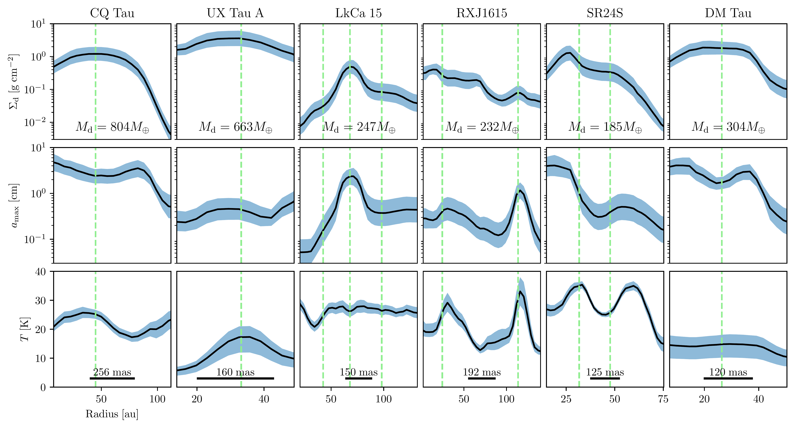
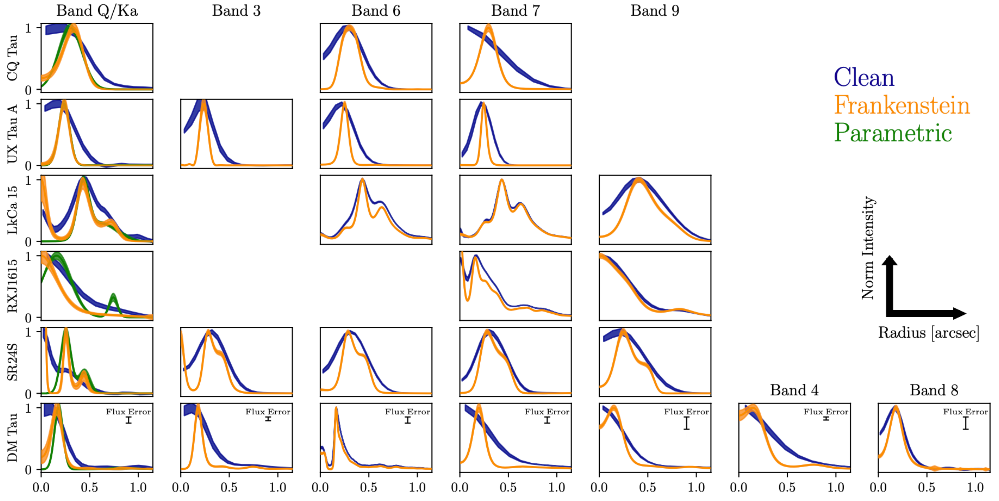
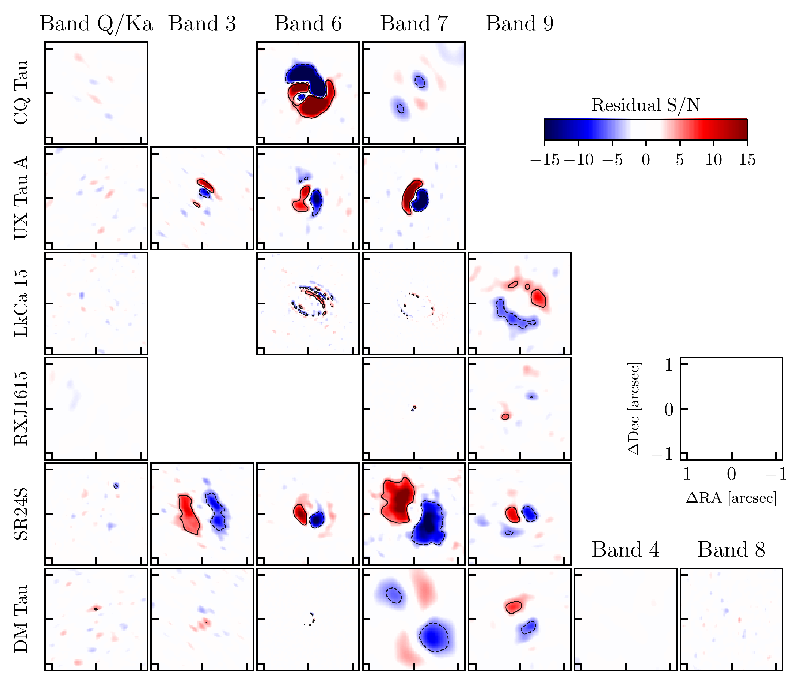
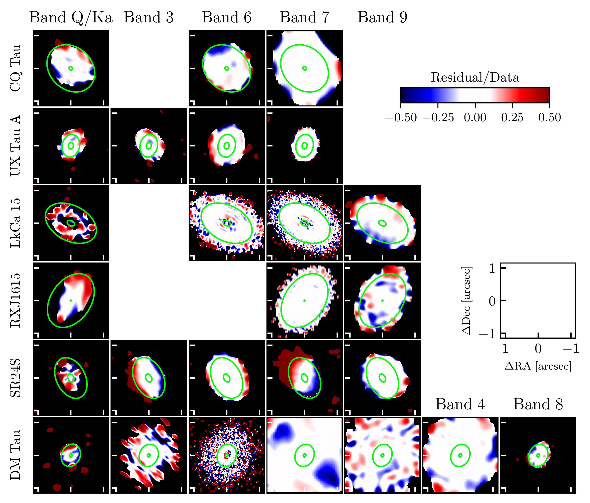

$\newcommand{\ensuremath}{}$
$\newcommand{\xspace}{}$
$\newcommand{\object}[1]{\texttt{#1}}$
$\newcommand{\farcs}{{.}''}$
$\newcommand{\farcm}{{.}'}$
$\newcommand{\arcsec}{''}$
$\newcommand{\arcmin}{'}$
$\newcommand{\ion}[2]{#1#2}$
$\newcommand{\textsc}[1]{\textrm{#1}}$
$\newcommand{\hl}[1]{\textrm{#1}}$
$\newcommand{\footnote}[1]{}$
$\newcommand{\cmark}{\ding{51}}$
$\newcommand{\xmark}{\ding{55}}$
$\newcommand{\pmark}{\ding{212}}$
$\newcommand{\vdag}{(v)^\dagger}$
$\newcommand$
$\newcommand$

# Constraints on the physical origin of large cavities in transition disks from multi-wavelength dust continuum emission

<mark>Appeared on: 2024-08-29</mark> - 

A. Sierra, et al. -- incl., <mark>M. Benisty</mark>, <mark>T. Henning</mark>

**Abstract:** The physical origin of the large cavities observed in transition disks is to date still unclear. Different physical mechanisms (e.g., a  companion, dead zones, enhanced grain growth) produce disk cavities of different depth, and the expected spatial distribution of gas and solids in each mechanism is not the same. In this work, we analyze the multi-wavelength interferometric visibilities of dust continuum observations obtained with ALMA and VLA for six transition disks: CQTau, UXTau A, LkCa15, RXJ1615, SR24S, and DMTau, and calculate brightness radial profiles, where diverse emission morphology is revealed at different wavelengths. The multi-wavelength data is used to model the spectral energy distribution and compute constraints on the radial profile of the dust surface density, maximum grain size, and dust temperature in each disk. They are compared with the observational signatures expected from various physical mechanisms responsible for disk cavities.The observational signatures suggest that the cavities observed in the disks around UXTau A, LkCa15, and RXJ1615 could potentially originate from a dust trap created by a companion. Conversely, in the disks around CQTau, SR24S, DMTau, the origin of the cavity remains unclear, although it is compatible with a pressure bump and grain growth within the cavity.

**Figure 7. -** Dust surface density (top panels), maximum grain size (middle panels), and dust temperature (bottom  panels) constraints from the SED fit. The vertical dashed lines mark the position of bright rings inferred at higher angular resolution. The inferred dust mass and angular resolution of each disk are shown in the bottom of the top and bottom panels, respectively. (*fig:Posterior*)

**Figure 5. -** Normalized brightness radial profile for each observation in our sample. The blue lines are the azimuthal average computed from the image plane in Figure \ref{fig:Observations}, the orange lines are the non-parametric radial profile computed with Frankenstein, and the green lines for the VLA observations are the parametric radial profiles. The vertical error bars in the bottom panels show the uncertainty from the flux calibration at each Band. (*fig:Vis_RadProfile*)

**Figure 10. -**  Residual maps normalized with the rms (left) and the intensity maps (right).
    The name and band of the disk are shown in the top left and top right corner of each panel, respectively. The solid/dashed contours in the left figure are the region with a signal-to-noise (SNR) of +5/-5, respectively. The black area in the right figure is the region where the intensity map has a SNR $< 3$. The green ellipses show the minimum and maximum radius where dust properties constraints are computed in Figure \ref{fig:Posterior}. (*fig:residuals*)

