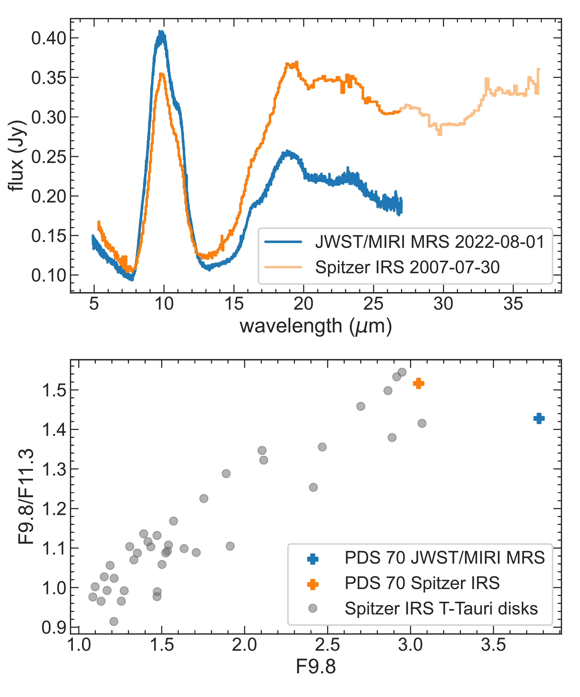
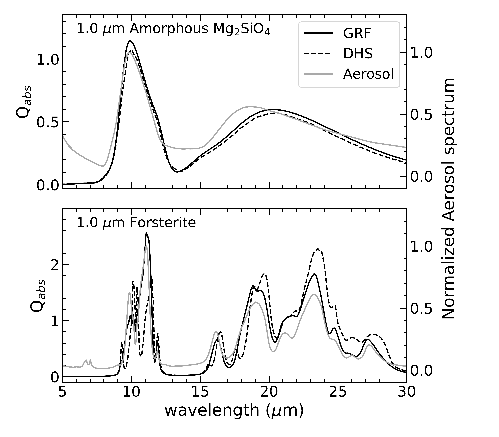
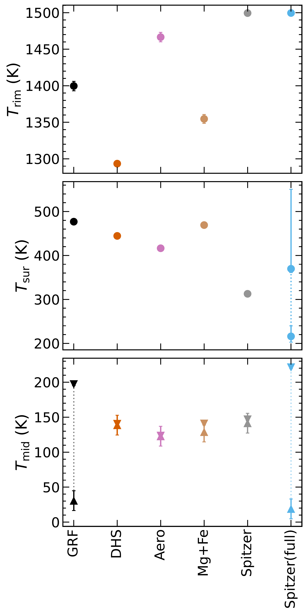

$\newcommand{\ensuremath}{}$
$\newcommand{\xspace}{}$
$\newcommand{\object}[1]{\texttt{#1}}$
$\newcommand{\farcs}{{.}''}$
$\newcommand{\farcm}{{.}'}$
$\newcommand{\arcsec}{''}$
$\newcommand{\arcmin}{'}$
$\newcommand{\ion}[2]{#1#2}$
$\newcommand{\textsc}[1]{\textrm{#1}}$
$\newcommand{\hl}[1]{\textrm{#1}}$
$\newcommand{\footnote}[1]{}$
$\newcommand{\sect}[1]{Sect.~\ref{sec:#1}}$
$\newcommand{\Sect}[1]{Section~\ref{sec:#1}}$
$\newcommand{\sects}[2]{Sects. \ref{sec:#1} and \ref{sec:#2}}$
$\newcommand{\Sects}[2]{Sections \ref{sec:#1} and \ref{sec:#2}}$
$\newcommand{\fg}[1]{Fig.~\ref{fig:#1}}$
$\newcommand{\Fg}[1]{Figure~\ref{fig:#1}}$
$\newcommand{\fgs}[2]{Figs. \ref{fig:#1} and \ref{fig:#2}}$
$\newcommand{\Fgs}[2]{Figures \ref{fig:#1} and \ref{fig:#2}}$
$\newcommand{\fgnum}[1]{\ref{fig:#1}}$
$\newcommand{\eq}[1]{Eq.~(\ref{eq:#1})\xspace}$
$\newcommand{\Eq}[1]{Equation~(\ref{eq:#1})\xspace}$
$\newcommand{\Eqs}[2]{Eqs. (\ref{eq:#1}) and (\ref{eq:#2})}$
$\newcommand{\Eqss}[3]{Eqs. (\ref{eq:#1}), (\ref{eq:#2}) and (\ref{eq:#3})}$
$\newcommand{\co}[1]{\textcolor{blue}{\textsf{#1}}}$
$\newcommand{\jay}[1]{\textcolor{orange}{\textsf{#1}}}$

# Dust mineralogy and variability of the inner PDS 70 disk

<mark>Appeared on: 2024-08-30</mark> -  _18 pages, 13 figures, Accepted by A&A_

H. Jang, et al. -- incl., <mark>G. Perotti</mark>, <mark>T. Henning</mark>, <mark>K. Schwarz</mark>

**Abstract:** _Context._ The inner disk of the young star PDS 70 may be a site of rocky planet formation, with two giant planets detected further out. Recently, JWST/MIRI MRS observations have revealed the presence of warm water vapour in the inner disk. Solids in the inner disk may inform us about the origin of this inner disk water and nature of the dust in the rocky planet-forming regions of the disk. \ _Aims._ We aim to constrain the chemical composition, lattice structure, and grain sizes of small silicate grains in the inner disk of PDS 70, observed both in JWST/MIRI MRS and Spitzer IRS. \ _Methods._ We use a dust fitting model, called DuCK, based on a two-layer disk model considering three different sets of dust opacities. We use Gaussian Random Field and Distribution of Hollow Spheres models to obtain two sets of dust opacities using the optical constants of cosmic dust analogues derived from laboratory-based measurements. These sets take into account the grain sizes as well as their shapes. The third set of opacities is obtained from the experimentally measured transmission spectra from aerosol spectroscopy. We use stoichiometric amorphous silicates, forsterite, and enstatite in our analysis. We also study the iron content of crystalline olivine using the resonance at 23-24 $\mu$ m and test the presence of fayalite. Both iron-rich and magnesium-rich amorphous silicate dust species are also employed to fit the observed spectra. \ _Results._ The Gaussian Random Field opacity set agrees well with the observed spectrum, better than the other two opacity sets. In both MIRI and Spitzer spectra, amorphous silicates are the dominant dust species. Crystalline silicates are dominated by iron-poor olivine. The 23-24 $\mu$ m olivine band peaks at 23.44 $\mu$ m for the MIRI spectrum and 23.47 $\mu$ m for the Spitzer spectrum, representing around or less than 10 \% of iron content in the crystalline silicate. In all of models, we do not find strong evidence for enstatite. Moreover, the silicate band in the MIRI spectrum indicates larger grain sizes (a few microns up to 5 $\mu$ m) than the Spitzer spectrum (0.1 to 1 $\mu$ m), indicating a time-variable small grain reservoir. \ _Conclusions._ The inner PDS 70 disk is dominated by a variable reservoir of warm (T $\sim$ 350-500 K) amorphous silicates, with $\sim$ 15 \% of forsterite in mass fraction. The 10 $\mu$ m and 18 $\mu$ m amorphous silicate bands are very prominent, indicating that most emission originates from optically thin dust. We suggest that the small grains detected in the PDS 70 inner disk are likely transported inward from the outer disk as a result of filtration by the pressure bump associated with the gap and fragmentation into smaller sizes at the ice line. Collisions among larger parent bodies may also contribute to the small grain reservoir in the inner disk, but these parent bodies must be enstatite-poor. In addition, the variation between MIRI and Spitzer data can be explained by a combination of grain growth over 15 years and a dynamical inner disk where opacity changes occur resulting from the highly variable hot (T $\sim$ 1000 K) innermost dust reservoir.

**Figure 1. -** The MIRI and Spitzer spectra of PDS 70 and their shapes of 10 $\mu$m silicate bands. _Upper_: MIRI spectrum is in blue, and Spitzer spectrum is in orange. Light orange shows full wavelength range of the Spitzer spectrum. Around $10 \mu$m, the MIRI spectrum has a higher flux and broader silicate band while the Spitzer spectrum shows higher flux levels beyond $12 \mu$m. _Lower_: Band strength at 9.8 $\mu$m and the shape of 10 $\mu$m silicate band. Gray dots are disks in CASSIS database with low resolution spectra. Blue cross is the MIRI spectrum while orange cross is the Spitzer spectrum. (*fig:MIRI_Spitzer*)

**Figure 2. -** Comparison among absorption efficiencies for amorphous $Mg_2$$SiO_4$(upper panel) and forsterite (lower panel). GRF (black solid line) and DHS (dashed line) are plotted for $Q_{\rm abs}$ on the left y-axis, and Aerosol spectra (gray solid line) are normalized on the right y-axis. (*fig:Qcompare*)

**Figure 3. -** Temperatures of dust in the inner rim (top), disk surface (middle), and midplane (bottom) of dust fitting models in Table \ref{tab:results}. For Spitzer(full), the dotted line in the temperature of the disk surface indicates the temperature gradient across the disk surface; the other models assume a single temperature. (*fig:temperatures*)

