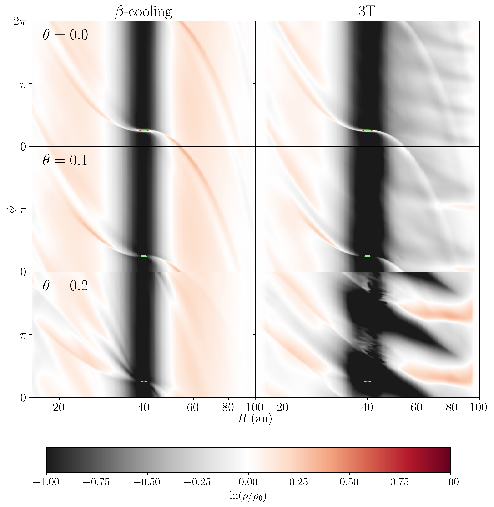
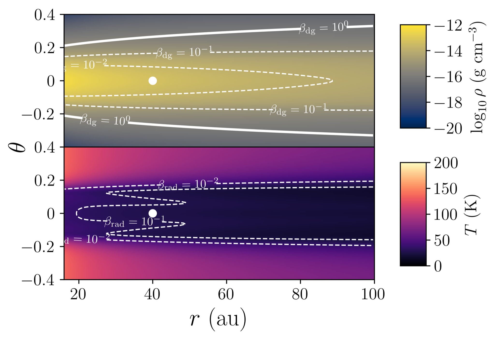
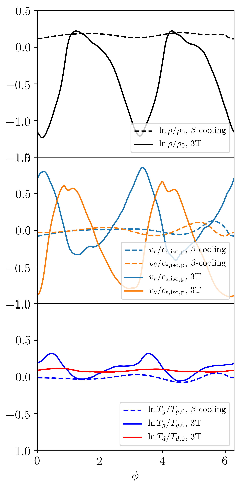

$\newcommand{\ensuremath}{}$
$\newcommand{\xspace}{}$
$\newcommand{\object}[1]{\texttt{#1}}$
$\newcommand{\farcs}{{.}''}$
$\newcommand{\farcm}{{.}'}$
$\newcommand{\arcsec}{''}$
$\newcommand{\arcmin}{'}$
$\newcommand{\ion}[2]{#1#2}$
$\newcommand{\textsc}[1]{\textrm{#1}}$
$\newcommand{\hl}[1]{\textrm{#1}}$
$\newcommand{\footnote}[1]{}$
$\newcommand{\vdag}{(v)^\dagger}$
$\newcommand$
$\newcommand$
$\newcommand{\dmnote}[1]{{\bf \color{blue}[D.M.: #1]}}$
$\newcommand{\dmfnote}[1]{{\bf \color{orange}[D.M.F.: #1]}}$
$\newcommand{\hknote}[1]{{\bf \color{green}[H.K.: #1]}}$
$\newcommand{\revision}[1]{{#1}}$

#  Can gap-edge illumination excite spirals in protoplanetary disks?

<mark>Appeared on: 2024-08-30</mark> -  _11 pages, 9 figures incl. Appendices. A&A accepted; further comments and questions welcome_

<mark>D. Muley</mark>, J. D. M. Fuksman, <mark>H. Klahr</mark>

**Abstract:** The advent of high-resolution, near-infrared instruments such as VLT/SPHERE and Gemini/GPI has helped uncover a wealth of substructure in planet-forming disks, including large, prominent spiral arms in MWC 758, SAO 206462, and V1247 Ori among others. In the classical theory of disk-planet interaction, these arms are consistent with Lindblad-resonance driving by multi-Jupiter-mass companions. Despite improving detection limits, evidence for such massive bodies in connection with spiral substructure has been inconclusive. In search of an alternative explanation, we use the PLUTO code to run 3D hydrodynamical simulations with two comparatively low planet masses (Saturn-mass, Jupiter-mass) and two thermodynamic prescriptions (three-temperature radiation hydrodynamics, and the more traditional $\beta$ -cooling) in a low-mass disk. In the radiative cases, an $m = 2$ mode, potentially attributable to the interaction of stellar radiation with gap-edge asymmetries, creates an azimuthal pressure gradient, which in turn gives rise to prominent spiral arms $\revision{in the upper layers of the disk}$ . Monte Carlo radiative transfer (MCRT) post-processing with RADMC3D reveals that $\revision{in near-infrared scattered light, }$ these $\revision{gap-edge}$ spirals are significantly more prominent than $\revision{the}$ traditional Lindblad spirals $\revision{for planets in the mass range tested}$ . Our results demonstrate that even intermediate-mass **proto** planets---less detectable, but more ubiquitous, than super-Jupiters---are capable of indirectly inducing large-scale spiral disk features, and underscore the importance of including radiation physics in efforts to reproduce observations.

**Figure 7. -** Gas density $\rho$ at $t = 1010$ orbits (1000 orbits at the fiducial resolution, 10 at the doubled resolution used in \cite{Muley2024}), with respect to the initial condition $\rho_0$, for our simulations with a Saturn-mass planet. The green ellipse indicates the planet's Hill radius. With the 3T scheme, the disk atmosphere shows clear development of $m = 2$ spiral arms, which are absent in the $\beta$-cooling simulations. $\revision${White bands at the interior and exterior of the radiative simulation result from wave-damping to the initial condition.} (*fig:dens-compare*)

**Figure 1. -** Initial conditions for gas density $\rho$(above), $\revision${as well as dust and gas temperatures $T_d$ and $T_g$ (below), which are initially equal.} Contours for normalized cooling timescales from gas-grain collision ($\beta_{\rm dg}$) are plotted above, and from radiation ($\beta_{\rm rad}$) below, with white lines. Figure reproduced exactly from \cite{Muley2024}. (*fig:initial_conditions*)

**Figure 2. -** Azimuthal profiles of various quantities at a fiducial radius of $r = 60 {\rm  au} = 1.5 r_p$, and at an altitude of $\theta = 0.2$ rad above the midplane $\revision${in our $M_p = 3 \times 10^{-4} M_{\odot}$ simulations}. In the 3T case, azimuthal asymmetries of even a few percent in disk illumination---potentially induced by the RWI, and visible in the $T_d$ profile---lead to strong non-axisymmetry in $\rho$, $T_g$, and the velocity components.
     (*fig:azi_profiles*)

