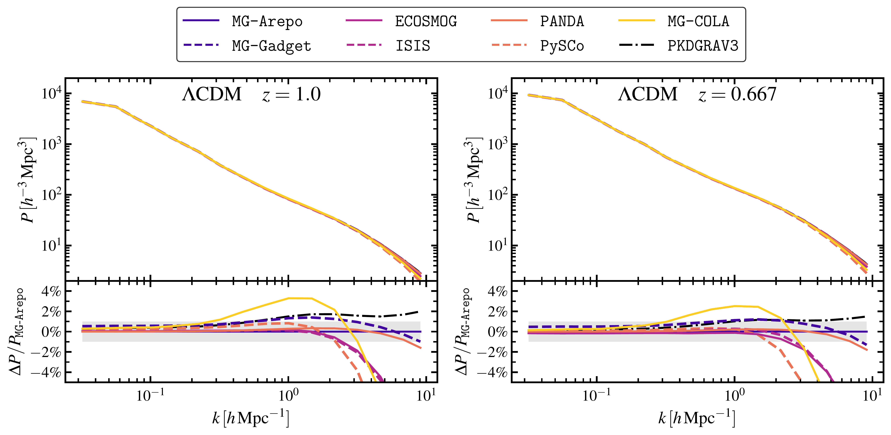
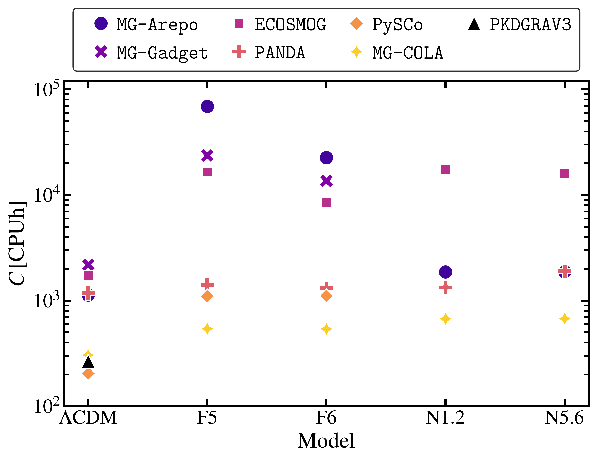
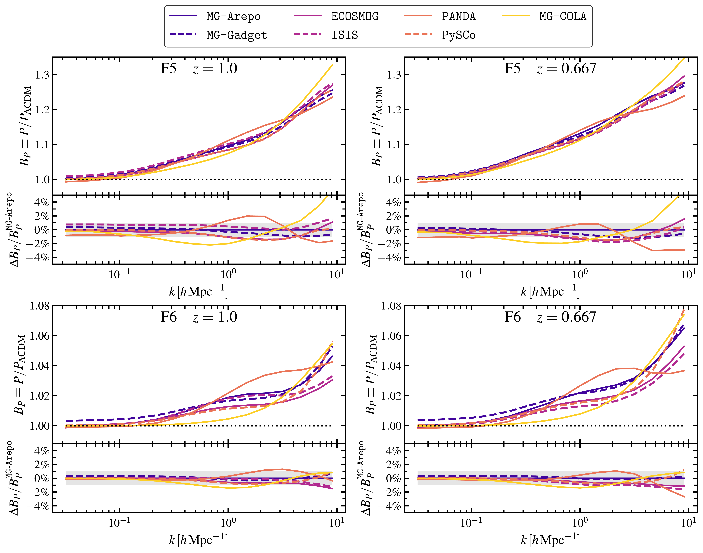

$\newcommand{\ensuremath}{}$
$\newcommand{\xspace}{}$
$\newcommand{\object}[1]{\texttt{#1}}$
$\newcommand{\farcs}{{.}''}$
$\newcommand{\farcm}{{.}'}$
$\newcommand{\arcsec}{''}$
$\newcommand{\arcmin}{'}$
$\newcommand{\ion}[2]{#1#2}$
$\newcommand{\textsc}[1]{\textrm{#1}}$
$\newcommand{\hl}[1]{\textrm{#1}}$
$\newcommand{\footnote}[1]{}$
$\newcommand{\Om}[1]{\Omega_\mathrm{#1}}$
$\newcommand{\Omm}{\Omega_\mathrm{m}}$
$\newcommand{\Omr}{\Omega_\mathrm{r}}$
$\newcommand{\Omk}{\Omega_\mathrm{k}}$
$\newcommand{\OmDE}{\Omega_\mathrm{DE}}$
$\newcommand{\OmL}{\Omega_\Lambda}$
$\newcommand{\de}[1]{\delta_\mathrm{#1}}$
$\newcommand{\rh}[1]{\rho_\mathrm{#1}}$
$\newcommand{\pysco}{\texttt{PySCo}\xspace}$
$\newcommand{\orcid}[1]{\orcidlink{#1}}$
$\newcommand{\arraystretch}{2.0}$

# $\Euclid$ preparation

<mark>Appeared on: 2024-09-06</mark> -  _20 pages, 7 figures, 1 appendix; submitted on behalf of the Euclid Collaboration_

E. Collaboration, et al. -- incl., <mark>K. Jahnke</mark>

**Abstract:** To constrain models beyond $\Lambda$ CDM, the development of the $\Euclid$ analysis pipeline requires simulations that capture the nonlinear phenomenology of such models.  We present an overview of numerical methods and $N$ -body simulation codes developed to study the nonlinear regime of structure formation in alternative dark energy and modified gravity theories. We review a variety of numerical techniques and approximations employed in cosmological $N$ -body simulations to model the complex phenomenology of scenarios beyond $\Lambda$ CDM. This includes discussions on solving nonlinear field equations, accounting for fifth forces, and implementing screening mechanisms. Furthermore, we conduct a code comparison exercise to assess the reliability and convergence of different simulation codes across a range of models. Our analysis demonstrates a high degree of agreement among the outputs of different simulation codes, providing confidence in current numerical methods for modelling cosmic structure formation beyond $\Lambda$ CDM. We highlight recent advances made in simulating the nonlinear scales of structure formation, which are essential for leveraging the full scientific potential of the forthcoming observational data from the $\Euclid$ mission.

**Figure 2. -** Matter power spectra from simulations carried out with different codes (different line styles) for a $\Lambda$CDM cosmology. The *left panels* show the spectra at redshift $z=1$ whereas the *right panels* show the spectra at redshift $z=0.667$. The *bottom panels* show the relative difference with respect to the simulation carried out with \texttt{MG-Arepo}. (*fig:Pk_LCDM*)

**Figure 1. -** Comparison of the computational costs of simulations run under different gravity models (labels on the $x$-axis) and with different codes (markers and colours as described in the legend). (*fig:CompCost*)

**Figure 3. -** Amplification factor of the matter power spectra from simulations of two $f(R)$ scenarios, $\bar{f}_{,R} = 10^{-5}$(F5, *top row*) and $\bar{f}_{,R} = 10^{-6}$(F6, *bottom row*), relative to the reference $\Lambda$CDM cosmology. The amplification factor $B_P = P/P_{\Lambda\mathrm{CDM}}$ is measured for different codes (different line styles) at two different redshifts, $z=1$(*left panels*) and $z=0.667$(*right panels*). The *bottom panel* of each plot shows the relative agreement of the individual measurements, using \texttt{MG-Arepo} as a common reference. (*fig:Bk_fR*)

