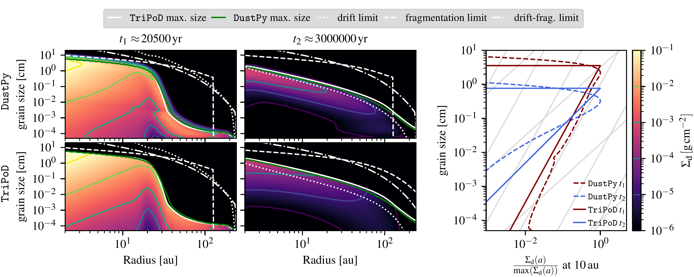
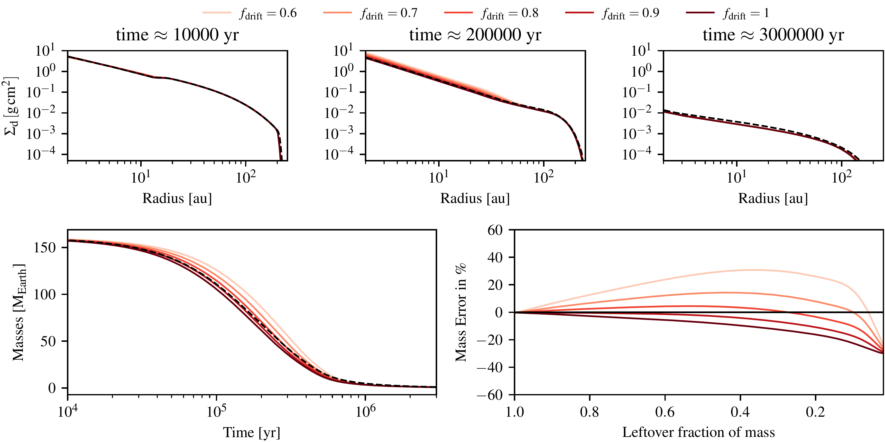
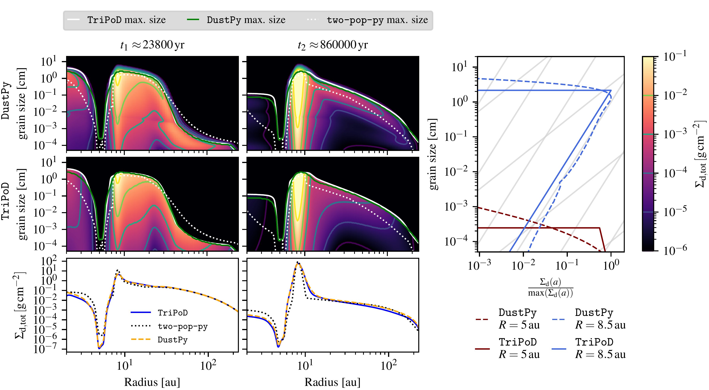

$\newcommand{\ensuremath}{}$
$\newcommand{\xspace}{}$
$\newcommand{\object}[1]{\texttt{#1}}$
$\newcommand{\farcs}{{.}''}$
$\newcommand{\farcm}{{.}'}$
$\newcommand{\arcsec}{''}$
$\newcommand{\arcmin}{'}$
$\newcommand{\ion}[2]{#1#2}$
$\newcommand{\textsc}[1]{\textrm{#1}}$
$\newcommand{\hl}[1]{\textrm{#1}}$
$\newcommand{\footnote}[1]{}$
$\newcommand{\RN}[1]{$
$  \textup{\uppercase\expandafter{\romannumeral#1}}$
$}$
$\newcommand{\Sigmag}{\Sigma_{\mathrm{g}}}$
$\newcommand{\Sigmad}{\Sigma_{\mathrm{d}}}$
$\newcommand{\rhog}{\rho_{\mathrm{g}}}$
$\newcommand{\rhod}{\rho_{\mathrm{d}}}$
$\newcommand{\vg}{\vec{v}_{\mathrm{g}}}$
$\newcommand{\vd}{\vec{v}_{\mathrm{d}}}$
$\newcommand{\amax}{a_{\mathrm{max}}}$
$\newcommand{\amin}{a_{\mathrm{min}}}$
$\newcommand{\aint}{a_{\mathrm{int}}}$
$\newcommand{\adr}{a_{\mathrm{drift}}}$
$\newcommand{\vdr}{v_{\mathrm{drift}}}$
$\newcommand{\tfr}{t_\mathrm{fric}}$
$\newcommand{\St}{\mathrm{St}}$
$\newcommand{\Rey}{\mathrm{Re}}$
$\newcommand{\OmK}{\Omega_\text{K}}$
$\newcommand{\der}[2]{\frac{\partial{#1}}{\partial{#2}}}$
$\newcommand{\hd}{h_{\mathrm{d}}}$
$\newcommand{\Mp}{m_{\mathrm{p}}}$
$\newcommand{\Sd}{\Sigma_{\mathrm{d}}}$
$\newcommand{\dpy}{\texttt{DustPy}}$
$\newcommand{\pluto}{\texttt{PLUTO}}$
$\newcommand{\tpop}{\texttt{TriPoD}}$
$\newcommand{\tpoppy}{\texttt{two-pop-py}}$
$\newcommand{\rev}[1]{{#1}}$
$\newcommand{\revI}[1]{{#1}}$
$\newcommand{\revII}[1]{{#1}}$
$\newcommand{\new}[1]{{#1}}$
$\newcommand$

# $\tpop$ : \texttt{Tri}-\texttt{P}opulation size distributions for \texttt{D}ust evolution.

<mark>Appeared on: 2024-09-09</mark> -  _22 pages, 13 figures, accepted for publication in Astronomy and Astrophysics_

<mark>T. Pfeil</mark>, T. Birnstiel, <mark>H. Klahr</mark>

**Abstract:** Dust coagulation and fragmentation impact the structure and evolution of protoplanetary disks and set the initial conditions for planet formation. Dust grains dominate the opacities, they determine the cooling times of the gas via thermal accommodation in collisions, they influence the ionization state of the gas, and the available grain surface area is an important parameter for the chemistry in protoplanetary disks. Therefore, dust evolution is an effect that should not be ignored in numerical studies of protoplanetary disks. Available dust coagulation models are, however, too computationally expensive to be implemented in large-scale hydrodynamic simulations. This limits detailed numerical studies of protoplanetary disks, including these effects, mostly to one-dimensional models. We aim to develop a simple---yet accurate---dust coagulation model that can be easily implemented in hydrodynamic simulations of protoplanetary disks. Our model shall not significantly increase the computational cost of simulations and provide information about the local grain size distribution. The local dust size distributions are assumed to be truncated power laws. Such distributions can be fully characterized by only two dust fluids (large and small grains) and a maximum particle size, truncating the power law. We compare our model to state-of-the-art dust coagulation simulations and calibrate it to achieve a good fit with these sophisticated numerical methods. Running various parameter studies, we achieved a good fit between our simplified three-parameter model and $\dpy$ , a state-of-the-art dust coagulation software. We present $\tpop$ , a sub-grid dust coagulation model for the $\pluto$ code. With $\tpop$ , we can perform two-dimensional, vertically integrated dust coagulation simulations on top of a hydrodynamic simulation. Studying the dust distributions in two-dimensional vortices and planet-disk systems is thus made possible.

**Figure 3. -** Comparison between the fiducial $\dpy$  setup and the fiducial $\tpop$  setup.Comparison between the full coagulation model $\dpy$(upper row, 171 dust fluids) and our new three-parameter power-law prescription $\tpop$ , which we implemented in the $\pluto$  code (two dust fluids). We show two snapshots of the one-dimensional disk models in the first two panels in each row. The third panel shows the local dust size distribution of the respective model at \SI{10}{\AU} for both snapshots. The light grid in the background represents size distribution power laws with $n(a)\propto a^{-3.5}$ and $n(a)\propto a^{-3.0}$. (*fig:fiducial*)

**Figure 6. -** Drift velocity factor parameter study.Comparison between $\dpy$  and our model in a setup with dust diffusion ($\delta=10^{-3}$) and with different drift calibration factors $f_\mathrm{drift}$. $\rev$I{Solid lines show the results of our $\tpop$  calibration runs and dashed lines show the respective $\dpy$  simulation, to which we calibrate our model.} The upper row shows a timeseries of the dust column density evolution in three snapshots. In the lower row, we show the mass evolution and the errors with respect to the full coagulation model $\dpy$ . For a factor of $\new${$f_\mathrm{drift}=0.8$}, the mass evolution of the full coagulation model is well reproduced by our three-parameter model. (*fig:FudgeDiff*)

**Figure 9. -** Detailed comparison between $\dpy$  and $\tpop$  in a simulation with a planetary gap.Comparison between a $\dpy$  simulation and a $\pluto$  simulation with our $\tpop$  dust coagulation model in a protoplanetary disk with a pre-defined gap. We also show the particle sizes and dust column density profiles calculated with the old $\tpop$py  model as dotted lines. $\rev$I{The plot on the right-hand side depicts the local dust size distributions at \SI{5}{\AU} (within the gap) and at \SI{8.5}{\AU} (at the pressure maximum), for two different snapshots. The gray lines in the right panel follow power laws with $q=-3.5$ and $q=-3.0$.} (*fig:Duffell1D*)

