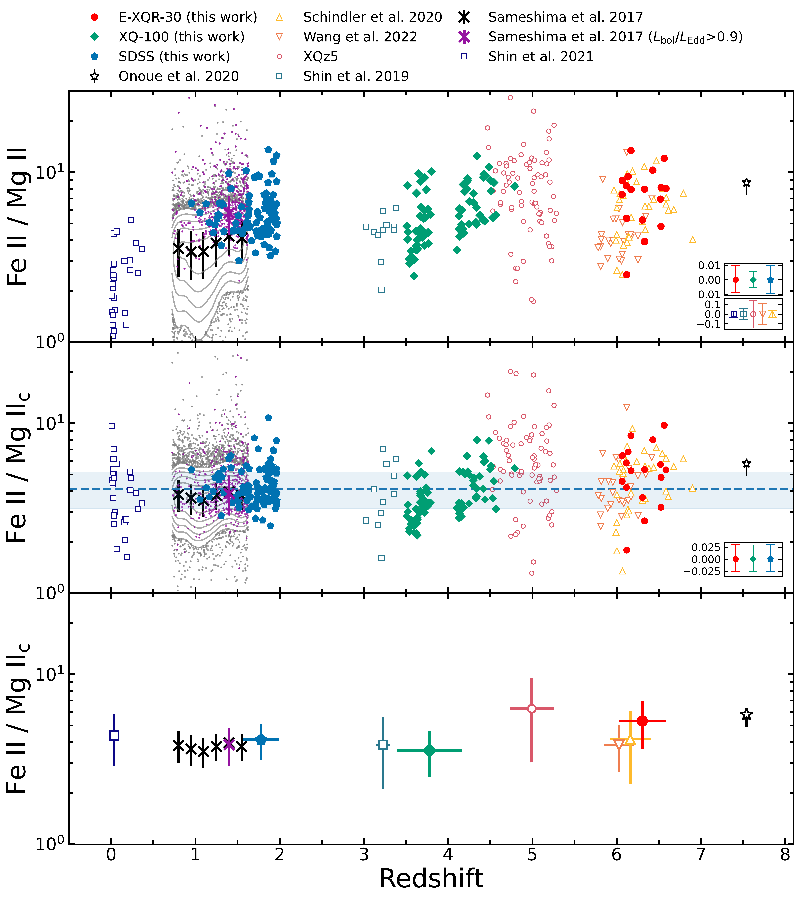

$\newcommand{\ensuremath}{}$
$\newcommand{\xspace}{}$
$\newcommand{\object}[1]{\texttt{#1}}$
$\newcommand{\farcs}{{.}''}$
$\newcommand{\farcm}{{.}'}$
$\newcommand{\arcsec}{''}$
$\newcommand{\arcmin}{'}$
$\newcommand{\ion}[2]{#1#2}$
$\newcommand{\textsc}[1]{\textrm{#1}}$
$\newcommand{\hl}[1]{\textrm{#1}}$
$\newcommand{\footnote}[1]{}$
$\newcommand{\vdag}{(v)^\dagger}$
$\newcommand$
$\newcommand$

# No Redshift Evolution in the $\ion{Fe}{2}$/$\ion{Mg}{2}$ Flux Ratios of Quasars across Cosmic Time

<mark>Appeared on: 2024-09-11</mark> -  _23 pages, 9 figures; Accepted for publication in ApJ. The online materials are available at this https URL_

D. Jiang, et al. -- incl., <mark>F. Walter</mark>

**Abstract:** The $\ion{Fe}{2}$ / $\ion{Mg}{2}$ emission line flux ratio in quasar spectra serves as a proxy for the relative Fe to $\alpha$ -element abundances in the broad line regions of quasars. Due to the expected different enrichment timescales of the two elements, they can be used as a cosmic clock in the early Universe. We present a study of the $\ion{Fe}{2}$ / $\ion{Mg}{2}$ ratios in a sample of luminous quasars exploiting high-quality near-IR spectra taken primarily by the XQR-30 program with VLT XSHOOTER. These quasars have a median bolometric luminosity of log( $L_\mathrm{bol}$ [ erg s $^{-1}$ ] ) $\sim47.3$ and cover a redshift range of $z=6.0$ -- $6.6$ . The median value of the measured $\ion{Fe}{2}$ / $\ion{Mg}{2}$ ratios is $\sim7.9$ with a normalized median absolute deviation of $\sim2.2$ . In order to trace the cosmic evolution of $\ion{Fe}{2}$ / $\ion{Mg}{2}$ in an unbiased manner, we select two comparison samples of quasars with similar luminosities and high-quality spectra from the literature, one at intermediate redshifts ( $z=3.5$ -- $4.8$ ) and the other at low redshifts ( $z=1.0$ -- $2.0$ ).We perform the same spectral analysis for all these quasars, including the usage of the same iron template, the same spectral fitting method, and the same wavelength fitting windows.We find no significant redshift evolution in the $\ion{Fe}{2}$ / $\ion{Mg}{2}$ ratio over the wide redshift range from $z=1$ to 6.6. The result is consistent with previous studies and supports the scenario of a rapid iron enrichment in the vicinity of accreting supermassive black holes at high redshift.

**Figure 5. -** Spectral fitting for two representative spectra in the E-XQR-30 sample at $\lambda_{\rm rest}\sim$$2100 - 3100$ Å.
The heavy atmospheric absorption regions at 18,200--19,400 Å are masked out in the figure. In each panel, the color-coded lines show the power-law continuum plus Balmer continuum (PL + BC, orange), the Balmer continuum only (BC, brown), the scaled $\ion${Fe}{2} template from 2006ApJ...650...57($\ion${Fe}{2}, green), and the $\ion${Mg}{2} emission line ($\ion${Mg}{2}, blue). The red line shows the sum of all components (best-fit model). For each spectrum, the residual flux of the best-fit model with the $\pm 1\sigma$ observed errors (grey ranges) is shown in the lower sub-panel.
We also smooth the errors and use the pink curves to indicate their boundaries.
The full list of the spectra with the best-fit model fits are published as online figures, and the captions of the online figures are the same as the caption of this figure (but for different quasars).
 (*fig:fitted_spec_xqr30*)

**Figure 9. -** $\ion${Fe}{2}/$\ion${Mg}{2} line flux ratios at redshift from $z=0$ to $7$. The top panel shows the observed flux ratios. The middle panel shows the same ratios after correcting the Eddington ratio dependence (see details in Section \ref{subsec:EddRatio_correlation}).
The bottom panel shows the median and $\pm1\sigma$ scatter of each sample. The filled symbols show the samples analyzed in this work (red: E-XQR-30, green: XQ-100, blue: low-redshift SDSS), and the open symbols show the samples in the literature. The different colors and symbols are described in the legend on the top. The sub-panels in the lower right corners of the top and middle panels show the typical measurement errors in the logarithmic scale. The grey contours (with a step of 0.2 dex in the logarithmic scale) and grey dots represent the low-redshift sample of 2017ApJ...834...203. Their median $\ion${Fe}{2}/$\ion${Mg}{2} flux ratios at six redshift bins (a step of $\Delta z=0.15$) are shown as the black crosses. Those with Eddington ratios over 0.9 are shown as the purple dots, and the median of this subsample is shown as the purple cross. The dashed line and its shaded region are the median value of the SDSS sample and its $\pm1\sigma$ range as our baseline at low redshift. The figure shows no apparent evolution of the line flux ratio with redshift.
 (*fig:FeIIMgII_z*)

**Figure 7. -** Same as Figure \ref{fig:fitted_spec_xqr30} but for the low-redshift SDSS sample.
The smoothed errors are not shown for SDSS spectra.
The $\ion${Fe}{2}/$\ion${Mg}{2} ratios of SDSS 081946.32+414247.2 (upper panel) and SDSS 113448.31+333105.2 (lower panel) are $4.31_{-0.10}^{+0.09}$ and $3.75_{-0.07}^{+0.06}$, respectively.
 (*fig:fitted_spec_sdss*)

