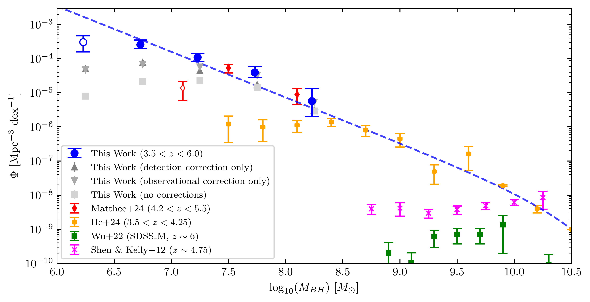
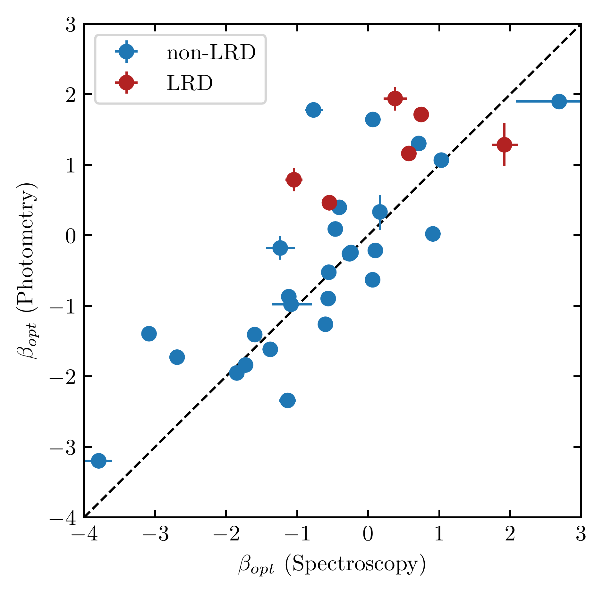
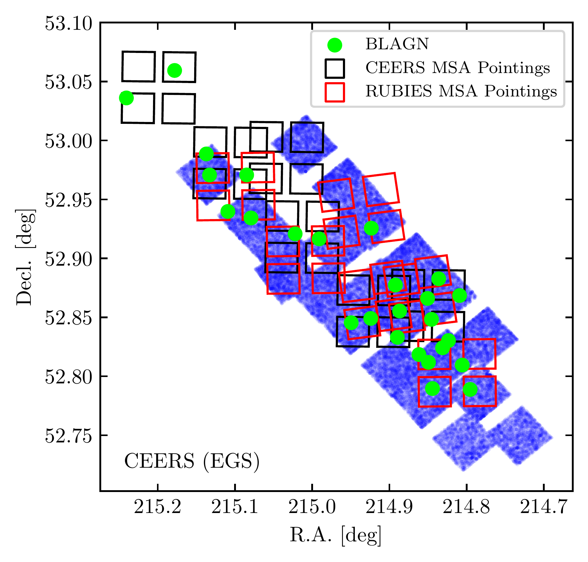
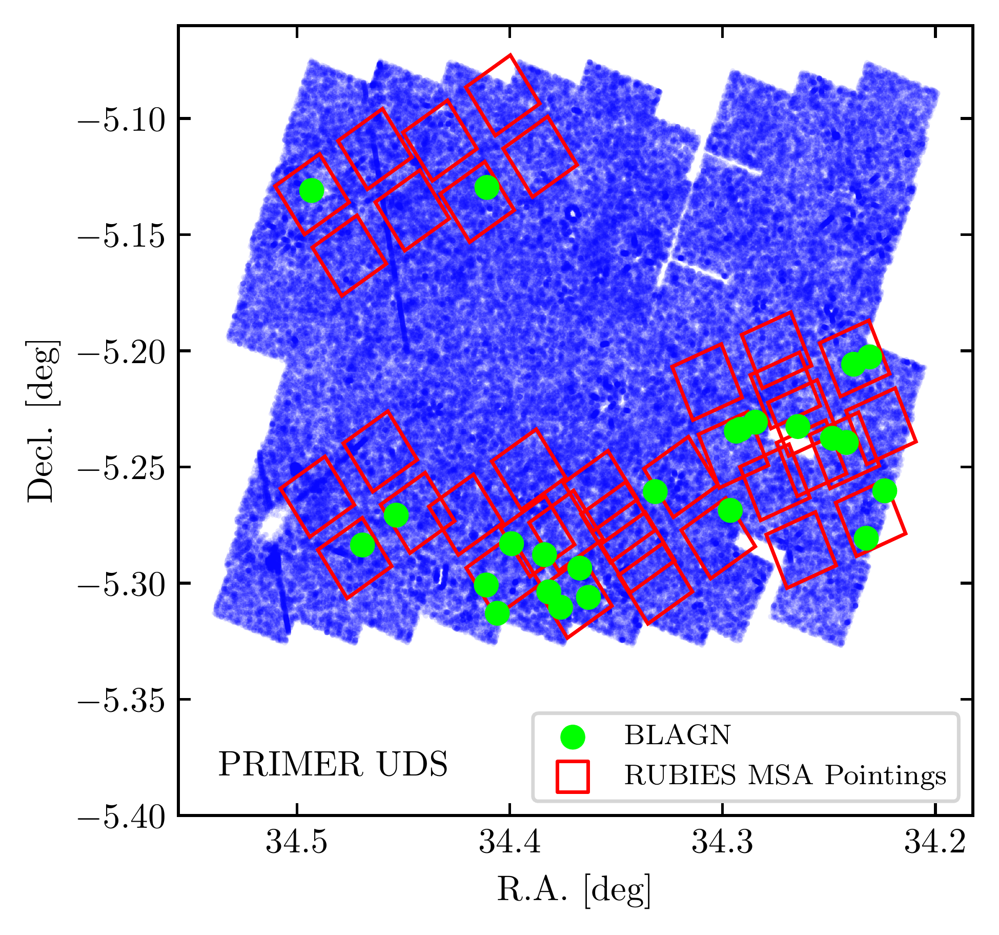

$\newcommand{\ensuremath}{}$
$\newcommand{\xspace}{}$
$\newcommand{\object}[1]{\texttt{#1}}$
$\newcommand{\farcs}{{.}''}$
$\newcommand{\farcm}{{.}'}$
$\newcommand{\arcsec}{''}$
$\newcommand{\arcmin}{'}$
$\newcommand{\ion}[2]{#1#2}$
$\newcommand{\textsc}[1]{\textrm{#1}}$
$\newcommand{\hl}[1]{\textrm{#1}}$
$\newcommand{\footnote}[1]{}$
$\newcommand$
$\newcommand$
$\newcommand{\per}{\ensuremath{^{-1}}\xspace}$
$\newcommand{\Ha}{H\ensuremath{\alpha}\xspace}$

# Broad-Line AGN at $\mathbf{3.5<z<6}$:\ The Black Hole Mass Function and a Connection with Little Red Dots

<mark>Appeared on: 2024-09-12</mark> -  _28 pages, 14 figures, 4 tables. Submitted to ApJ_

A. J. Taylor, et al. -- incl., <mark>E. Bañados</mark>, <mark>Y. Khusanova</mark>

**Abstract:** We present a sample of 50 H $\alpha$ detected broad-line active galactic nuclei (BLAGN) at redshifts $3.5<z<6.8$ using data from the CEERS and RUBIES surveys. We select these sources directly from _JWST_ /NIRSpec G395M/F290LP spectra. We use a multi-step pre-selection and a Bayesian fitting procedure to ensure a high-quality sample of sources with broad Balmer lines and narrow forbidden lines. We compute rest-frame ultraviolet and optical spectral slopes for these objects, and determine that 10 BLAGN in our sample are also little red dots (LRDs). These LRD BLAGN, when examined in aggregate, show broader $\Ha$ line profiles and a higher fraction of broad-to-narrow component $\Ha$ emission than non-LRD BLAGN. Moreover, we find that $\sim66\%$ of these objects are intrinsically reddened ( $\beta_{opt}>0$ ), independent of the contributions of emission lines to the broadband photometry. We construct the black hole (BH) mass function at $3.5<z<6$ after computing robust observational and line detection completeness corrections. This BH mass function shows broad agreement with both recent _JWST_ /NIRSpec and _JWST_ /NIRCam WFSS based BH mass functions, though we extend these earlier results to log (M $_{BH}/M_{\odot}) < 7$ . The derived BH mass function is consistent with a variety of theoretical models, indicating that the observed abundance of black holes in the early universe is not discrepant with physically-motivated predictions.  The BH mass function shape resembles a largely featureless power-law, suggesting that any signature from black-hole seeding has been lost by redshift $z\sim$ 5--6.Finally, we compute the BLAGN UV luminosity function and find good agreement with _JWST_ -detected BLAGN samples from recent works, finding that BLAGN hosts constitute $\lesssim$ 10 \% of the total observed UV luminosity at all but the brightest luminosities.

**Figure 12. -** The BLAGN BH mass function for $3.5<z<6$. Blue points indicate the fully completeness-corrected BH mass function from this work, and upward/downward pointing grey triangles indicate our BH mass function with only the line detection/observational correction applied. We mark our lightest mass point with a hollow blue point to indicate its low line detection completeness of $<20\%$. Grey squares indicate our uncorrected BH mass function. All of our error bars are Poissonian (following the  ([ and Gehrels 1986]())  prescription). Our partially corrected or uncorrected BH mass functions share the same error bars (in logarithmic space) as our fully corrected BH mass function and are omitted to reduce visual clutter. Red diamonds show the BH mass function derived from NIRCam WFSS data in [Matthee, Naidu and Brammer (2024)](). Note that [Matthee, Naidu and Brammer (2024)]() acknowledge that their lightest mass point (marked with a hollow red diamond) likely suffers from incompleteness and does not indicate a turnover of the BH mass function at $M_{\textrm{BH}}\sim10^7 M_{\odot}$. Yellow hexagons show the BH mass function at $3.5<z<4.25$ derived from ground-based SDSS+HSC data in [He, Akiyama and Enoki (2024)](). Green squares show the BH mass function at $z\sim6$ from [Wu, Shen and Jiang (2022)](), and pink x's show the BH mass function from [Shen and Kelly (2012)](), both derived from SDSS data. We show a Schecter fit to our data from $10^{6.5}<M_{\textrm{BH}}>10^{8.5}$ and the [He, Akiyama and Enoki (2024)]() data at $M_{\textrm{BH}}>10^{8.5} M_{\odot}$ as the dashed blue curve. Our corrected points show excellent agreement with the [Matthee, Naidu and Brammer (2024)]() points indicating that our observational completeness correction is performing well, and our overall BH mass function seems to extend the [He, Akiyama and Enoki (2024)]() BH mass function to lower masses. (*fig:BHmassfunction*)

**Figure 6. -** Photometrically measured $\beta_{opt}$ versus Spectroscopically measured $\beta_{opt}$. We show the BLAGN in our sample that are identified as LRDs using the   ([Kocevski, Finkelstein and Barro 2024]())  criteria as red points, and  BLAGN in our sample that do not satisfy the  ([Kocevski, Finkelstein and Barro 2024]())  selection as blue points. Note that not all of our BLAGN have PRISM data, thus some are excluded from this figure. The black dashed line is the 1:1 line. Objects above this line show a redder $\beta_{opt}$ when measured from photometry instead of spectroscopy likely due to emission line boosting. However, despite the emission line boosting effects, the LRDs still exhibit red to moderately red $\beta_{opt}$, implying that they are intrinsically dust-reddened. (*fig:optvopt*)

**Figure 4. -** Upper panel: the positions of the BLAGN sample (green circles), the CEERS NIRCam coverage (blue shading), and CEERS/RUBIES NIRSpec MSA footprints (black/red outlines). Lower panel: the same as the top panel, for the PRIMER-UDS field. Note that the sky areas shown in the two panels are not exactly to scale with one another. The BLAGN are broadly distributed over the observed areas of the CEERS and PRIMER-UDS fields. (*fig:fields*)

