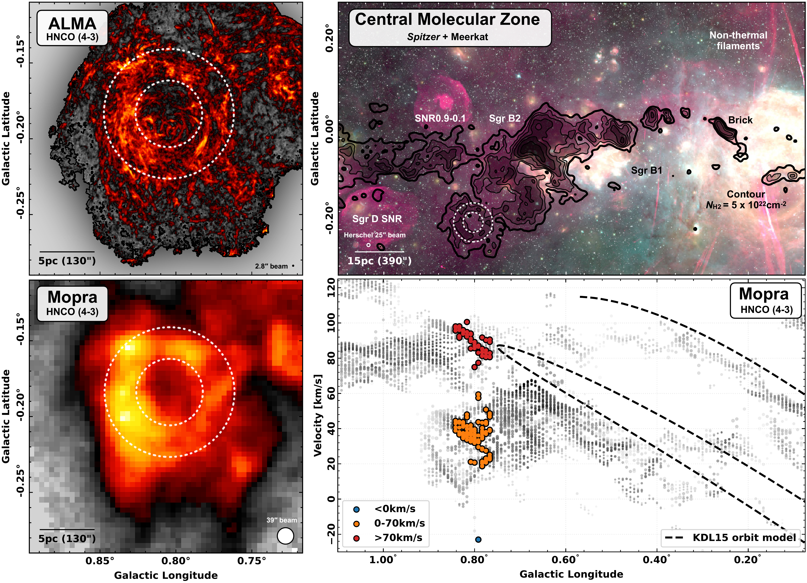
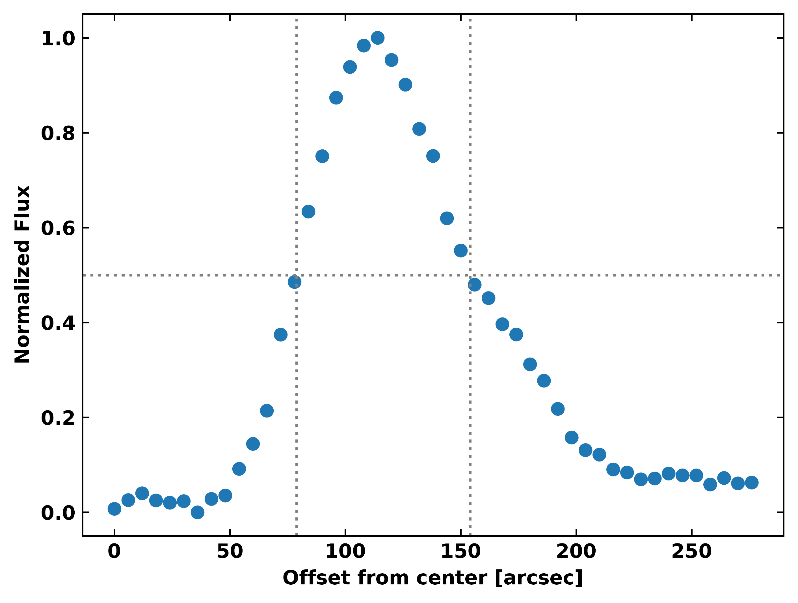

$\newcommand{\ensuremath}{}$
$\newcommand{\xspace}{}$
$\newcommand{\object}[1]{\texttt{#1}}$
$\newcommand{\farcs}{{.}''}$
$\newcommand{\farcm}{{.}'}$
$\newcommand{\arcsec}{''}$
$\newcommand{\arcmin}{'}$
$\newcommand{\ion}[2]{#1#2}$
$\newcommand{\textsc}[1]{\textrm{#1}}$
$\newcommand{\hl}[1]{\textrm{#1}}$
$\newcommand{\footnote}[1]{}$
$\newcommand{\HII}{\ion{H}{II}}$
$\newcommand{\Ha}{H{\alpha}}$
$\newcommand{\kms}{\rm km s^{-1}}$
$\newcommand{\xx}[1]{\textcolor{black}{ #1}}$
$\newcommand\kms{{\rm km s^{-1}}}$
$\newcommand\Kkms{{\rm K km s^{-1}}}$
$\newcommand\msun{{\mathrm{M}_\odot}}$
$\newcommand\lsun{{\mathrm{L}_\odot}}$
$\newcommand\micron{\hbox{\mum}}$
$\newcommand\solyr{{\rm M_\odot yr^{-1}}}$
$\newcommand\sol{{\rm M_\odot}}$
$\newcommand\dyncm{{\rm dyn cm^{-2}}}$
$\newcommand\ergs{{\rm  erg s^{-1}}}$
$\newcommand\cmsq{{\rm cm^{-2}}}$
$\newcommand\cmcb{{\rm cm^{-3}}}$
$\newcommand\gcmsq{{\rm g cm^{-2}}}$
$\newcommand\gcmcb{{\rm g cm^{-3}}}$
$\newcommand\Kcmcb{{\rm K cm^{-3}}}$
$\newcommand\ntdp{{\rm N_2D^+}}$
$\newcommand\name{{\rm the vortex}}$

# Disruption of a massive molecular cloud by a supernova in the Galactic Centre

<mark>Appeared on: 2024-09-19</mark> -  _17 pages, 13 figures, and 2 tables. Accepted for publication in Astronomy & Astrophysics_

M. Nonhebel, et al.

**Abstract:** The Milky Way's Central Molecular Zone (CMZ) differs dramatically from our local solar neighbourhood, both in the extreme interstellar medium conditions it exhibits (e.g. high gas, stellar, and feedback density) and in the strong dynamics at play (e.g. due to shear and gas influx along the bar).Consequently, it is likely that there are large-scale physical structures within the CMZ that cannot form elsewhere in the Milky Way.In this paper, we present new results from the Atacama Large Millimeter/submillimeter Array (ALMA) large programme ACES (ALMA CMZ Exploration Survey) and conduct a multi-wavelength and kinematic analysis to determine the origin of the M0.8 $-$ 0.2 ring, a molecular cloud with a distinct ring-like morphology. We estimate the projected inner and outer radii of the M0.8 $-$ 0.2 ring to be 79 $\arcsec$ and 154 $\arcsec$ , respectively (3.1 pc and 6.1 pc at an assumed Galactic Centre distance of 8.2 kpc) and calculate a mean gas density $> 10^{4}$ cm $^{-3}$ , a mass of $\sim$ $10^6$ $\sol$ , and an expansion speed of $\sim$ 20 $\kms$ , resulting in a high estimated kinetic energy ( $> 10^{51}$ erg) and momentum ( $> 10^7$ $\textup{M}_{\odot}$ $\kms$ ). We discuss several possible causes for the existence and expansion of the structure, including stellar feedback and large-scale dynamics. We propose that the most likely cause of the M0.8 $-$ 0.2 ring is a single high-energy hypernova explosion. To viably explain the observed morphology and kinematics, such an explosion would need to have taken place inside a dense, very massive molecular cloud, the remnants of which we now see as the M0.8 $-$ 0.2 ring. In this case, the structure provides an extreme example of how supernovae can affect molecular clouds.

**Figure 7. -** {Multi-wavelength view of the M0.8$-$0.2 ring.}
    The dotted white circles in each panel show the approximate extent of the _Herschel_ 250 $\mu$m continuum emission of the ring. The cyan circle marks the position of the $\ion${H}{ii} region discussed in Sect. \ref{subsec_youngfeedback}.
    _Top row, left to right:__Chandra_ 4 - 6 keV emission  ([ and Wang 2021]()) , 2MASS K-band observations  ([Skrutskie, Cutri and Stiening 2006]()) , and _Spitzer_ 8 $\mu$m observations from the GLIMPSE survey  ([Churchwell, Babler and Meade 2009]()) . _Middle row, left to right:__Spitzer_ MIPSGAL 24 $\mu$m  ([Carey, Noriega-Crespo and Mizuno 2009]())  and _Herschel_  70 and 250 $\mu$m observations  ([Molinari, Swinyard and Bally 2010]()) . _Bottom row, left to right:_ 3 mm continuum emission from the ACES survey (12 m combined with GBT+_Planck_ from \citealp{Ginsburg2020}), 20 cm emission observed by MeerKAT, and the MeerKAT spectral index map, with a zoomed-in view of the peak H40$\alpha$ emission at the location of the $\ion${H}{ii} region overlaid.
    In the 3 mm continuum image, magnetic field pseudo-vectors from the FIREPLACE polarimetry survey are overlaid (polarisation vectors rotated by 90 degrees, as the direction of the polarised electric field measured in the infrared is considered to be perpendicular to that of the magnetic field; \citealp{Butterfield2023, Butterfield2024}).
    The beam sizes of the observations are shown with a circle in the lower-right corner of each panel, with the FWHMs as follows (proceeding from left to right and top to bottom, and finishing with the H40$\alpha$ image): 0.5, 4, 2, 6, 5, 18, 2.5, 4, 4, and 1.4$\arcsec$. A scale bar of 5 pc is displayed in yellow on the _Chandra_ image. (*fig_multiwavelength*)

**Figure 5. -** {Overview of the M0.8$-$0.2 ring within the CMZ.}_Upper-left panel:_ HNCO (4--3) peak intensity map (12 m, 7 m, and total power array data combined) from ACES towards the M0.8$-$0.2 ring. The colour scale extends from 0.2 to 8.0 K in square root stretch. The dotted white circles show the approximate extent of the _Herschel_ 250 $\mu$m continuum emission of the ring-like structure. The ALMA beam size of 2.8$\arcsec$ is shown in the lower right, and a scale bar of 5 pc is shown in the lower left of the panel. _Lower-left panel:_ HNCO (4--3) emission from the Mopra telescope  ([Jones, Burton and Cunningham 2012]()) . The Mopra beam size of 39$\arcsec$ is shown in the lower right of the panel. _Upper-right panel:_ Multi-wavelength view of part of the CMZ. We show a three-colour composite of 8 \micron emission  from the * Spitzer* GLIMPSE survey \citep[green;][]{Churchwell2009}, 24 \micron emission from the * Spitzer* MIPSGAL survey \citep[yellow;][]{Carey2009}, and 20 cm emission observed by MeerKAT \citep[red;][]{Heywood2019, Heywood2022} and the GBT (red; \citealp{Law2008}). Overlaid as black contours are the total molecular gas column densities at levels of 5, 7.5, 10, 15, 25, and 50 $\times  10^{22}$ cm$^{-2}$(Battersby et al., in prep) calculated using data from the * Herschel* Hi-GAL survey  ([Molinari, Swinyard and Bally 2010]()) . Also overlaid are a number of interesting features in the Galactic Centre and the dotted white circles highlighting the ring-like structure (identical to the left panels). The _Herschel_ beam size of 25$\arcsec$ and a scale bar of 15 pc are shown in the lower left of the panel. _Lower-right panel:_ PV diagram of the Mopra HNCO (4--3) emission  ([Henshaw, Longmore and Kruijssen 2016]()) . Each point corresponds to the longitude and centroid velocity of a Gaussian component of the HNCO emission, extracted using {\sc scouse} ([Henshaw, Longmore and Kruijssen 2016]()) . The emission at the position of the ring-like structure is highlighted with three different colours, corresponding to the velocity ranges <0 $\kms$(blue), 0--70 $\kms$(orange), and >70 $\kms$(red). The orange dots correspond to the M0.8$-$0.2 ring, while the blue and red dots relate to additional line-of-sight material. The orbital model of [Kruijssen, Dale and Longmore (2015)]() is overlaid as a dashed black line. (*fig_CMZ_HNCO_peak*)

**Figure 1. -** {Radial profile from _Herschel_ 250 $\mu$m emission.} The mean flux contained in annuli of increasing radius is plotted, normalised against the peak value. The annuli are defined outwards from the centre of the M0.8-0.2 ring ($l=0.^{\circ}804$ and $b=-0.^{\circ}184$) with a thickness of one pixel. The overlaid vertical grey lines define the radii between which the normalised mean flux is above the threshold of 0.5, indicated by the horizontal grey line. (*fig_chans*)

