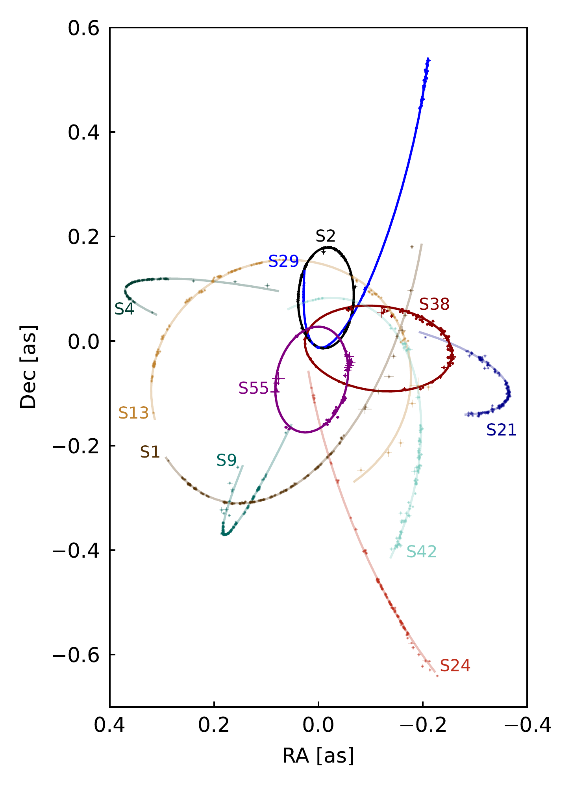
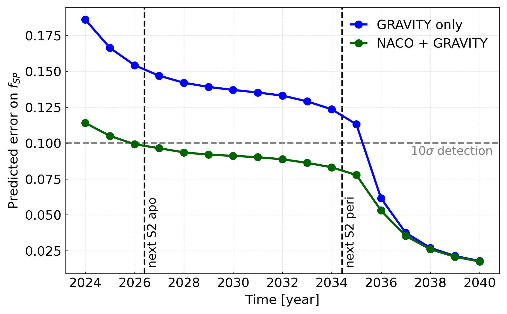
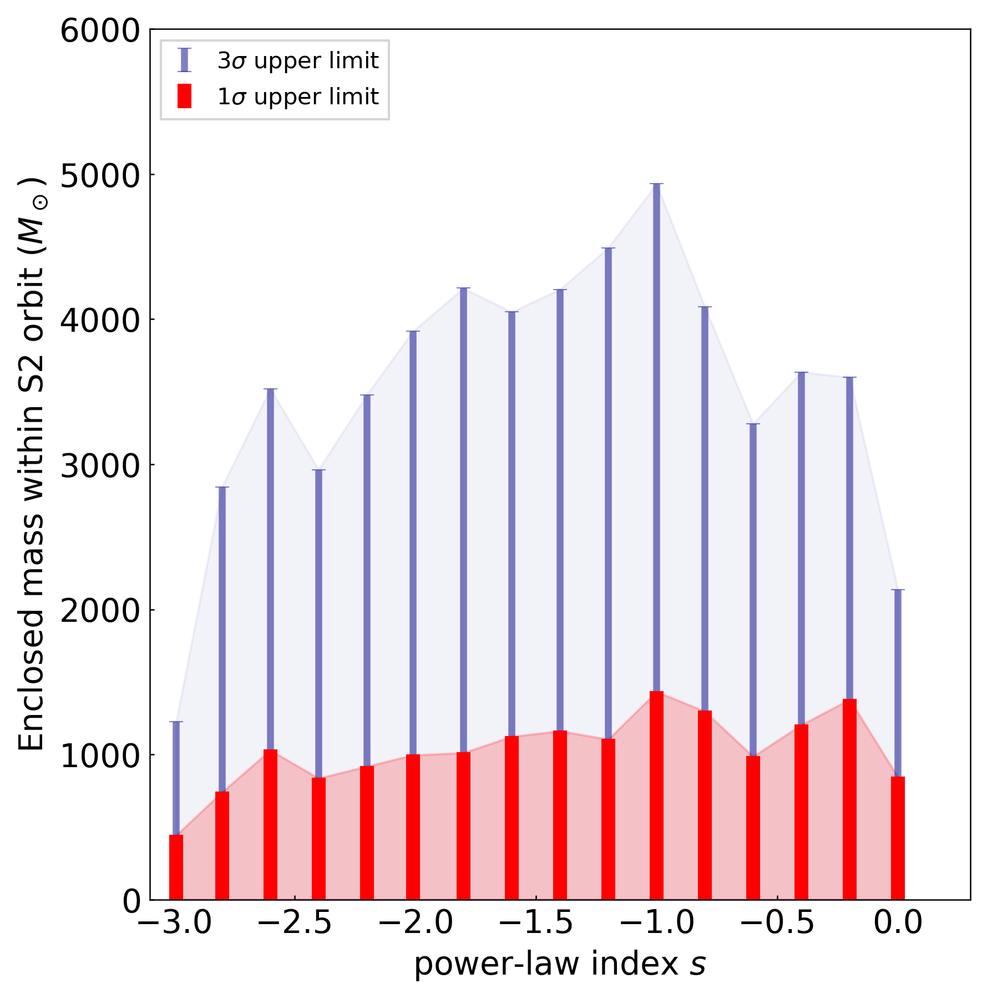
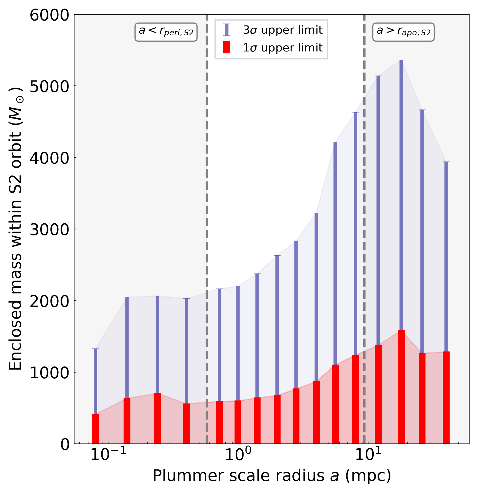

$\newcommand{\ensuremath}{}$
$\newcommand{\xspace}{}$
$\newcommand{\object}[1]{\texttt{#1}}$
$\newcommand{\farcs}{{.}''}$
$\newcommand{\farcm}{{.}'}$
$\newcommand{\arcsec}{''}$
$\newcommand{\arcmin}{'}$
$\newcommand{\ion}[2]{#1#2}$
$\newcommand{\textsc}[1]{\textrm{#1}}$
$\newcommand{\hl}[1]{\textrm{#1}}$
$\newcommand{\footnote}[1]{}$

# Improving constraints on the extended mass distribution in the Galactic Center with stellar orbits

<mark>Appeared on: 2024-09-20</mark> -  _Submitted to A&A on September 17, 2024_

T. G. Collaboration, et al. -- incl., <mark>P. Garcia</mark>, <mark>T. Henning</mark>, <mark>S. Scheithauer</mark>

**Abstract:** Studying the orbital motion of stars around Sagittarius A* in the Galactic Center provides a unique opportunity to probe the gravitational potential near the supermassive black hole at the heart of our Galaxy. Interferometric data obtained with the GRAVITY instrument at the Very Large Telescope Interferometer (VLTI) since 2016 has allowed us to achieve unprecedented precision in tracking the orbits of these stars. GRAVITY data have been key to detecting the in-plane, prograde Schwarzschild precession of the orbit of the star S2, as predicted by General Relativity. By combining astrometric and spectroscopic data from multiple stars, including S2, S29, S38, and S55 - for which we have data around their time of pericenter passage with GRAVITY - we can now strengthen the significance of this detection to an approximately $10 \sigma$ confidence level. The prograde precession of S2's orbit provides valuable insights into the potential presence of an extended mass distribution surrounding Sagittarius A*, which could consist of a dynamically relaxed stellar cusp comprised of old stars and stellar remnants, along with a possible dark matter spike. Our analysis, based on two plausible density profiles - a power-law and a Plummer profile - constrains the enclosed mass within the orbit of S2 to be consistent with zero, establishing an upper limit of approximately $1200   M_\odot$ with a $1 \sigma$ confidence level. This significantly improves our constraints on the mass distribution in the Galactic Center. Our upper limit is very close to the expected value from numerical simulations for a stellar cusp in the Galactic Center, leaving little room for a significant enhancement of dark matter density near Sagittarius A*.

**Figure 1. -** Orbits for the set of 11 S-stars that have been used in this paper. Highlighted are the 4 most relevant stars to constrain the gravitational potential around Sgr A*: S2, S29, S38 and S55. (*fig_orb*)

**Figure 2. -** Predicted error on $f_{SP}$ as a function of time, obtained through mock observations of S2 with GRAVITY and ERIS. The blue points show the result keeping only GRAVITY data in the fit, namely excluding the NACO data and removing the reference frame parameters. The green points show the result keeping both NACO and GRAVITY data.
    (*fig_simu*)

**Figure 6. -** Upper limit on the enclosed mass within the orbit of S2 for an extended mass distribution around Sgr A*. We test two plausible density profile for the mass distribution: a power-law profile with varying slope (panel a) and a Plummer profile with varying scale radius (panel b). In red we plot the $1 \sigma$ upper limit and in blue the $3 \sigma$ upper limit, derived from a multi-star fit using data from the stars S2, S29, S38 and S55. Independently of the density profile, the enclosed mass within S2’s orbit is consistently compatible with zero. We set a strong upper limit of approximately $1200   M_\odot$ with a $1 \sigma$ confidence level, for reasonable choices of the slope of the power-law ($s<-1.2$) and the scale radius of the Plummer profile ($a \lesssim 8$ mpc).
        ** Power-law profile****Plummer profile** (*fig:extmass_4s*)

