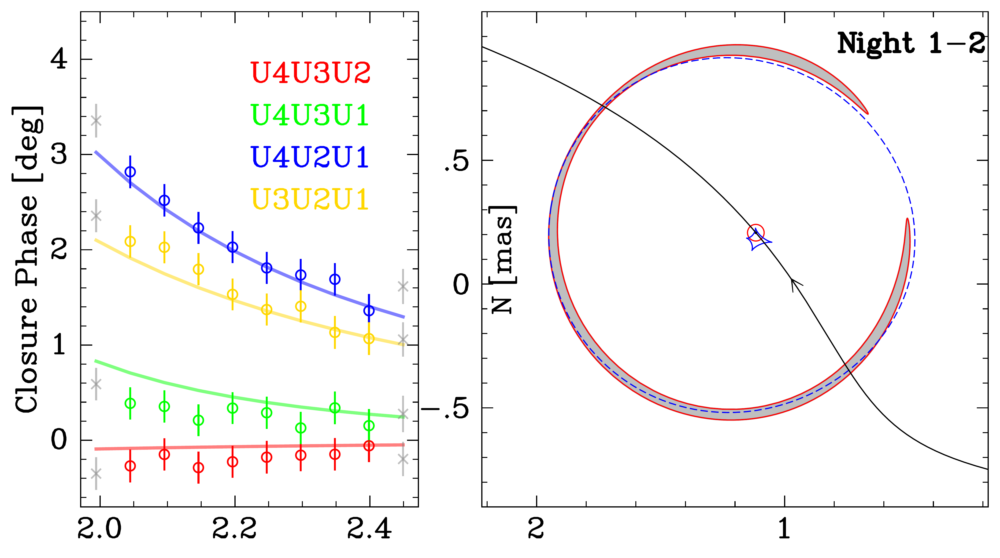
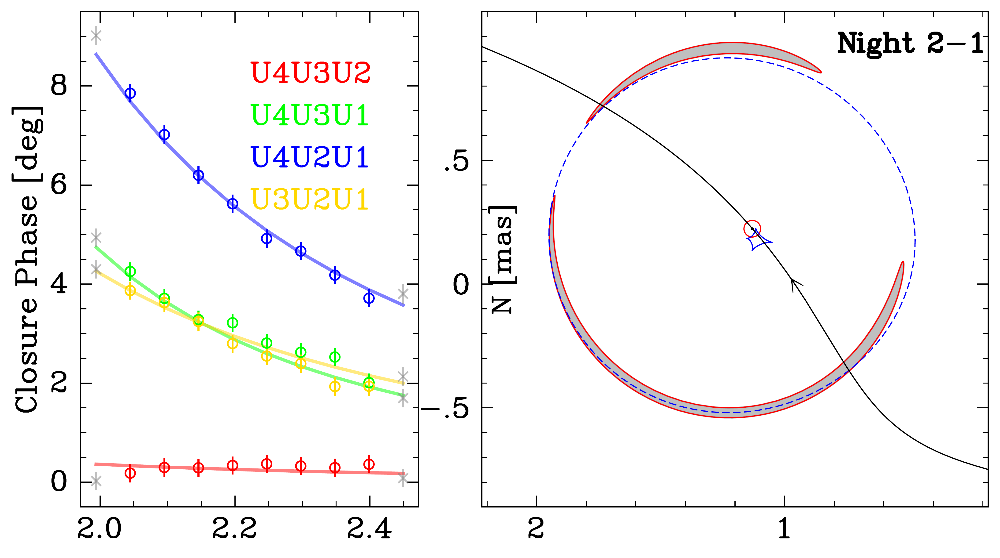
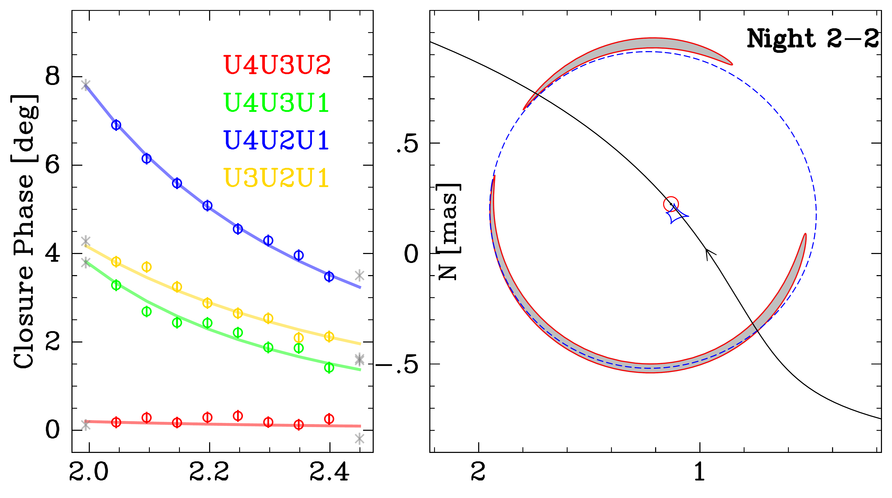
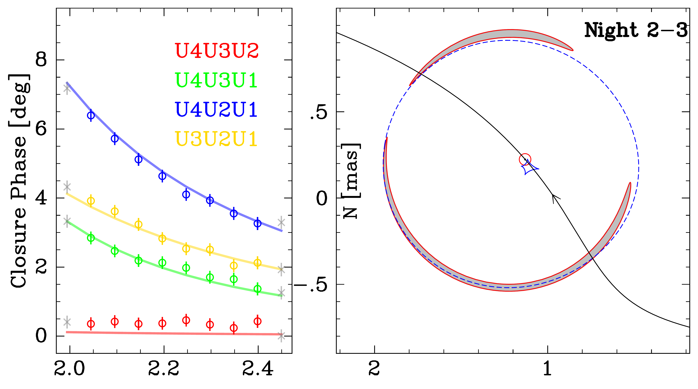
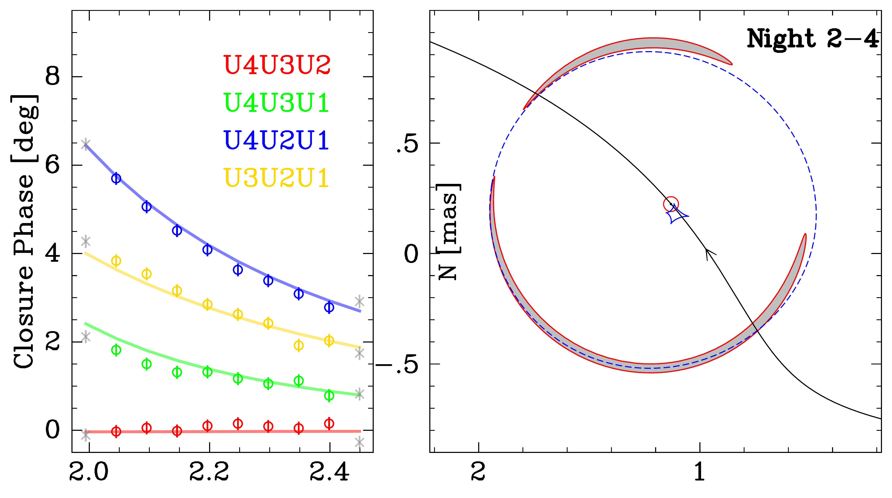
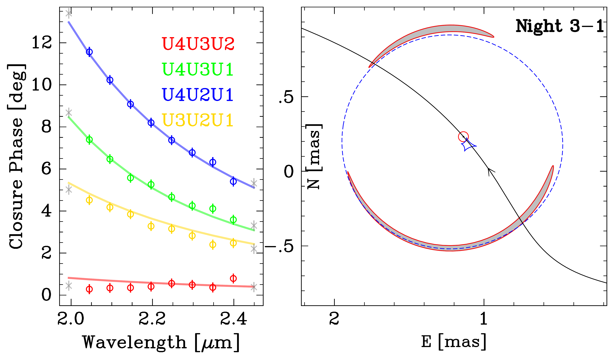
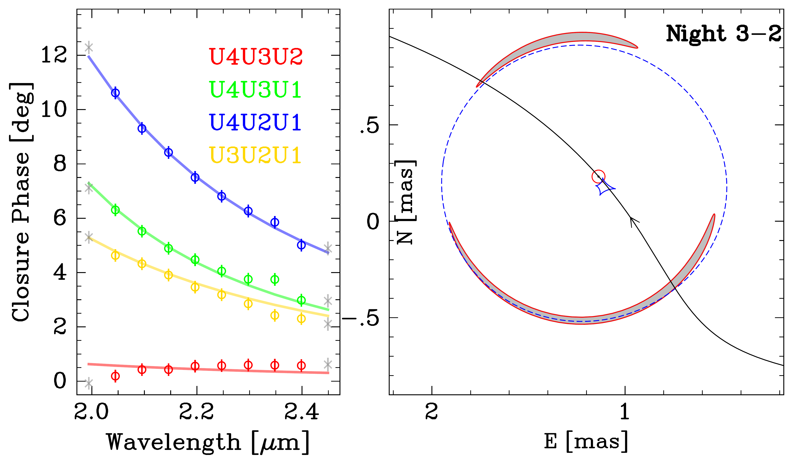
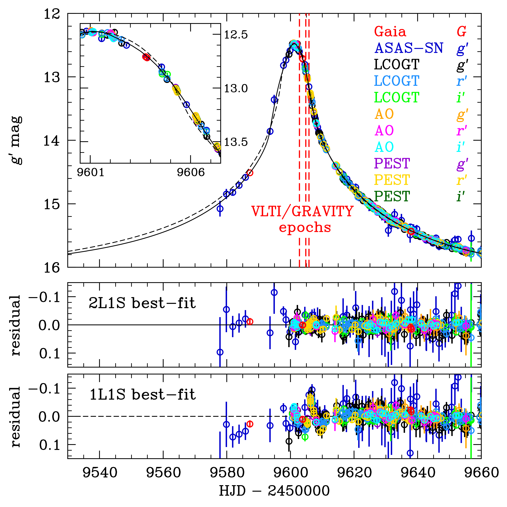
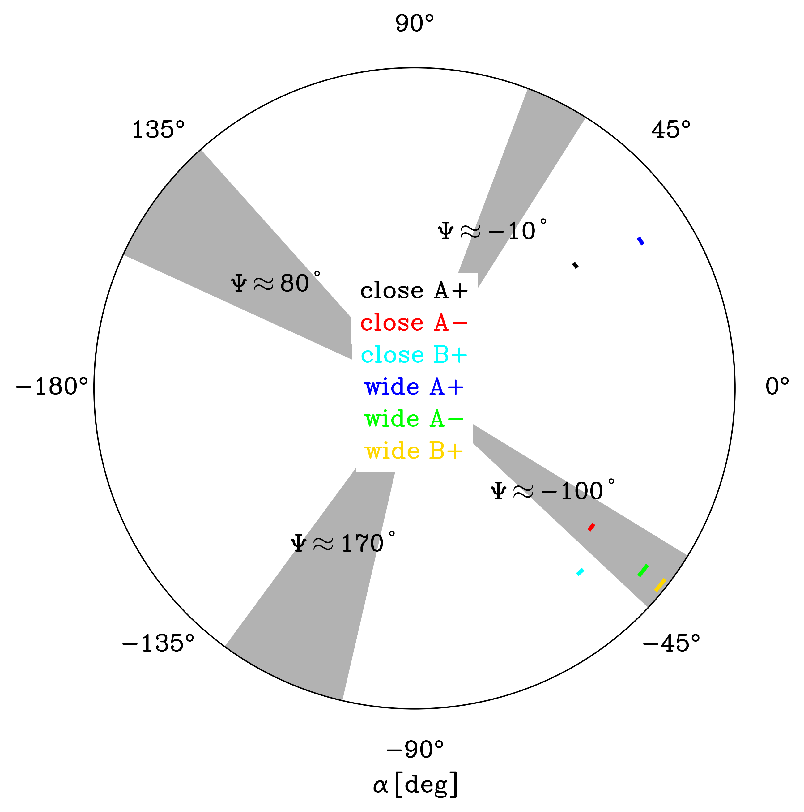

$\newcommand{\ensuremath}{}$
$\newcommand{\xspace}{}$
$\newcommand{\object}[1]{\texttt{#1}}$
$\newcommand{\farcs}{{.}''}$
$\newcommand{\farcm}{{.}'}$
$\newcommand{\arcsec}{''}$
$\newcommand{\arcmin}{'}$
$\newcommand{\ion}[2]{#1#2}$
$\newcommand{\textsc}[1]{\textrm{#1}}$
$\newcommand{\hl}[1]{\textrm{#1}}$
$\newcommand{\footnote}[1]{}$
$\newcommand{\au}{{\rm AU}}$
$\newcommand{\sinc}{{\rm sinc}}$
$\newcommand{\kms}{{\rm km} {\rm s}^{-1}}$
$\newcommand{\masyr}{{\rm mas} {\rm yr}^{-1}}$
$\newcommand{\yr}{{\rm yr}}$
$\newcommand{\kpc}{{\rm kpc}}$
$\newcommand{\mas}{{\rm mas}}$
$\newcommand{\sat}{{\rm sat}}$
$\newcommand{\muas}{\mu{\rm as}}$
$\newcommand{\var}{{\rm var}}$
$\newcommand{\pc}{{\rm pc}}$
$\newcommand{\orb}{{\rm orb}}$
$\newcommand{\obs}{{\rm obs}}$
$\newcommand{\max}{{\rm max}}$
$\newcommand{\min}{{\rm min}}$
$\newcommand{\rel}{{\rm rel}}$
$\newcommand{\ast}{{\rm ast}}$
$\newcommand{\eff}{{\rm eff}}$
$\newcommand{\rot}{{\rm rot}}$
$\newcommand{\lsr}{{\rm lsr}}$
$\newcommand{\hel}{{\rm hel}}$
$\newcommand{\geo}{{\rm geo}}$
$\newcommand{\B}{{\rm B}}$
$\newcommand{\Sc}{{\rm S}}$
$\newcommand{\L}{{\rm L}}$
$\newcommand{\E}{{\rm E}}$
$\newcommand{\bpi}{{\bm\pi}}$
$\newcommand{\bmu}{{\bm\mu}}$
$\newcommand{\balpha}{{\bdv\alpha}}$
$\newcommand{\bgamma}{{\bdv\gamma}}$
$\newcommand{\bDelta}{{\bdv\Delta}}$
$\newcommand{\btheta}{{\bdv\theta}}$
$\newcommand{\bphi}{{\bdv\phi}}$
$\newcommand{\bp}{{\bf p}}$
$\newcommand{\bv}{{\bf v}}$
$\newcommand{\bu}{{\bf u}}$
$\newcommand{\deg}{^\circ}$
$\newcommand{\close}{{"close A-"}}$
$\newcommand{\wide}{{"wide A-"}}$
$\newcommand{\revisec}{\color{red}}$

# First Resolution of Microlensed Images of a Binary-Lens Event

<mark>Appeared on: 2024-09-23</mark> -  _see the ancillary file for animation associated with Fig. 8_

Z. Wu, et al. -- incl., <mark>W. Brandner</mark>, <mark>P. Garcia</mark>, <mark>L. Kreidberg</mark>, <mark>J. Sauter</mark>

**Abstract:** We resolve the multiple images of the binary-lens microlensing event ASASSN-22av using the GRAVITY instrument of the Very Large Telescope Interferometer (VLTI). The light curves show weak binary perturbations, complicating the analysis, but the joint modeling with the VLTI data breaks several degeneracies, arriving at a strongly favored solution. Thanks to precise measurements of angular Einstein radius $\theta_\E = 0.726\pm0.002$ mas and microlens parallax, we determine that the lens system consists of two M dwarfs with masses of $M_1= 0.261\pm{0.009}  M_\odot$ and $M_2 = 0.252\pm{0.017}  M_\odot$ , a projected separation of $r_\perp = 7.42\pm0.33 \au$ and a distance of $D_\L=2.31\pm0.09$ kpc. The successful VLTI observations of ASASSN-22av open up a new path for studying intermediate-separation (i.e., a few AUs) stellar-mass binaries, including those containing dark compact objects such as neutron stars and stellar-mass black holes.

**Figure 7. -** $4\times 2$ panel groups showing the closure phase data and the best-fit microlensing model ($\wide$) for the eight VLTI GRAVITY exposures obtained over three nights. Within each group, the left sub-panel shows the closure phase data as a function of wavelength, with the best-fit model over-plotted as solid lines; the right sub-panel shows the caustics (blue), source trajectory (black line with an arrow) and source position (red circle) at the time of the VLTI observation, with the microlensed images displayed as shaded regions and the critical curves as blue dashed lines. (*fig:cpfit*)

**Figure 1. -** Top: The multi-band light curves of the microlensing event ASASSN-22av, which are well described by the best-fit 2L1S model (black solid line) from the joint VLTI and light-curve analysis. The light curves deviate from the best-fit 1L1S model with finite-source effects (black dashed line) near the peak, as shown with the enlarged view in the inset. We analyze three nights of VLTI GRAVITY observations taken after the peak, and their epochs are marked with the red dashed lines.
		Middle: The residuals of the best-fit  2L1S model.
		Bottom: The best-fit 1L1S model shows significant residuals for the $\sim 10$ days around the peak. (*fig:lc*)

**Figure 5. -** The comparisons of $\alpha_{\rm LC}$ derived from light-curve fitting with $\alpha_{\rm VLTI}$ inferred from VLTI data. The colored arcs denote the 1$\sigma$ range of $\alpha_{\rm LC}$ for solutions "close A$+$" (black), "close A$-$" (red), "close B$+$" (cyan), "wide A$+$" (blue), "wide A$-$" (green) and "wide B$+$" (yellow), respectively. The shaded regions indicate the 3$\sigma$ range of $\alpha_{\rm VLTI}$ at $\Psi \sim -100$\deg$, -10$\deg$, 80$\deg$$ and $170$\deg$$. Three solutions (wide A$-$, wide B$+$ and close A$-$) have consistent $\alpha_{\rm LC}$ with $\alpha_{\rm VLTI}$. (*fig:alpha*)

