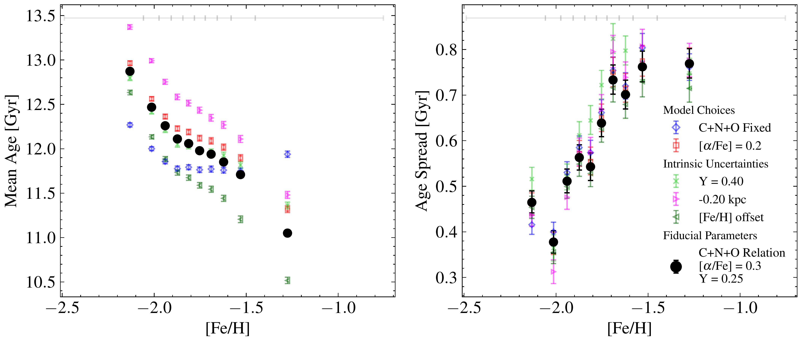
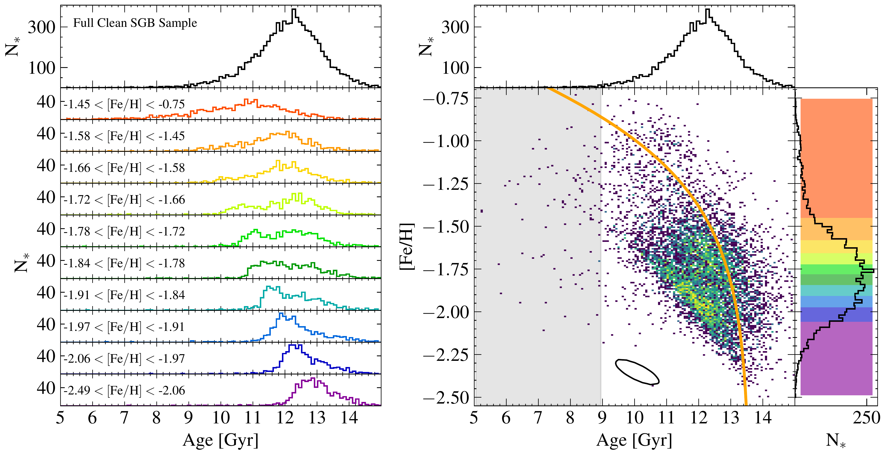
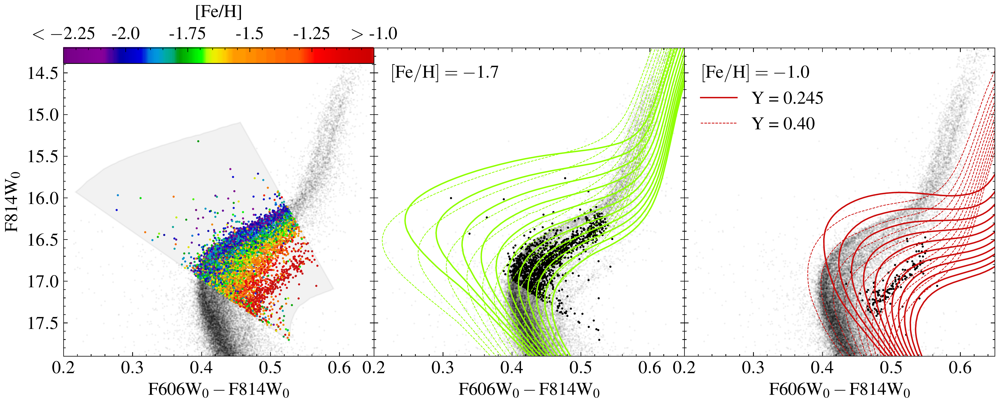

$\newcommand{\ensuremath}{}$
$\newcommand{\xspace}{}$
$\newcommand{\object}[1]{\texttt{#1}}$
$\newcommand{\farcs}{{.}''}$
$\newcommand{\farcm}{{.}'}$
$\newcommand{\arcsec}{''}$
$\newcommand{\arcmin}{'}$
$\newcommand{\ion}[2]{#1#2}$
$\newcommand{\textsc}[1]{\textrm{#1}}$
$\newcommand{\hl}[1]{\textrm{#1}}$
$\newcommand{\footnote}[1]{}$
$\newcommand{\vdag}{(v)^\dagger}$
$\newcommand$
$\newcommand$
$\newcommand$
$\newcommand$

# oMEGACat IV: Constraining Ages of Omega Centauri sub-giant branch stars with _HST_ and MUSE

<mark>Appeared on: 2024-09-24</mark> -  _23 pages, 11 figures_

<mark>C. Clontz</mark>, et al. -- incl., <mark>M. Häberle</mark>, <mark>N. Neumayer</mark>

**Abstract:** We present age estimates for over 8100 sub-giant branch (SGB) stars in Omega Centauri ( $\omc$ ) to study its star formation history. Our large data set, which combines multi-wavelength _HST_ photometry with MUSE metallicities, provides an unprecedented opportunity to measure individual stellar ages. We do this by fitting each star's photometry and metallicity with theoretical isochrones, that are embedded with an empirical [ C+N+O ] - [ Fe/H ] relation specifically for $\omc$ . The bulk of the stars have ages between 13 and 10 Gyr, with the mean stellar age being 12.08 $\pm{0.01}$ Gyrs and the median age uncertainty being 0.68 Gyrs. From these ages we construct the most complete age-metallicity relation (AMR) for $\omc$ to date.  We find that the mean age of stars decreases with increasing metallicity and find two distinct streams in the age-metallicity plane, hinting at different star formation pathways. We derive an intrinsic spread in the ages of 0.75 $\pm{0.01}$ Gyr for the whole cluster, with the age spread showing a clear increase with metallicity. We verif $\newtext{y}$ the robustness of our age estimations by varying isochrone parameters and constraining our systematics. We find the C+N+O relation to be the most critical consideration for constraining the AMR. We also present the SGB chromosome map with age information. In the future, these stellar ages could be combined with chemical abundances to study age differences in subpopulations, and uncover the chemical evolution history of this massive nuclear star cluster.

**Figure 10. -** (*left*) **Mean Age vs. [Fe/H] Systematics:** Our mean age (\em{left}) and age spread (\em{right}) as a function of metallicity with our fiducial results (black points) as well as systematic tests (colored points; marker labels shared with both panels).  In both panels errorbars show 1$\sigma$ uncertainty and gray bars along the top denote the [Fe/H] equal number bin edges. Generally, our systematics tests slightly affect the mean ages but not the trend with [Fe/H] except for the C+N+O abundance, which significantly impacts this measurement. The age spread is largely independent of any systematic effects.
 (*fig:age_and_age_spread_systematics*)

**Figure 8. -** **The Age-Metallicity Relation:**(*left*) The age distribution of the SGB star sample in equal number ($ \rm N_* = 803$) metallicity bins. The colors correspond to the colormap of Figure 1. (*right*) The 2D histogram of stars in the age-metallicity plane is given by the colormap, where purple is less dense and yellow is denser. The median uncertainty is given by the black contour in the lower center. The Gaia-Sausage /Enceladus (GS/E) SFH  ([Limberg, Souza and Pérez-Villegas 2022]())  is shown by the orange line. \newtext{On the right side we show the full [Fe/H] histogram with each equal number bin region denoted by colored patches. On the top of both panels we show the full age histogram for the clean SGB sample.} (*fig:age_met_relation*)

**Figure 6. -** **SGB Selection \& Relevant Isochrones:** The left panel shows our initial SGB region selection colored by the MUSE metallicity. The middle panel shows stars with $-1.75 < {\rm[Fe/H]} < -1.65$ and isochrones (described in Section \ref{subsec:iso_models}) with [Fe/H] = -1.7  and ages ranging from 5 to 15 Gyr (top to bottom) overplotted in green. The solid lines are the solar scaled helium abundance isochrones and the dashed lines are the Y$=$0.40 models. The right panel is similar to the middle, now with ${\rm[Fe/H]} = -1.0$ and isochrones colored in red. Our selection utilizes the region where the models are the most similar. (*fig:sgb_region*)

