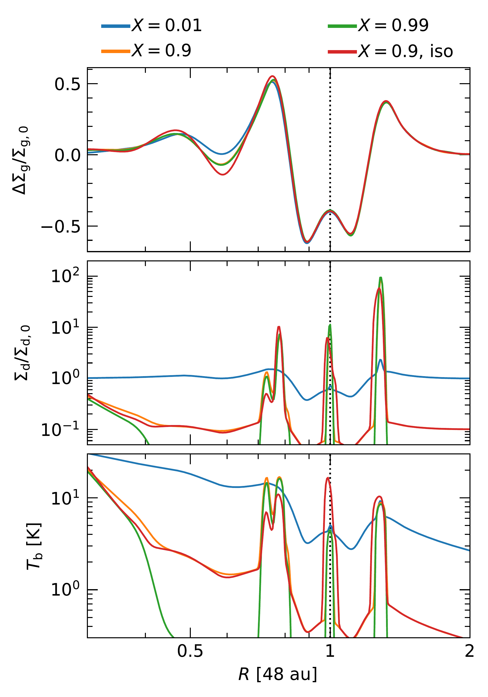
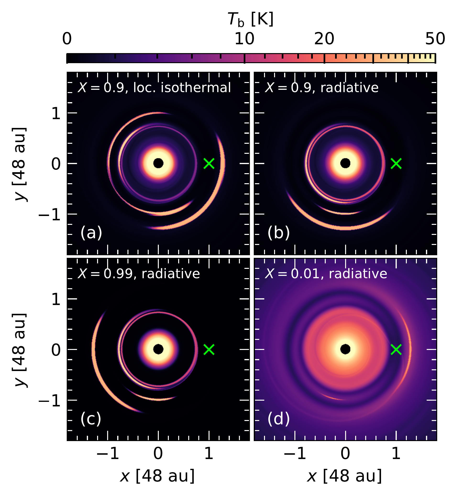
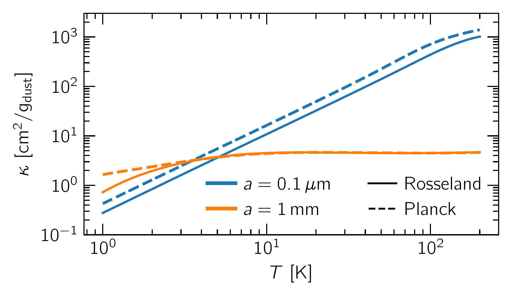

$\newcommand{\ensuremath}{}$
$\newcommand{\xspace}{}$
$\newcommand{\object}[1]{\texttt{#1}}$
$\newcommand{\farcs}{{.}''}$
$\newcommand{\farcm}{{.}'}$
$\newcommand{\arcsec}{''}$
$\newcommand{\arcmin}{'}$
$\newcommand{\ion}[2]{#1#2}$
$\newcommand{\textsc}[1]{\textrm{#1}}$
$\newcommand{\hl}[1]{\textrm{#1}}$
$\newcommand{\footnote}[1]{}$
$\newcommand{\tensor}[1]{\overline{\textbf{#1}}}$
$\newcommand{\tensorGR}[1]{\overline{\bm{{#1}}}}$
$\newcommand{\DP}[2]{\frac{\partial{#1}}{\partial{#2}}}$
$\newcommand{\D}[2]{\frac{\text{d}{#1}}{\text{d}{#2}}}$
$\newcommand{\ep}{e_\mathrm{p}}$
$\newcommand{\ap}{a_\mathrm{p}}$
$\newcommand{\G}{\text{G}}$
$\newcommand{\Mstar}{M_\star}$
$\newcommand{\Lstar}{L_\star}$
$\newcommand{\Rp}{R_\mathrm{p}}$
$\newcommand{\Mp}{M_\mathrm{p}}$
$\newcommand{\hp}{h_\mathrm{p}}$
$\newcommand{\Hp}{H_\mathrm{p}}$
$\newcommand{\Tp}{T_\mathrm{p}}$
$\newcommand{\Pp}{P_\mathrm{p}}$
$\newcommand{\Tb}{T_\mathrm{b}}$
$\newcommand{\Mth}{M_\mathrm{th}}$
$\newcommand{\Msun}{\mathrm{M}_\odot}$
$\newcommand{\Lsun}{\mathrm{L}_\odot}$
$\newcommand{\Mjup}{\mathrm{M}_\mathrm{J}}$
$\newcommand{\Rgas}{\mathcal{R}}$
$\newcommand{\cs}{c_\mathrm{s}}$
$\newcommand{\csiso}{c_\mathrm{s,iso}}$
$\newcommand{\csadb}{c_\mathrm{s}^\mathrm{ad}}$
$\newcommand{\OmegaK}{\Omega_\mathrm{K}}$
$\newcommand{\vK}{u_\mathrm{K}}$
$\newcommand{\mean}[1]{\langle{#1} \rangle}$
$\newcommand{\tauR}{\tau_\mathrm{R}}$
$\newcommand{\tauP}{\tau_\mathrm{P}}$
$\newcommand{\tauReff}{\tau_\mathrm{R}^\mathrm{eff}}$
$\newcommand{\tauPeff}{\tau_\mathrm{P}^\mathrm{eff}}$
$\newcommand{\taueff}{\tau_\mathrm{eff}}$
$\newcommand{\kappaR}{\kappa_\mathrm{R}}$
$\newcommand{\kappaP}{\kappa_\mathrm{P}}$
$\newcommand{\cv}{c_\mathrm{v}}$
$\newcommand{\rhomid}{\rho_\mathrm{mid}}$
$\newcommand{\sigmaSB}{\sigma_\mathrm{SB}}$
$\newcommand{\vel}{\bm{u}}$
$\newcommand{\xh}{{x}_\mathrm{h}}$
$\newcommand{\varpih}{{\varpi}_\mathrm{h}}$
$\newcommand{\tcool}{t_\mathrm{cool}}$
$\newcommand{\bcool}{\beta_\mathrm{cool}}$
$\newcommand{\bsurf}{\beta_\mathrm{surf}}$
$\newcommand{\bmid}{\beta_\mathrm{mid}}$
$\newcommand{\btot}{\beta_\mathrm{tot}}$
$\newcommand{\bcoll}{\beta_\mathrm{coll}}$
$\newcommand{\bbuoy}{\beta_\mathrm{buoy}}$
$\newcommand{\bdiff}{\beta_\text{diff}}$
$\newcommand{\bfld}{\beta_\mathrm{FLD}}$
$\newcommand{\Qvisc}{Q_\mathrm{visc}}$
$\newcommand{\Qcool}{Q_\mathrm{cool}}$
$\newcommand{\Qirr}{Q_\mathrm{irr}}$
$\newcommand{\Qrad}{Q_\mathrm{rad}}$
$\newcommand{\Qrelax}{Q_\mathrm{relax}}$
$\newcommand{\Erad}{E_\mathrm{rad}}$
$\newcommand{\aR}{a_\mathrm{R}}$
$\newcommand{\lrad}{l_\mathrm{rad}}$
$\newcommand{\Sigmag}{\Sigma_\mathrm{g}}$
$\newcommand{\Sigmad}{\Sigma_\mathrm{d}}$
$\newcommand{\velg}{\vel_\mathrm{g}}$
$\newcommand{\veld}{\vel_\mathrm{d}}$
$\newcommand{\veli}{\vel_\mathrm{i}}$
$\newcommand{\velj}{\vel_\mathrm{j}}$
$\newcommand{\St}{\mathrm{St}}$
$\newcommand{\ts}{t_\mathrm{s}}$
$\newcommand{\ad}{a_\mathrm{d}}$
$\newcommand{\brhod}{\bar{\rho}_\mathrm{d}}$
$\newcommand{\sd}{s_\mathrm{d}}$
$\newcommand{\md}{m_\mathrm{d}}$
$\newcommand{\pluto}{\texttt{PLUTO}}$
$\newcommand{\dw}{\texttt{DUSTYWAVE}}$
$\newcommand{\fargo}{{\texttt{FARGO3D}}}$
$\newcommand{\thebibliography}{\DeclareRobustCommand{\VAN}[3]{##3}\VANthebibliography}$

# Dusty substructures induced by planets in ALMA disks:\\how dust growth and dynamics changes the picture

<mark>Appeared on: 2024-09-25</mark> -  _15 pages, 15 figures, 2 tables; submitted to MNRAS, uploaded for visibility during PLUTO symposium; suggestions and comments welcome_

A. Ziampras, et al. -- incl., <mark>P. Sudarshan</mark>, <mark>M. Flock</mark>

**Abstract:** Protoplanetary disks exhibit a rich variety of substructure in millimeter continuum emission, often attributed to unseen planets. As these planets carve gaps in the gas, dust particles can accumulate in the resulting pressure bumps, forming bright features in the dust continuum. We investigate the role of dust dynamics in the gap-opening process with 2D radiation hydrodynamics simulations of planet--disk interaction and a two-population dust component modeled as a pressureless fluid. We consider the opacity feedback and backreaction due to drag forces as mm grains accumulate in pressure bumps at different stages of dust growth. We find that dust dynamics can significantly affect the resulting substructure driven by the quasi-thermal-mass planet with $\Mp/\Mstar=10^{-4}$ . Opacity feedback causes nonaxisymmetric features to become more compact in azimuth, whereas the drag-induced backreaction tends to dissolve nonaxisymmetries. For our fiducial model, this results in multiple concentric rings of dust rather than the expected vortices and corotating dust clumps found in models without dust feedback. A higher coagulation fraction disproportionately enhances the effect of dust opacity feedback, favoring the formation of crescents rather than rings. Our results suggest that turbulent diffusion is not always necessary to explain the rarity of observed nonaxisymmetric features, and that incorporating dust dynamics is vital for interpreting the observed substructure in protoplanetary disks. We also describe and test the implementation of the publicly-available dust fluid module in the $\pluto$ code.

**Figure 5. -** Azimuthally averaged gas surface density (top), dust surface density (middle), and dust brightness temperature at 1.25 mm (bottom) for models with different coagulation fractions $X$. The secondary gap in the gas surface density is shallower for smaller $X$(i.e., more mass in small grains), due to the longer cooling timescale in the inner disk. Substructure in the dust is less pronounced for $X=0.01$, due to the well-coupled small grains representing most of the dust mass. (*fig:compare-X-1D*)

**Figure 7. -** Brightness temperature heatmaps at 1.25 mm for models with different coagulation fractions $X$. The locally isothermal model (panel *a*) shows a fainter ring than its radiative counterpart (*b*) near the inner gap edge and an azimuthally extended bright feature inside the corotating region. The model with $X=0.01$(*d*) is overall brighter and shows less pronounced features, as the bulk of the dust is perfectly coupled to the gas. (*fig:compare-X*)

**Figure 2. -** Rosseland and Planck mean opacities as a function of temperature for small (blue) and big (orange) grains. Small grains follow a power law $\propto T^{1.6}$, while big grains have a roughly constant opacity. (*fig:opacity-temperature*)

