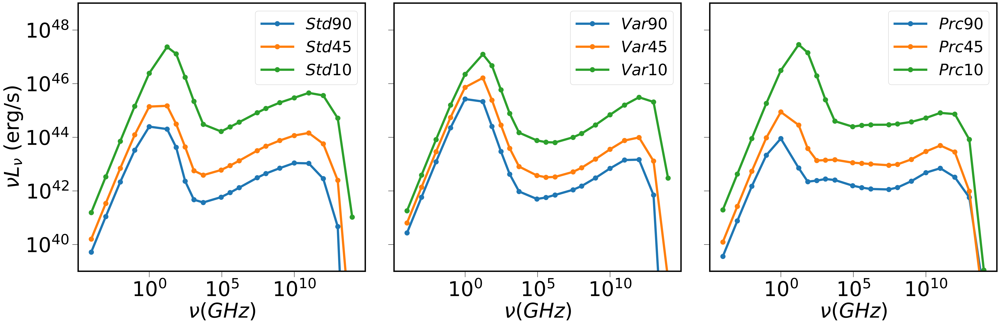
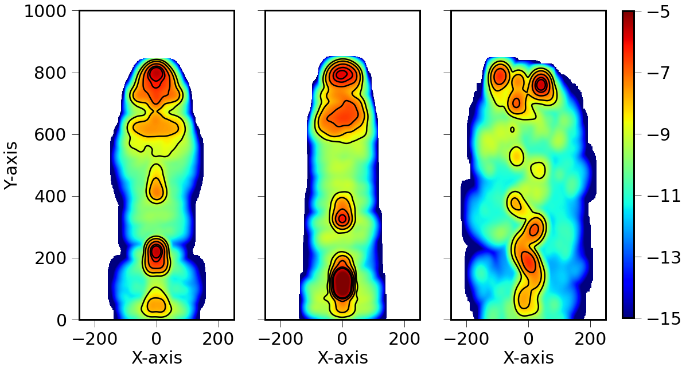
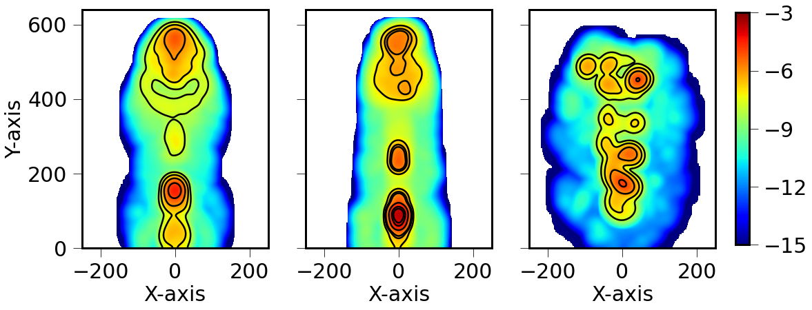
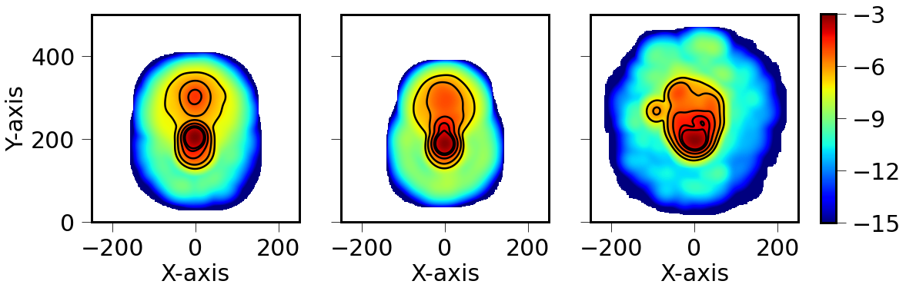
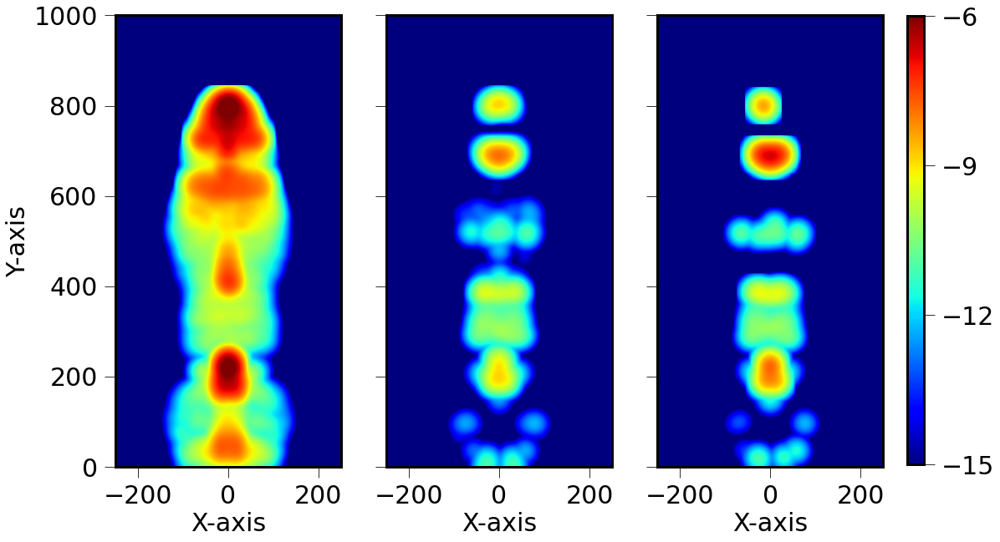

$\newcommand{\ensuremath}{}$
$\newcommand{\xspace}{}$
$\newcommand{\object}[1]{\texttt{#1}}$
$\newcommand{\farcs}{{.}''}$
$\newcommand{\farcm}{{.}'}$
$\newcommand{\arcsec}{''}$
$\newcommand{\arcmin}{'}$
$\newcommand{\ion}[2]{#1#2}$
$\newcommand{\textsc}[1]{\textrm{#1}}$
$\newcommand{\hl}[1]{\textrm{#1}}$
$\newcommand{\footnote}[1]{}$
$\newcommand{\vecc}{\textbf{\textit }}$

# Particles in Relativistic MHD Jets II: Bridging Jet Dynamics with Multi-waveband Non-Thermal Emission Signatures

<mark>Appeared on: 2024-09-25</mark> -  _Submitted to The Astrophysical Journal (ApJ)_

<mark>R. P. Dubey</mark>, <mark>C. Fendt</mark>, B. Vaidya

**Abstract:** Relativistic magnetized jets, originating near black holes, are observed to exhibit sub-structured flows.In this study, we present synthetic synchrotron emission signatures for different lines of sight and frequencies,derived from three-dimensional relativistic magneto-hydrodynamic simulations of pc-scale AGN jets.These simulations apply different injection nozzles, injecting steady, variable, and precessing jets.Extending our previous study, here, we have developed a bridge to connect jet dynamics and particle acceleration withinrelativistic shocks with non-thermal radiation dominant in jets.The emission is derived from Lagrangian particles - injected into the jet and following the fluid - accelerated through diffusiveshock acceleration and subsequently cooled by emitting energy via synchrotron and inverse-Compton processes.Overall, the different shocks structures lead to the formation of numerous localized emission patterns - interpreted as jet knots.These knot patterns can fade or flare, also as a consequence of merging or Doppler boosting, leading to jet variability.We find knots with high-enough pattern speed supposed to be visible as superluminal motion $\lesssim 5c$ .Synchrotron spectra of all jets reveal double-humped structures, reflecting multiple electron populations characterized by the natureof underlying shock and their age.The precessing jet is the most powerful emitter, featuring a spectrum flatter than the steady and the variable jet.The emission, although essentially governed by the acceleration through shocks, depends on the cooling history of the particle as well.Overall, the continuous re-acceleration of electrons through shocks along the jet we found,is an essential prerequisite for observing extended jet emission over large time-scales and length-scales.

**Figure 10. -** Radiation spectra from simulations of a steady jet (left), a variable jet (center), and a precessing jet (right),
    at time $t=50$(in code units).
    In all three panels, the blue, orange and green curves represent the inclination
    $\hat{_**n**_}_{\rm los} = 90^\circ$, $45^\circ$, and $10^\circ$ respectively.
    Fluxes are integrated over the whole computational domain, similar to an unresolved * core* emission. (*fig:spc_t50*)

**Figure 4. -** 2D distribution of specific intensity $I_{\nu}$(in $\log$ scale), blurred with a Gaussian beam, in the plane of the sky at frequency $\nu = 1$ GHz and time $t=50$(in code units)
    after integrating the specific emissivity $J_{\nu}$ along the line of sight.
    Shown are the maps for
    steady (left), variable (center), and precessing (right) jets with inclination $\hat{_**n**_}_{\rm los} = 90^\circ$(top panel), $45^\circ$(middle panel) and $10^\circ$(bottom panel), respectively.
    The colorbars indicate the level of specific intensity in $\rm{erg  s^{-1}cm^{-2}str^{-1}Hz^{-1}}$(in $\log$ scale).
    The black contours indicate 0.01, 0.1, 1, 5, and 10 per cent of maximum intensity in all panels.
    Additionally, contours at $10^{-5}$ of the maximum intensity are added in the middle panel
    for better visualisation.
     (*fig:blur_intensity_1GHZ*)

**Figure 5. -** Mock radiant intensity ($\nu I_{\nu}$) distribution (in $\log$ scale) in the plane of the sky  for the steady jet * Std90* at time $t=50$
    and frequency $\nu = 1$ GHz (left), $9\times 10^4$ GHz (center), and $10^9$ GHz (right), lying in the radio, optical and X-ray regime, respectively.
    The colorbars indicate the levels of radiant intensity in $10^9 \rm{erg s^{-1}cm^{-2}str^{-1}}$(in $\log$ scale).  (*fig:multi_int*)

