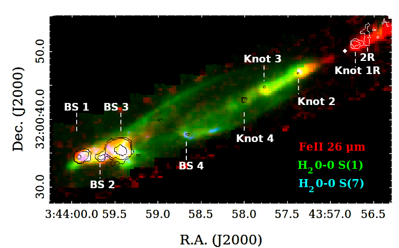
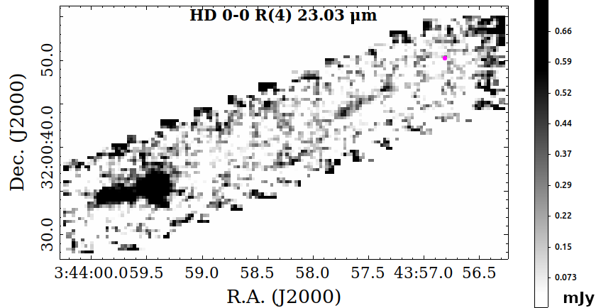
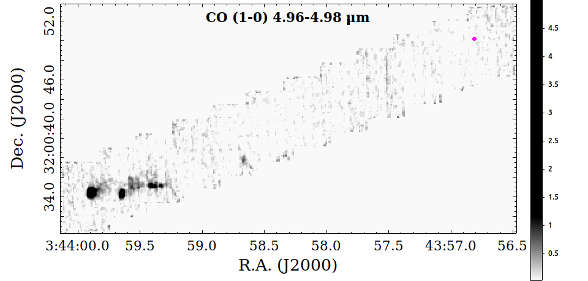
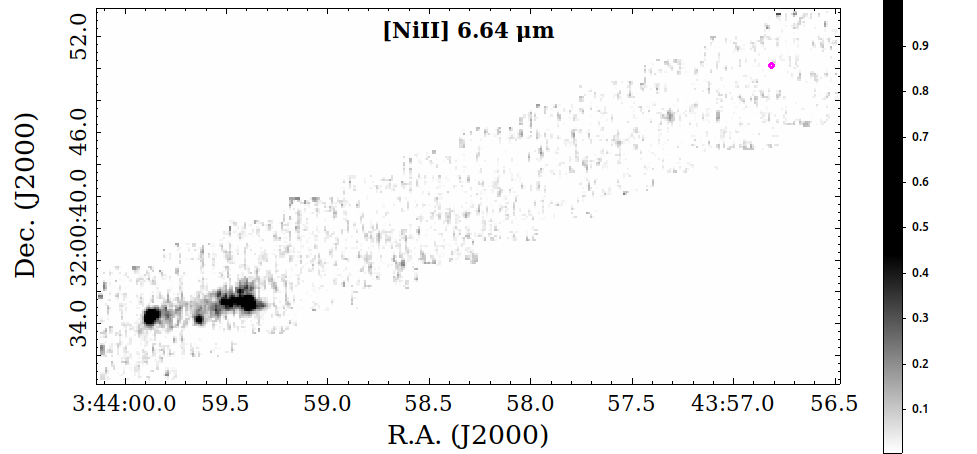
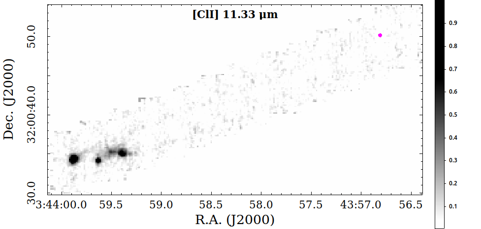
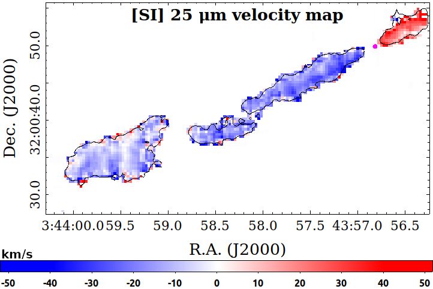
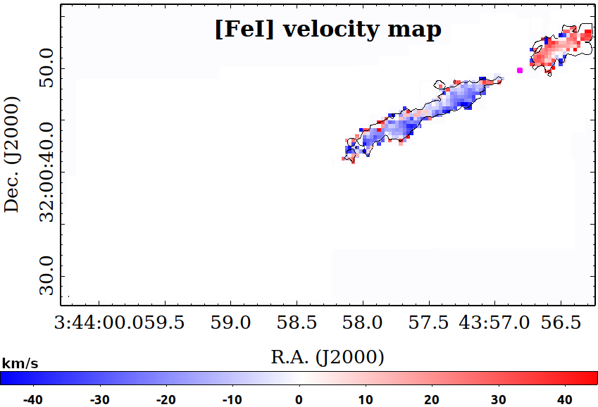
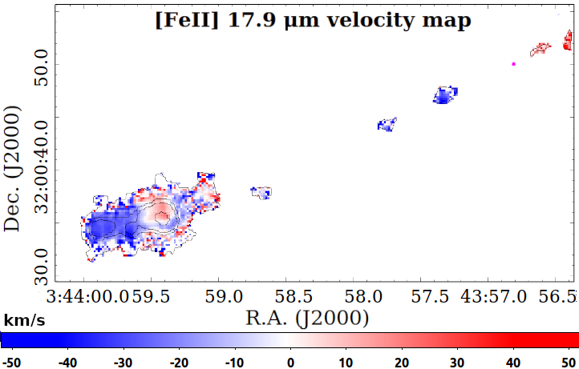

$\newcommand{\ensuremath}{}$
$\newcommand{\xspace}{}$
$\newcommand{\object}[1]{\texttt{#1}}$
$\newcommand{\farcs}{{.}''}$
$\newcommand{\farcm}{{.}'}$
$\newcommand{\arcsec}{''}$
$\newcommand{\arcmin}{'}$
$\newcommand{\ion}[2]{#1#2}$
$\newcommand{\textsc}[1]{\textrm{#1}}$
$\newcommand{\hl}[1]{\textrm{#1}}$
$\newcommand{\footnote}[1]{}$
$\newcommand{\lsun}{\mbox{L}_\odot}$
$\newcommand{\msun}{\mbox{M}_\odot}$
$\newcommand{\macc}{\dot{M}_{\rm acc} }$
$\newcommand{\FeII}{[\ion{Fe}{ii}] }$
$\newcommand{\FeIIp}{[\ion{Fe}{ii}]}$
$\newcommand{\FeI}{[\ion{Fe}{i}] }$
$\newcommand{\FeIp}{[\ion{Fe}{i}]}$
$\newcommand{\TiII}{[\ion{Ti}{ii}]}$
$\newcommand{\SII}{[\ion{S}{ii}]}$
$\newcommand{\SIIp}{[\ion{S}{ii}] }$
$\newcommand{\OI}{[\ion{O}{i}] }$
$\newcommand{\OIp}{[\ion{O}{i}]}$
$\newcommand{\PII}{[\ion{P}{ii}]}$
$\newcommand{\NiI}{[\ion{Ni}{i}] }$
$\newcommand{\NiII}{[\ion{Ni}{ii}] }$
$\newcommand{\NiIIp}{[\ion{Ni}{ii}]}$
$\newcommand{\NIp}{\ion{N}{i}}$
$\newcommand{\CaIIp}{\ion{Ca}{ii}}$
$\newcommand{\PI}{[\ion{P}{i}]}$
$\newcommand{\NeII}{[\ion{Ne}{ii}] }$
$\newcommand{\NeIIp}{[\ion{Ne}{ii}]}$
$\newcommand{\CoII}{[\ion{Co}{ii}] }$
$\newcommand{\CoIIp}{[\ion{Co}{ii}]}$
$\newcommand{\ClI}{[\ion{Cl}{i}] }$
$\newcommand{\ClIp}{[\ion{Cl}{i}]}$
$\newcommand{\ClII}{[\ion{Cl}{ii}] }$
$\newcommand{\ClIIp}{[\ion{Cl}{ii}]}$
$\newcommand{\CIp}{\ion{C}{i}}$
$\newcommand{\HeI}{\ion{He}{i}}$
$\newcommand{\MgIp}{\ion{Mg}{i}}$
$\newcommand{\MgIIp}{\ion{Mg}{ii}}$
$\newcommand{\NaI}{\ion{Na}{i}}$
$\newcommand{\HI}{\ion{H}{i} }$
$\newcommand{\HIp}{\ion{H}{i}}$
$\newcommand{\SI}{[\ion{S}{i}] }$
$\newcommand{\SiII}{[\ion{Si}{ii}]}$
$\newcommand{\SIp}{[\ion{S}{i}]}$
$\newcommand{\SIII}{[\ion{S}{iii}] }$
$\newcommand{\SIIIp}{[\ion{S}{iii}]}$
$\newcommand{\ArII}{[\ion{Ar}{ii}] }$
$\newcommand{\ArIIp}{[\ion{Ar}{ii}]}$
$\newcommand{\brg}{Br\gamma}$
$\newcommand{\pab}{Pa\beta}$
$\newcommand{\lacc}{L_{acc}}$
$\newcommand{\lbol}{L_{bol}}$
$\newcommand{\mjet}{\dot{M}_{\rm jet}}$
$\newcommand{\mh}{\dot{M}_{H_2}}$
$\newcommand{\Ne}{n_e}$
$\newcommand{\h}{H_2}$
$\newcommand{\kms}{km s^{-1}}$
$\newcommand{\um}{\mum}$
$\newcommand{\lam}{\lambda}$
$\newcommand{\msyr}{M_{\sun} yr^{-1}}$
$\newcommand{\Av}{A_V }$
$\newcommand{\rsun}{R_{\sun}}$
$\newcommand{\cm}{cm^{-3}}$
$\newcommand{\ergscm}{erg s^{-1} cm^{-2}}$

# JWST Observations of Young protoStars (JOYS): HH 211: the textbook case of a protostellar jet and outflow

<mark>Appeared on: 2024-09-25</mark> -  _Paper accepted in A&A for publication_

A. C. o. Garatti, et al. -- incl., <mark>M. McCaughrean</mark>, <mark>H. Beuther</mark>, <mark>S. Reyes</mark>, <mark>T. Henning</mark>

**Abstract:** Due to the high visual extinction and lack of sensitive mid-IR telescopes, the origin and properties of outflows and jets from embedded Class 0 protostars are still poorly constrained. We aim at characterising the physical, kinematic, and dynamical properties of the $\object{HH 211}$ jet and outflow, one of the youngest protostellar flows. We use the $_ James Webb Space Telescope_$ (JWST) and its Mid-Infrared Instrument (MIRI) in the 5--28 $\mu$ m range, to study the embedded $\object{HH 211}$ flow. We map a 0 $\farcm$ 95 $\times$ 0 $\farcm$ 22 region, covering the full extent of the blue-shifted lobe, the central protostellar region, and a small portion of the red-shifted lobe. We extract spectra along the jet and outflow and construct line and excitation maps of both atomic and molecular lines. Additional JWST NIRCam $H_2$ narrow-band images (at 2.122 and 3.235 $\mu$ m) provide a visual-extinction map of the whole flow, and are used to deredden our data. The jet driving source is not detected even at the longest mid-IR wavelengths. The overall morphology of the flow consists of a highly collimated jet, mostly molecular ($H_2$ , HD) with an inner atomic ( $\FeIp$ , $\FeIIp$ , $\SIp$ , $\NiIIp$ ) structure. The jet shocks the ambient medium, producing several large bow-shocks, rich in forbidden atomic ( $\FeIIp$ , $\SIp$ , $\NiIIp$ , $\ClIp$ , $\ClIIp$ , $\ArIIp$ , $\CoIIp$ , $\NeIIp$ , $\SIIIp$ ) and molecular lines ($H_2$ , HD, CO, OH, $H_2$ O, $CO_2$ , HCO $^+$ ), and is driving an $H_2$ molecular outflow, mostly traced by low- $J$ , $v=0$ transitions.   Moreover, $H_2$ 0-0 S(1) uncollimated emission is also detected down to 2 $\arcsec$ --3 $\arcsec$ ( $\sim$ 650--1000 au) from the source, tracing a cold ( $T$ =200--400 K), less dense and poorly collimated molecular wind. Two $H_2$ components (warm, $T$ =300--1000 K, and hot, $T$ =1000--3500 K) are detected along the jet and outflow.   The atomic jet ( $\FeII$ at 26 $\mu$ m) is detected down to $\sim$ 130 au from source, whereas the lack of $H_2$ emission (at 17 $\mu$ m) close to the source is likely due to the large visual extinction ( $\Av$ $>$ 80 mag).   Dust continuum-emission is detected at the terminal bow-shocks, and in the blue- and red-shifted jet, being likely dust lifted from the disk. The jet shows an onion-like structure, with layers of different size, velocity, temperature, and chemical composition.   Moreover, moving from the inner jet to the outer bow-shocks, different physical, kinematic and excitation conditions for both molecular and atomic gas are observed. The jet mass-flux rate, momentum, and momentum flux of the warm $H_2$ component are up to one order of magnitude higher than those inferred from the atomic jet component.   Our findings indicate that the warm $H_2$ component is the primary mover of the outflow, namely it is the most significant dynamical component of the jet, in contrast to jets from more evolved YSOs, where the atomic component is dominant.

**Figure 19. -** Tricolour MIRI-MRS map of $H_2$ 0-0 S(7) (at 5.5 $\mu$m, in blue), $H_2$ 0-0 S(1) (at 17 $\mu$m, in green), and $\FeII$(at 26 $\mu$m, in red) emission lines. The white circle marks the position of the ALMA mm continuum source. Black and white contours indicate the position (on the blue- and red-shifted lobe side, respectively) of continuum emission integrated between 25.3 and 25.9 $\mu$m (displayed contours are at 3, 5, and 50 $\sigma$; 1 $\sigma$=4 MJy sr$^{-1}$). Knots and bow-shocks (BS) showing continuum emission are indicated. (*fig:MIRI-tricolor*)

**Figure 12. -** 
   Additional line maps of some bright features detected along HH 211. From top to bottom: HD 0-0 R(4) at 23.03 $\mu$m, CO (1-0) lines from 4.96 to 4.98 $\mu$m, $\NiI$I at 6.64 $\mu$m, $\ClI$ at 11.33 $\mu$m. The magenta circle shows the position of the ALMA mm continuum source. Integrated flux is in mJy pixel$^{-1}$.  (*fig:all_maps*)

**Figure 15. -** $\SI$ at 25 $\mu$m (top panel) and $\FeI$ at 24 $\mu$m (middle panel) and $\FeII$ at 17.9 $\mu$m (bottom panel) velocity maps. Black contours in the top and bottom panels show the integrated continuum-subtracted line intensity at 5$\sigma$(0.8 mJy pixel$^{-1}$). Bottom panel black contours are at 5, 50, 100, and 500 $\sigma$(namely, 0.5, 5, 10, and 50 mJy pixel$^{-1}$
    Only velocities within a 5$\sigma$ threshold are plotted. The magenta circle shows the position of the ALMA mm continuum source. (*fig:atomic_vmap*)

