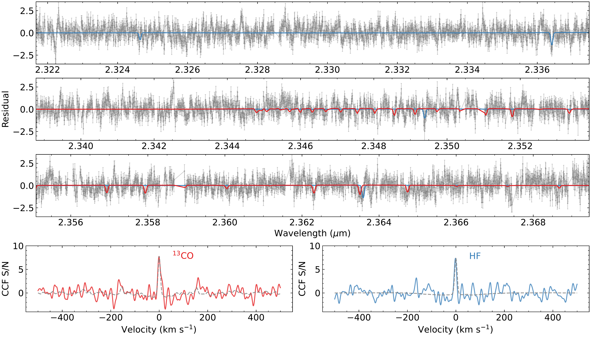
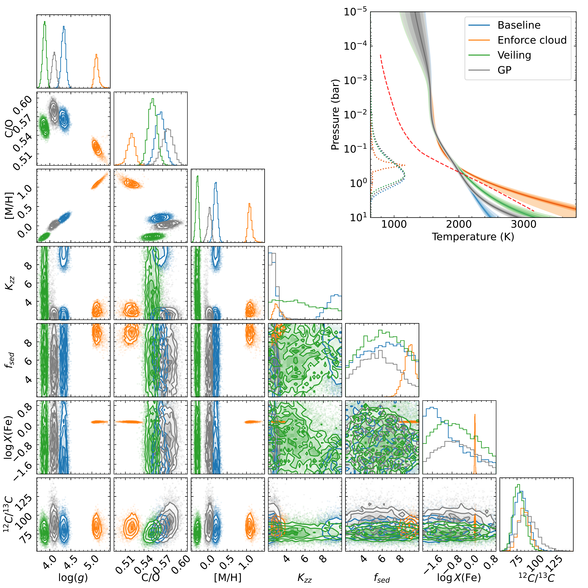

$\newcommand{\ensuremath}{}$
$\newcommand{\xspace}{}$
$\newcommand{\object}[1]{\texttt{#1}}$
$\newcommand{\farcs}{{.}''}$
$\newcommand{\farcm}{{.}'}$
$\newcommand{\arcsec}{''}$
$\newcommand{\arcmin}{'}$
$\newcommand{\ion}[2]{#1#2}$
$\newcommand{\textsc}[1]{\textrm{#1}}$
$\newcommand{\hl}[1]{\textrm{#1}}$
$\newcommand{\footnote}[1]{}$
$\newcommand$
$\newcommand$
$\newcommand{\vdag}{(v)^\dagger}$
$\newcommand{\COiso}{^{13}\textrm{CO}}$
$\newcommand{\COmain}{^{12}\textrm{CO}}$
$\newcommand{\HTWOO}{H_{2}\textrm{O}}$
$\newcommand{\COTWO}{CO_{2}}$
$\newcommand{\methane}{CH_{4}}$
$\newcommand{\ammonia}{NH_{3}}$
$\newcommand{\enstatite}{MgSiO_{3}}$
$\newcommand{\Mjup}{M_\mathrm{Jup}}$
$\newcommand{\Rjup}{R_\mathrm{Jup}}$
$\newcommand{\Msun}{M_\odot}$
$\newcommand{\Teff}{T_\mathrm{eff}}$
$\newcommand{\kms}{km s^{-1}}$
$\newcommand{\rnote}[1]{{\textbf{\color{red}#1}}}$
$\newcommand{\leiden}{Leiden Observatory, Leiden University, P.O. Box 9513, 2300 RA, Leiden, The Netherlands}$
$\newcommand{\caltech}{Department of Astronomy, California Institute of Technology, Pasadena, CA 91125, USA}$
$\newcommand{\gps}{Division of Geological \& Planetary Sciences, California Institute of Technology, Pasadena, CA 91125, USA}$
$\newcommand{\warwick}{Department of Physics, University of Warwick, Coventry CV4 7AL, UK}$
$\newcommand{\warwicks}{Centre for Exoplanets and Habitability, University of Warwick, Gibbet Hill Road, Coventry CV4 7AL, UK}$
$\newcommand{\ipac}{IPAC, Mail Code 100-22, Caltech, 1200 E. California Boulevard, Pasadena, CA 91125, USA}$
$\newcommand{\mpia}{Max-Planck-Institut für Astronomie, Königstuhl 17, 69117 Heidelberg, Germany}$
$\newcommand{\granada}{Instituto de Astrof{í}sica de Andaluc{í}a (IAA-CSIC), Glorieta de la Astronom{í}a s/n, 18008 Granada, Spain}$
$\newcommand{\galway}{School of Natural Sciences, Center for Astronomy, University of Galway, Galway, H91 CF50, Ireland}$
$\newcommand{\carnegiew}{Earth and Planets Laboratory, Carnegie Institution for Science, Washington, DC, 20015}$

# The ESO SupJup Survey III: confirmation of $\COiso$ in YSES 1 b and atmospheric detection of YSES 1 c with CRIRES$^+$

<mark>Appeared on: 2024-09-26</mark> -  _25 pages, 11 figure, accepted for publication in AJ. The extracted CRIRES+ spectra of the YSES-1 system can be found at this https URL_

Y. Zhang, et al. -- incl., <mark>P. Mollière</mark>, <mark>E. Nasedkin</mark>

**Abstract:** High-resolution spectroscopic characterization of young super-Jovian planets enablesprecise constraints on elemental and isotopic abundances of their atmospheres.As part of the ESO SupJup Survey, we present high-resolution spectral observations oftwo wide-orbit super-Jupiters in YSES 1 (or TYC 8998-760-1) using the upgraded VLT/CRIRES $^+$ ( $\mathcal{R}\sim 100,000$ )in K-band.We carry out free atmospheric retrieval analyses to constrain chemical and isotopic abundances, temperature structures,rotation velocities ( $v\sin i$ ), and radial velocities (RV).We confirm the previous detection of $\COiso$ in YSES 1 b at a higher significance of 12.6 $\sigma$ , but point to a higher $\COmain$ / $\COiso$ ratio of $88\pm 13$ (1 $\sigma$ confidence interval), consistent with the primary's isotope ratio $66 \pm 5$ .We retrieve a solar-like composition in YSES 1 b with a C/O $=0.57 \pm 0.01$ ,indicating a formation via gravitational instability or core accretion beyond the CO iceline.Additionally, the observations lead to detections of $\HTWOO$ and CO in the outer planet YSES 1 c at 7.3 $\sigma$ and 5.7 $\sigma$ , respectively.We constrain the atmospheric C/O ratio of YSES 1 c to be either solar or subsolar (C/O= $0.36 \pm 0.15$ ), indicating the accretion of oxygen-rich solids.The two companions have distinct $v\sin i$ , $5.34 \pm 0.14$ $\kms$ for YSES 1 b and $11.3 \pm 2.1$ $\kms$ for YSES 1 c, despite their similar natal environments.This may indicate different spin axis inclinations or effective magnetic braking by the long-lived circumplanetary disk around YSES 1 b.YSES 1 represents an intriguing system for comparative studies of super-Jovian companions and linking present atmospheres to formation histories.

**Figure 7. -** Detection of $\COiso$ and HF molecules in CRIRES$^+$ observations of YSES 1 b.
      The top three panels show the 2.32-2.37 \micron observational residuals, where the main $\HTWOO$ and $\COmain$ spectral features have been removed from the data.
      The best-fit $\COiso$ and HF model spectra are overplotted in red and blue lines, demonstrating the detection of individual lines in the data.
      The bottom panels display cross-correlation functions (CCF) of observational residuals with $\COiso$ and HF models.
      The gray dashed line is each molecular model's auto-correlation function (ACF).
     (*fig:1b_ccf*)

**Figure 8. -** Comparison of retrieval results of alternative models for YSES 1 b.
    Blue represents the baseline model, orange shows the enforced (optically thick) cloud model, green represents the model with veiling effect, and gray is the model with Gaussian Processes accounting for correlated noise.
    The upper right panel shows the retrieved T-P profiles. Different color saturations indicate the envelopes of
    1$\sigma$, 2$\sigma$, and 3$\sigma$ intervels. The red dashed line is the self-consistent T-P profile ($\Teff$=1900 K, $\log g$=4.0)
    from the Sonora Bobcat model grid. The dotted curve shows the flux-weighted emission contribution of each model.
    The corner plots show the posteriors of free parameters, including surface gravity, C/O ratio,
    metallicity, vertical mixing parameter, settling parameter, mass fraction of clouds at the cloud base, and carbon isotope ratio.
    We note the correlation between surface gravity and metallicity, while C/O and $\COmain$/$\COiso$ are less model dependent.
     (*fig:compare_pt*)

**Figure 6. -** One spectral order of CRIRES$^+$ observations of YSES 1 b from 2.32 to 2.37 \micron.
    The observations are shown in black data points with error bars. Overplotted is the best-fit model
    obtained with retrieval analyses.
    We annotated the positions of absorption features from $\HTWOO$ and CO with short bars on the top of each panel.
    The observational residuals (data minus model) are shown with scattered dots in gray.
     (*fig:1b_spec*)

