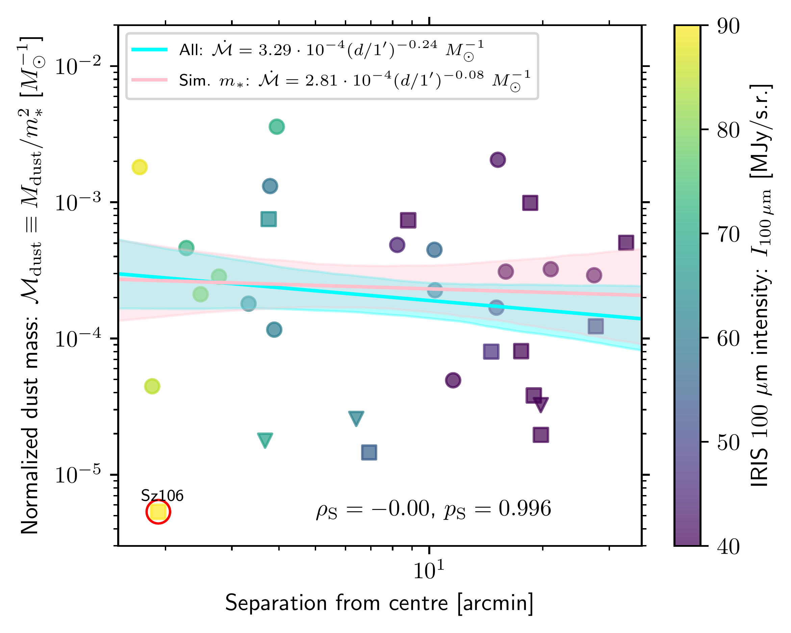
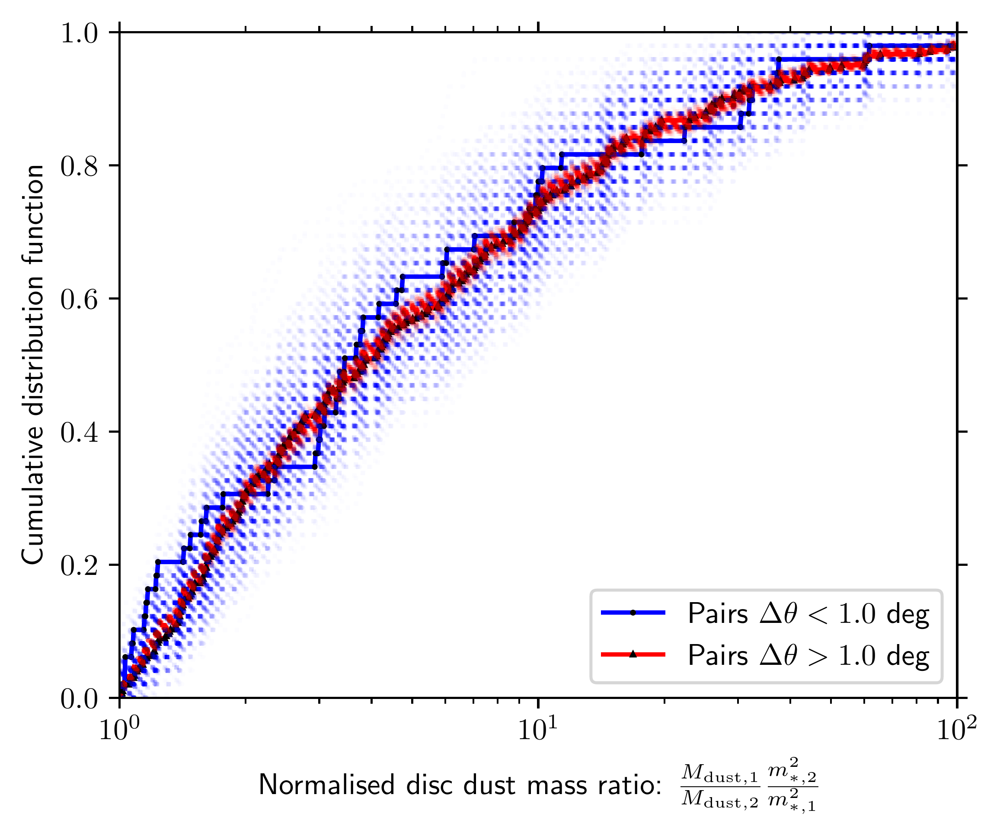

$\newcommand{\ensuremath}{}$
$\newcommand{\xspace}{}$
$\newcommand{\object}[1]{\texttt{#1}}$
$\newcommand{\farcs}{{.}''}$
$\newcommand{\farcm}{{.}'}$
$\newcommand{\arcsec}{''}$
$\newcommand{\arcmin}{'}$
$\newcommand{\ion}[2]{#1#2}$
$\newcommand{\textsc}[1]{\textrm{#1}}$
$\newcommand{\hl}[1]{\textrm{#1}}$
$\newcommand{\footnote}[1]{}$

# Spatially correlated stellar accretion in the Lupus star-forming region: Evidence for ongoing infall from the interstellar medium?

<mark>Appeared on: 2024-09-27</mark> -  _10 pages, 6 figures, accepted for publication in A&A Letters_

A. J. Winter, <mark>M. Benisty</mark>, C. Manara, A. Gupta

**Abstract:** Growing evidence suggests that protoplanetary discs may be influenced by late stage infall from the interstellar medium (ISM). It remains unclear the degree to which infall shapes disc populations at ages $\gtrsim 1$ Myr. We explored possible spatial correlations between stellar accretion rates in the Lupus star-forming region, which would support the hypothesis that infall can regulate stellar accretion. We considered both the `clustered' stars towards the center of Lupus 3, and the `distributed' stars that are more sparsely distributed across the Lupus complex. We took the observed accretion rates in the literature and explore spatial correlations. In particular, we tested whether the clustered stars exhibit a radial gradient in normalised accretion rates, and whether the distributed stars have spatially correlated accretion rates. We found statistically significant correlations for both the clustered and distributed samples. The clustered sample exhibits higher accretion rates in the central region, consistent with the expected Bondi-Hoyle-Lyttleton accretion rate. Stars that are spatially closer among the distributed population also exhibit more similar accretion rates. These results cannot be explained by the stellar mass distribution for either sample. ${Age gradients are disfavoured, though not discounted,}$ because normalised disc dust masses are not spatially correlated across the region. Spatially correlated stellar accretion rates within the Lupus star-forming region argue in favour of an environmental influence on stellar accretion, possibly combined with internal processes in the inner disc. ${Refined age measurements and}$ searches for evidence of infalling material is a potential way to further test this finding.

**Figure 5. -** {Distribution of candidate Lupus members with _Gaia_ kinematics as identified by [ and Luhman (2020)](), which we show as hollow shapes (fuchsia circles the `on cloud' sample that coincide with Lupus 1-4, and red squares are the `off cloud' sample). The locations of stars with discs included in the PP7 catalogue of [Manara, Ansdell and Rosotti (2023)]() but without measurements of stellar mass, accretion rate or disc dust mass are shown as lime triangles. Those stars which have stellar masses, dust masses and accretion rates recorded by [Manara, Ansdell and Rosotti (2023)]() are shown as filled coloured circles (or downward triangles for upper limits in accretion rate) that represent the normalised accretion rate according to the colour bar. The greyscale overlay is the IRIS $100$ $\mu$m map of the region  ([ and Lagache 2005]()) . We mark with cyan stars and labels the locations of systems which exhibit some evidence of interaction with the ISM or high levels of outer disc turbulence, discussed in Section \ref{sec:individ_syst}. We also show a zoom-in on a region centered on Lupus 3, which we define as the `clustered' region (inside the solid red ellipse). Within this circle, we show the `on cloud' sample with fuchsia circles and inner points to make the sample clear in the crowded central region.} (*fig:lupus*)

**Figure 2. -** As in Figure \ref{subfig:mdacc_sep}, but for normalised disc dust masses rather than accretion rates. (*fig:mdiscsep*)

**Figure 3. -** As in Figure \ref{subfig:corr_CDF}, but for normalised disc dust masses rather than accretion rates. (*fig:corr_CDF_Md*)

