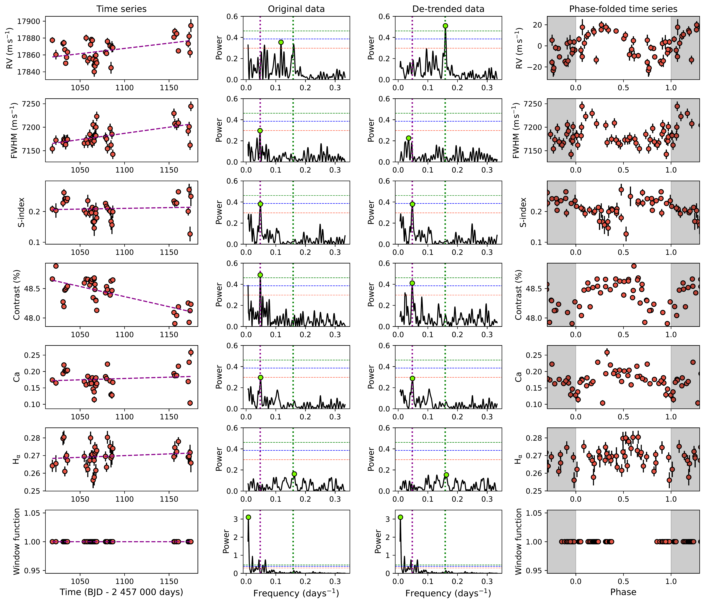
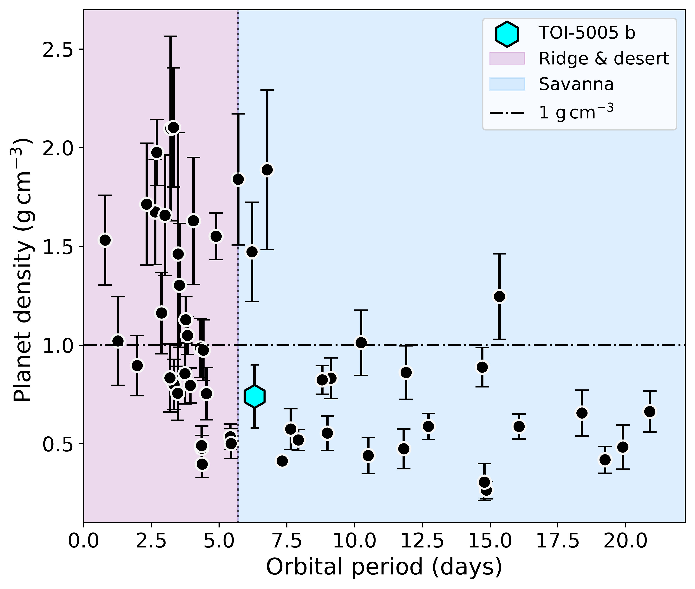
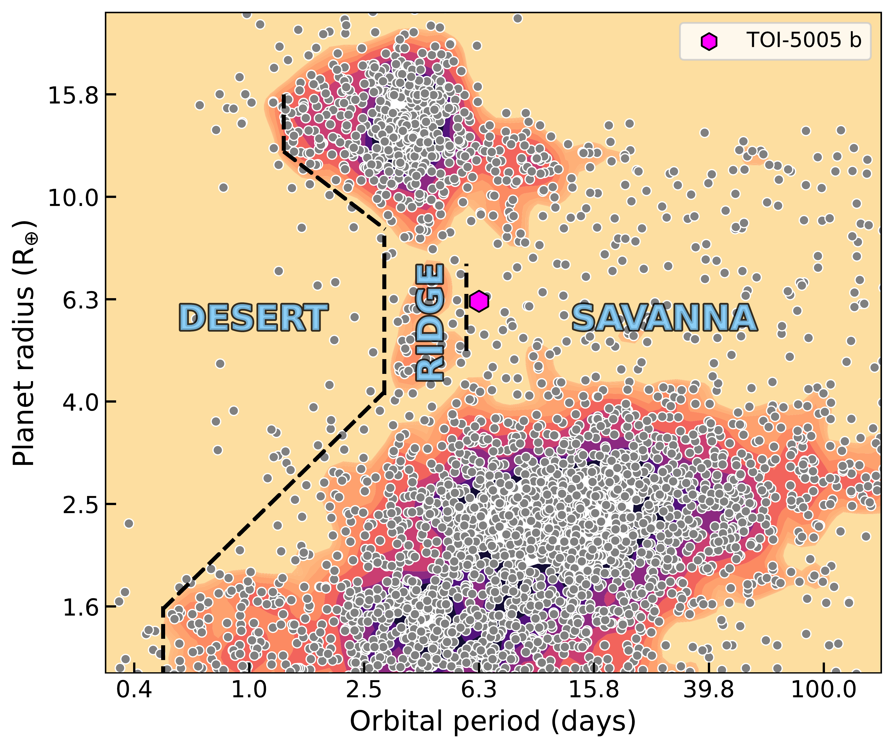

$\newcommand{\ensuremath}{}$
$\newcommand{\xspace}{}$
$\newcommand{\object}[1]{\texttt{#1}}$
$\newcommand{\farcs}{{.}''}$
$\newcommand{\farcm}{{.}'}$
$\newcommand{\arcsec}{''}$
$\newcommand{\arcmin}{'}$
$\newcommand{\ion}[2]{#1#2}$
$\newcommand{\textsc}[1]{\textrm{#1}}$
$\newcommand{\hl}[1]{\textrm{#1}}$
$\newcommand{\footnote}[1]{}$
$\newcommand{\maketitle}{\begingroup\let\footnote=\thanks \ACMmaketitle\endgroup}$
$\newcommand{\arraystretch}{1.4}$
$\newcommand{\arraystretch}{1.3}$
$\newcommand{\arraystretch}{1.3}$
$\newcommand{\arraystretch}{1.4}$
$\newcommand{\arraystretch}{1.35}$
$\newcommand{\arraystretch}{1.23}$
$\newcommand{\arraystretch}{1.23}$
$\newcommand{\arraystretch}{1.23}$
$\newcommand{\arraystretch}{1.3}$
$\newcommand{\arraystretch}{1.14}$

# TOI-5005 b: A super-Neptune in the savanna near the ridge

<mark>Appeared on: 2024-09-27</mark> -  _Accepted for publication in A&A. Abstract shortened. 35 pages, 26 figures_

A. Castro-González, et al. -- incl., <mark>L. Acuña</mark>

**Abstract:** The Neptunian desert and savanna have been recently found to be separated by a ridge, an overdensity of planets in the $\simeq$ 3-5 days period range. These features are thought to be shaped by dynamical and atmospheric processes. However, their relative roles are not yet well understood. We intend to confirm and characterise the super-Neptune TESS candidate TOI-5005.01, which orbits a moderately bright (V = 11.8) solar-type star (G2 V) with an orbital period of 6.3 days. With such properties, TOI-5005.01 is located in the Neptunian savanna near the ridge. We used Bayesian inference to analyze 38 HARPS radial velocity measurements, three sectors of TESS photometry, and two PEST and TRAPPIST-South transits. We tested a set of models involving eccentric and circular orbits, long-term drifts, and Gaussian processes to account for correlated stellar and instrumental noise. We computed the Bayesian evidences to find the model that best represents our data set and infer the orbital and physical properties of the system. We confirm TOI-5005 b to be a transiting super-Neptune with a radius of $R_{\rm p}$ = $6.25\pm 0.24$  $\rm R_{\rm \oplus}$ ( $R_{\rm p}$ = $0.558\pm 0.021$ $\rm R_{\rm J}$ ) and a mass of $M_{\rm p}$ = $32.7\pm 5.9$ $\rm M_{\oplus}$ ( $M_{\rm p}$ = $0.103\pm 0.018$ $\rm M_{\rm J}$ ), which corresponds to a mean density of $\rho_{\rm p}$ = $0.74 \pm 0.16$ $\rm g   cm^{-3}$ .  Our internal structure modelling indicates that the core mass fraction (CMF = $0.74^{+0.05}_{-0.45}$ ) and envelope metal mass fraction ( $Z_{\rm env}$ = $0.08^{+0.41}_{-0.06}$ ) of TOI-5005 b are degenerate, but the overall metal mass fraction is well constrained to a value slightly lower than that of Neptune and Uranus ( $Z_{\rm planet}$ = $0.76^{+0.04}_{-0.11}$ ). The $Z_{\rm planet}$ / $Z_{\rm star}$ ratio is consistent with the well-known mass-metallicity relation, which suggests that TOI-5005 b was formed via core accretion. We also estimated the present-day atmospheric mass-loss rate of TOI-5005 b but found contrasting predictions depending on the choice of photoevaporation model ( $0.013\pm 0.008$  $\rm M_{\oplus}$ Gyr $^{-1}$ versus $0.17\pm 0.12$  $\rm M_{\oplus}$ Gyr $^{-1}$ ). At a population level, we find statistical evidence ( $p$ -value = $0.0092^{+0.0184}_{-0.0066}$ ) that planets in the savanna such as TOI-5005 b tend to show lower densities than planets in the ridge, with a dividing line around 1 $\rm g   cm^{-3}$ , which supports the hypothesis of different evolutionary pathways populating both regimes. TOI-5005 b is located in a key region of the period-radius space to study the transition between the Neptunian ridge and the savanna. It orbits the brightest star of all such planets known today, which makes it a target of interest for atmospheric and orbital architecture observations that will bring a clearer picture of its overall evolution.

**Figure 8. -** Left panels: time series of the HARPS RVs, activity indicators, and the window function. The magenta dashed lines represent the linear trends fit to the data. Centre panels: GLS periodograms of the original time series and de-trended time series. The green dotted vertical lines indicate the location of the orbital period of TOI-5005.01 ($P_{\rm orb}$ = 6.3 days). The magenta dotted vertical lines indicate the $\simeq$21 days activity-related signal that most likely reflects the stellar rotation period. The horizontal dotted lines correspond to the 10 (orange), 1 (blue), and 0.1$\%$(green) FAP levels. Right panels: HARPS data folded to the maximum power periods; that is, 6.3 days (RVs), 21.3 days (FWHM), 20.8 days (S-index), 21.0 days (Contrast), 20.5 days (Ca), 6.2 days ($\rm H_{\alpha}$), and 129.8 days (window function). The RV panel shows the de-trended data and the indicators panels show the original time series.  (*fig:gls_to_HARPS*)

**Figure 15. -** Left: Mass-radius diagram of all known Neptunian planets with masses and radii with precisions better than 20$\%$. Right: Density-period diagram of the same sample. The data were collected from the NASA Exoplanet Archive on 20 September 2024. This plot was generated with \texttt{mr-plotter}\citep[\url{https://github.com/castro-gzlz/mr-plotter};][]{2023A&A...675A..52C}.  (*fig:mass-radius-density-period*)

**Figure 4. -** Contextualization of TOI-5005 b in the period-radius diagram of close-in exoplanets, where we highlight the population-based boundaries of the Neptunian desert, ridge, and savanna derived in \citet{2024A&A...689A.250C}. The data were collected from the NASA Exoplanet Archive \citep{2013PASP..125..989A} on 20 September 2024. This plot has been generated with \texttt{nep-des}(\url{https://github.com/castro-gzlz/nep-des}). (*fig:nep_desert*)

