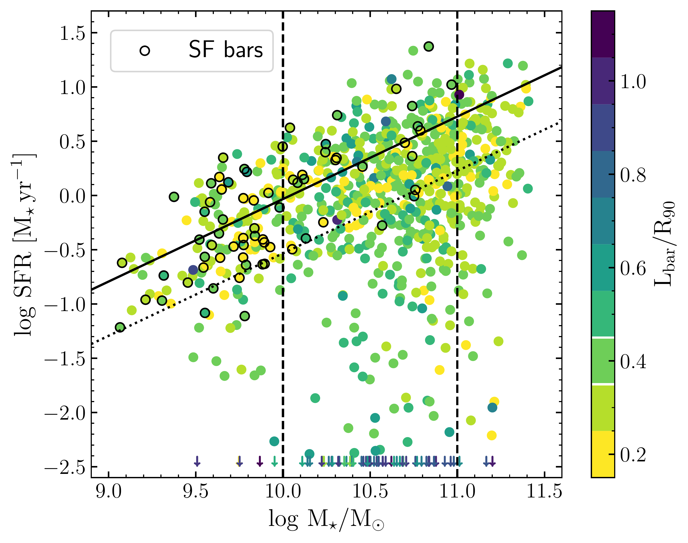
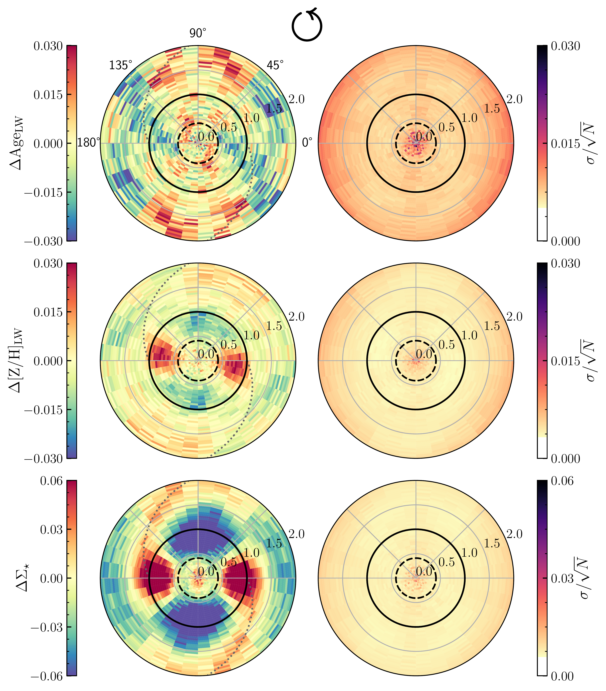
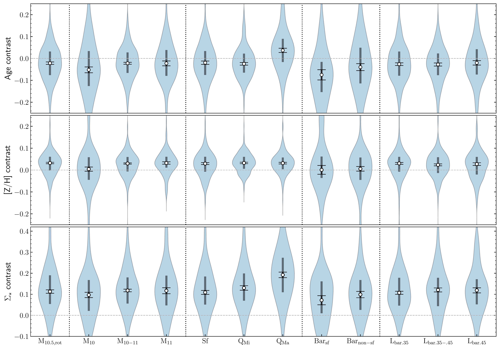

$\newcommand{\ensuremath}{}$
$\newcommand{\xspace}{}$
$\newcommand{\object}[1]{\texttt{#1}}$
$\newcommand{\farcs}{{.}''}$
$\newcommand{\farcm}{{.}'}$
$\newcommand{\arcsec}{''}$
$\newcommand{\arcmin}{'}$
$\newcommand{\ion}[2]{#1#2}$
$\newcommand{\textsc}[1]{\textrm{#1}}$
$\newcommand{\hl}[1]{\textrm{#1}}$
$\newcommand{\footnote}[1]{}$
$\newcommand{\ff}{{\sc firefly}}$
$\newcommand{\ffvac}{\texttt{MaNGA {\sc firefly} VAC}}$
$\newcommand{\arraystretch}{1.3}$
$\newcommand{\thebibliography}{\DeclareRobustCommand{\VAN}[3]{##3}\VANthebibliography}$

# Azimuthal Variations of Stellar Populations in Barred Galaxies

<mark>Appeared on: 2024-10-01</mark> -  _18 pages, 12 figures (+appendix), accepted for publication in MNRAS_

<mark>J. Neumann</mark>, et al. -- incl., <mark>C. Mao</mark>, <mark>E. Schinnerer</mark>

**Abstract:** Bars are expected to impact the distribution of stellar populations both during bar formation, as they rearrange stars into new orbits, and afterwards, due to the redistribution of star-formation-fuelling gas and transfer of angular momentum. We study the impact of stellar bars on the azimuthal variation of stellar population age, metallicity and mass surface density in $\sim1 000$ nearby barred galaxies from the SDSS-IV/MaNGA survey. Bars have higher stellar mass density ( $0.113^{+0.065}_{-0.067}$ dex) and are more metal-rich ( $0.028^{+0.033}_{-0.040}$ dex) than the discs at the same radii. Stellar ages show a variety of bar to inter-bar contrasts with no consistent trend. The difference in metallicity increases with total stellar mass of the galaxy and distance below the star-forming main sequence. We discuss a combination of potentially responsible processes including kinematic separation, more extended star formation histories and more efficient recycling in bars and at bar-spiral arm connections. Additionally, we observe an offset ( $10◦$ - $40◦$ ) of the peak metallicity to the bar major axis in star-forming bars in low-mass galaxies, and more metal-rich regions outside the ends of the bar in long bars and quenched galaxies. Furthermore, there is a subtle trend of lower metallicities on the leading side of spiral arms compared to the trailing side. Finally, we report a spiral arm surface density feature, which could point towards a dominant bar-spiral connection and pitch angle of $\alpha \sim 25◦$ . We interpret these features in the context of bar formation and the impact of large-scale gas flows associated with their presence.

**Figure 1. -** Sample representation in total SFR versus total stellar mass plane. SFRs are based on dust-corrected H$\alpha$ measurements from \texttt{Pipe3D}\citep{Sanchez2022}. Points are coloured by scaled bar length with L$_\mathrm{bar}$ as described in Sect. \ref{sect:lbar} and R$_{90}$ from the enhanced NASA Sloan Atlas \citep{Wake2017}. Star-forming bars are marked using the information provided in \citet{FraserMcKelvie2020a}. The black solid line marks the star-forming main sequence (SFMS) as determined by \citet{Renzini2015} and the dotted line 0.5 dex below the solid line represents our selection of galaxies on or below the main sequence. The two dashed vertical lines illustrate our subsamples separated in mass and the two white horizontal lines on the colourbar show our sample separation by bar length. Points outside the y-axis range are illustrated as arrows at the bottom. (*fig:sample*)

**Figure 4. -** Azimuthal variations of stellar populations for all high-mass galaxies with determinable sense of rotation, showing, from top to bottom, light-weighted age, [Z/H] and $\Sigma_\star$. Left panels show medians per polar grid cell, while the right panels show significance maps of these medians. The black solid circle marks the bar radius and the dashed circle marks the average 2$\times$FWHM of the PSF across the subsample. The dotted line follows a log-spiral function with a pitch angle of $ 25.2◦$. Zero degree is towards the right, 90 degree towards the top. The arrow indicates the anti-clockwise rotation of the galaxies. (*fig:polar_example*)

**Figure 11. -** Bar-to-inter-bar contrast of age, [Z/H] and $\Sigma_\star$ for all subsamples discussed in the text. Violins show the distribution of individual galaxies. Marked are the medians (white dots), interquartile ranges (vertical grey bars) and standard errors on the medians (black error bars). (*fig:violins*)

