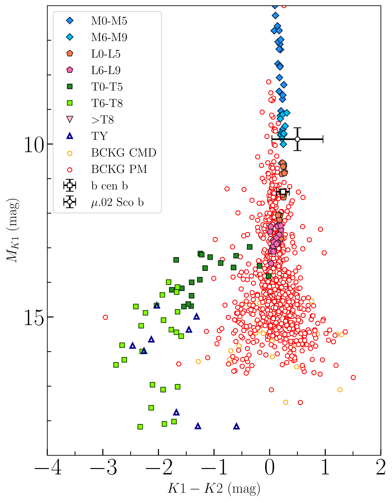
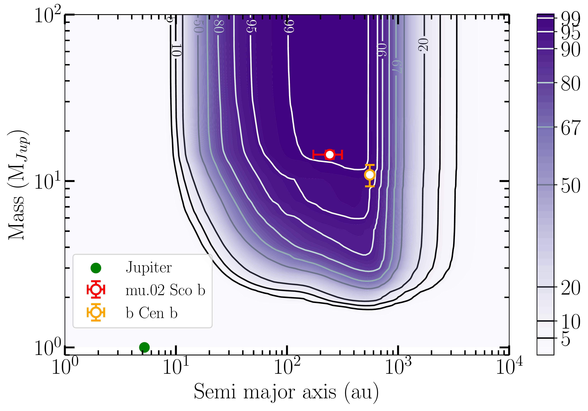

$\newcommand{\ensuremath}{}$
$\newcommand{\xspace}{}$
$\newcommand{\object}[1]{\texttt{#1}}$
$\newcommand{\farcs}{{.}''}$
$\newcommand{\farcm}{{.}'}$
$\newcommand{\arcsec}{''}$
$\newcommand{\arcmin}{'}$
$\newcommand{\ion}[2]{#1#2}$
$\newcommand{\textsc}[1]{\textrm{#1}}$
$\newcommand{\hl}[1]{\textrm{#1}}$
$\newcommand{\footnote}[1]{}$
$\newcommand{\eg}{{\it e.g.}, }$
$\newcommand{\ie}{{\it i.e.}, }$
$\newcommand{\ms}{m s^{\rm -1}}$
$\newcommand{\kms}{\ensuremath{\mathrm{km} \mathrm{s}^{-1}}}$
$\newcommand{\mearth}{M_{\rm Earth}}$
$\newcommand{\vsini}{v\sin{i}}$
$\newcommand{\elodie}{E{\small LODIE}}$
$\newcommand{\sophie}{S{\small OPHIE}}$
$\newcommand{\harps}{H{\small ARPS}}$
$\newcommand{\thetacyg}{\theta Cygni}$
$\newcommand{\bp}{\beta Pictoris }$
$\newcommand{\bpic}{\beta Pictoris }$
$\newcommand{\mds}{\mu ^2~Sco }$
$\newcommand{\bcen}{b Centauri }$
$\newcommand$
$\newcommand$
$\newcommand{◦ee}{^{\circ}}$
$\newcommand{\arraystretch}{1.5}$
$\newcommand{\DvtwoD}{\ensuremath{v_{\mathrm{2D}}}\xspace}$
$\newcommand{\DvthreeD}{\ensuremath{v_{\mathrm{3D}}}\xspace}$
$\newcommand{\pcapt}{\ensuremath{p_{\mathrm{capt}}\xspace}}$
$\newcommand{\rmin}{\ensuremath{r_{\mathrm{min}}\xspace}}$

# Giant planets population around B stars from the first part of the BEAST survey$\thanks{Based on data obtained with the ESO/VLT SPHERE instrument under programs 1101.C-0258(A/B/C/D).}$

<mark>Appeared on: 2024-09-30</mark> -  _Accepted in A&A_

P. Delorme, et al. -- incl., <mark>G. Chauvin</mark>, <mark>T. Henning</mark>, <mark>G.-D. Marleau</mark>, <mark>M. Samland</mark>

**Abstract:** Exoplanets form from circumstellar protoplanetary discs whose fundamental properties (notably their extent, composition, mass, temperature and lifetime) depend on the host star properties, such as their mass and luminosity. B-stars are among the most massive stars and their protoplanetary discs test extreme conditions for exoplanet formation. This paper investigates the frequency of giant planet companions around young B-stars (median age of 16 Myr) in the Scorpius-Centaurus association, the closest association containing a large population of B-stars. We systematically search for massive exoplanets with the high-contrast direct imaging instrument SPHERE using the data from the BEAST survey, that targets an homogeneous sample of young B-stars from the wide Sco-Cen association. We derive accurate detection limits in case of non-detections. We found evidence in previous papers for two substellar companions around 42 stars. The masses of these companions are straddling the $\sim$ 13 Jupiter mass deuterium burning limit but their mass ratio with respect to their host star is close to that of Jupiter. We derive a frequency of such massive planetary mass companions around B stars of $11_{-5}^{+7}$ \% , accounting for the survey sensitivity. The discoveries of substellar companions $\bcen$ b and $\mds$ B happened after only few stars in the survey had been observed, raising the possibility that massive Jovian planets might be common around B-stars. However our statistical analysis show that the occurrence rate of such planets is similar around B-stars and around solar-type stars of similar age, while B-star companions exhibit low mass ratios and larger semi-major axis.

**Figure 2. -** K1-K2 color-magnitude diagram of candidate companions found around the original, 42-strong, sample. Detected sources are represented by the hollow dots while the plain symbols represent the theoretical MLT track \citep[][Appendix C]{Bonnefoy_GJ504_2018}. (*fig:CMD*)

**Figure 4. -** Average detection probability of a companion of given mass/sma in the BEAST intermediary survey using the cond atmospheric model. The two detected planets in this survey are also represented with the mass / sma extracted from [Janson, Gratton and Rodet (2021)]() and [Squicciarini, et. al (2021)](). Jupiter is also added to provide comparison. In the case of $\bcen$ b, no semi-major axis estimation is available, so we represented its projected separation. (*fig:sample_detmaps*)

**Figure 9. -** Mean probability detection maps computed using 3 different model and the nominal, minimum and maximum age for all stars indicated in Table \ref{tab:star_table}. (*fig:all_mean_detmaps*)

