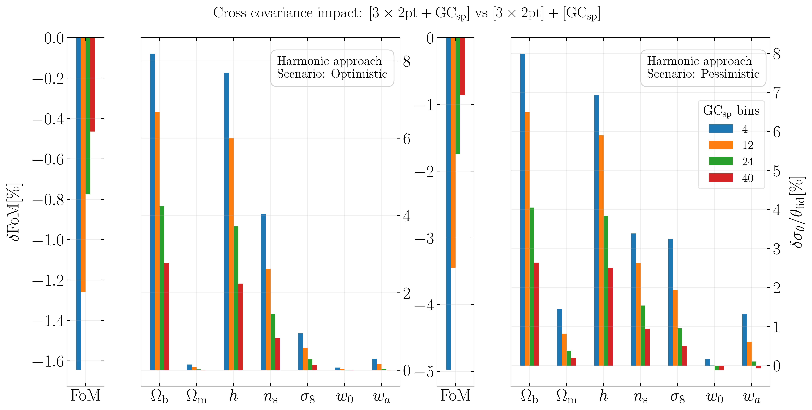
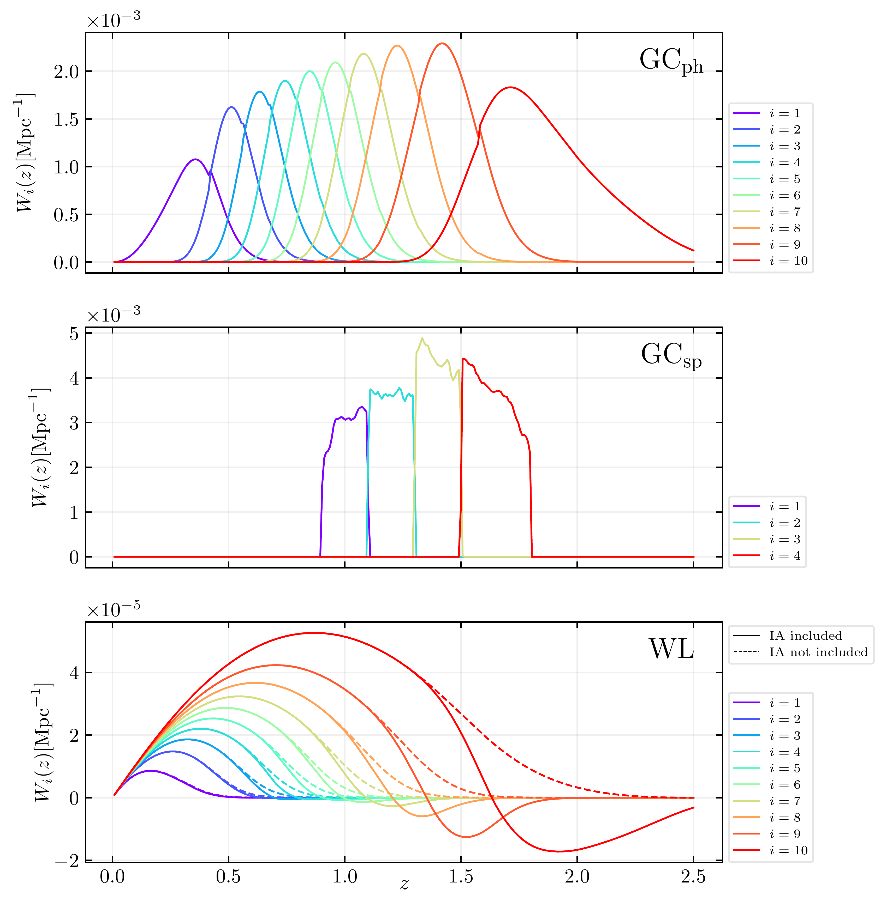
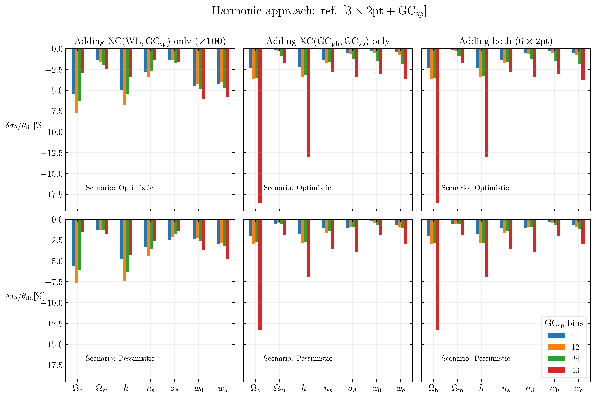

$\newcommand{\ensuremath}{}$
$\newcommand{\xspace}{}$
$\newcommand{\object}[1]{\texttt{#1}}$
$\newcommand{\farcs}{{.}''}$
$\newcommand{\farcm}{{.}'}$
$\newcommand{\arcsec}{''}$
$\newcommand{\arcmin}{'}$
$\newcommand{\ion}[2]{#1#2}$
$\newcommand{\textsc}[1]{\textrm{#1}}$
$\newcommand{\hl}[1]{\textrm{#1}}$
$\newcommand{\footnote}[1]{}$
$\newcommand$
$\newcommand$
$\newcommand{\onesigma}{1\mbox{--}\sigma}$
$\newcommand{\Omb}{\Omega_\mathrm{b}}$
$\newcommand{\Omm}{\Omega_\mathrm{m}}$
$\newcommand{\mnu}{M_\nu}$
$\newcommand{\GCph}{\mathrm{GC}_\mathrm{ph}}$
$\newcommand{\GCsp}{\mathrm{GC}_\mathrm{sp}}$
$\newcommand{\WL}{\mathrm{WL}}$
$\newcommand{\wz}{w_0}$
$\newcommand{\wa}{w_a}$
$\newcommand{\sige}{\sigma_{8}}$
$\newcommand{\FoM}{\mathrm{FoM}}$
$\newcommand{\LCDM}{\Lambda\mathrm{CDM}}$
$\newcommand{\wzwaCDM}{\wz\wa\mathrm{CDM}}$
$\newcommand{\bivz}{b_{\mathrm{v},i}(z)}$
$\newcommand{\bv}{b_\mathrm{v}}$
$\newcommand{\bveff}{b_{\mathrm{v}\mathrm{eff}}}$
$\newcommand{\nivz}{n_i^\textrm{v}(z)}$
$\newcommand{\vis}{VIS}$
$\newcommand{\nisp}{NISP}$
$\newcommand{\pkz}{P_{\mathrm{mm}}(k,z)}$
$\newcommand{\pmkz}{P_{\mathrm{mm}}(k,z)}$
$\newcommand{\pmlimb}{P_{\textrm{mm}}\left[\frac{\ell+1 / 2}{r(z)}, z\right]}$
$\newcommand{\cl}[3]{C^{#1}_{#2}({#3})}$
$\newcommand{\cnol}[2]{C^{#1}_{#2}}$
$\newcommand{\Halpha}{\mathrm{H}\alpha}$
$\newcommand{\de}{\mathrm{d}}$
$\newcommand{\clest}{\hat{C}(\ell)}$
$\newcommand{\clgg}{C^{\gamma\gamma}(\ell)}$
$\newcommand{\clABij}{C^\mathrm{AB}_{ij}(\ell)}$
$\newcommand{\clestABij}{\hat{C}^{\mathrm{AB}}_{ij}(\ell)}$
$\newcommand{\clggij}{C^{\gamma \gamma}_{ij}(\ell)}$
$\newcommand{\lmax}{\ell_{\mathrm{max}}}$
$\newcommand{\lmin}{\ell_{\min}}$
$\newcommand{\fisher}{F_{\alpha \beta}}$
$\newcommand{\CAMB}{\texttt{CAMB}}$
$\newcommand{\camb}{\texttt{CAMB}}$
$\newcommand{\lcdm}{\Lambda \mathrm{CDM}}$
$\newcommand{\nlcdm}{\nu \lcdm}$
$\newcommand{\wcdm}{w_0 w_a \mathrm{CDM}}$
$\newcommand{\nwcdm}{\nu \wcdm}$
$\newcommand{\Hzero}{H_0}$
$\newcommand{\HzeroUNIT}{\text{km}   \text{s}^{-1}   \text{Mpc}^{-1}}$
$\newcommand{\HzeroVAL}{100   \HzeroUNIT}$
$\newcommand{\Hz}{H(z)}$
$\newcommand{\Ommhh}{\Omm h^2}$
$\newcommand{\omb}{\omega_\textrm{b}}$
$\newcommand{\Ombhh}{\Omb h^2}$
$\newcommand{\omc}{\omega_\textrm{c}}$
$\newcommand{\Omc}{\Omega_\textrm{c}}$
$\newcommand{\Omchh}{\Omc h^2}$
$\newcommand{\Omn}{\Omega_\nu}$
$\newcommand{\Omnhh}{\Omn h^2}$
$\newcommand{\OmL}{\Omega_\Lambda}$
$\newcommand{\Mnu}{M_\nu}$
$\newcommand{\ns}{n_\textrm{s}}$
$\newcommand{\As}{A_\textrm{s}}$
$\newcommand{\sigeSCALE}{8 h^{-1} \mbox{Mpc}}$
$\newcommand{\refMnu}{0.06}$
$\newcommand{\refMnueV}{\refMnu   \mbox{eV}}$
$\newcommand{\wklens}{\mathrm{WL}}$
$\newcommand{\bigblock}[1]{\vec{\mathcal{#1}}(\ell)}$
$\newcommand{\tomoblock}[1]{\mathbf{#1}(\ell)}$
$\newcommand{\deltac}{\delta_\mathrm{c}}$
$\newcommand{\deltav}{\delta_\mathrm{v}}$
$\newcommand{\pzpz}{p_{\mathrm{ph}}\left(z_{\mathrm{p}} | z\right)}$
$\newcommand{\ngz}{n^\mathrm{g}(z)}$
$\newcommand{\nigz}{n_i^\mathrm{g}(z)}$
$\newcommand{\aIA}{\mathcal{A}_{\mathrm{IA}}}$
$\newcommand{\betaIA}{\beta_{\mathrm{IA}}}$
$\newcommand{\etaIA}{\eta_{\mathrm{IA}}}$
$\newcommand{\CIA}{C_{\mathrm{IA}}}$
$\newcommand{\wlwl}{\mathrm{wlwl}}$
$\newcommand{\phph}{\mathrm{phph}}$
$\newcommand{\spsp}{\mathrm{spsp}}$
$\newcommand{\wlph}{\mathrm{wlph}}$
$\newcommand{\phwl}{\mathrm{phwl}}$
$\newcommand{\wlsp}{\mathrm{wlsp}}$
$\newcommand{\spwl}{\mathrm{spwl}}$
$\newcommand{\phsp}{\mathrm{phsp}}$
$\newcommand{\spph}{\mathrm{spph}}$
$\newcommand{\xc}[2]{\mathrm{XC}(#1,#2)}$
$\newcommand{\threetwoptShort}{\ensuremath{\textrm{3\times2pt}}}$
$\newcommand{\threetwoptLong}{\WL+\GCph+\xc{\WL}{\GCph}}$
$\newcommand{\sixtwoptShort}{\ensuremath{\textrm{6\times2pt}}}$
$\newcommand{\sixtwoptLong}{\WL+\GCph+\GCsp+\xc{\WL}{\GCph}+\xc{\WL}{\GCsp}+\xc{\GCph}{\GCsp}}$
$\newcommand{\positive}[1]{\textcolor{ForestGreen}{#1}}$
$\newcommand{\negative}[1]{\textcolor{red}{#1}}$
$\newcommand{ç}[1]{{\textcolor{magenta}{#1}}}$
$\newcommand{\bcl}[2]{\mathbf{C}^{#1}(#2)}$
$\newcommand{\hatbcl}[1]{\hat{\mathbf{C}}^{#1}(\ell)}$
$\newcommand{\sgl}[3]{\Sigma^{#1}_{#2}(#3)}$
$\newcommand{\bsgl}[2]{\mathbf{\Sigma}^{#1}(#2)}$
$\newcommand{\cov}[2]{\operatorname{Cov}\left[#1, #2\right]}$
$\newcommand{\invcov}[2]{\operatorname{Cov}^{-1}\left[#1, #2\right]}$
$\newcommand{\pdv}[2]{\frac{\partial #1}{\partial #2}}$
$\newcommand{\orcid}[1]$
$\newcommand$
$\newcommand$
$\newcommand$
$\newcommand$
$\newcommand$
$\newcommand$
$\newcommand$
$\newcommand$
$\newcommand$

# $\Euclid$ preparation: 6$\times$2pt analysis of $\Euclid$'s spectroscopic and photometric data sets

<mark>Appeared on: 2024-10-01</mark> -  _32 pages, 20 figures. Comments are welcome_

E. Collaboration, et al. -- incl., <mark>K. Jahnke</mark>

**Abstract:**            We present cosmological parameter forecasts for the Euclid 6x2pt statistics, which include the galaxy clustering and weak lensing main probes together with previously neglected cross-covariance and cross-correlation signals between imaging/photometric and spectroscopic data. The aim is understanding the impact of such terms on the Euclid performance. We produce 6x2pt cosmological forecasts, considering two different techniques: the so-called harmonic and hybrid approaches, respectively. In the first, we treat all the different Euclid probes in the same way, i.e. we consider only angular 2pt-statistics for spectroscopic and photometric clustering, as well as for weak lensing, analysing all their possible cross-covariances and cross-correlations in the spherical harmonic domain. In the second, we do not account for negligible cross-covariances between the 3D and 2D data, but consider the combination of their cross-correlation with the auto-correlation signals. We find that both cross-covariances and cross-correlation signals, have a negligible impact on the cosmological parameter constraints and, therefore, on the Euclid performance. In the case of the hybrid approach, we attribute this result to the effect of the cross-correlation between weak lensing and photometric data, which is dominant with respect to other cross-correlation signals. In the case of the 2D harmonic approach, we attribute this result to two main theoretical limitations of the 2D projected statistics implemented in this work according to the analysis of official Euclid forecasts: the high shot noise and the limited redshift range of the spectroscopic sample, together with the loss of radial information from subleading terms such as redshift-space distortions and lensing magnification. Our analysis suggests that 2D and 3D Euclid data can be safely treated as independent, with a great saving in computational resources.         

**Figure 14. -** Impact on FoM and marginalised 1-$\sigma$ uncertainties, of cross covariances between $\GCsp$ and $\threetwoptShort  ([$\WL$+$\GCph$+$\xc${$\WL$}{$\GCph$}])$, quantified with percentage differences on the constraints, in the optimistic (left) and pessimistic (right) scenarios. The reference for the percentage are the constraints of $[$\threetwoptShort$] + [$\GCsp$]$, where $\GCsp$ is considered as *independent* from the rest. Note the opposite sign of the percentage differences for FoM and uncertainties. (*fig:3x2pt_sp_cov_impact*)

**Figure 1. -** Weight functions for the three probes considered in the forecast. For $\WL$ at high redshift bins, the weight function \cref{eq:weak_lensing_full_weight}(solid line) becomes negative, due to the contribution of intrinsic alignment (IA). The shear weight function \cref{eq:shear_weight}(dashed line) remains instead always positive as it should be. (*fig:weight_functions_plot*)

**Figure 15. -** Impact of the $\xc{$\GCph$}{$\GCsp$}$ and $\xc{$\WL$}{$\GCsp$}$ cross-correlations on marginalised $\onesigma$ uncertainties, with respect to the constraints given by the $[$\threetwoptShort$+$\GCsp$]$ Fisher matrix, in which the cross-covariance between $\threetwoptShort$ statistics and $\GCsp$ is taken into account. The top panels refer to the optimistic scenario, while the bottom panels refer to the pessimistic one. The percentage differences related to $\xc{$\WL$}{$\GCsp$}$ have been multiplied by $100$ to make them visible when using a single scale on the $y$ axis. (*fig:6x2pt_harmonic_xcs_impact_ref_3x2pt_gcsp_cov*)

