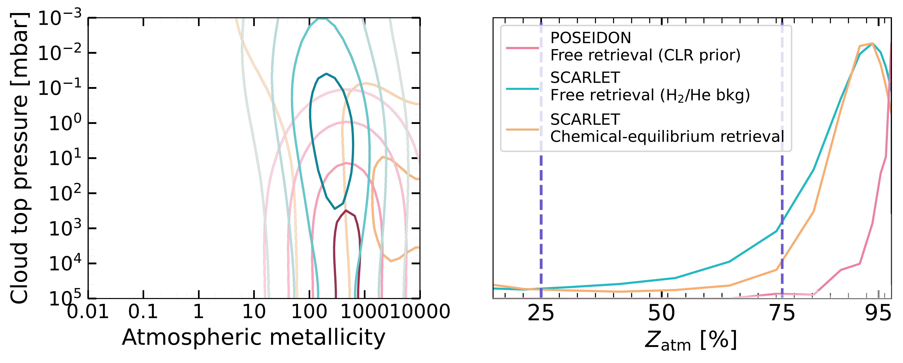
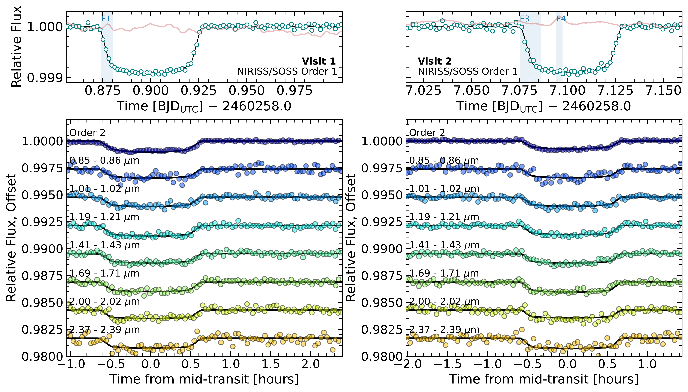

$\newcommand{\ensuremath}{}$
$\newcommand{\xspace}{}$
$\newcommand{\object}[1]{\texttt{#1}}$
$\newcommand{\farcs}{{.}''}$
$\newcommand{\farcm}{{.}'}$
$\newcommand{\arcsec}{''}$
$\newcommand{\arcmin}{'}$
$\newcommand{\ion}[2]{#1#2}$
$\newcommand{\textsc}[1]{\textrm{#1}}$
$\newcommand{\hl}[1]{\textrm{#1}}$
$\newcommand{\footnote}[1]{}$
$\newcommand{\vdag}{(v)^\dagger}$
$\newcommand$
$\newcommand$
$\newcommand{\logX}[1]{\ensuremath{\log(\mathrm{X_{\ce{#1}}})}}$
$\newcommand{\logXratio}[2]{\ensuremath{\log(\mathrm{X_{\ce{#1}} / X_{\ce{#2}} })}}$
$\newcommand{\umontreal}{Department of Physics and Trottier Institute for Research on Exoplanets, Université de Montréal, Montreal, QC, Canada \href{mailto:caroline.piaulet@umontreal.ca}{caroline.piaulet@umontreal.ca}}$
$\newcommand{\thefigure}{A\arabic{figure}}$
$\newcommand{\thetable}{A\arabic{table}}$

# JWST/NIRISS reveals the water-rich "steam world" atmosphere of GJ 9827 d

<mark>Appeared on: 2024-10-07</mark> -  _37 pages, 18 figures, Accepted for publication in ApJL_

C. Piaulet-Ghorayeb, et al. -- incl., <mark>E.-M. Ahrer</mark>, <mark>D. Christie</mark>, <mark>L. Acuña</mark>, <mark>C. Gapp</mark>

**Abstract:** With sizable volatile envelopes but smaller radii than the solar system ice giants, sub-Neptunes have been revealed as one of the most common types of planet in the galaxy. While the spectroscopic characterization of larger sub-Neptunes (2.5--4R $_\oplus$ ) has revealed hydrogen-dominated atmospheres, smaller sub-Neptunes (1.6--2.5R $_\oplus$ ) could either host thin, rapidly evaporating hydrogen-rich atmospheres or be stable metal-rich “water worlds” with high mean molecular weight atmospheres and a fundamentally different formation and evolutionary history. Here, we present the 0.6--2.8 $\mu$ m JWST NIRISS/SOSS transmission spectrum of GJ 9827 d, the smallest (1.98 R $_\oplus$ ) warm (T $_\mathrm{eq, A_B=0.3} \sim 620$ K) sub-Neptune where atmospheric absorbers have been detected to date. Our two transit observations with NIRISS/SOSS, combined with the existing _HST_ /WFC3 spectrum, enable us to break the clouds-metallicity degeneracy. We detect water in a highly metal-enriched "steam world" atmosphere (O/H of $\sim 4$ by mass and $H_2$ O found to be the background gas with a volume mixing ratio (VMR) of $>31$ \% ). We further show that these results are robust to stellar contamination through the transit light source effect. We do not detect escaping metastable He, which, combined with previous nondetections of escaping He and H, supports the steam atmosphere scenario. In water-rich atmospheres, hydrogen loss driven by water photolysis happens predominantly in the ionized form which eludes observational constraints. We also detect several flares in the NIRISS/SOSS light-curves with far-UV energies of the order of 10 $^{30}$ erg, highlighting the active nature of the star. Further atmospheric characterization of GJ 9827 d probing carbon or sulfur species could reveal the origin of its high metal enrichment.

**Figure 17. -** Posterior distributions for important atmospheric volatile species (top, blue) and the stellar heterogeneity component (bottom, orange), for the POSEIDON retrieval (top rows) using a centered-log-ratios (CLR) agnostic prior on the background gas, and for the SCARLET retrieval (bottom rows) where $H_2$/He is the filler (background) gas. Different colors correspond to different retrievals where spots or faculae are included or excluded (see legend). Our constraints on the HMMW atmospheric volatile species are broadly unaffected by our treatment of stellar contamination, and the retrieval only provides a lower limit on the $H_2$O abundance. For the SCARLET retrieval, the distributions on $T_\mathrm{spot}$ and $T_\mathrm{fac}$ are derived from the posterior distributions on $\Delta T_\mathrm{spot}$, $\Delta T_\mathrm{fac}$ and $T_\mathrm{phot,star}$. The POSEIDON prior on the spot temperature extends all the way to 2300 K, while SCARLET assumes that spots are at most 800 K colder than the photosphere. (*fig:1d_distri_retrieval*)

**Figure 10. -** Constraints on the atmospheric composition from the POSEIDON retrieval with the agnostic (CLR) prior on the background gas (pink), the SCARLET retrieval with $H_2$/He assumed to be the background gas (blue), and SCARLET chemically-consistent retrieval (orange). _Left panel:_ Contours representing the 0.5, 1, 1.5, and 2$\sigma$ levels in the joint posterior probability distribution on the atmospheric metallicity and the gray cloud top pressure, for all three retrievals. _Right panel:_ Kernel density estimations of  the atmospheric metal mass fraction $Z_\mathrm{atm}$ obtained from all posterior samples, for each retrieval setup. (*fig:met_pcloud_zatm*)

**Figure 8. -** _Top panels:_ Results from the white light curve fit of the supreme-SPOON reduction for Visits 1 (left) and 2 (right), and fitted systematics models. The order 1 systematics-corrected light-curves are shown (teal points), binned for visual purposes, along with the best-fit transit model (black) and the systematics model including the GP component (red, with the GP scaled for visualization purposes). The vertical blue shaded regions indicate the three candidate flares with the highest signal-to-noise spectra and following typical flare evolution profiles (see Section \ref{ssec:intransit_varia}).
    _Bottom panels:_ Spectroscopic light-curve fits to the two NIRISS/SOSS transits of GJ 9827 d from the \texttt{supreme-SPOON} reduction. The left panel corresponds to the first visit and the right panel to the second visit. We show the detrended broadband light-curve for order 2, and seven spectroscopic light-curves from order 1, from top to bottom. The best-fit astrophysical model is shown for each light-curve (black) and light-curves are offset relative to each other for clarity.
     (*fig:wlc_slc_fit*)

