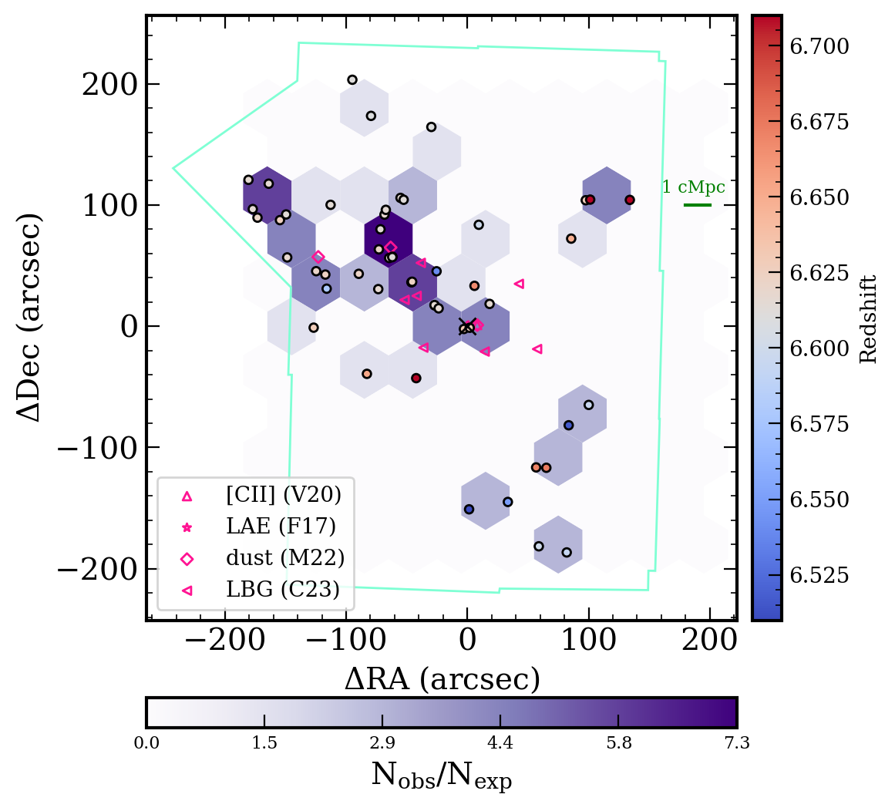
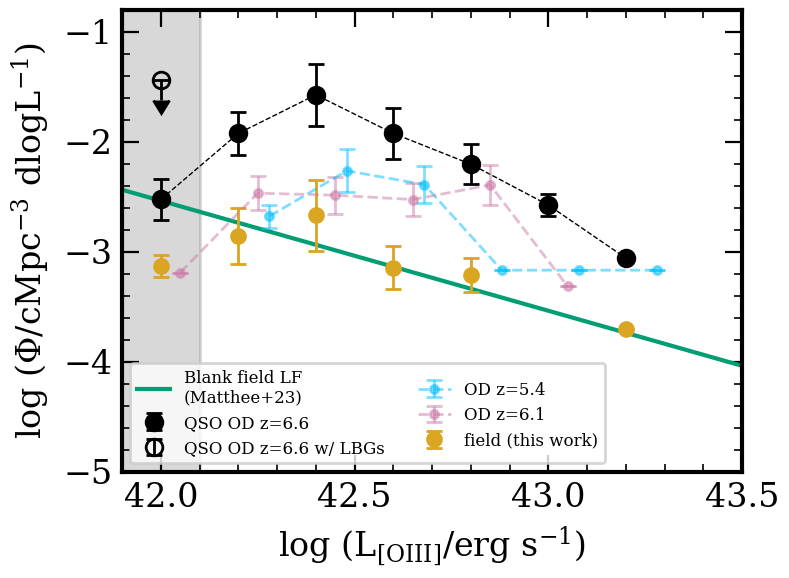
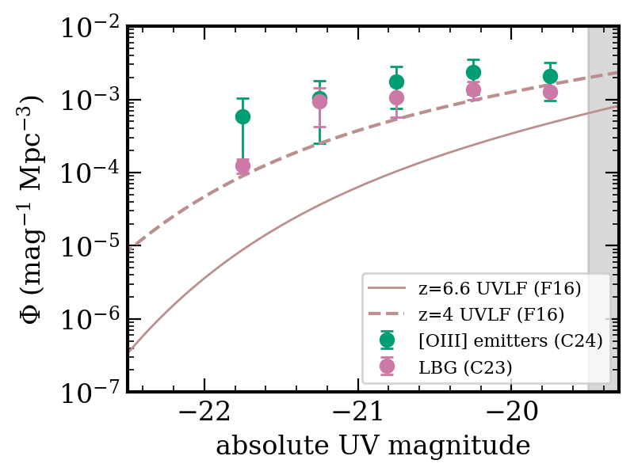

$\newcommand{\ensuremath}{}$
$\newcommand{\xspace}{}$
$\newcommand{\object}[1]{\texttt{#1}}$
$\newcommand{\farcs}{{.}''}$
$\newcommand{\farcm}{{.}'}$
$\newcommand{\arcsec}{''}$
$\newcommand{\arcmin}{'}$
$\newcommand{\ion}[2]{#1#2}$
$\newcommand{\textsc}[1]{\textrm{#1}}$
$\newcommand{\hl}[1]{\textrm{#1}}$
$\newcommand{\footnote}[1]{}$
$\newcommand$
$\newcommand{\vdag}{(v)^\dagger}$
$\newcommand$
$\newcommand$
$\newcommand{\sfr}{M_{\odot} yr^{-1}}$
$\newcommand{\etal}{et al.}$
$\newcommand{\um}{\mum}$
$\newcommand{\lsun}{L_{\odot}}$
$\newcommand{\msun}{M_{\odot}}$
$\newcommand{\mstar}{M_{\star}}$
$\newcommand{\lt}{<}$
$\newcommand{\gt}{>}$
$\newcommand{\Cii}{[C\textsc{ii}]}$
$\newcommand{\Oiii}{[O\textsc{iii}]}$
$\newcommand{\herschel}{\textit{Herschel}}$
$\newcommand{\lya}{Ly\alpha}$
$\newcommand{\halpha}{H\alpha}$
$\newcommand{\magphys}{\textsc{magphys}}$
$\newcommand{\kms}{km s^{-1}}$
$\newcommand{\pz}{P(z)}$
$\newcommand{\hband}{H_{160}}$
$\newcommand{\jband}{J_{125}}$
$\newcommand{\yband}{Y_{105}}$
$\newcommand{\iband}{i_{814}}$
$\newcommand{\vband}{V_{606}}$
$\newcommand{\jhband}{\textit{JH}_{140}}$
$\newcommand{\yjband}{\textit{YJ}_{110}}$
$\newcommand{\zband}{z_{850}}$
$\newcommand{\amp}{~}$
$\newcommand{\scubaii}{{\sc Scuba-2}}$
$\newcommand{\uJy}{\muJy}$
$\newcommand{\co}{\rm CO}$
$\newcommand{\alphaco}{\alpha_{\rm CO}}$
$\newcommand{\acounits}{M_{\odot}/(K km s^{-1} pc^{2})}$
$\newcommand{\ltsima}{\; \buildrel < \over \sim \;}$
$\newcommand{\simlt}{\lower.5ex\hbox{\ltsima}}$
$\newcommand{\gtsima}{\; \buildrel > \over \sim \;}$
$\newcommand{\simgt}{\lower.5ex\hbox{\gtsima}}$
$\newcommand{\ltsima}{\; \buildrel < \over \sim \;}$
$\newcommand{\simlt}{\lower.5ex\hbox{\ltsima}}$
$\newcommand{\gtsima}{\; \buildrel > \over \sim \;}$
$\newcommand{\simgt}{\lower.5ex\hbox{\gtsima}}$

# A Quasar-Anchored Protocluster at $z=6.6$ in the ASPIRE Survey: I. Properties of [OIII] Emitters in a 10 Mpc Overdensity Structure

<mark>Appeared on: 2024-10-09</mark> -  _submitted to ApJ june 2024. 18 pages, 7 figures. companion paper II by Champagne+24b is also available on arXiv today_

Jaclyn~B.~Champagne, et al. -- incl., <mark>E. Bañados</mark>

**Abstract:** ASPIRE (A SPectroscopic survey of bIased halos in the Reionization Era) is a quasar legacy survey primarily using _JWST_ to target a sample of 25 $z>6$ quasars with NIRCam slitless spectroscopy and imaging.The first study in this series found evidence of a strong overdensity of galaxies around J0305 $-$ 3150, a luminous quasar at $z=6.61$ , within a single NIRCam pointing obtained in JWST Cycle 1.Here, we present the first results of a JWST Cycle 2 mosaic that covers 35 arcmin $^2$ with NIRCam imaging/WFSS of the same field to investigate the spatial extent of the putative protocluster.The F356W grism data targets $\Oiii$ +H $\beta$ at $5.3<z<7$ and reveals a population of 124 line emitters down to a flux limit of 1.2 $\times$ 10 $^{-18}$ erg s $^{-1}$ cm $^{-2}$ .Fifty-three of these galaxies lie at $6.5<z<6.8$ spanning 10 cMpc on the sky, corresponding to an overdensity within a 2500 cMpc $^3$ volume of 12.5 $\pm$ 2.6, anchored by the quasar.Comparing to the $\Oiii$ luminosity function from the Emission line galaxies and Intergalactic Gas in the Epoch of Reionization (EIGER) project, we find a dearth of faint $\Oiii$ emitters at log(L/erg s $^{-1}$ ) $<$ 42.3, which we suggest is consistent with either bursty star formation causing galaxies to scatter around the grism detection limit or modest suppression from quasar feedback.While we find a strong filamentary overdensity of $\Oiii$ emitters consistent with a protocluster, we suggest that we could be insensitive to a population of older, more massive Lyman-break galaxies with weak nebular emission on scales $>10$ cMpc.

**Figure 2. -**  2D representation of spectroscopically confirmed $\Oiii$  emitters at the quasar redshift (circles). The quasar is marked as the large black $\times$; galaxies identified via other tracers are marked in pink symbols. The hexbin histogram (bottom colorbar) denotes the 2D overdensity of $\Oiii$  emitters with respect to the UV luminosity function at $z=6$ ([Finkelstein, Ryan and Papovich 2015]()) , showing that the overdensity is stronger in a filament pointing away from the quasar. The right colorbar denotes the redshift of individual galaxies, centered on the quasar redshift. The green outline depicts the footprint of the mosaic. (*fig:hexbin*)

**Figure 6. -** _Left:_ Luminosity function of the $\Oiii$  emitters in our sample. The black points indicate members of the protocluster (empty point indicates the upper limit when including LBGs not detected in $\Oiii$); the blue and pink points indicate the overdensities at $z<6.5$. The green line is the blank field luminosity function from EIGER  ([Matthee, Mackenzie and Simcoe 2023]()) , and the filled gold points are the field galaxies in our sample that do not belong to the three overdensities. The grey shaded regions in both panels indicate where we are $<80$\% complete. The quasar overdensity is an order of magnitude above the blank field expectations but the shape is dissimilar, with a preference for fainter galaxies and a slight dearth of the brightest galaxies. _Right:_ The UV luminosity function within the quasar protocluster of our $\Oiii$  emitters and LBGs from [Champagne, Casey and Finkelstein (2023)](). M$_{UV}$ is calculated from the best-fit SEDs presented in Paper II. The redshift-parameterized UVLFs at $z=6.6$ and $z=4$ from [ and Finkelstein (2016)]() are shown: both the $\Oiii$  emitters and the LBGs are consistent with having undergone more rapid evolution than the field by several hundred Myr. (*fig:o3lf*)

**Figure 5. -** 
    Full F356W six-pointing mosaic surrounding
    J0305$-$3150, with the full field of view outlined in black. The quasar is depicted at the center with a white circle. The quasar-anchored overdensity members are shown in pink, the overdensities at $z=5.4$ and $z=6.2$ are in blue and purple, and the field galaxies at $5.3<z<6.5$ are shown in yellow. The blue box shows the WFC3 footprint where galaxies have photometric coverage from _HST_. The configuration of the pointings is such that we have the greatest depth in the immediate surroundings of the quasar, so we are most sensitive to faint galaxies in the central regions. The filled points indicate sources already identified in the Cycle 1 data  ([Wang, Yang and Hennawi 2023]()) .
  Inset: Zoom-in to the central 30$\arcsec$  surrounding the quasar. Three companion $\Cii$  emitters  ([Venemans, Walter and Neeleman 2020]()) , 1 dust continuum emitter  ([Champagne, Decarli and Casey 2018]()) , 1 LAE  ([Farina, Venemans and Decarli 2017]()) , and 2 $\Oiii$  emitters (this work; one of them is the LAE) are visible within a few hundred ckpc from the quasar. (*fig:f356w*)

