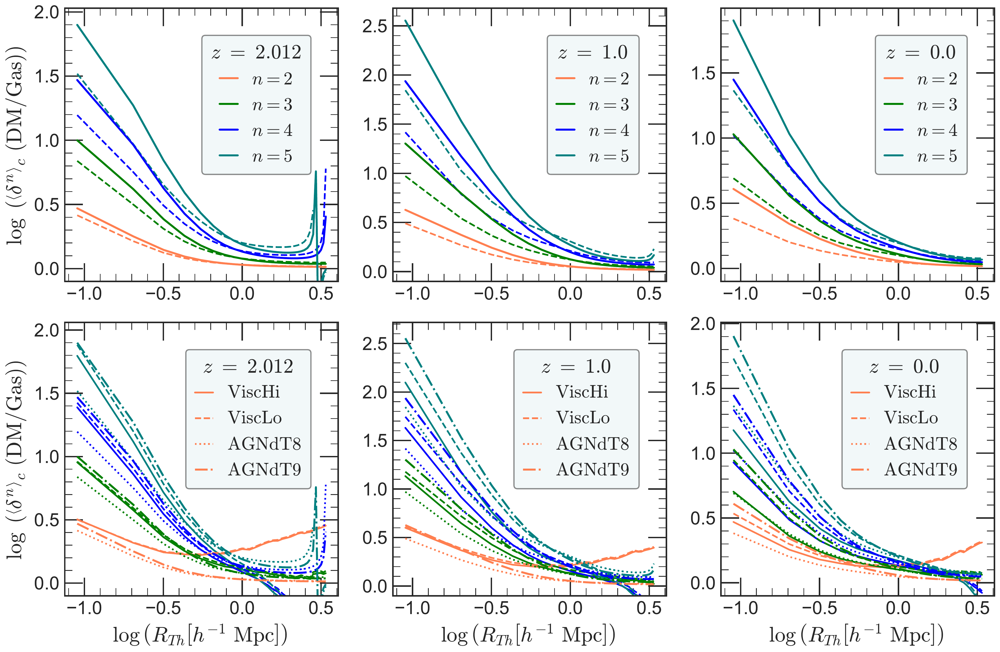
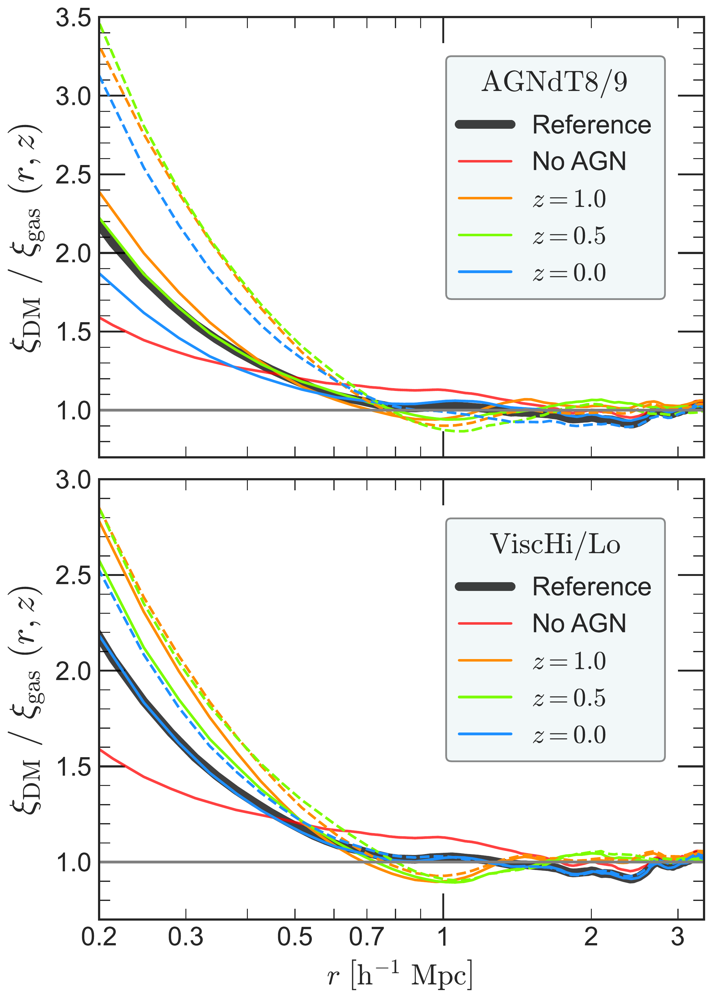
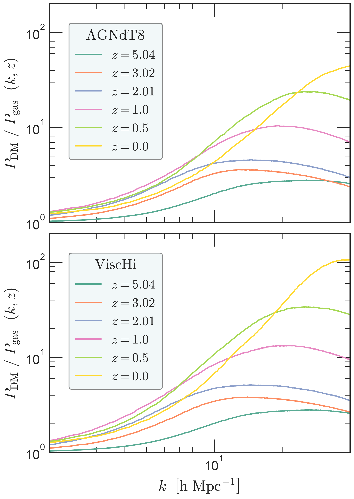

$\newcommand{\ensuremath}{}$
$\newcommand{\xspace}{}$
$\newcommand{\object}[1]{\texttt{#1}}$
$\newcommand{\farcs}{{.}''}$
$\newcommand{\farcm}{{.}'}$
$\newcommand{\arcsec}{''}$
$\newcommand{\arcmin}{'}$
$\newcommand{\ion}[2]{#1#2}$
$\newcommand{\textsc}[1]{\textrm{#1}}$
$\newcommand{\hl}[1]{\textrm{#1}}$
$\newcommand{\footnote}[1]{}$
$\newcommand$
$\newcommand$
$\newcommand$
$\newcommand$
$\newcommand{\Sownak}[1]{\textcolor{red}{{\bf #1}}}$
$\newcommand{\saha}[1]{\textcolor{orange}{{\bf #1}}}$
$\newcommand$

# Quantifying the impact of AGN feedback on the large-scale matter distribution using two- and three-point statistics

<mark>Appeared on: 2024-10-10</mark> -  _Accepted for publication in MNRAS_

<mark>B. Saha</mark>, S. Bose

**Abstract:** Feedback from active galactic nuclei (AGN) plays a critical role in shaping the matter distribution on scales comparable to and larger than individual galaxies. Upcoming surveys such as _Euclid_ and LSST aim to precisely quantify the matter distribution on cosmological scales, making a detailed understanding of AGN feedback effects essential. Hydrodynamical simulations provide an informative framework for studying these effects, in particular by allowing us to vary the parameters that determine the strength of these feedback processes and, consequently, to predict their corresponding impact on the large-scale matter distribution. We use the EAGLE simulations to explore how changes in subgrid viscosity and AGN heating temperature affect the matter distribution, quantified via  2- and 3-point correlation functions, as well as higher order cumulants of the matter distribution. We find that varying viscosity has a small impact ( $\approx 10\%$ ) on scales larger than $1 h^{-1}$ Mpc, while changes to the AGN heating temperature lead to substantial differences, with up to 70 \% variation in gas clustering on small scales ( $\lesssim 1 h^{-1}$ Mpc). By examining the suppression of the power spectrum as a function of time, we identify the redshift range $z = 1.5 - 1$ as a key epoch where AGN feedback begins to dominate in these simulations. The 3-point function provides complementary insight to the more familiar 2-point statistics, and shows more pronounced variations between models on the scale of individual haloes. On the other hand, we find that effects on even larger scales are largely comparable.

**Figure 20. -** Cumulants of the DM density field relative to gas at different epochs for different smoothing scales. The color of the lines indicates the curve while the line styles indicate the different models in our study. The top panels show the suppression in the cumulants for {\tt AGNdT9}(solid curves) and {\tt AGNdT8}(dashed curves) models. In the bottom panels for completeness, we plot all the models.
     (*fig:fig10*)

**Figure 3. -** Comparing 2pCF of gas with DM between {\tt AGNdT8-9} and {\tt ViscHi-Lo}.The solid lines are for {\tt AGNdT8} and {\tt ViscHi}, and the dashed lines are for {\tt AGNdT9} and {\tt ViscLo}, respectively. The 2pCF is boosted for {\tt AGNdT8} and {\tt ViscHi}, therefore they have more clustering of matter than their counterparts. The solid black line is the 2pCF from the EAGLE reference model at $z=0$, while black dashed line represent the 2pCF at $z=0$ with the AGN feedback turned off. (*fig:fig4*)

**Figure 2. -** $P(k)$ at different epochs for {\tt AGNdT8} and {\tt ViscHi} model. With evolving time, clustering increases which boosts the $P(k)$. AGN feedback re-distributes matter, which suppresses the $P(k)$. The crossover events, which are departures from general trend of $P(k)$ with $z$, are indicative of the onset of dominance of AGN feedback. Similar behaviour is observed with {\tt AGNdT9} and {\tt ViscLo}, but with different intensity, which is studied later. (*fig:fig3*)

