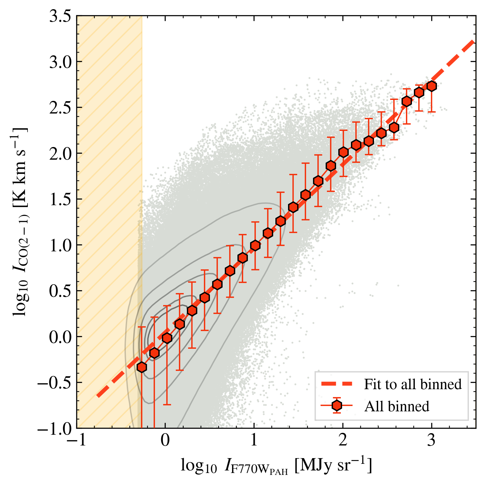
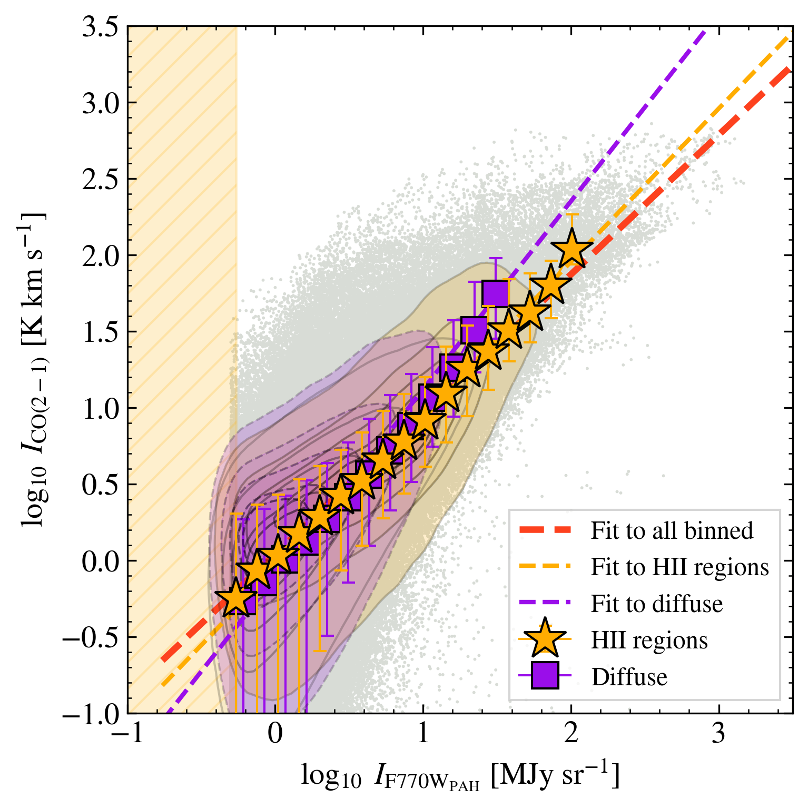
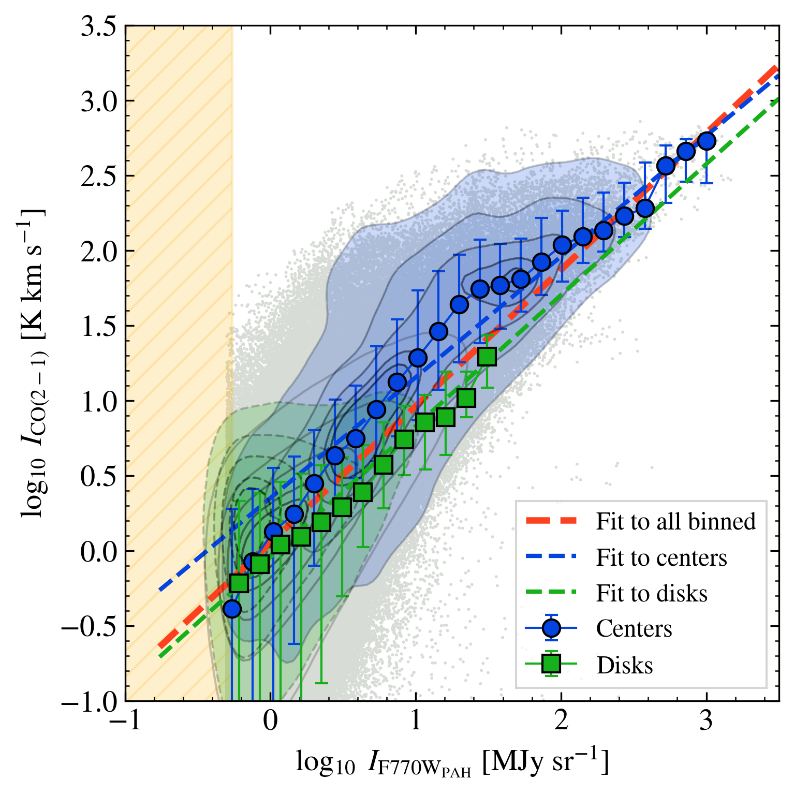
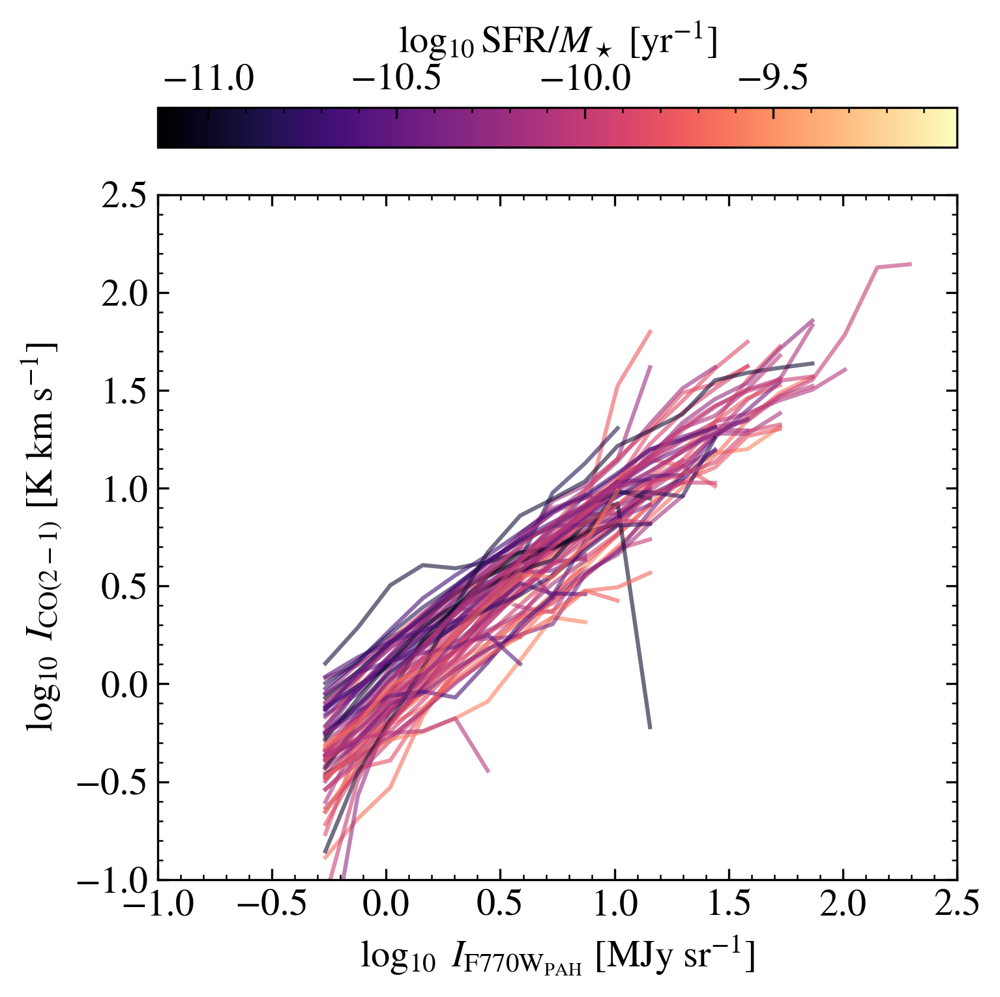
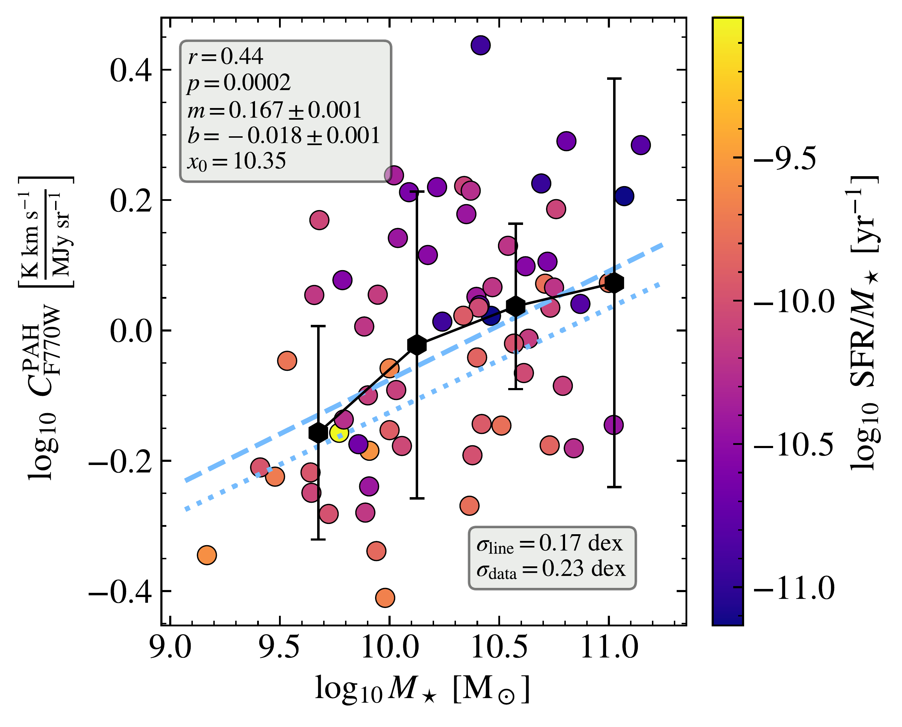
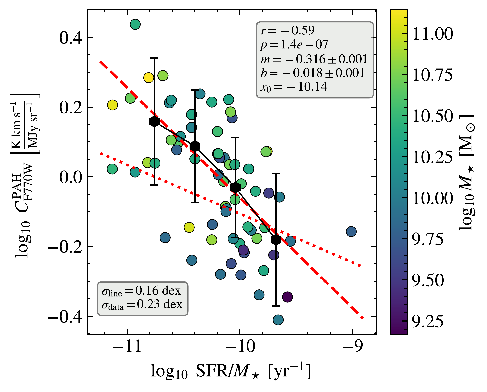
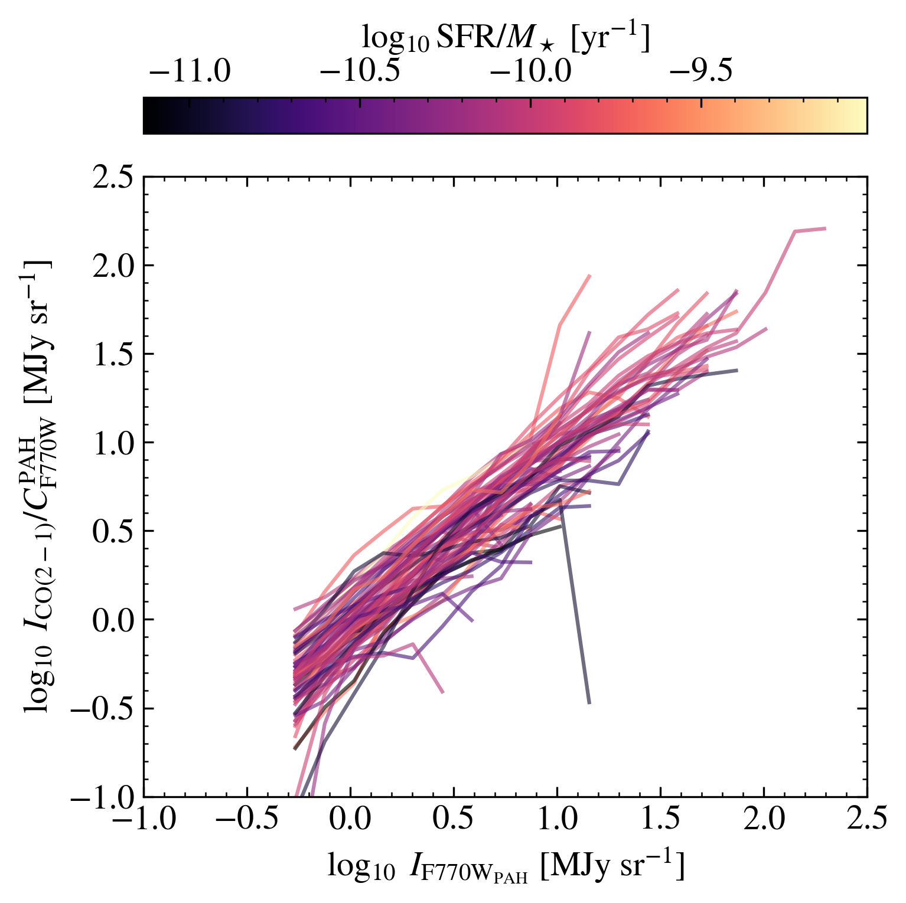
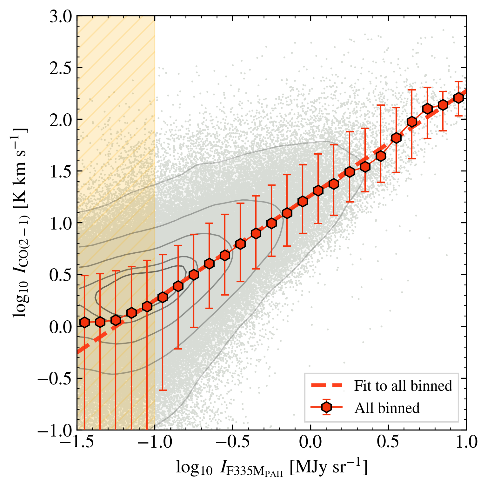
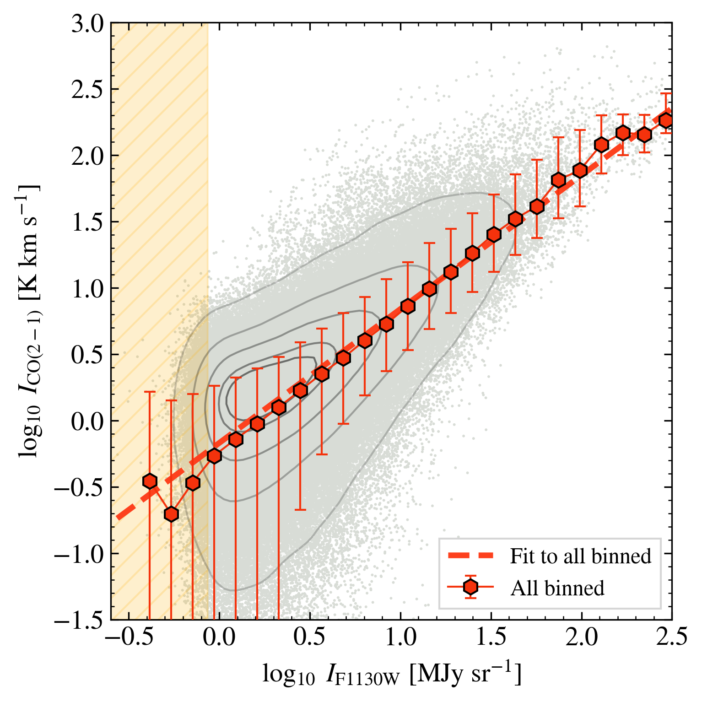

$\newcommand{\ensuremath}{}$
$\newcommand{\xspace}{}$
$\newcommand{\object}[1]{\texttt{#1}}$
$\newcommand{\farcs}{{.}''}$
$\newcommand{\farcm}{{.}'}$
$\newcommand{\arcsec}{''}$
$\newcommand{\arcmin}{'}$
$\newcommand{\ion}[2]{#1#2}$
$\newcommand{\textsc}[1]{\textrm{#1}}$
$\newcommand{\hl}[1]{\textrm{#1}}$
$\newcommand{\footnote}[1]{}$
$\newcommand{\vdag}{(v)^\dagger}$
$\newcommand$
$\newcommand$
$\newcommand{\um}{\mum}$
$\newcommand{\nh}{\ensuremath{N(\mathrm{H})}}$
$\newcommand{\nhtwo}{\ensuremath{N(\mathrm{H_2})}}$
$\newcommand{\htwo}{\ensuremath{\mathrm{H_2}}}$
$\newcommand{\hone}{\ion{H}{1}}$
$\newcommand{\hplus}{\ion{H}{2}}$
$\newcommand{\qpah}{\ensuremath{q_\mathrm{PAH}}}$
$\newcommand{\aco}{\ensuremath{\alpha_\mathrm{CO}}}$
$\newcommand{\inu}{\ensuremath{I_\nu}}$
$\newcommand{\ipah}{\ensuremath{I^\mathrm{PAH}_{\rm F770W}}}$
$\newcommand{\ssfr}{\ensuremath{\mathrm{SFR}/M_\star}}$
$\newcommand{\mstar}{\ensuremath{M_\star}}$
$\newcommand{\norm}{\ensuremath{C_\mathrm{F770W}^\mathrm{PAH}}}$
$\newcommand{\mjysr}{MJy~sr^{-1}}$
$\newcommand{\kkms}{K~km~s^{-1}}$
$\newcommand{\copahunit}{\kkms/(\mjysr)}$
$\newcommand$
$\newcommand{\Ox}{Sub-department of Astrophysics, Department of Physics, University of Oxford, Keble Road, Oxford OX1 3RH, UK}$
$\newcommand{\UGent}{Sterrenkundig Observatorium, Universiteit Gent, Krijgslaan 281 S9, B-9000 Gent, Belgium}$
$\newcommand{\STScI}{Space Telescope Science Institute, 3700 San Martin Drive, Baltimore, MD 21218, USA}$
$\newcommand{\MPIA}{Max-Planck-Institut für Astronomie, Königstuhl 17, D-69117, Heidelberg, Germany}$
$\newcommand{\AURA}{AURA for the European Space Agency (ESA), Space Telescope Science Institute, 3700 San Martin Drive, Baltimore, MD 21218, USA}$
$\newcommand{\UCSD}{Department of Astronomy \& Astrophysics, University of California, San Diego, 9500 Gilman Dr., La Jolla, CA 92093, USA}$
$\newcommand{\Whitman}{Whitman College, 345 Boyer Avenue, Walla Walla, WA 99362, USA}$
$\newcommand{\JHU}{Department of Physics and Astronomy, The Johns Hopkins University, Baltimore, MD 21218, USA}$
$\newcommand{\OSU}{Department of Astronomy, The Ohio State University, 140 West 18th Avenue, Columbus, OH 43210, USA}$
$\newcommand{\OSUPhys}{Department of Physics, The Ohio State University, Columbus, Ohio 43210, USA}$
$\newcommand{ÇAPP}{Center for Cosmology and Astroparticle Physics (CCAPP), 191 West Woodruff Avenue, Columbus, OH 43210, USA}$
$\newcommand{\ARI}{Astronomisches Rechen-Institut, Zentrum für Astronomie der Universität Heidelberg, Mönchhofstr. 12-14, D-69120 Heidelberg, Germany}$
$\newcommand{\ANU}{Research School of Astronomy and Astrophysics, Australian National University, Canberra, ACT 2611, Australia}$
$\newcommand{\UConn}{Department of Physics, University of Connecticut, 196A Auditorium Road, Storrs, CT 06269, USA}$
$\newcommand{\UHawaii}{Institute for Astronomy, University of Hawaii, 2680 Woodlawn Drive, Honolulu, HI 96822, USA}$
$\newcommand{\UniCA}{Université C\^{o}te d'Azur, Observatoire de la C\^{o}te d'Azur, CNRS, Laboratoire Lagrange, 06000, Nice, France}$
$\newcommand{\UAlberta}{Dept. of Physics, University of Alberta, 4-183 CCIS, Edmonton, Alberta, T6G 2E1, Canada}$
$\newcommand{\Arcetri}{INAF — Osservatorio Astrofisico di Arcetri, Largo E. Fermi 5, I-50125, Florence, Italy}$
$\newcommand{\UWyoming}{Department of Physics and Astronomy, University of Wyoming, Laramie, WY 82071, USA}$
$\newcommand{\LJMU}{Astrophysics Research Institute, Liverpool John Moores University, 146 Brownlow Hill, Liverpool L3 5RF, UK}$
$\newcommand{\ITA}{Universität Heidelberg, Zentrum für Astronomie, Institut für Theoretische Astrophysik, Albert-Ueberle-Str 2, D-69120 Heidelberg, Germany}$
$\newcommand{\CfA}{Center for Astrophysics \mid Harvard \& Smithsonian, 60 Garden St., 02138 Cambridge, MA, USA}$
$\newcommand{\MPE}{Max-Planck-Institut für Extraterrestrische Physik (MPE), Giessenbachstr. 1, D-85748 Garching, Germany}$
$\newcommand{\UMD}{Department of Astronomy and Joint Space-Science Institute, University of Maryland, College Park, MD 20742, USA}$
$\newcommand{\UVA}{Department of Astronomy, University of Virginia, Charlottesville, VA, USA}$
$\newcommand{\NRAO}{National Radio Astronomy Observatory, Charlottesville, VA, USA}$
$\newcommand{\ASIAA}{Institute of Astronomy and Astrophysics, Academia Sinica, No. 1, Sec. 4, Roosevelt Road, Taipei 106216, Taiwan}$
$\newcommand{\kipac}{Kavli Institute for Particle Astrophysics \& Cosmology (KIPAC), Stanford University, CA 94305, USA}$
$\newcommand{\aifa}{Argelander-Institut für Astronomie, University of Bonn, Auf dem Hügel 71, 53121 Bonn, Germany}$
$\newcommand{\TKU}{Department of Physics, Tamkang University, No.151, Yingzhuan Road, Tamsui District, New Taipei City 251301, Taiwan}$
$\newcommand{\CarnegieObs}{The Observatories of the Carnegie Institution for Science. 813 Santa Barbara Street, Pasadena, CA 91101, USA}$
$\newcommand{\Princeton}{Department of Astrophysical Sciences, Princeton University, Princeton, NJ 08544, USA}$
$\newcommand{\IAS}{Institute for Advanced Study, 1 Einstein Drive, Princeton, NJ 08540, USA}$
$\newcommand{\COOL}{Cosmic Origins Of Life (COOL) Research DAO, coolresearch.io}$
$\newcommand{\ESO}{European Southern Observatory (ESO), Karl-Schwarzschild-Stra{\ss}e 2, 85748 Garching, Germany}$
$\newcommand{\ULyon}{Univ Lyon, Univ Lyon 1, ENS de Lyon, CNRS, Centre de Recherche Astrophysique de Lyon UMR5574, F-69230 Saint-Genis-Laval, France}$

# Polycyclic Aromatic Hydrocarbon and CO (2-1) Emission at $50{-}150$ pc Scales in $\nsample$ Nearby Galaxies

<mark>Appeared on: 2024-10-10</mark> -  _21 pages, 4 figures, 3 tables. Submitted to ApJ_

Ryan~Chown, et al. -- incl., <mark>K. Kreckel</mark>, <mark>E. Schinnerer</mark>

**Abstract:** Combining Atacama Large Millimeter/sub-millimeter Array CO(2-1) mapping and JWST near- and mid-infrared imaging, we characterize the relationship between CO(2-1) and polycyclic aromatic hydrocarbon (PAH) emission at $\approx 100$ pc resolution in $\nsample$ nearby star-forming galaxies, expanding the sample size from previous $\approx 100$ pc resolution studies by more than an order of magnitude. Focusing on regions of galaxies where most of the gas is likely to be molecular, we find strong correlations between CO(2-1) and 3.3 $\mu$ m, $7.7\mu$ m, and $11.3 \mu$ m PAH emission, estimated from JWST's F335M, F770W, and F1130W filters. We derive power law relations between CO(2-1) and PAH emission, which have indices in the range $0.8{-}1.2$ , implying relatively weak variations in the observed CO-to-PAH ratios across the regions that we study. We find that CO-to-PAH ratios and scaling relationships near $\ion{H}{2}$ regions are similar to those in  diffuse sight lines. The main difference between the two types of regions is that sight lines near $\ion{H}{2}$ regions show higher intensities in all tracers. Galaxy centers, on the other hand, show higher overall intensities and enhanced CO-to-PAH ratios compared to galaxy disks. Individual galaxies show $0.19$ dex scatter in the normalization of CO at fixed $I_{\rm PAH}$ , and this normalization anti-correlates with specific star formation rate ( $\ssfr$ ) and correlates with stellar mass. We provide a prescription that accounts for these galaxy-to-galaxy variations and represents our best current empirical predictor to estimate CO(2-1) intensity from PAH emission, which allows one to take advantage of JWST's excellent sensitivity and resolution to trace cold gas.

**Figure 1. -** **CO(2--1) and starlight continuum-subtracted F770W$_{\rm PAH**$ emission} at $\approx 100$ pc resolution in 66 nearby star-forming galaxies. _Top left:_ All sight lines in our analysis (gray points) with data density contours enclosing the densest 15, 25, 50, 75, and 95\% of the data points. The bins show the median and 16{-}84\% range of CO(2-1) emission in logarithmically-spaced bins of $I_{\rm PAH}^{\rm F770W}$; treating the PAH emission as the independent variable allows us to average the noisier CO(2-1) data. The dashed line shows the best-fit power law describing these binned measurements (Table \ref{tab:fits}).  _Top right:_ As the top left panel but now separately plotting results for sight lines near $\ion${H}{2} regions (yellow, stars) and diffuse emission outside these regions (purple, squares). The two environments show similar CO-to-PAH ratios where they overlap, but the sight lines near $\ion${H}{2} regions show overall brighter intensities. _Bottom left:_ As for the previous figures, but now separating galaxy centers (blue, circles) from disks (green, squares). Galaxy centers show brighter emission and higher CO-to-PAH ratios at the same $I_{\rm F770W}^{\rm PAH}$. _Bottom right:_ Traces show binned results for each individual galaxy. The galaxies show overall similar CO(2-1) vs. F770W$_{\rm PAH}$ relations with moderate offsets from galaxy to galaxy. These offsets correlate with the integrated galaxy properties (see Figure \ref{fig:co_mir_bygal}, with the color bar indicating SFR$/M_\star$). See Table \ref{tab:fits} for ratios and best fits for each panel.
 (*fig:co_mir_all*)

**Figure 2. -** **Galaxy-to-galaxy variations in the CO(2--1) vs. F770W$_{\rm PAH**$ relationship.} CO(2-1) at fixed PAH intensity for individual galaxies (see bottom left panel Fig. \ref{fig:co_mir_all}) as a function of (_left_) galaxy-integrated stellar mass, $M_\star$ and (_right_) specific star formation rate, SFR/$M_\star$. Spearman's $r$, p-value, the best-fit slope, intercept and pivot ($y=m(x-x_0)+b$) to all galaxies, the scatter about the best-fit relation (Eq. \ref{eq:norms}), and vertical scatter are all indicated. We observe a modest correlation between the CO-to-PAH ratio and $M_\star$ and a well-defined anti-correlation between the CO-to-PAH ratio and SFR/$M_\star$. The correlation with $M_\star$ may reflect increased contribution of PAH emission associated with CO-dark gas or atomic gas in low mass galaxies. The anti-correlation with SFR/$M_\star$ likely reflects a mixture of increased radiation field strength, suppression of $X_{\rm CO}$, and enhancement of $R_{21}$ in high SFR/M$_\star$ galaxies, which appear to represent stronger effects than any $q_{\rm PAH}$. Scaled versions of the best-fit normalizations of $I_\mathrm{CO(2-1)}$ vs _WISE_ 12 $\um$ against stellar mass and SFR$/M_\star$ from [Leroy, Bolatto and Sandstrom (2023)]() are shown (dotted lines), showing similar trends.
 (*fig:co_mir_bygal*)

**Figure 3. -** **CO(2--1) intensity as functions of 3.3 $\mu$m and $11.3 \mu$m PAH intensity.** As Figure \ref{fig:co_mir_all}, but now showing PAH intensity captured by (_left_) the F335M filter capturing the 3.3 $\mu$m PAH feature (after continuum subtraction following H. Koziol et al. in preparation) and (_right_) the F1130W filter capturing the 11.3 $\mu$m PAH feature. The relationship between CO(2-1) and these bands resembles that which we observe for F770W$_{\rm PAH}$ in Figure \ref{fig:co_mir_all}, though the specifics of the fits differ (Table \ref{tab:fits}). Of note, the F335M$_{\rm PAH}$ feature has a lower intensity than the others and extracting it from imaging depends critically on stellar continuum subtraction, but the shorter wavelength means that the band offers even higher resolution compared to the other features \citep[see][]{sandstrom2023}.
 (*fig:co_mir_all_otherbands*)

