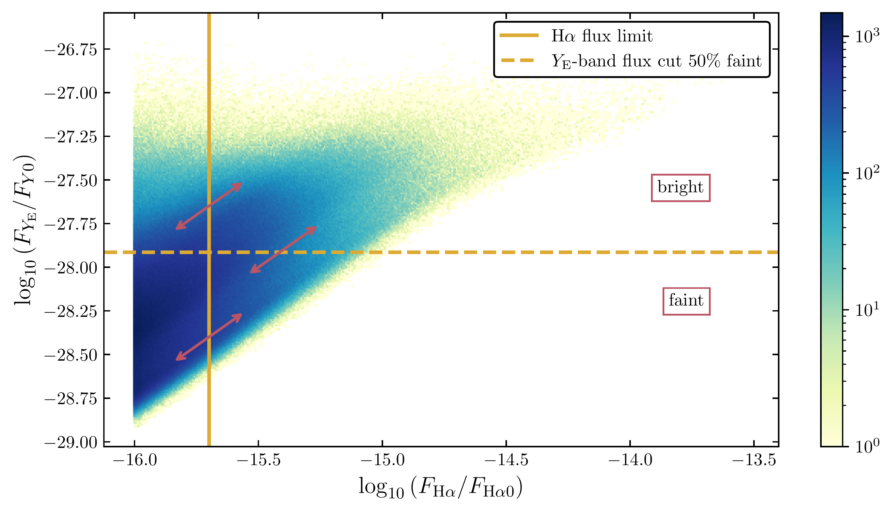
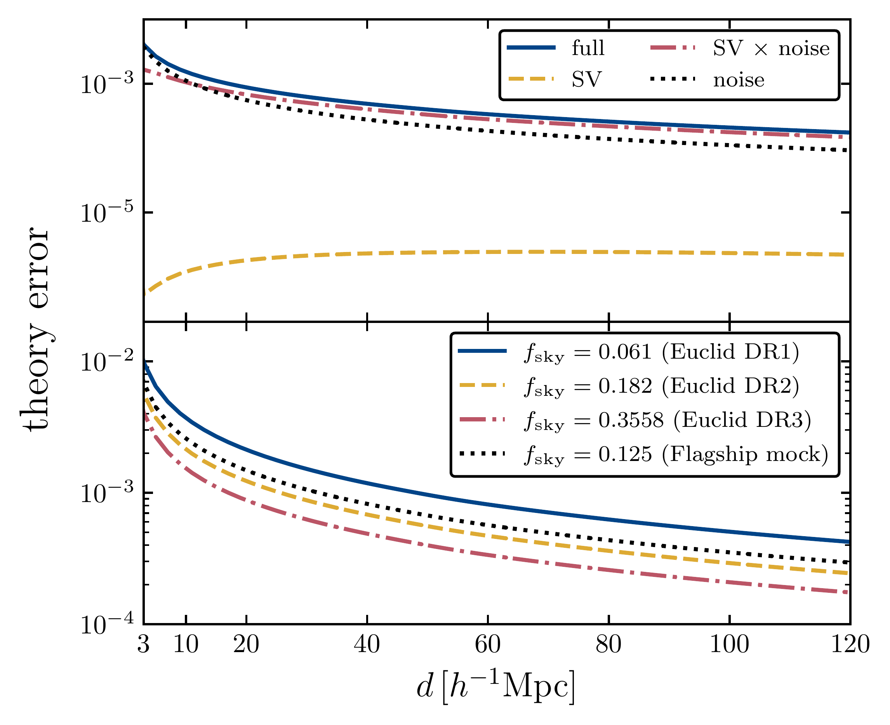
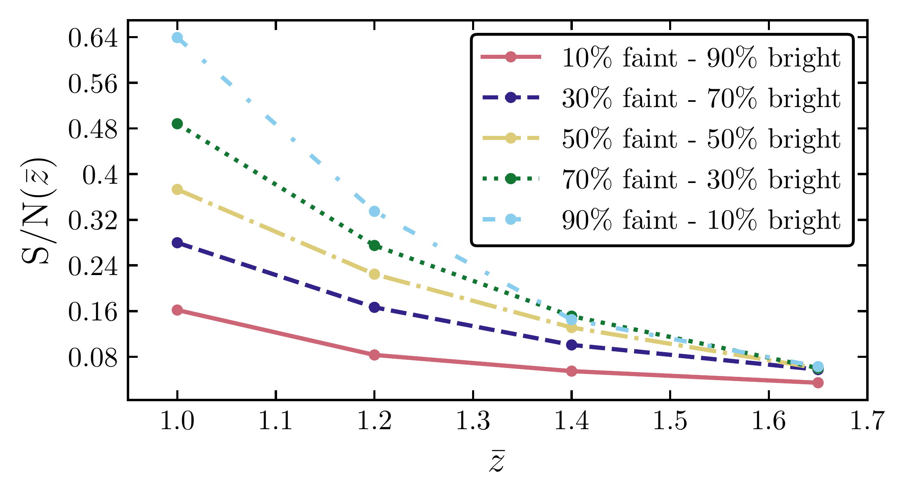

$\newcommand{\ensuremath}{}$
$\newcommand{\xspace}{}$
$\newcommand{\object}[1]{\texttt{#1}}$
$\newcommand{\farcs}{{.}''}$
$\newcommand{\farcm}{{.}'}$
$\newcommand{\arcsec}{''}$
$\newcommand{\arcmin}{'}$
$\newcommand{\ion}[2]{#1#2}$
$\newcommand{\textsc}[1]{\textrm{#1}}$
$\newcommand{\hl}[1]{\textrm{#1}}$
$\newcommand{\footnote}[1]{}$
$\newcommand{\lcdm}{\LambdaCDM}$
$\newcommand{\wcdm}{\wzero\waCDM}$
$\newcommand{\wzero}{w_0}$
$\newcommand{\wa}{w_a}$
$\newcommand{\bn}{{{\bm n}}}$
$\newcommand{\bV}{{\bm V}}$
$\newcommand{\De}{\Delta}$
$\newcommand{\HH}{\mathcal{H}}$
$\newcommand{\al}{\alpha}$
$\newcommand{\de}{\mathrm{d}}$
$\newcommand{\bal}{\boldsymbol{\al}}$
$\newcommand{\bnabla}{\boldsymbol{\nabla}}$
$\newcommand{\ka}{\kappa}$
$\newcommand{\Om}{\Omega}$
$\newcommand{\ds}{{\slash\hspace{-5pt}\partial}}$
$\newcommand{\fnl}{f_{\rm NL}}$
$\newcommand{\GCsp}{\mathrm{GC}_{\rm sp}}$
$\newcommand{\GCph}{\mathrm{GC}_{\rm ph}}$
$\newcommand{\laplaciansphere}{\Delta_{\Omega}}$
$\newcommand{\ns}{n_{\text{s}}}$
$\newcommand{\barnS}{\bar{n}_\text{S}}$
$\newcommand{\rsource}{r_\text{s}}$
$\newcommand{\luminositysource}{L_\text{S}}$
$\newcommand{\fisher}{\tens{F}}$
$\newcommand{\covariance}{\tens{C}}$
$\newcommand{\iu}{{i\mkern1mu}}$
$\newcommand{\std}{\mathrm{std}}$
$\newcommand{\magn}{\ensuremath{\text{magn}}}$
$\newcommand{\dd}{\partial}$
$\newcommand$
$\newcommand{\minus}{\ensuremath{-}}$
$\newcommand{\zmean}{\bar{z}}$
$\newcommand{\MyBlue}{\color[rgb]{0.0, 0.53, 0.74}}$
$\newcommand{\Sangria}{\color[rgb]{0.57, 0.0, 0.04}}$
$\newcommand{\jat}[1]{{\color[rgb]{0,0.6,0}#1}}$
$\newcommand{\jar}[1]{{\color[rgb]{0,0.6,0}{\tt[Julian: #1]}}}$
$\newcommand{\sebt}[1]{{\color[rgb]{1.0,0.3,0.5}#1}}$
$\newcommand{\sebr}[1]{{\color[rgb]{1.0,0.3,0.5}{\tt[Sebastian: #1]}}}$
$\newcommand{\sst}[1]{{\color[rgb]{1.0,0.5,0}#1}}$
$\newcommand{\cam}[1]{\textcolor{red}{{#1}}}$
$\newcommand{\camC}[1]{\textcolor{red}{[{\tt CB: #1}]}}$
$\newcommand{\itt}[1]{\textcolor{purple}{{#1}}}$
$\newcommand{\itc}[1]{\textcolor{purple}{[{\tt IT: #1}]}}$
$\newcommand{\law}[1]{\textcolor{teal}{{#1}}}$
$\newcommand{\lawc}[1]{\textcolor{teal}{[{\tt LD: #1}]}}$
$\newcommand{\orcid}[1]$
$\newcommand{\bea}{\begin{eqnarray}}$
$\newcommand{\eea}{\end{eqnarray}}$
$\newcommand{\bn}{{{\bm n}}}$
$\newcommand{\bV}{{\bm V}}$
$\newcommand{\De}{\Delta}$
$\newcommand{\HH}{\mathcal{H}}$
$\newcommand{\al}{\alpha}$
$\newcommand{\de}{\mathrm{d}}$
$\newcommand{\bal}{\boldsymbol{\al}}$
$\newcommand{\bnabla}{\boldsymbol{\nabla}}$
$\newcommand{\ga}{\gamma}$
$\newcommand{\ka}{\kappa}$
$\newcommand{\la}{\lambda}$
$\newcommand{\Om}{\Omega}$
$\newcommand{\ds}{{\slash\hspace{-5pt}\partial}}$
$\newcommand{\fnl}{f_{\rm NL}}$
$\newcommand{\GCsp}{\mathrm{GC}_{\rm sp}}$
$\newcommand{\GCph}{\mathrm{GC}_{\rm ph}}$
$\newcommand{\laplaciansphere}{\Delta_{\Omega}}$
$\newcommand{\ns}{n_{\text{s}}}$
$\newcommand{\barnS}{\bar{n}_\text{S}}$
$\newcommand{\rsource}{r_\text{s}}$
$\newcommand{\luminositysource}{L_\text{S}}$
$\newcommand{\fisher}{\tens{F}}$
$\newcommand{\covariance}{\tens{C}}$
$\newcommand{\iu}{{i\mkern1mu}}$
$\newcommand{\std}{\mathrm{std}}$
$\newcommand{\magn}{\ensuremath{\text{magn}}}$
$\newcommand{\dd}{\partial}$
$\newcommand\snr{\ensuremath{\text{S} / \text{N}}}$
$\newcommand{\minus}{\ensuremath{-}}$
$\NewDocumentCommand{\evalat}{sO{\big}mm}{$
$  \IfBooleanTF{#1}{\mleft. #3 \mright|_{#4}}{#3#2|_{#4}}$
$}$
$\newcommand{\zmean}{\bar{z}}$
$\newcommand{\MyBlue}{\color[rgb]{0.0, 0.53, 0.74}}$
$\newcommand{\Sangria}{\color[rgb]{0.57, 0.0, 0.04}}$
$\newcommand\fraC{#1}{{\Sangria[\tt FL: #1]}}$
$\newcommand\fra{#1}{{\Sangria #1}}$
$\newcommand\fraRem{#1}{{\Sangria \sout{#1}}}$
$\newcommand{\jat}[1]{{\color[rgb]{0,0.6,0}#1}}$
$\newcommand{\jar}[1]{{\color[rgb]{0,0.6,0}{\tt[Julian: #1]}}}$
$\newcommand{\sebt}[1]{{\color[rgb]{1.0,0.3,0.5}#1}}$
$\newcommand{\sebr}[1]{{\color[rgb]{1.0,0.3,0.5}{\tt[Sebastian: #1]}}}$
$\newcommand{\sst}[1]{{\color[rgb]{1.0,0.5,0}#1}}$
$\newcommand{\cam}[1]{\textcolor{red}{{#1}}}$
$\newcommand{\camC}[1]{\textcolor{red}{[{\tt CB: #1}]}}$
$\newcommand{\itt}[1]{\textcolor{purple}{{#1}}}$
$\newcommand{\itc}[1]{\textcolor{purple}{[{\tt IT: #1}]}}$
$\newcommand{\law}[1]{\textcolor{teal}{{#1}}}$
$\newcommand{\lawc}[1]{\textcolor{teal}{[{\tt LD: #1}]}}$
$\begin{document}$
$\title{\Euclid: Relativistic effects in the dipole of the 2-point correlation function\thanks{This paper is published on behalf of the Euclid Consortium.}}$
$\newcommand{\orcid}[1] $
$\author{F.~Lepori\thanks{\email{francesca.lepori2@uzh.ch}}\inst{\ref{aff1}}$
$\and S.~Schulz\orcid{0000-0002-8235-9986}\inst{\ref{aff1}}$
$\and I.~Tutusaus\orcid{0000-0002-3199-0399}\inst{\ref{aff2}}$
$\and M.-A.~Breton\inst{\ref{aff3},\ref{aff4},\ref{aff5}}$
$\and S.~Saga\orcid{0000-0002-7387-7570}\inst{\ref{aff6},\ref{aff7}}$
$\and C.~Viglione\inst{\ref{aff8},\ref{aff3}}$
$\and J.~Adamek\orcid{0000-0002-0723-6740}\inst{\ref{aff1}}$
$\and C.~Bonvin\orcid{0000-0002-5318-4064}\inst{\ref{aff9}}$
$\and L.~Dam\orcid{0000-0003-3163-9571}\inst{\ref{aff9}}$
$\and P.~Fosalba\orcid{0000-0002-1510-5214}\inst{\ref{aff8},\ref{aff3}}$
$\and L.~Amendola\orcid{0000-0002-0835-233X}\inst{\ref{aff10}}$
$\and S.~Andreon\orcid{0000-0002-2041-8784}\inst{\ref{aff11}}$
$\and C.~Baccigalupi\orcid{0000-0002-8211-1630}\inst{\ref{aff12},\ref{aff13},\ref{aff14},\ref{aff15}}$
$\and M.~Baldi\orcid{0000-0003-4145-1943}\inst{\ref{aff16},\ref{aff17},\ref{aff18}}$
$\and S.~Bardelli\orcid{0000-0002-8900-0298}\inst{\ref{aff17}}$
$\and D.~Bonino\orcid{0000-0002-3336-9977}\inst{\ref{aff19}}$
$\and E.~Branchini\orcid{0000-0002-0808-6908}\inst{\ref{aff20},\ref{aff21},\ref{aff11}}$
$\and M.~Brescia\orcid{0000-0001-9506-5680}\inst{\ref{aff22},\ref{aff23},\ref{aff24}}$
$\and J.~Brinchmann\orcid{0000-0003-4359-8797}\inst{\ref{aff25},\ref{aff26}}$
$\and A.~Caillat\inst{\ref{aff27}}$
$\and S.~Camera\orcid{0000-0003-3399-3574}\inst{\ref{aff28},\ref{aff29},\ref{aff19}}$
$\and V.~Capobianco\orcid{0000-0002-3309-7692}\inst{\ref{aff19}}$
$\and C.~Carbone\orcid{0000-0003-0125-3563}\inst{\ref{aff30}}$
$\and J.~Carretero\orcid{0000-0002-3130-0204}\inst{\ref{aff31},\ref{aff32}}$
$\and S.~Casas\orcid{0000-0002-4751-5138}\inst{\ref{aff33},\ref{aff34}}$
$\and M.~Castellano\orcid{0000-0001-9875-8263}\inst{\ref{aff35}}$
$\and G.~Castignani\orcid{0000-0001-6831-0687}\inst{\ref{aff17}}$
$\and S.~Cavuoti\orcid{0000-0002-3787-4196}\inst{\ref{aff23},\ref{aff24}}$
$\and A.~Cimatti\inst{\ref{aff36}}$
$\and C.~Colodro-Conde\inst{\ref{aff37}}$
$\and G.~Congedo\orcid{0000-0003-2508-0046}\inst{\ref{aff38}}$
$\and L.~Conversi\orcid{0000-0002-6710-8476}\inst{\ref{aff39},\ref{aff40}}$
$\and Y.~Copin\orcid{0000-0002-5317-7518}\inst{\ref{aff41}}$
$\and F.~Courbin\orcid{0000-0003-0758-6510}\inst{\ref{aff42},\ref{aff43}}$
$\and H.~M.~Courtois\orcid{0000-0003-0509-1776}\inst{\ref{aff44}}$
$\and H.~Degaudenzi\orcid{0000-0002-5887-6799}\inst{\ref{aff45}}$
$\and G.~De~Lucia\orcid{0000-0002-6220-9104}\inst{\ref{aff13}}$
$\and F.~Dubath\orcid{0000-0002-6533-2810}\inst{\ref{aff45}}$
$\and C.~A.~J.~Duncan\orcid{0009-0003-3573-0791}\inst{\ref{aff46}}$
$\and X.~Dupac\inst{\ref{aff40}}$
$\and S.~Dusini\orcid{0000-0002-1128-0664}\inst{\ref{aff47}}$
$\and M.~Farina\orcid{0000-0002-3089-7846}\inst{\ref{aff48}}$
$\and S.~Farrens\orcid{0000-0002-9594-9387}\inst{\ref{aff49}}$
$\and S.~Ferriol\inst{\ref{aff41}}$
$\and M.~Frailis\orcid{0000-0002-7400-2135}\inst{\ref{aff13}}$
$\and E.~Franceschi\orcid{0000-0002-0585-6591}\inst{\ref{aff17}}$
$\and S.~Galeotta\orcid{0000-0002-3748-5115}\inst{\ref{aff13}}$
$\and B.~Gillis\orcid{0000-0002-4478-1270}\inst{\ref{aff38}}$
$\and C.~Giocoli\orcid{0000-0002-9590-7961}\inst{\ref{aff17},\ref{aff18}}$
$\and A.~Grazian\orcid{0000-0002-5688-0663}\inst{\ref{aff50}}$
$\and F.~Grupp\inst{\ref{aff51},\ref{aff52}}$
$\and S.~V.~H.~Haugan\orcid{0000-0001-9648-7260}\inst{\ref{aff53}}$
$\and W.~Holmes\inst{\ref{aff54}}$
$\and F.~Hormuth\inst{\ref{aff55}}$
$\and A.~Hornstrup\orcid{0000-0002-3363-0936}\inst{\ref{aff56},\ref{aff57}}$
$\and S.~Ili\'c\orcid{0000-0003-4285-9086}\inst{\ref{aff58},\ref{aff2}}$
$\and K.~Jahnke\orcid{0000-0003-3804-2137}\inst{\ref{aff59}}$
$\and M.~Jhabvala\inst{\ref{aff60}}$
$\and E.~Keihänen\orcid{0000-0003-1804-7715}\inst{\ref{aff61}}$
$\and A.~Kiessling\orcid{0000-0002-2590-1273}\inst{\ref{aff54}}$
$\and M.~Kilbinger\orcid{0000-0001-9513-7138}\inst{\ref{aff49}}$
$\and B.~Kubik\orcid{0009-0006-5823-4880}\inst{\ref{aff41}}$
$\and M.~Kunz\orcid{0000-0002-3052-7394}\inst{\ref{aff9}}$
$\and H.~Kurki-Suonio\orcid{0000-0002-4618-3063}\inst{\ref{aff62},\ref{aff63}}$
$\and S.~Ligori\orcid{0000-0003-4172-4606}\inst{\ref{aff19}}$
$\and P.~B.~Lilje\orcid{0000-0003-4324-7794}\inst{\ref{aff53}}$
$\and V.~Lindholm\orcid{0000-0003-2317-5471}\inst{\ref{aff62},\ref{aff63}}$
$\and I.~Lloro\orcid{0000-0001-5966-1434}\inst{\ref{aff64}}$
$\and E.~Maiorano\orcid{0000-0003-2593-4355}\inst{\ref{aff17}}$
$\and O.~Mansutti\orcid{0000-0001-5758-4658}\inst{\ref{aff13}}$
$\and O.~Marggraf\orcid{0000-0001-7242-3852}\inst{\ref{aff65}}$
$\and K.~Markovic\orcid{0000-0001-6764-073X}\inst{\ref{aff54}}$
$\and M.~Martinelli\orcid{0000-0002-6943-7732}\inst{\ref{aff35},\ref{aff66}}$
$\and N.~Martinet\orcid{0000-0003-2786-7790}\inst{\ref{aff27}}$
$\and F.~Marulli\orcid{0000-0002-8850-0303}\inst{\ref{aff67},\ref{aff17},\ref{aff18}}$
$\and R.~Massey\orcid{0000-0002-6085-3780}\inst{\ref{aff68}}$
$\and E.~Medinaceli\orcid{0000-0002-4040-7783}\inst{\ref{aff17}}$
$\and M.~Melchior\inst{\ref{aff69}}$
$\and Y.~Mellier\inst{\ref{aff70},\ref{aff71}}$
$\and M.~Meneghetti\orcid{0000-0003-1225-7084}\inst{\ref{aff17},\ref{aff18}}$
$\and E.~Merlin\orcid{0000-0001-6870-8900}\inst{\ref{aff35}}$
$\and G.~Meylan\inst{\ref{aff72}}$
$\and M.~Moresco\orcid{0000-0002-7616-7136}\inst{\ref{aff67},\ref{aff17}}$
$\and L.~Moscardini\orcid{0000-0002-3473-6716}\inst{\ref{aff67},\ref{aff17},\ref{aff18}}$
$\and C.~Neissner\orcid{0000-0001-8524-4968}\inst{\ref{aff73},\ref{aff32}}$
$\and S.-M.~Niemi\inst{\ref{aff74}}$
$\and C.~Padilla\orcid{0000-0001-7951-0166}\inst{\ref{aff73}}$
$\and S.~Paltani\orcid{0000-0002-8108-9179}\inst{\ref{aff45}}$
$\and F.~Pasian\orcid{0000-0002-4869-3227}\inst{\ref{aff13}}$
$\and K.~Pedersen\inst{\ref{aff75}}$
$\and V.~Pettorino\inst{\ref{aff74}}$
$\and S.~Pires\orcid{0000-0002-0249-2104}\inst{\ref{aff49}}$
$\and G.~Polenta\orcid{0000-0003-4067-9196}\inst{\ref{aff76}}$
$\and M.~Poncet\inst{\ref{aff77}}$
$\and L.~A.~Popa\inst{\ref{aff78}}$
$\and F.~Raison\orcid{0000-0002-7819-6918}\inst{\ref{aff51}}$
$\and A.~Renzi\orcid{0000-0001-9856-1970}\inst{\ref{aff79},\ref{aff47}}$
$\and J.~Rhodes\orcid{0000-0002-4485-8549}\inst{\ref{aff54}}$
$\and G.~Riccio\inst{\ref{aff23}}$
$\and E.~Romelli\orcid{0000-0003-3069-9222}\inst{\ref{aff13}}$
$\and M.~Roncarelli\orcid{0000-0001-9587-7822}\inst{\ref{aff17}}$
$\and C.~Rosset\orcid{0000-0003-0286-2192}\inst{\ref{aff80}}$
$\and E.~Rossetti\orcid{0000-0003-0238-4047}\inst{\ref{aff16}}$
$\and R.~Saglia\orcid{0000-0003-0378-7032}\inst{\ref{aff52},\ref{aff51}}$
$\and Z.~Sakr\orcid{0000-0002-4823-3757}\inst{\ref{aff10},\ref{aff2},\ref{aff81}}$
$\and A.~G.~Sánchez\orcid{0000-0003-1198-831X}\inst{\ref{aff51}}$
$\and D.~Sapone\orcid{0000-0001-7089-4503}\inst{\ref{aff82}}$
$\and B.~Sartoris\orcid{0000-0003-1337-5269}\inst{\ref{aff52},\ref{aff13}}$
$\and M.~Schirmer\orcid{0000-0003-2568-9994}\inst{\ref{aff59}}$
$\and P.~Schneider\orcid{0000-0001-8561-2679}\inst{\ref{aff65}}$
$\and T.~Schrabback\orcid{0000-0002-6987-7834}\inst{\ref{aff83}}$
$\and A.~Secroun\orcid{0000-0003-0505-3710}\inst{\ref{aff84}}$
$\and G.~Seidel\orcid{0000-0003-2907-353X}\inst{\ref{aff59}}$
$\and S.~Serrano\orcid{0000-0002-0211-2861}\inst{\ref{aff8},\ref{aff85},\ref{aff3}}$
$\and C.~Sirignano\orcid{0000-0002-0995-7146}\inst{\ref{aff79},\ref{aff47}}$
$\and G.~Sirri\orcid{0000-0003-2626-2853}\inst{\ref{aff18}}$
$\and L.~Stanco\orcid{0000-0002-9706-5104}\inst{\ref{aff47}}$
$\and J.~Steinwagner\orcid{0000-0001-7443-1047}\inst{\ref{aff51}}$
$\and P.~Tallada-Crespí\orcid{0000-0002-1336-8328}\inst{\ref{aff31},\ref{aff32}}$
$\and I.~Tereno\inst{\ref{aff86},\ref{aff87}}$
$\and R.~Toledo-Moreo\orcid{0000-0002-2997-4859}\inst{\ref{aff88}}$
$\and F.~Torranewcommandlot\orcid{0000-0003-1160-1517}\inst{\ref{aff32},\ref{aff31}}$
$\and L.~Valenziano\orcid{0000-0002-1170-0104}\inst{\ref{aff17},\ref{aff89}}$
$\and T.~Vassallo\orcid{0000-0001-6512-6358}\inst{\ref{aff52},\ref{aff13}}$
$\and Y.~Wang\orcid{0000-0002-4749-2984}\inst{\ref{aff90}}$
$\and J.~Weller\orcid{0000-0002-8282-2010}\inst{\ref{aff52},\ref{aff51}}$
$\and E.~Zucca\orcid{0000-0002-5845-8132}\inst{\ref{aff17}}$
$\and C.~Burigana\orcid{0000-0002-3005-5796}\inst{\ref{aff91},\ref{aff89}}$
$\and G.~Fabbian\orcid{0000-0002-3255-4695}\inst{\ref{aff92},\ref{aff93}}$
$\and F.~Finelli\orcid{0000-0002-6694-3269}\inst{\ref{aff17},\ref{aff89}}$
$\and A.~Pezzotta\orcid{0000-0003-0726-2268}\inst{\ref{aff51}}$
$\and V.~Scottez\inst{\ref{aff70},\ref{aff94}}$
$\and M.~Viel\orcid{0000-0002-2642-5707}\inst{\ref{aff12},\ref{aff13},\ref{aff15},\ref{aff14},\ref{aff95}}}$
$\institute{Department of Astrophysics, University of Zurich, Winterthurerstrasse 190, 8057 Zurich, Switzerland\label{aff1}$
$\and$
$Institut de Recherche en Astrophysique et Planétologie (IRAP), Université de Toulouse, CNRS, UPS, CNES, 14 Av. Edouard Belin, 31400 Toulouse, France\label{aff2}$
$\and$
$Institute of Space Sciences (ICE, CSIC), Campus UAB, Carrer de Can Magrans, s/n, 08193 Barcelona, Spain\label{aff3}$
$\and$
$Institut de Ciencies de l'Espai (IEEC-CSIC), Campus UAB, Carrer de Can Magrans, s/n Cerdanyola del Vallés, 08193 Barcelona, Spain\label{aff4}$
$\and$
$Laboratoire Univers et Théorie, Observatoire de Paris, Université PSL, Université Paris Cité, CNRS, 92190 Meudon, France\label{aff5}$
$\and$
$Kobayashi-Maskawa Institute for the Origin of Particles and the Universe, Nagoya University, Chikusa-ku, Nagoya, 464-8602, Japan\label{aff6}$
$\and$
$Institute for Advanced Research, Nagoya University, Chikusa-ku, Nagoya, 464-8601, Japan\label{aff7}$
$\and$
$Institut d'Estudis Espacials de Catalunya (IEEC),  Edifici RDIT, Campus UPC, 08860 Castellnewcommandels, Barcelona, Spain\label{aff8}$
$\and$
$Université de Genève, Département de Physique Théorique and Centre for Astroparticle Physics, 24 quai Ernest-Ansermet, CH-1211 Genève 4, Switzerland\label{aff9}$
$\and$
$Institut für Theoretische Physik, University of Heidelberg, Philosophenweg 16, 69120 Heidelberg, Germany\label{aff10}$
$\and$
$INAF-Osservatorio Astronomico di Brera, Via Brera 28, 20122 Milano, Italy\label{aff11}$
$\and$
$IFPU, Institute for Fundamental Physics of the Universe, via Beirut 2, 34151 Trieste, Italy\label{aff12}$
$\and$
$INAF-Osservatorio Astronomico di Trieste, Via G. B. Tiepolo 11, 34143 Trieste, Italy\label{aff13}$
$\and$
$INFN, Sezione di Trieste, Via Valerio 2, 34127 Trieste TS, Italy\label{aff14}$
$\and$
$SISSA, International School for Advanced Studies, Via Bonomea 265, 34136 Trieste TS, Italy\label{aff15}$
$\and$
$Dipartimento di Fisica e Astronomia, Università di Bologna, Via Gobetti 93/2, 40129 Bologna, Italy\label{aff16}$
$\and$
$INAF-Osservatorio di Astrofisica e Scienza dello Spazio di Bologna, Via Piero Gobetti 93/3, 40129 Bologna, Italy\label{aff17}$
$\and$
$INFN-Sezione di Bologna, Viale Berti Pichat 6/2, 40127 Bologna, Italy\label{aff18}$
$\and$
$INAF-Osservatorio Astrofisico di Torino, Via Osservatorio 20, 10025 Pino Torinese (TO), Italy\label{aff19}$
$\and$
$Dipartimento di Fisica, Università di Genova, Via Dodecaneso 33, 16146, Genova, Italy\label{aff20}$
$\and$
$INFN-Sezione di Genova, Via Dodecaneso 33, 16146, Genova, Italy\label{aff21}$
$\and$
$Department of Physics "E. Pancini", University Federico II, Via Cinthia 6, 80126, Napoli, Italy\label{aff22}$
$\and$
$INAF-Osservatorio Astronomico di Capodimonte, Via Moiariello 16, 80131 Napoli, Italy\label{aff23}$
$\and$
$INFN section of Naples, Via Cinthia 6, 80126, Napoli, Italy\label{aff24}$
$\and$
$Instituto de Astrofísica e Ci\^encias do Espaço, Universidade do Porto, CAUP, Rua das Estrelas, PT4150-762 Porto, Portugal\label{aff25}$
$\and$
$Faculdade de Ci\^encias da Universidade do Porto, Rua do Campo de Alegre, 4150-007 Porto, Portugal\label{aff26}$
$\and$
$Aix-Marseille Université, CNRS, CNES, LAM, Marseille, France\label{aff27}$
$\and$
$Dipartimento di Fisica, Università degli Studi di Torino, Via P. Giuria 1, 10125 Torino, Italy\label{aff28}$
$\and$
$INFN-Sezione di Torino, Via P. Giuria 1, 10125 Torino, Italy\label{aff29}$
$\and$
$INAF-IASF Milano, Via Alfonso Corti 12, 20133 Milano, Italy\label{aff30}$
$\and$
$Centro de Investigaciones Energéticas, Medioambientales y Tecnológicas (CIEMAT), Avenida Complutense 40, 28040 Madrid, Spain\label{aff31}$
$\and$
$Port d'Informació Científica, Campus UAB, C. Albareda s/n, 08193 Bellaterra (Barcelona), Spain\label{aff32}$
$\and$
$Institute for Theoretical Particle Physics and Cosmology (TTK), RWTH Aachen University, 52056 Aachen, Germany\label{aff33}$
$\and$
$Institute of Cosmology and Gravitation, University of Portsmouth, Portsmouth PO1 3FX, UK\label{aff34}$
$\and$
$INAF-Osservatorio Astronomico di Roma, Via Frascati 33, 00078 Monteporzio Catone, Italy\label{aff35}$
$\and$
$Dipartimento di Fisica e Astronomia "Augusto Righi" - Alma Mater Studiorum Università di Bologna, Viale Berti Pichat 6/2, 40127 Bologna, Italy\label{aff36}$
$\and$
$Instituto de Astrofísica de Canarias, Calle Vía Láctea s/n, 38204, San Cristóbal de La Laguna, Tenerife, Spain\label{aff37}$
$\and$
$Institute for Astronomy, University of Edinburgh, Royal Observatory, Blackford Hill, Edinburgh EH9 3HJ, UK\label{aff38}$
$\and$
$European Space Agency/ESRIN, Largo Galileo Galilei 1, 00044 Frascati, Roma, Italy\label{aff39}$
$\and$
$ESAC/ESA, Camino Bajo del Castillo, s/n., Urb. Villafranca del Castillo, 28692 Villanueva de la Cañada, Madrid, Spain\label{aff40}$
$\and$
$Université Claude Bernard Lyon 1, CNRS/IN2P3, IP2I Lyon, UMR 5822, Villeurbanne, F-69100, France\label{aff41}$
$\and$
$Institut de Ciències del Cosmos (ICCUB), Universitat de Barcelona (IEEC-UB), Martí i Franquès 1, 08028 Barcelona, Spain\label{aff42}$
$\and$
$Institució Catalana de Recerca i Estudis Avançats (ICREA), Passeig de Lluís Companys 23, 08010 Barcelona, Spain\label{aff43}$
$\and$
$UCB Lyon 1, CNRS/IN2P3, IUF, IP2I Lyon, 4 rue Enrico Fermi, 69622 Villeurbanne, France\label{aff44}$
$\and$
$Department of Astronomy, University of Geneva, ch. d'Ecogia 16, 1290 Versoix, Switzerland\label{aff45}$
$\and$
$Jodrell Bank Centre for Astrophysics, Department of Physics and Astronomy, University of Manchester, Oxford Road, Manchester M13 9PL, UK\label{aff46}$
$\and$
$INFN-Padova, Via Marzolo 8, 35131 Padova, Italy\label{aff47}$
$\and$
$INAF-Istituto di Astrofisica e Planetologia Spaziali, via del Fosso del Cavaliere, 100, 00100 Roma, Italy\label{aff48}$
$\and$
$Université Paris-Saclay, Université Paris Cité, CEA, CNRS, AIM, 91191, Gif-sur-Yvette, France\label{aff49}$
$\and$
$INAF-Osservatorio Astronomico di Padova, Via dell'Osservatorio 5, 35122 Padova, Italy\label{aff50}$
$\and$
$Max Planck Institute for Extraterrestrial Physics, Giessenbachstr. 1, 85748 Garching, Germany\label{aff51}$
$\and$
$Universitäts-Sternwarte München, Fakultät für Physik, Ludwig-Maximilians-Universität München, Scheinerstrasse 1, 81679 München, Germany\label{aff52}$
$\and$
$Institute of Theoretical Astrophysics, University of Oslo, P.O. Box 1029 Blindern, 0315 Oslo, Norway\label{aff53}$
$\and$
$Jet Propulsion Laboratory, California Institute of Technology, 4800 Oak Grove Drive, Pasadena, CA, 91109, USA\label{aff54}$
$\and$
$Felix Hormuth Engineering, Goethestr. 17, 69181 Leimen, Germany\label{aff55}$
$\and$
$Technical University of Denmark, Elektrovej 327, 2800 Kgs. Lyngby, Denmark\label{aff56}$
$\and$
$Cosmic Dawn Center (DAWN), Denmark\label{aff57}$
$\and$
$Université Paris-Saclay, CNRS/IN2P3, IJCLab, 91405 Orsay, France\label{aff58}$
$\and$
$Max-Planck-Institut für Astronomie, Königstuhl 17, 69117 Heidelberg, Germany\label{aff59}$
$\and$
$NASA Goddard Space Flight Center, Greenbelt, MD 20771, USA\label{aff60}$
$\and$
$Department of Physics and Helsinki Institute of Physics, Gustaf Hällströmin katu 2, 00014 University of Helsinki, Finland\label{aff61}$
$\and$
$Department of Physics, P.O. Box 64, 00014 University of Helsinki, Finland\label{aff62}$
$\and$
$Helsinki Institute of Physics, Gustaf H{ä}llstr{ö}min katu 2, University of Helsinki, Helsinki, Finland\label{aff63}$
$\and$
$NOVA optical infrared instrumentation group at ASTRON, Oude Hoogeveensedijk 4, 7991PD, Dwingeloo, The Netherlands\label{aff64}$
$\and$
$Universität Bonn, Argelander-Institut für Astronomie, Auf dem Hügel 71, 53121 Bonn, Germany\label{aff65}$
$\and$
$INFN-Sezione di Roma, Piazzale Aldo Moro, 2 - c/o Dipartimento di Fisica, Edificio G. Marconi, 00185 Roma, Italy\label{aff66}$
$\and$
$Dipartimento di Fisica e Astronomia "Augusto Righi" - Alma Mater Studiorum Università di Bologna, via Piero Gobetti 93/2, 40129 Bologna, Italy\label{aff67}$
$\and$
$Department of Physics, Institute for Computational Cosmology, Durham University, South Road, DH1 3LE, UK\label{aff68}$
$\and$
$University of Applied Sciences and Arts of Northwestern Switzerland, School of Engineering, 5210 Windisch, Switzerland\label{aff69}$
$\and$
$Institut d'Astrophysique de Paris, 98bis Boulevard Arago, 75014, Paris, France\label{aff70}$
$\and$
$Institut d'Astrophysique de Paris, UMR 7095, CNRS, and Sorbonne Université, 98 bis boulevard Arago, 75014 Paris, France\label{aff71}$
$\and$
$Institute of Physics, Laboratory of Astrophysics, Ecole Polytechnique Fédérale de Lausanne (EPFL), Observatoire de Sauverny, 1290 Versoix, Switzerland\label{aff72}$
$\and$
$Institut de Física d'Altes Energies (IFAE), The Barcelona Institute of Science and Technology, Campus UAB, 08193 Bellaterra (Barcelona), Spain\label{aff73}$
$\and$
$European Space Agency/ESTEC, Keplerlaan 1, 2201 AZ Noordwijk, The Netherlands\label{aff74}$
$\and$
$DARK, Niels Bohr Institute, University of Copenhagen, Jagtvej 155, 2200 Copenhagen, Denmark\label{aff75}$
$\and$
$Space Science Data Center, Italian Space Agency, via del Politecnico snc, 00133 Roma, Italy\label{aff76}$
$\and$
$Centre National d'Etudes Spatiales -- Centre spatial de Toulouse, 18 avenue Edouard Belin, 31401 Toulouse Cedex 9, France\label{aff77}$
$\and$
$Institute of Space Science, Str. Atomistilor, nr. 409 M\u{a}gurele, Ilfov, 077125, Romania\label{aff78}$
$\and$
$Dipartimento di Fisica e Astronomia "G. Galilei", Università di Padova, Via Marzolo 8, 35131 Padova, Italy\label{aff79}$
$\and$
$Université Paris Cité, CNRS, Astroparticule et Cosmologie, 75013 Paris, France\label{aff80}$
$\and$
$Université St Joseph; Faculty of Sciences, Beirut, Lebanon\label{aff81}$
$\and$
$Departamento de Física, FCFM, Universidad de Chile, Blanco Encalada 2008, Santiago, Chile\label{aff82}$
$\and$
$Universität Innsbruck, Institut für Astro- und Teilchenphysik, Technikerstr. 25/8, 6020 Innsbruck, Austria\label{aff83}$
$\and$
$Aix-Marseille Université, CNRS/IN2P3, CPPM, Marseille, France\label{aff84}$
$\and$
$Satlantis, University Science Park, Sede Bld 48940, Leioa-Bilbao, Spain\label{aff85}$
$\and$
$Departamento de Física, Faculdade de Ci\^encias, Universidade de Lisboa, Edifício C8, Campo Grande, PT1749-016 Lisboa, Portugal\label{aff86}$
$\and$
$Instituto de Astrofísica e Ci\^encias do Espaço, Faculdade de Ci\^encias, Universidade de Lisboa, Tapada da Ajuda, 1349-018 Lisboa, Portugal\label{aff87}$
$\and$
$Universidad Politécnica de Cartagena, Departamento de Electrónica y Tecnología de Computadoras,  Plaza del Hospital 1, 30202 Cartagena, Spain\label{aff88}$
$\and$
$INFN-Bologna, Via Irnerio 46, 40126 Bologna, Italy\label{aff89}$
$\and$
$Infrared Processing and Analysis Center, California Institute of Technology, Pasadena, CA 91125, USA\label{aff90}$
$\and$
$INAF, Istituto di Radioastronomia, Via Piero Gobetti 101, 40129 Bologna, Italy\label{aff91}$
$\and$
$Kavli Institute for Cosmology Cambridge, Madingley Road, Cambridge, CB3 0HA, UK\label{aff92}$
$\and$
$Institute of Astronomy, University of Cambridge, Madingley Road, Cambridge CB3 0HA, UK\label{aff93}$
$\and$
$Junia, EPA department, 41 Bd Vauban, 59800 Lille, France\label{aff94}$
$\and$
$ICSC - Centro Nazionale di Ricerca in High Performance Computing, Big Data e Quantum Computing, Via Magnanelli 2, Bologna, Italy\label{aff95}}$
$\abstract{$
$Gravitational redshift and Doppler effects give rise to an antisymmetric component of the galaxy correlation function when cross-correlating two galaxy populations or two different tracers. In this paper, we assess the detectability of these effects in the \Euclid spectroscopic galaxy survey. We model the impact of gravitational redshift on the observed redshift of galaxies in the Flagship mock catalogue using a Navarro--Frenk--White profile for the host haloes. We isolate these relativistic effects, largely subdominant in the standard analysis, by splitting the galaxy catalogue into two populations of faint and bright objects and estimating the dipole of their cross-correlation in four redshift bins.$
$In the simulated catalogue, we detect the dipole signal on scales below30 h^{-1}{\rm Mpc}, with detection significances of 4 \sigma and 3 \sigma in the two lowest redshift bins, respectively. At higher redshifts, the detection significance drops below 2 \sigma. Overall, we estimate the total detection significance in the \Euclid spectroscopic sample to be approximately 6 \sigma. We find that on small scales, the major contribution to the signal comes from the nonlinear gravitational potential. Our study on the Flagship mock catalogue shows that this observable can be detected in Euclid Data Release 2 and beyond.$
$    }$
$    \keywords{Cosmology: large-scale structure of Universe -- Gravitation -- Cosmology: theory}$
$   \titlerunning{\Euclid: Relativistic effects in the dipole of the 2-point correlation function}$
$   \authorrunning{F. Lepori et al.}$
$   \maketitle$
$\n\end{document}}\end{eqnarray}}$
$\newcommand{\eea}{\end{eqnarray}}$
$\newcommand{\ga}{\gamma}$
$\newcommand{\la}{\lambda}$
$\newcommand\fraC{#1}$
$\newcommand\fra{#1}$
$\newcommand\fraRem{#1}$

# $\Euclid$: Relativistic effects in the dipole of the 2-point correlation function$\thanks{This paper is published on behalf of the Euclid Consortium.}$

<mark>Appeared on: 2024-10-10</mark> -  _21 pages, 11 figures, 1 appendix; submitted on behalf of the Euclid Collaboration_

F. Lepori, et al. -- incl., <mark>K. Jahnke</mark>

**Abstract:** Gravitational redshift and Doppler effects give rise to an antisymmetric component of the galaxy correlation function when cross-correlating two galaxy populations or two different tracers. In this paper, we assess the detectability of these effects in the $\Euclid$ spectroscopic galaxy survey. We model the impact of gravitational redshift on the observed redshift of galaxies in the Flagship mock catalogue using a Navarro--Frenk--White profile for the host haloes. We isolate these relativistic effects, largely subdominant in the standard analysis, by splitting the galaxy catalogue into two populations of faint and bright objects and estimating the dipole of their cross-correlation in four redshift bins.In the simulated catalogue, we detect the dipole signal on scales below $ 30 h^{-1}{\rm Mpc}$ , with detection significances of $4 \sigma$ and $3 \sigma$ in the two lowest redshift bins, respectively. At higher redshifts, the detection significance drops below $2 \sigma$ . Overall, we estimate the total detection significance in the $\Euclid$ spectroscopic sample to be approximately $6 \sigma$ . We find that on small scales, the major contribution to the signal comes from the nonlinear gravitational potential. Our study on the Flagship mock catalogue shows that this observable can be detected in Euclid Data Release 2 and beyond.

**Figure 6. -** Correlation between  $F_{\mathrm{H}$\al$pha}$ and $F_{Y}$ for the redshift bin centred at $\bar{z} = 1$ of the Flagship spectroscopic mock catalogue. A continuous line denotes the flux limit of the Euclid Wide Survey, while a dashed line highlights a \YE-band flux cut, splitting the sample in two equally-populated bright and faint populations. The reference fluxes are $F_{\mathrm{H}$\al$pha 0} = 1 {\rm erg} {\rm cm}^{-2} {\rm s}^{-1}$ and $F_{Y0} \equiv 1 {\rm erg} {\rm cm}^{-2} {\rm s}^{-1} {\rm Hz}^{-1}$. The colour bar highlights the density of objects (in arbitrary units).  (*fig:magn-flux*)

**Figure 2. -** 
    Theory uncertainty, given by the square root of the diagonal elements of the theory covariance, estimated for the redshift bin $\bar{z} = 1$, with specifics from \cref{tab:spec}, split `$90\%$ faint, $10\%$ bright'. We have assumed a bin size of $\Delta d = 2 h^{-1} {\rm Mpc}$. The top panel shows the different contributions to the uncertainty,
    coming from the pure shot noise term (black dotted line), the purely sample variance term (yellow dashed line), and the cross-term (red dot-dashed line).
    The sum of all contributions is shown as solid blue line. The bottom panel shows the theory uncertainty,
    including all terms, for different sky coverages
    corresponding to the planned data releases of \Euclid and the Flagship mock used in this work.
     (*fig:theory-cov*)

**Figure 5. -** S/N of the dipole on linear scales ($\geq20 h^{-1} \mathrm{Mpc}$) for a range of population splits. Here the model prediction is given by linear theory. (*fig:sn:linear*)

