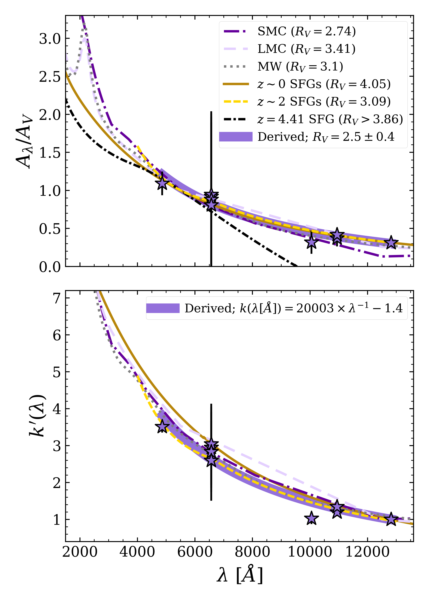
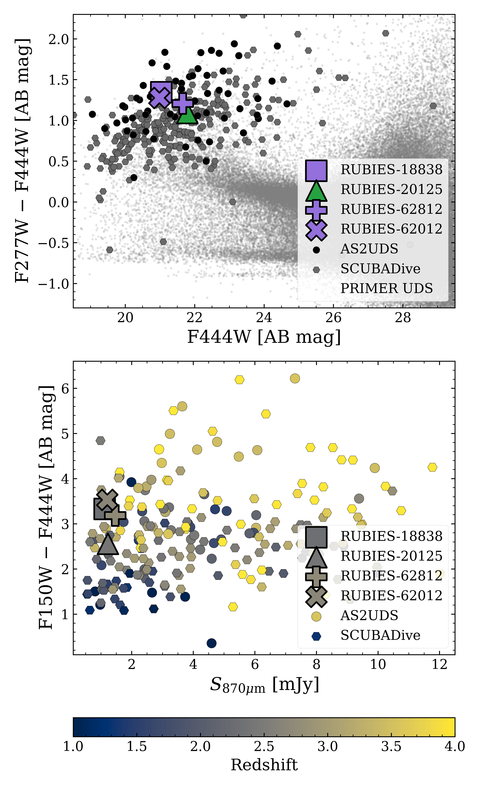

$\newcommand{\ensuremath}{}$
$\newcommand{\xspace}{}$
$\newcommand{\object}[1]{\texttt{#1}}$
$\newcommand{\farcs}{{.}''}$
$\newcommand{\farcm}{{.}'}$
$\newcommand{\arcsec}{''}$
$\newcommand{\arcmin}{'}$
$\newcommand{\ion}[2]{#1#2}$
$\newcommand{\textsc}[1]{\textrm{#1}}$
$\newcommand{\hl}[1]{\textrm{#1}}$
$\newcommand{\footnote}[1]{}$
$\newcommand$
$\newcommand$
$\newcommand$
$\newcommand{\Lya}{Lyman-\alpha}$
$\newcommand{\Hb}{H\beta}$
$\newcommand{\Pab}{Pa\beta}$
$\newcommand{\Pag}{Pa\gamma}$
$\newcommand{\Pad}{Pa\delta}$
$\newcommand{\Pae}{Pa\epsilon}$
$\newcommand{\Feii}{[Fe\textsc{ii}]\lambda1.257\um}$
$\newcommand{\Ha}{H\alpha}$
$\newcommand{\zs}{z_{\rm spec}}$
$\newcommand{\zp}{z_{\rm phot}}$
$\newcommand{\Hei}{He\textsc{i}}$
$\newcommand{\Oii}{[O\textsc{ii}]}$
$\newcommand{\Hii}{H\textsc{ii}}$
$\newcommand{\Nii}{[N\textsc{ii}]}$
$\newcommand{\Siii}{[S\textsc{iii}]}$
$\newcommand{\Oiii}{[O\textsc{iii}]}$
$\newcommand{\Ciii}{C\textsc{iii}]}$
$\newcommand{\Cii}{[C\textsc{ii}]}$
$\newcommand{\Muv}{M_{\text{UV}}}$
$\newcommand$
$\newcommand$
$\newcommand$

# RUBIES: JWST/NIRSpec resolves evolutionary phases of dusty star-forming galaxies at $z\sim2$

<mark>Appeared on: 2024-10-14</mark> -  _20 pages, 4 figures; submitted to ApJ_

O. R. Cooper, et al. -- incl., <mark>A. d. Graaff</mark>

**Abstract:** The dearth of high quality spectroscopy of dusty star-forming galaxies (DSFGs) --- the main drivers of the assembly of dust and stellar mass at the peak of activity in the Universe --- greatly hinders our ability to interpret their physical processes and evolutionary pathways. We present JWST/NIRSpec observations from RUBIES of four submillimeter-selected, ALMA-detected DSFGs at cosmic noon, $z\sim2.3-2.7$ . While photometry uniformly suggests vigorous ongoing star formation for the entire sample in line with canonical DSFGs, the spectra differ: one source has spectroscopic evidence of an evolved stellar population, indicating a recent transition to a post-starburst phase, while the remainder show strong spectroscopic signatures of ongoing starbursts. All four galaxies are infrared-luminous (log $_{10}$ $L_{\rm{IR}}$ / $\Lsun$ $>12.4$ ), massive (log $_{10} M_\star$ / $\Msun$ $>11$ ), and very dust-obscured ( $A_V\sim3-4$ ABmag). Leveraging detections of multiple Balmer and Paschen lines, we derive an optical attenuation curve consistent with Calzetti overall, yet an optical extinction ratio $R_V\sim2.5$ , potentially indicating smaller dust grains or differences in star-dust geometry. This case study provides some of the first detailed spectroscopic evidence that the DSFGs encompass a heterogeneous sample spanning a range of star formation properties and evolutionary stages, and illustrates the advantages of synergistic JWST and ALMA analysis of DSFGs.

**Figure 1. -** Dust attenuation curves derived for our sample compared to a few literature attenuation/extinction curves. Attenuation curve measurements and associated errors from line ratios measured for all detected Balmer/Paschen emission line pairs are shown as stars, and the best-fit function linear in $1/\lambda$ is shown in thick purple. Overplotted are the extinction curves for the MW \citep[gray;][]{1989cardelli}, SMC \citep[dark purple;][]{2003gordon}, and LMC \citep[lavender;][]{2003gordon}, as well as attenuation curves measured for star-forming galaxies (SFGs) nearby \citep[dark gold;][]{2000calzetti}, at $z\sim 2$\citep[yellow;][]{2020reddy}, and for a $z=4.41$ galaxy \citep[black;][]{2024sanders}. _Top:_ Absolute attenuation curve normalized to $A_V = 1$, for direct comparison of the relative shapes of the attenuation curves. _Bottom:_ Total attenuation $k^\prime(\lambda)$, to demonstrate the relative magnitudes of attenuation over the wavelength range. Line ratios used for fitting are all anchored to $\Pab$, therefore each attenuation curve here is normalized such that $k^\prime(\rm Pa\beta)=1$. Note that we do not show the $z=4.41$ curve here as it is not constrained out to our normalization wavelength. The legend shows the best fit functional form for $k(\lambda)$; this is the normalized functional form such that $k(28000\rm{Å}) = 0$, which differs in normalization constant only to the curve shown in the figure. (*fig:alaw*)

**Figure 3. -** JWST/NIRSpec 1D PRISM spectra and uncertainty for our sources (green/purple and light green/purple, respectively) and best-fit model from \texttt{msaexp}(black). We present the spectra in two different colors to emphasize the distinction in their star-formation properties, using green for the more evolved, post-starburst galaxy, and purple for the strongly starbursting galaxies. Measured spectroscopic redshifts and object names are listed for each source. Wavelengths of redshifted spectroscopic features are shown as dashed vertical lines, with detected lines or features (S/N$>3$) labeled in dark gray and non-detected lines labeled in light gray for reference. The JWST/NIRCam F444W cutout for each source is shown as an inset ($2"$ wide), with the position of the NIRSpec slit overplotted on each image. (*fig:spec*)

**Figure 2. -** Our DSFGs are bright and red, have typical NIRCam colors and moderately bright submillimeter flux densities, overall consistent with the larger DSFG sample. _Top:_ JWST/NIRCam color magnitude diagram comparing the F277W $-$ F444W colors and F444W magnitudes of the DSFGs reported in this work to the broader sample of known DSFGs in AS2UDS \citep[][]{2020dudz,2024gillman} within the PRIMER-UDS footprint (black points), and to the DSFGs in SCUBADive \citep[gray hexagons;][]{2024mckinney}, with the full PRIMER-UDS catalog in the background (small gray points). The three starbursting galaxies in our sample are noted in purple, while the post-starburst galaxy is shown in green. _Bottom:_ Color magnitude diagram with JWST/NIRCam F150W $-$ F444W color versus ALMA Band 7 flux density. Symbols are consistent as in the top subplot, but here colors denote the redshift; a spectroscopic redshift for the four RUBIES DSFGs, else the best-available redshifts from AS2UDS and SCUBADive. (*fig:cmd*)

