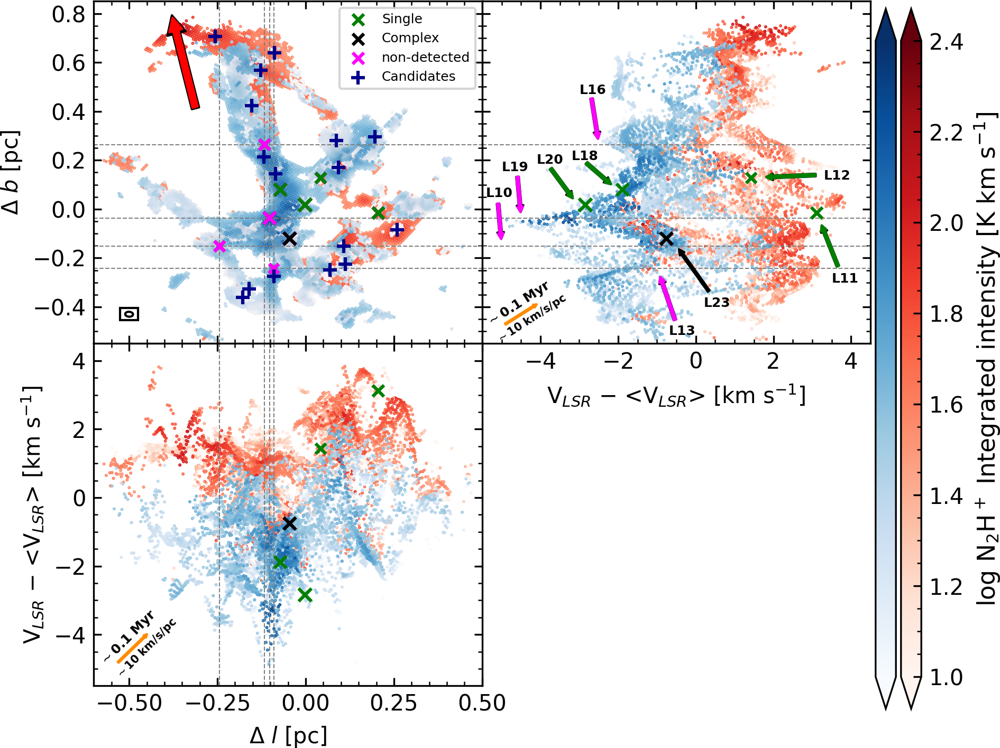
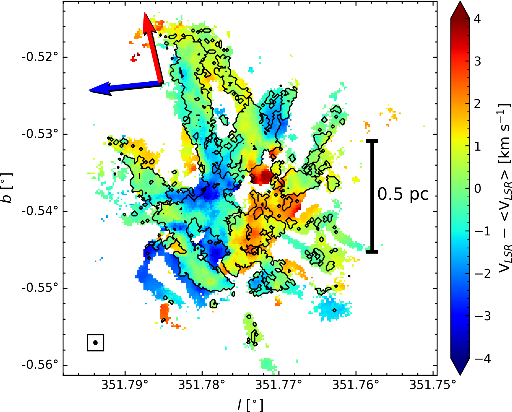
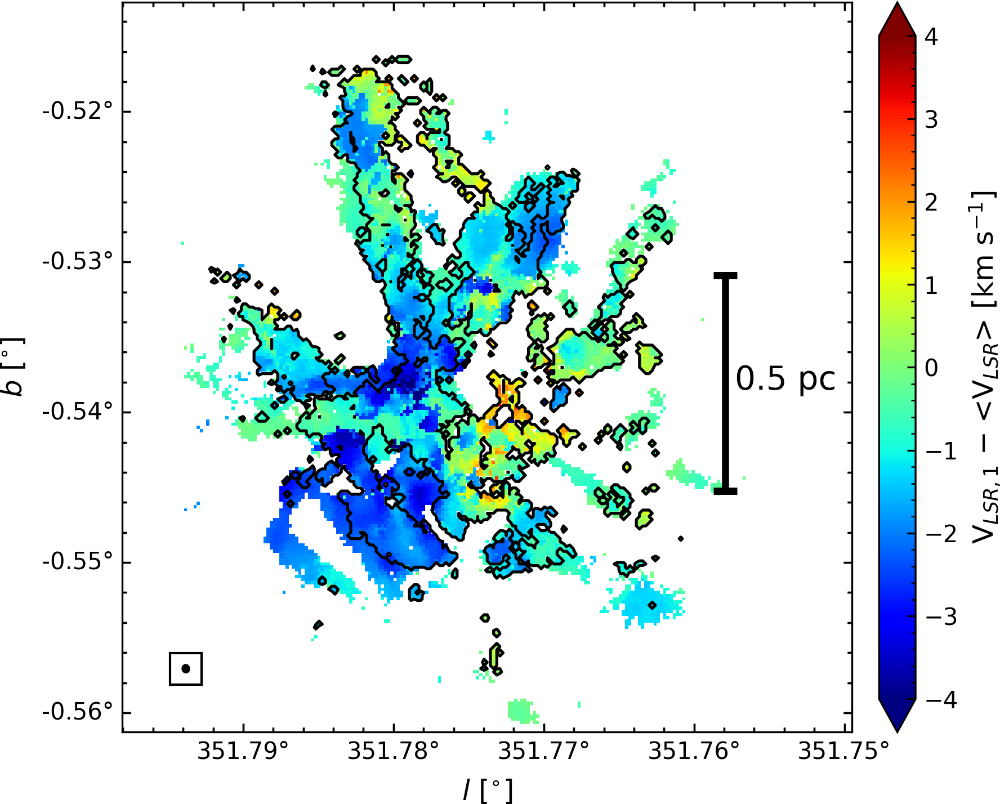
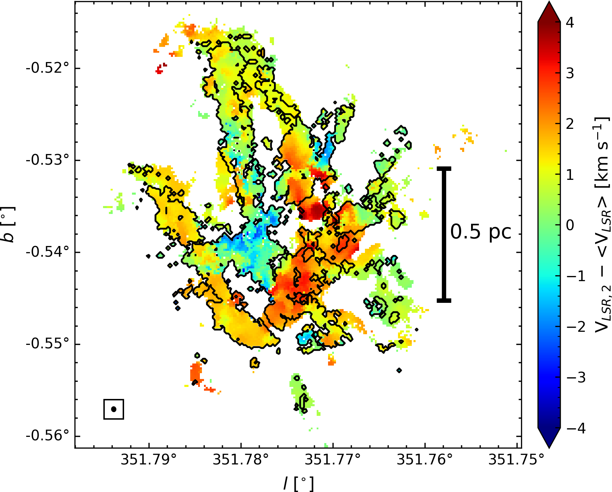
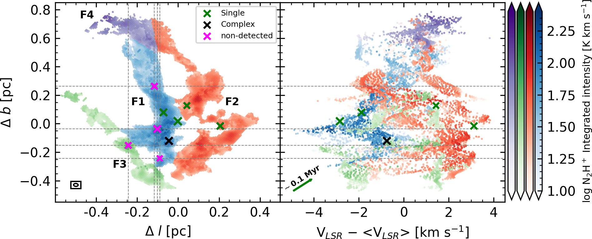

$\newcommand{\ensuremath}{}$
$\newcommand{\xspace}{}$
$\newcommand{\object}[1]{\texttt{#1}}$
$\newcommand{\farcs}{{.}''}$
$\newcommand{\farcm}{{.}'}$
$\newcommand{\arcsec}{''}$
$\newcommand{\arcmin}{'}$
$\newcommand{\ion}[2]{#1#2}$
$\newcommand{\textsc}[1]{\textrm{#1}}$
$\newcommand{\hl}[1]{\textrm{#1}}$
$\newcommand{\footnote}[1]{}$
$\newcommand{\nhp}{N_2H^+\xspace}$
$\newcommand{\nthp}{N_2H^+\xspace}$
$\newcommand{\hco}{H_2CO\xspace}$
$\newcommand{\hdos}{H_2\xspace}$
$\newcommand{\tex}{T_{ex}\xspace}$
$\newcommand{\calL}{{\cal L}}$
$\newcommand{\spitzer}{\textit{Spitzer}\xspace}$
$\newcommand{\msun}{\hbox{\hbox{\rm M}_{\odot}}\xspace}$
$\newcommand{\herschel}{\textit{Herschel}\xspace}$
$\newcommand{\lsun}{L_{\odot}}$
$\newcommand{\rsun}{R_{\odot}}$
$\newcommand{\rstar}{R_{*}}$
$\newcommand{\mdotenv}{\dot{M}_{\rm env}}$
$\newcommand{\rmaxenv}{R_{\rm env,max}}$
$\newcommand{\rminenv}{R_{\rm env,min}}$
$\newcommand{\thetac}{\theta_{C}}$
$\newcommand{\mdotdisk}{\dot{M}_{\rm disk}}$
$\newcommand{\rmaxdisk}{R_{\rm disk,max}}$
$\newcommand{\rmindisk}{R_{\rm disk,min}}$
$\newcommand{\mdisk}{M_{\rm disk}}$
$\newcommand{\lbol}{L_{\rm bol}}$
$\newcommand{\tbol}{T_{\rm bol}}$
$\newcommand{\lsl}{L_{\rm smm}/L_{\rm bol}}$
$\newcommand{\lsmm}{L_{\rm smm}}$
$\newcommand{\kms}{\rm km s^{-1}}$
$\newcommand{\pc}{{\rm pc}}$
$\newcommand{\mx}{{\rm max}}$
$\newcommand{\planck}{\textit{Planck}\xspace}$
$\newcommand{\vlsr}{V_{\rm LSR}\xspace}$
$\newcommand{\mum}{\micron\xspace}$
$\newcommand{◦ee}{\mbox{^{\circ}}\xspace}$
$\newcommand{\minflow}{\dot{\textup{M}}_{\textup{tot,in}}\xspace}$
$\newcommand{\HII}{H {\sc ii} }$
$\newcommand{\novel}{\multicolumn{1}{c}{\textemdash}}$
$\newcommand{\ntot}{N_{\rm tot}\xspace}$
$\newcommand{\mtot}{M_{\rm tot}\xspace}$
$\newcommand{\msunyr}{\hbox{\hbox{\rm M}_{\odot} \rm{yr}^{-1}}\xspace}$
$\newcommand{\amy}{\textcolor{purple}}$
$\newcommand{\nico}{\textcolor{cyan}}$

# ALMA-IMF XVIII: The assembly of a star cluster: Dense $\nhp$ (1-0)     kinematics in the massive G351.77 protocluster

<mark>Appeared on: 2024-10-15</mark> -  _Submitted in A&A, 28 pages, 31 figures, 4 interactive figures, 7 tables_

N. A. Sandoval-Garrido, et al. -- incl., <mark>P. Garcia</mark>

**Abstract:** ALMA-IMF observed 15 massive protoclusters capturing multiple spectral lines and the continuum emission. Here we focus on the massive protocluster G351.77 ( $\sim$ 2500 M $_{\odot}$ , estimated from single-dish continuum observations) located at 2 kpc. We trace the dense gas emission and kinematics with $N_2$ H $^+$ (1-0) at $\sim$ 4 kau resolution. We estimate an $N_2$ H $^+$ relative abundance $\sim (1.66 \pm 0.46) \times 10^{-10}$ . We decompose the $N_2$ H $^+$ emission into up to two velocity components, highlighting the kinematic complexity in the dense gas. By examining the position-velocity (PV) and PPV diagrams on small scales, we observe clear inflow signatures (V-shapes) associated with 1.3 mm cores. The most prominent V-shape has a mass inflow rate of $\sim 9.82 \times 10^{-4}$ M $_{\odot}$ yr $^{-1}$ and a short timescale of $\sim$ 15.63 kyr. We also observe V-shapes without associated cores. This suggests both that cores or centers of accretion exist below the 1.3 mm detection limit, and that the V-shapes may be viable tracers of very early accretion and star formation on $\sim$ 4 kau scales. The large-scale PV diagram shows that the protocluster is separated into 2 principal velocity structures separate by $\sim$ 2 km s $^{-1}$ . Combined with smaller scale DCN and $H_2$ CO emission in the center, we propose a scenario of larger scale slow contraction with rotation in the center based on simple toy models. This scenario is consistent with previous lines of evidence, and leads to the new suggestion of outside-in evolution of the protocluster as it collapses. The gas depletion times implied by the V-shapes are short ( $\sim$ 0.3 Myr), requiring either very fast cluster formation, and/or continuous mass feeding of the protocluster. The latter is possible via the Mother Filament G351.77 is forming out of. The remarkable similarities in the properties of G351.77 and the recently published work in G353.41 indicate that many of the physical conditions inferred via the ALMA-IMF $N_2$ H $^+$ observations may be generic to protoclusters.

**Figure 29. -** Integrated intensity and position-velocity (PV) diagrams of
  the Blue- (blue colorbar) and Red- (red color bar) velocity components
  seen in $\nhp$ (1-0). Top left: Spatial distribution of $\nhp$ (1-0) emission in
  G351.77.  The green, black, and magenta $\times$ markers indicate
  the positions of the 9 out of the 18 (see \S \ref{sec:kinematic-analysis-at-small-scales})
  dense cores  ([Louvet, Sanhueza and Stutz 2024]()) ,
  where each color represents the DCN spectral
  classification: single, complex, and non-detected, respectively  ([Cunningham, Ginsburg and Galván-Madrid 2023]()) .
  The $+$ markers indicate the position of the 16 core candidates, proposed on the basis
   on the $\nhp$ PV features observed at scales of
  $\sim$ 0.1 pc (see \S \ref{sec:kinematic-analysis-at-small-scales}
  and Table \ref{tab:VGcores}). Dashed lines indicate the
  positions of the four cores that do not have measurable velocities. The red arrow
  indicates the direction of the Mother Filament.
  The ellipse in the bottom-left represents the
  beam size of the $\nhp$ data. Top right and bottom left: PV diagrams along
  the two perpendicular directions. The arrows indicate the position of the
  dense cores, listed in Table \ref{tab:core_parameters}, in the PV diagram.
  We observe multiple structures,
  such as V-shapes and Straight structures (see text) along the filaments,
  some associated with cores in both position and
  velocity. The orange arrows represent a velocity gradient of
  10 $\kms$ pc$^{-1}$$\approx$ 0.1 Myr. (*fig:pv_diagram1*)

**Figure 7. -** Top: Mean velocity map from the final spectral model
  composed of both the 1- and 2-velocity-components. The red arrow display
  the direction of the Mother Filament. Whereas the blue arrow indicates
  the direction of the large-scale velocity gradient measured from the centroid velocities.
  Middle: Centroid velocity
  map of the Blue-velocity component. Bottom: Centroid velocity map of the
  Red-velocity component. The spectra inside the black contour are fit
  with 2-velocity-components. The ellipse in the bottom-left corner represents the beam
  size of the $\nhp$ data. (*fig:velocity_map*)

**Figure 30. -** Integrated intensity and position-velocity (PV) diagram of
  the F1 (blue colorbar), F2 (red colorbar), F3 (green colorbar), and
  F4 (purple colorbar) large-scale structures of $\nhp$ (1-0) into which the
  protocluster has been divided. Left: Spatial distribution of $\nhp$ (1-0)
  emission. Markers and dashed lines are the same as in Fig. \ref{fig:pv_diagram1}.
  The ellipse in the bottom-left
  represents the beam size of the $\nhp$ data. Right: PV diagram. We observe
  multiple large-scale V-shapes and Straight-shapes along the different
  filamentary structures, with some of them associated with cores in
  position and in velocity. The green arrows represent a velocity
  gradient of 10 $\kms$ pc$^{-1}$, which correspond to a timescale
  of $\sim$ 0.1 Myr. (*fig:pvcolores*)

