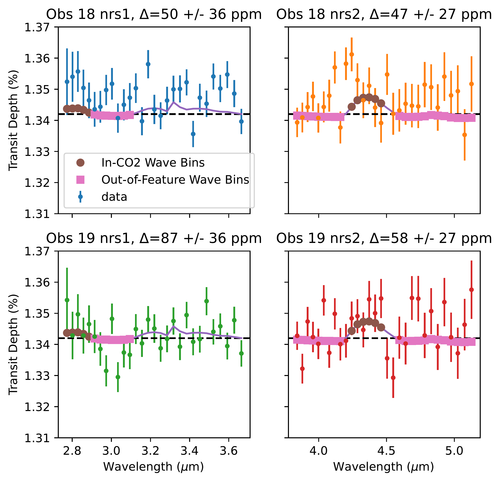
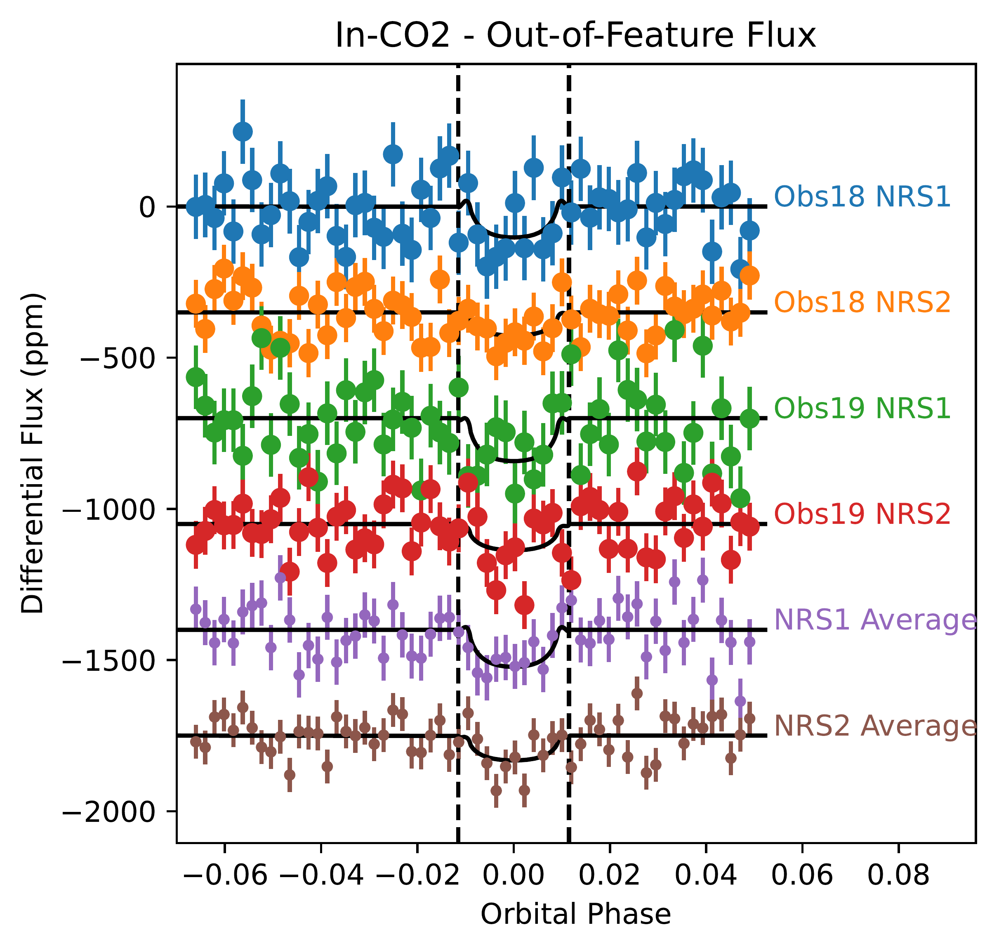
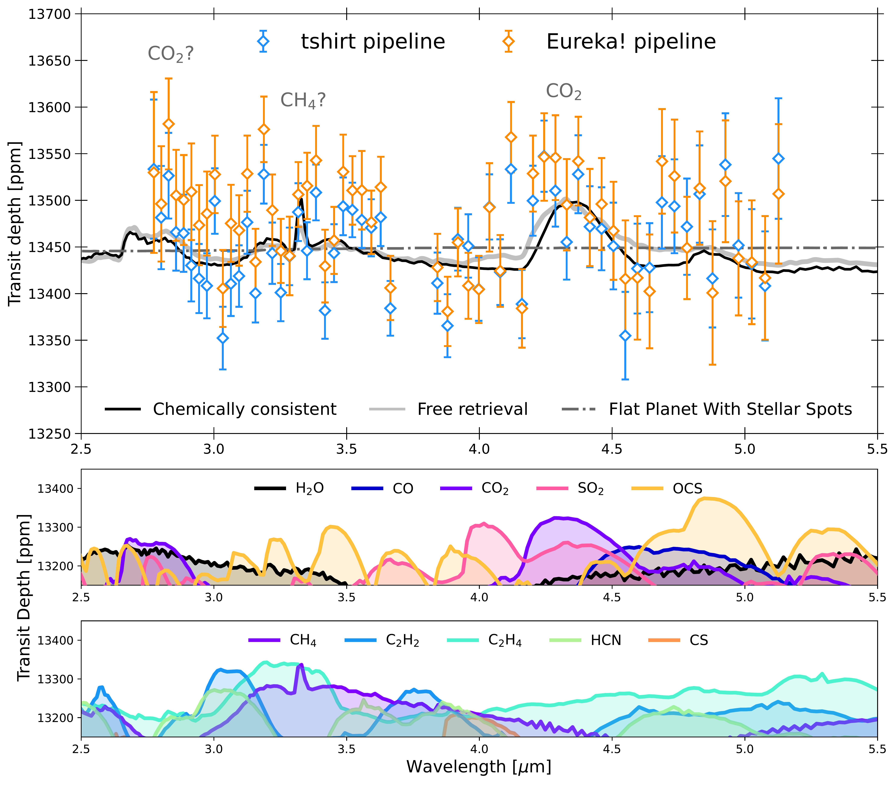
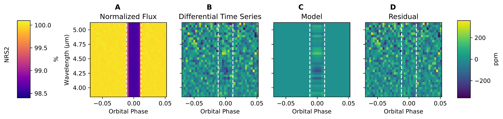
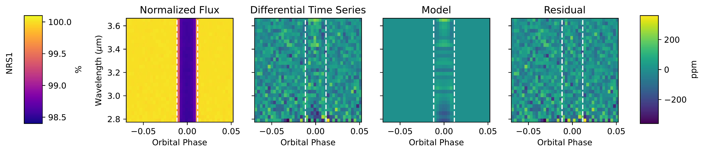

$\newcommand{\ensuremath}{}$
$\newcommand{\xspace}{}$
$\newcommand{\object}[1]{\texttt{#1}}$
$\newcommand{\farcs}{{.}''}$
$\newcommand{\farcm}{{.}'}$
$\newcommand{\arcsec}{''}$
$\newcommand{\arcmin}{'}$
$\newcommand{\ion}[2]{#1#2}$
$\newcommand{\textsc}[1]{\textrm{#1}}$
$\newcommand{\hl}[1]{\textrm{#1}}$
$\newcommand{\footnote}[1]{}$
$\newcommand{\vdag}{(v)^\dagger}$
$\newcommand$
$\newcommand$
$\newcommand{\exampleConstant}{0.04}$
$\newcommand{◦ee}{^\circ}$
$\newcommand{\methane}{CH_4}$
$\newcommand{\cotwo}{CO_2}$
$\newcommand{\cotwoSignificance}{2.4 \sigma}$
$\newcommand{\chfourSignificance}{2.0 \sigma}$
$\newcommand{\ocsSignificance}{\textcolor{red}{Not favored}}$
$\newcommand{\ngts}{NGTS}$
$\newcommand{\tess}{TESS}$
$\newcommand{\edit}[1]$

# Possible Carbon Dioxide Above the Thick Aerosols of GJ 1214 b

<mark>Appeared on: 2024-10-15</mark> -  _22 pages, 11 figures, Accepted in ApJL, Please also see a companion paper Ohno et al. (2024)_

E. Schlawin, et al. -- incl., <mark>L. Kreidberg</mark>

**Abstract:** Sub-Neptune planets with radii $\edit$ 1 ${smaller than}$ Neptune (3.9 R $_\oplus$ ) are the most common type of planet known to exist in The Milky Way, even though they are absent in the Solar System.These planets can potentially have a large diversity of compositions as a result of different mixtures of rocky material, icy material and gas accreted from a protoplanetary disk.However, the bulk density of a sub-Neptune, informed by its mass and radius alone, cannot uniquely constrain its composition; atmospheric spectroscopy is necessary.GJ 1214 b, which hosts an atmosphere that is potentially the most favorable for spectroscopic detection of any sub-Neptune, is instead enshrouded in aerosols (thus showing no spectroscopic features), hiding its composition from view at previously observed wavelengths in its terminator.Here, we present a JWST NIRSpec transmission spectrum from 2.8 to 5.1 $\micron$ that shows signatures of $CO_2$ and $CH_4$ , expected at high metallicity.A model containing both these molecules is preferred by 3.3 and 3.6 $\sigma$ as compared to a featureless spectrum for two different data analysis pipelines, respectively.Given the low signal-to-noise of the features compared to the continuum, however, more observations are needed to confirm the $CO_2$ and $CH_4$ signatures and better constrain other diagnostic features in the near-infrared.Further modeling of the planet's atmosphere, interior structure and origins will provide valuable insights about how sub-Neptunes like GJ 1214 b form and evolve.

**Figure 2. -** _ Left:_ Wavelength selections for $CO_2$ and Out-of-Feature co-adding.
    We use the chemically-consistent model (purple curve) and a threshold (dashed black line) to select wavelengths that are dominated by $CO_2$ opacity (brown circles) and wavelengths that are outside of features (pink circles).
    Individual spectra are shown for the NRS1 and NRS2 detectors and per observation (Obs 18 NRS1 (blue), Obs 18 NRS2 (orange), Obs 19 NRS1 (green), and Obs 19 NRS2 (red)).
    _ Right:_ Differential light curve inside and outside of significant $CO_2$ features. Each detector and observation's fluxes are summed for wavelengths inside a feature and divided by the fluxes summed outside this feature.
    The same blue, orange, green and red colors are used on the left and right to code each detector and observation.
    Finally, an average in-feature versus out-of-feature light curve across both observations is shown in purple and brown on the bottom for NRS1 and NRS2, respectively.
    The same wavelengths' best fit models are shown as black curves, which use a limb-darkened \texttt{starry} model.
    Linear trends have been removed from all time series and $\edit$1{vertical offsets were applied} for clarity. (*fig:CO2lc*)

**Figure 1. -** **Transmission Spectrum of GJ 1214 b with Two Data Reductions and Illustrative Models:**
    The top panel shows the results of data reduction by the \texttt{tshirt} and \texttt{Eureka!} pipelines, demonstrating that two independent pipelines yield consistent results within $1\sigma$ errorbars.
    The solid black, solid gray and dash-dotted gray lines show the median spectrum from the chemically-consistent model, chemically-agnostic free model, and a flat line (with stellar inhomogeneities), respectively fit to the HST, JWST-NIRSpec (\texttt{tshirt}) and JWST-MIRI panchromatic spectrum.
    The lower panels show the illustrative transmission spectra to exhibit the transit depth shape of relevant molecules -- we create clear isothermal ($T=500 {\rm K}$)  $N_2$ atmospheres with only one gas at a time with a VMR=$10^{-4}$ and repeat for all molecules. (*fig:differentAnalyses*)

**Figure 10. -** 2D light curves binned to a resolution of R=100 and 40 time bins for NRS2 (top row) and NRS1 (bottom row), with both transits averaged. The normalized flux in percentage (after linearly de-trending at each wavelength) is shown in panel A. The differential time series, after dividing by the broadband for a given detector is shown in ppm in panel B. The differential light curve model is shown in panel C and the residuals of the light curve subtracted by the model are shown in panel D.
    The start of ingress and end of egress times are marked as vertical dashed lines.
    Increased and decreased transit depths relative to the broadband light curve are visible as dark and bright bands between ingress and egress.
    The most noticeable features are increased transit depths near 4.3 \micron and 2.8 \micron and decreased transit depths near 3.6 \micron and 4.6 \micron. (*fig:2Dlc*)

