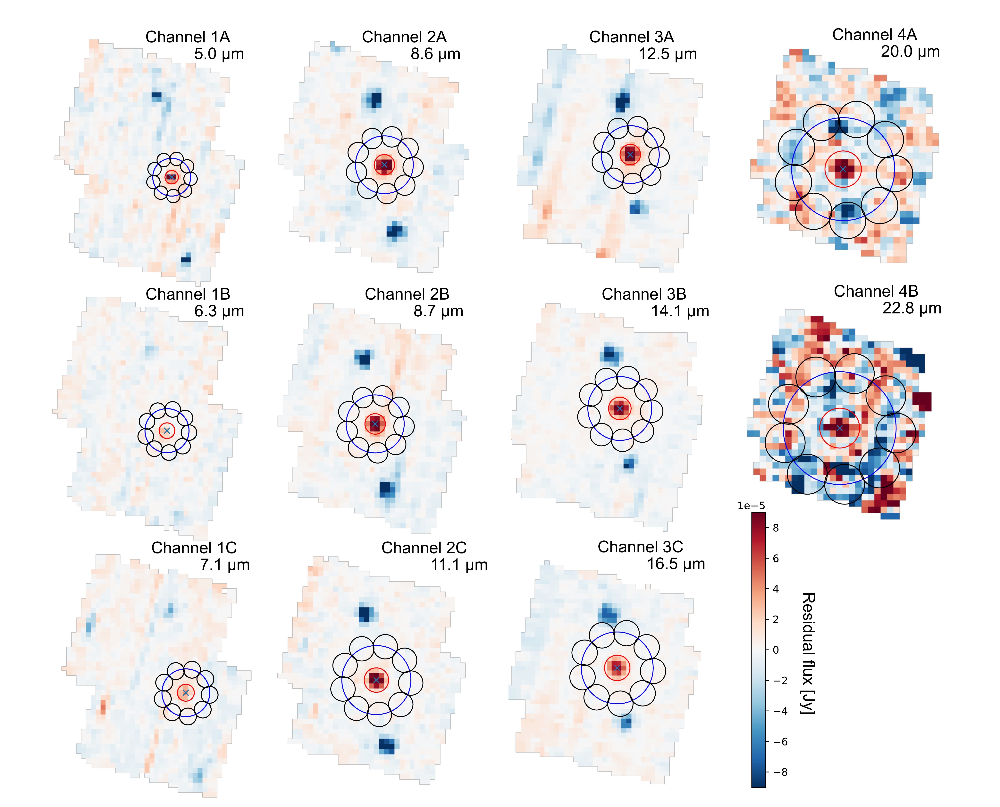
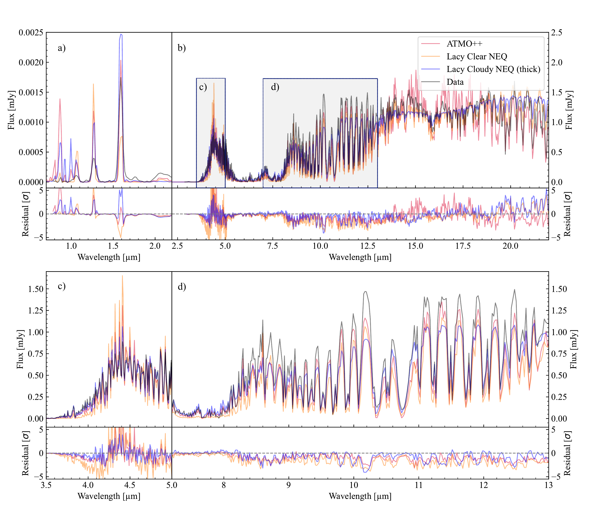
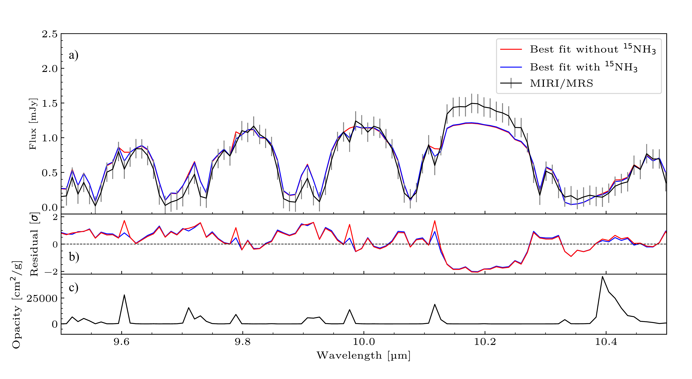

$\newcommand{\ensuremath}{}$
$\newcommand{\xspace}{}$
$\newcommand{\object}[1]{\texttt{#1}}$
$\newcommand{\farcs}{{.}''}$
$\newcommand{\farcm}{{.}'}$
$\newcommand{\arcsec}{''}$
$\newcommand{\arcmin}{'}$
$\newcommand{\ion}[2]{#1#2}$
$\newcommand{\textsc}[1]{\textrm{#1}}$
$\newcommand{\hl}[1]{\textrm{#1}}$
$\newcommand{\footnote}[1]{}$
$\newcommand{\todo}[1]{\textbf{\color{orange}#1}}$
$\newcommand{\RJ}{R_\mathrm{J}}$
$\newcommand{\MJ}{M_\mathrm{J}}$

# Water depletion and $\mathrm{^{15}NH_3}$ in the atmosphere of the coldest brown dwarf observed with JWST/MIRI

<mark>Appeared on: 2024-10-16</mark> -  _Submitted to A&A, 29 pages, 21 figures_

H. Kühnle, et al. -- incl., <mark>P. Mollière</mark>, <mark>E. Matthews</mark>, <mark>T. Henning</mark>

**Abstract:** With a temperature of $\sim$ 285 K WISE 0855 is the coldest brown dwarf observed so far. Such cold gas giants enable probing atmospheric physics and chemistry of evolved objects similar to the Solar System gas giants. Using the James Webb Space Telescope (JWST) we obtained observations that allow us to characterize WISE 0855's atmosphere focusing on vertical variation in the water steam abundance, measuring trace gas abundances and receiving bulk parameters for this cold object. We observed the ultra cool dwarf WISE 0855 using the Mid-Infrared Instrument Medium Resolution Spectrometer (MIRI/MRS) onboard JWST at a spectral resolution of up to 3'750. We combined the observation with the published data from the Near Infrared Spectrograph (NIRSpec) G395M and PRISM modes yielding a spectrum ranging from 0.8 to 22 µm. We applied atmospheric retrievals using \texttt{petitRADTRANS} to measure atmospheric abundances, the pressure-temperature structure, radius and gravity of the brown dwarf. We also employed publicly available clear and cloudy self-consistent grid models to estimate bulk properties of the atmosphere such as the effective temperature, radius, gravity and metallicity. Atmospheric retrievals constrain a variable water abundance profile in the atmosphere, as predicted by equilibrium chemistry. We detect the $\mathrm{^{15}NH_3}$ isotopologue and infer a ratio of mass fraction of $\mathrm{^{14}NH_3}$ / $\mathrm{^{15}NH_3}$ = 332 $^{+63}_{-43}$ for the clear retrieval. We measure the bolometric luminosity by integrating the presented spectrum and obtain a value of $\mathrm{log(L/\textup{L}_\odot)} = -7.291 \pm 0.008$ . The detected water depletion indicates that water condenses out in the upper atmosphere due to the very low effective temperature of WISE 0855. The height in the atmosphere where this occurs is covered by the MIRI/MRS data, and thus demonstrates the potential of MIRI to characterize cold gas giant's atmospheres. Comparing the data to retrievals and self-consistent grid models, we do not detect signs for water ice clouds, although their spectral features have been predicted in previous studies.

**Figure 5. -** Resulting cube images of channels 1 to 4 with sub channels A to C after dither subtraction. The wavelengths are chosen such that they refer to the detector image with the highest flux at the source in each band. The red circle shows the aperture for the flux extraction of the spectrum at one FWHM of the PSF of the source. The blue circle refers to three times the FWHM on which nine black circles of one FWHM are placed. We extract the flux from each circle and measure the variability to obtain an error including the noise in the background, $\sigma_{emp}$.  (*fig:errorestimation*)

**Figure 9. -** Best fit grid model spectra for the clear ATMO++ in red, the thick cloudy non-equilibrium model by Lacy2023 in blue and and the clear non-equilibrium in orange. Subplot a) shows an inset of the PRISM data, which has a significant lower amount of flux. Subfigure b) gives the NIRSpec/G395M and MIRI/MRS data set. Subplot c) and d) show insets in panel b) on the NIRspec/G395M region and the prominent $NH_3$ absorption feature. The corresponding $\chi^2$ values are 2.57, 1.97 and 5.66 for ATMO++, the Lacy cloudy (thick) and clear non-equilibrium model fits. As for the retrievals and for better visibility we re-bined the models and data to a resolution R = 500 for the NIRSpec/G395M and MIRI/MRS and kept NIRSpec/PRISM at R = 100. (*fig:cloud_self*)

**Figure 11. -** We show the best fit spectrum with $^{15}$$NH_3$ included in blue, the best fit removing the $^{15}$$NH_3$ opacity in red and in black the data with error bars. The top right panel b) shows the $^{15}$$NH_3$ feature observed by the MIRI/MRS spectrum of WISE 0855 with an inset shown in panel a). The middle plot d) shows the residuals of the fit with and without $^{15}$$NH_3$ in blue and red respectively. The lowest plot f) shows the $^{15}$$NH_3$ opacity used for the retrieval at 277 K and for the pressures of the clear retrieval with varying $H_2$O profile. Insets of the middle and lower plots are shown in panels c) and e) (*fig:isotop*)

