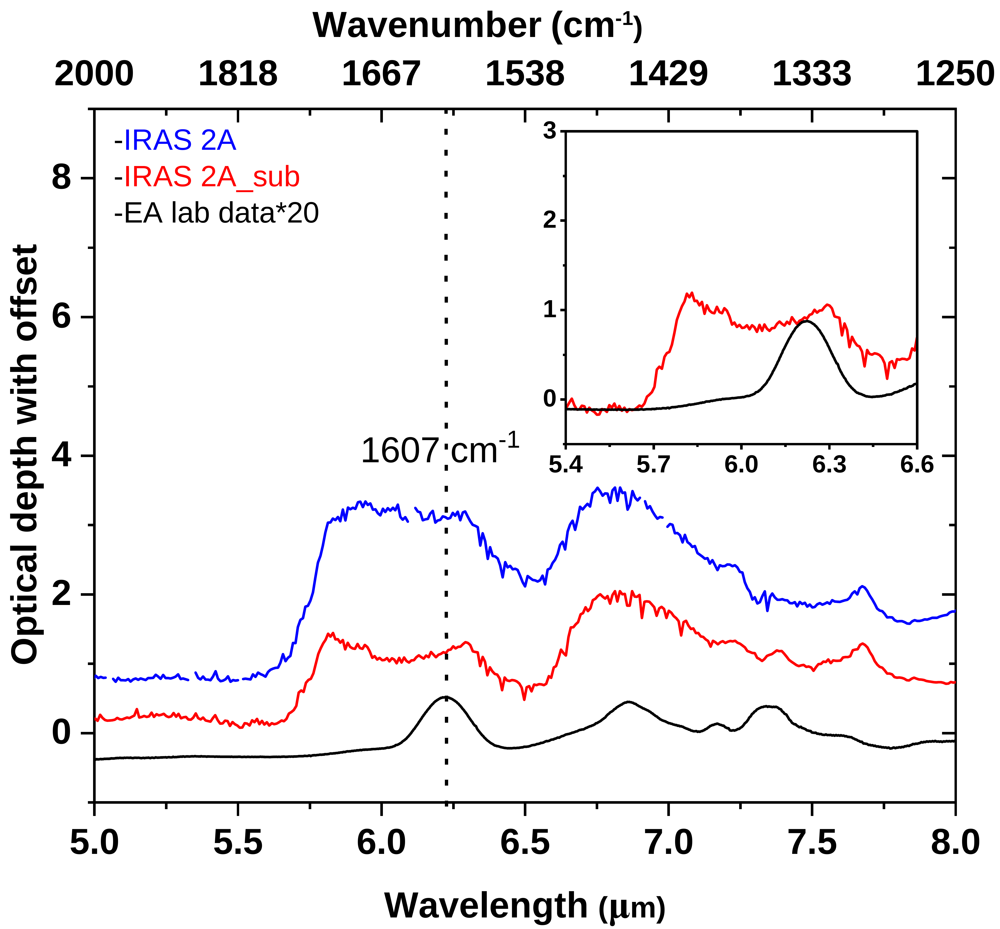
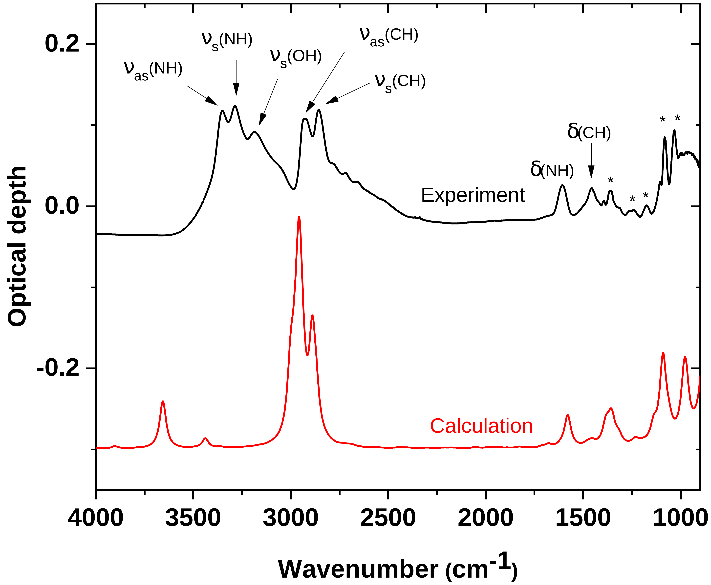
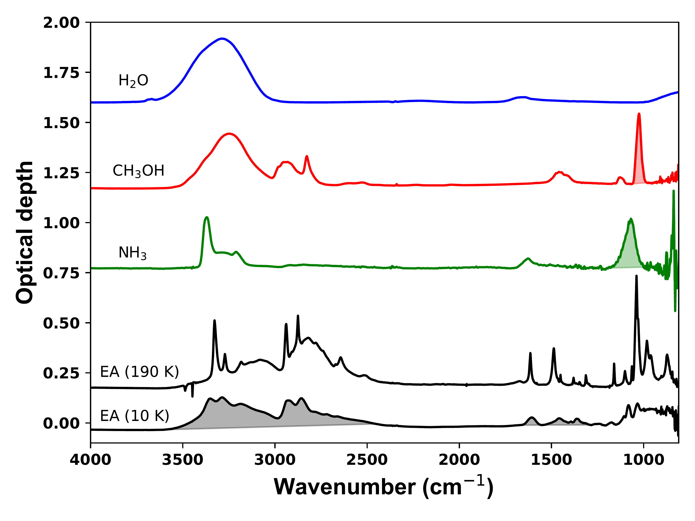

$\newcommand{\ensuremath}{}$
$\newcommand{\xspace}{}$
$\newcommand{\object}[1]{\texttt{#1}}$
$\newcommand{\farcs}{{.}''}$
$\newcommand{\farcm}{{.}'}$
$\newcommand{\arcsec}{''}$
$\newcommand{\arcmin}{'}$
$\newcommand{\ion}[2]{#1#2}$
$\newcommand{\textsc}[1]{\textrm{#1}}$
$\newcommand{\hl}[1]{\textrm{#1}}$
$\newcommand{\footnote}[1]{}$
$\newcommand{\textmathbf}[1]{\textbf{\boldmath#1}}$

# Infrared Spectra of Solid-State Ethanolamine: Laboratory Data in Support of JWST Observations

<mark>Appeared on: 2024-10-17</mark> -  _8 pages, 5 figures_

<mark>T. Suhasaria</mark>, et al. -- incl., <mark>S. M. Wee</mark>, <mark>G. Perotti</mark>, <mark>T. Henning</mark>

**Abstract:** Ethanolamine ($NH_2$ $CH_2$ $CH_2$ OH, EA) has been identified in the gas phase of the interstellar medium within molecular clouds. Although EA hasn't been directly observed in the molecular ice phase, a solid-state formation mechanism has been proposed. However, the current literature lacks an estimation of the infrared band strengths of EA ices, which are crucial data for quantifying potential astronomical observations and laboratory findings related to their formation or destruction via energetic processing. We conducted an experimental investigation of solid EA ice at low temperatures to ascertain its infrared band strengths, phase transition temperature, and multilayer binding energy. Since the refractive index and the density of EA ice are unknown, the commonly used laser interferometry method was not applied. Infrared band strengths were determined using three distinct methods. Besides the evaluation of band strengths of EA, we also tested the advantages and disadvantages of different approaches used for this purpose. The obtained lab spectrum of EA was compared with the publicly available MIRI MRS James Webb Space Telescope observations toward a low mass protostar. We used a combination of Fourier-transform transmission infrared spectroscopy and quadrupole mass spectrometry. The phase transition temperature for EA ice falls within the range of 175 to 185 K. Among the discussed methods, the simple pressure gauge method provides a reasonable estimate of band strength. We derive a band strength value of about $1\times10^{-17}$ cm molecule $^{-1}$ for the $NH_2$ bending mode in the EA molecules. Additionally, temperature-programmed desorption analysis yielded a multilayer desorption energy of 0.61 $\pm$ 0.01 eV. By comparing the laboratory data documented in this study with the JWST spectrum of the low mass protostar IRAS 2A, an upper-limit for the EA ice abundances was derived. This study addresses the lack of quantitative infrared measurements of EA at low temperatures, crucial for understanding its astronomical and laboratory presence and formation routes. Our approach presents a simple, yet effective method for determining the infrared band strengths of molecules with a reasonable level of accuracy.

**Figure 4. -** Comparison of the JWST/MIRI MRS spectra of IRAS 2A (blue curve) and IRAS 2A with water:silicate features subtracted (red curve) to the laboratory-measured EA ice profile at 10 K. For clearer comparison, all spectra are vertically shifted, with the laboratory spectrum intensity is multiplied by 20, and the EA band at 1607 cm$^{-1}$ is indicated by dashed line. The inset provides a closer examination of the water:silicate subtracted IRAS 2A spectrum alongside the fitted EA profile for upper limit estimation. (*fig5*)

**Figure 1. -** Experimental and theoretical mid-IR spectrum of EA. The upper one shows about 200 monolayers (ML) EA condensed on KBr at 10 K. The infrared bands marked with asterisks are due to a mixture of different vibrational modes. For the latter, calculations were performed at MP2/Aug-cc-pVTZ level. (*fig1*)

**Figure 2. -** Mid-infrared spectra of pure EA and reference molecules $NH_3$ and $CH_3$OH at 10 K. The spectrum of $H_2$O (common interstellar ice component) at 15 K is taken from the Leiden Ice Database for Astrochemistry (LIDA). Bands selected for band strength estimation are indicated by the shaded areas. (*fig3*)

