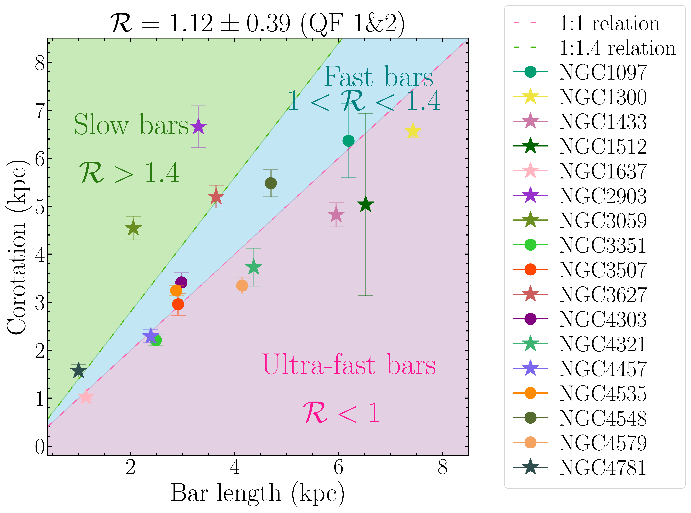

$\newcommand{\ensuremath}{}$
$\newcommand{\xspace}{}$
$\newcommand{\object}[1]{\texttt{#1}}$
$\newcommand{\farcs}{{.}''}$
$\newcommand{\farcm}{{.}'}$
$\newcommand{\arcsec}{''}$
$\newcommand{\arcmin}{'}$
$\newcommand{\ion}[2]{#1#2}$
$\newcommand{\textsc}[1]{\textrm{#1}}$
$\newcommand{\hl}[1]{\textrm{#1}}$
$\newcommand{\footnote}[1]{}$
$\newcommand{\sqdiamond}[1][fill=black]{\tikz[x=1.2ex,y=1.85ex,line width=.1ex,line join=round, yshift=-0.285ex] \draw[#1]  (0,.5) -- (.5,1) -- (1,.5) -- (.5,0) -- (0,.5) -- cycle;}$
$\newcommand{\sqdiamondDash}[1][fill=black]{$
$    \tikz[x=1.2ex,y=1.85ex,line width=.1ex,line join=round, yshift=-0.285ex]$
$        \draw[#1]$
$            (0,.5) -- (.5,1) -- (1,.5) -- (.5,0) -- (0,.5) -- cycle$
$            (0,1.1) --  (1,1.1);$
$}$
$\newcommand{\MyDiamond}[1][fill=black]{\mathop{\raisebox{-0.275ex}{\sqdiamond[#1]}}}$
$\newcommand{\re}{\ensuremath{r_\mathrm{e}}}$
$\newcommand{\SigStar}{\ensuremath{\Sigma_\mathrm{\star}}}$
$\newcommand{\SigMol}{\ensuremath{\Sigma_\mathrm{mol}}}$
$\newcommand{\SigSFR}{\ensuremath{\Sigma_\mathrm{SFR}}}$
$\newcommand{\tdep}{\ensuremath{\tau_\mathrm{dep}}}$
$\newcommand{\OSU}{\label{OSU} Department of Astronomy, The Ohio State University, 140 West 18th Avenue, Columbus, Ohio 43210, USA}$
$\newcommand{\Alberta}{\label{Alberta} Department of Physics, University of Alberta, Edmonton, AB T6G 2E1, Canada}$
$\newcommand{\ANU}{\label{ANU} Research School of Astronomy and Astrophysics, Australian National University, Canberra, ACT 2611, Australia}$
$\newcommand{\IPAC}{\label{IPAC} Caltech-IPAC, 1200 E. California Blvd. Pasadena, CA 91125, USA}$
$\newcommand{\Carnegie}{\label{Carnegi} Observatories of the Carnegie Institution for Science, 813 Santa Barbara Street, Pasadena, CA 91101, USA}$
$\newcommand{ÇAPP}{\label{CCAPP} Center for Cosmology and Astroparticle Physics, 191 West Woodruff Avenue, Columbus, OH 43210, USA}$
$\newcommand{\CfA}{\label{CfA} Harvard-Smithsonian Center for Astrophysics, 60 Garden Street, Cambridge, MA 02138, USA}$
$\newcommand{\CITEVA}{\label{CITEVA} Centro de Astronomía (CITEVA), Universidad de Antofagasta, Avenida Angamos 601, Antofagasta, Chile}$
$\newcommand{\CNRS}{\label{CNRS} CNRS, IRAP, 9 Av. du Colonel Roche, BP 44346, F-31028 Toulouse cedex 4, France}$
$\newcommand{\ESO}{\label{ESO} European Southern Observatory, Karl-Schwarzschild Stra{\ss}e 2, D-85748 Garching bei München, Germany}$
$\newcommand{\Heidelberg}{\label{Heidelberg} Astronomisches Rechen-Institut, Zentrum für Astronomie der Universität Heidelberg, Mönchhofstra\ss e 12-14, D-69120 Heidelberg, Germany}$
$\newcommand{\COOL}{\label{COOL} Cosmic Origins Of Life (COOL) Research DAO, coolresearch.io}$
$\newcommand{\ICRAR}{\label{ICRAR} International Centre for Radio Astronomy Research, University of Western Australia, 35 Stirling Highway, Crawley, WA 6009, Australia}$
$\newcommand{\IRAM}{\label{IRAM} Institut de Radioastronomie Millimétrique (IRAM), 300 Rue de la Piscine, F-38406 Saint Martin d'Hères, France}$
$\newcommand{\ITA}{\label{ITA} Universität Heidelberg, Zentrum für Astronomie, Institut für Theoretische Astrophysik, Albert-Ueberle-Str 2, D-69120 Heidelberg, Germany}$
$\newcommand{\IWR}{\label{IWR} Universität Heidelberg, Interdisziplinäres Zentrum für Wissenschaftliches Rechnen, Im Neuenheimer Feld 205, D-69120 Heidelberg, Germany}$
$\newcommand{\JHU}{\label{JHU} Department of Physics and Astronomy, The Johns Hopkins University, Baltimore, MD 21218, USA}$
$\newcommand{\Leiden}{\label{Leiden} Leiden Observatory, Leiden University, P.O. Box 9513, 2300 RA Leiden, The Netherlands}$
$\newcommand{\Maryland}{\label{Maryland} Department of Astronomy, University of Maryland, College Park, MD 20742, USA}$
$\newcommand{\MPE}{\label{MPE} Max-Planck-Institut für extraterrestrische Physik, Giessenbachstra{\ss}e 1, D-85748 Garching, Germany}$
$\newcommand{\MPIA}{\label{MPIA} Max-Planck-Institut für Astronomie, Königstuhl 17, D-69117, Heidelberg, Germany}$
$\newcommand{\Nagoya}{\label{Nagoya} Department of Physics, Nagoya University, Furo-cho, Chikusa-ku, Nagoya, Aichi 464-8602, Japan}$
$\newcommand{\NRAO}{\label{NRAO} National Radio Astronomy Observatory, 520 Edgemont Road, Charlottesville, VA 22903-2475, USA}$
$\newcommand{\OAN}{\label{OAN} Observatorio Astronómico Nacional (IGN), C/Alfonso XII, 3, E-28014 Madrid, Spain}$
$\newcommand{\ObsParis}{\label{ObsParis} Sorbonne Université, Observatoire de Paris, Université PSL, CNRS, LERMA, F-75014, Paris, France}$
$\newcommand{\Princeton}{\label{Princeton} Department of Astrophysical Sciences, Princeton University, 4 Ivy Ln., Princeton, NJ 08544 USA}$
$\newcommand{\UToledo}{\label{UToledo} University of Toledo, 2801 W. Bancroft St., Mail Stop 111, Toledo, OH, 43606}$
$\newcommand{\Toulouse}{\label{Toulouse} Université de Toulouse, UPS-OMP, IRAP, F-31028 Toulouse cedex 4, France}$
$\newcommand{\UBonn}{\label{UBonn} Argelander-Institut für Astronomie, Universität Bonn, Auf dem Hügel 71, 53121 Bonn, Germany}$
$\newcommand{\UChile}{\label{UChile} Departamento de Astronomía, Universidad de Chile, Camino del Observatorio 1515, Las Condes, Santiago, Chile}$
$\newcommand{\UConn}{\label{UConn} Department of Physics, University of Connecticut, Storrs, CT, 06269, USA}$
$\newcommand{\UCSD}{\label{UCSD} Center for Astrophysics and Space Sciences, Department of Physics,  University of California, San Diego, 9500 Gilman Drive, La Jolla, CA 92093, USA}$
$\newcommand{\UCSDAA}{\label{UCSDAA} Department of Astronomy \& Astrophysics,  University of California, San Diego, 9500 Gilman Drive, La Jolla, CA 92093, USA}$
$\newcommand{\UGent}{\label{UGent} Sterrenkundig Observatorium, Universiteit Gent, Krijgslaan 281 S9, B-9000 Gent, Belgium}$
$\newcommand{\ULyon}{\label{ULyon} Univ Lyon, Univ Lyon 1, ENS de Lyon, CNRS, Centre de Recherche Astrophysique de Lyon UMR5574,\ F-69230 Saint-Genis-Laval, France}$
$\newcommand{\UMass}{\label{UMass} University of Massachusetts—Amherst, 710 N. Pleasant Street, Amherst, MA 01003, USA}$
$\newcommand{\UWyoming}{\label{UWyoming} Department of Physics and Astronomy, University of Wyoming, Laramie, WY 82071, USA}$
$\newcommand{\LAM}{\label{LAM} Aix Marseille Univ, CNRS, CNES, LAM (Laboratoire d’Astrophysique de Marseille), Marseille, France}$
$\newcommand{\UHawaii}{\label{UHawaii} Institute for Astronomy, University of Hawaii, 2680 Woodlawn Drive, Honolulu, HI 96822, USA}$
$\newcommand{\UCM}{\label{UCM} Departamento de Física de la Tierra y Astrofísica, Universidad Complutense de Madrid, E-28040, Spain}$
$\newcommand{\IPARC}{\label{IPARC} Instituto de Física de Partículas y del Cosmos IPARCOS, Facultad de Ciencias Físicas, Universidad Complutense de Madrid, E-28040, Spain}$
$\newcommand{\STScI}{\label{STScI} Space Telescope Science Institute, 3700 San Martin Drive, Baltimore, MD 21218, USA}$
$\newcommand{\McMaster}{\label{McMaster} Department of Physics and Astronomy, McMaster University, 1280 Main Street West, Hamilton, ON L8S 4M1, Canada}$
$\newcommand{\INAF}{\label{INAF} INAF -- Osservatorio Astrofisico di Arcetri, Largo E. Fermi 5, I-50157, Firenze, Italy}$
$\newcommand{\Sydney}{\label{Sydney} Sydney Institute for Astronomy, School of Physics A28, The University of Sydney, NSW 2006, Australia}$
$\newcommand{\UA}{\label{UA} Centro de Astronomía (CITEVA), Universidad de Antofagasta, Avenida Angamos 601, Antofagasta, Chile}$
$\newcommand{\CITA}{\label{CITA} Canadian Institute for Theoretical Astrophysics (CITA), University of Toronto, 60 St George St, Toronto, ON M5S 3H8, Canada}$
$\newcommand{\ASIAA}{\label{ASIAA} Institute of Astronomy and Astrophysics, Academia Sinica, No. 1, Sec. 4, Roosevelt Road, Taipei 10617, Taiwan}$
$\newcommand{\TKU}{\label{TKU} Department of Physics, Tamkang University, No.151, Yingzhuan Rd., Tamsui Dist., New Taipei City 251301, Taiwan}$
$\newcommand{\PSMA}{\label{PSMA} Penn State Mont Alto, 1 Campus Drive, Mont Alto, PA  17237, USA}$
$\newcommand{\ILL}{\label{ILL} Institut Laue-Langevin, 71 avenue des Martyrs, F-38042 Grenoble, France}$
$\newcommand{\TUM}{\label{TUM} Technical University of Munich, School of Engineering and Design, Department of Aerospace and Geodesy, Chair of Remote Sensing Technology, Arcisstr. 21, 80333 Munich, Germany}$
$\newcommand{\Surrey}{\label{Surrey} Department of Physics, University of Surrey, Guildford GU2 7XH, UK}$
$\newcommand{\Oxford}{\label{Oxford} Sub-department of Astrophysics, Department of Physics, University of Oxford, Keble Road, Oxford OX1 3RH, UK}$
$\newcommand{\AIP}{\label{AIP} Leibniz-Institut for Astrophysik Potsdam (AIP), An der Sternwarte 16, 14482 Potsdam, Germany}$
$\newcommand{\Insubria}{\label{Insubria}{Universit{à} dell’Insubria, via Valleggio 11, 22100 Como, Italy}}$
$\newcommand{\StAndrews}{\label{StAndrews} School of Physics and Astronomy, University of St Andrews, North Haugh, St Andrews, KY16 9SS}$
$\newcommand{\IAC}{\label{IAC}{Instituto de Astrofísica de Canarias, C/ Vía Láctea s/n, E-38205, La Laguna, Spain}}$
$\newcommand{\ULL}{\label{ULL}{Departamento de Astrofísica, Universidad de La Laguna, Av. del Astrofísico Francisco Sánchez s/n, E-38206, La Laguna, Spain}}$
$\newcommand{\AIfA}{\label{AIfA}{$
$Argelander-Institut für Astronomie, Universität Bonn, Auf dem Hügel 71, 53121 Bonn, Germany}}$
$\newcommand{\Heidel}{\label{Heidel} Universität Heidelberg, Zentrum für Astronomie, Albert-Ueberle-Str. 2, 69120 Heidelberg, Germany}$
$\newcommand{\UMich}{\label{UMich}$
$Department of Astronomy, University of Michigan, Ann Arbor, MI 48109, USA}$
$\newcommand{\Msun}{\ifmmode{\mathrm M_\odot}\else{M_\odot}\fi}$
$\newcommand\action{#1}$
$\newcommand\change{#1}$

# Dynamical resonances in PHANGS galaxies

<mark>Appeared on: 2024-10-18</mark> - 

M. Ruiz-García, et al. -- incl., <mark>E. Schinnerer</mark>

**Abstract:** Bars are remarkable stellar structures that can transport gas toward centers and drive the secular evolution of galaxies. In this context, it is important to locate dynamical resonances associated with bars. For this study, we used _Spitzer_ near-infrared images as a proxy for the stellar gravitational potential and the ALMA CO(J=2-1) gas distribution from the PHANGS survey to determine the position of the main dynamical resonances associated with the bars in the PHANGS sample of 74 nearby star-forming galaxies. We used the gravitational torque method to estimate the location of the bar corotation radius ( $R_{\rm CR}$ ), where stars and gas rotate at the same angular velocity as the bar. Of the 46 barred galaxies in PHANGS, we have successfully determined the corotation (CR) for 38 of them. The mean ratio of the $R_{\rm CR}$ to the bar radius ( $R_{\rm bar}$ ) is $\mathcal{R} = R_{\rm CR}/R_{\rm bar} = 1.12$ , with a standard deviation of $0.39$ . This is consistent with the average value expected from theory and suggests that bars are predominantly fast. We also compared our results with other bar CR measurements from the literature, which employ different methods, and find good agreement ( $\rho = 0.64$ ). Finally, using rotation curves, we have estimated other relevant resonances such as the inner Lindblad resonance (ILR) and the outer Lindblad resonance (OLR), which are often associated with rings. This work provides a useful catalog of resonances for a large sample of nearby galaxies and emphasizes the clear connection between bar dynamics and morphology.

**Figure 17. -** **IC 1954**(SB, $QF=3$) non-weighted deprojected torque map (left panel), torque profile (upper central panel), comparison with values from the literature (lower central panel), rotation curve (upper right panel), and angular rotation curve (lower right panel). The cyan-contoured ellipse indicates the bar extent. We show contours corresponding to $[5\sigma, 15\sigma, 45\sigma, ..., 0.9\sigma_{\rm max}]$ in the CO map, where $\sigma$ is the mean value of the gas map and $\sigma_{\rm max}$ its maximum value. CR (if determined) is represented as a vertical pink line, together with its uncertainties (pink shaded area). This is a statistical uncertainty due to bootstrapping for $i$, PA and center position (see Sect. $\re$f{sec:bootstrap}). Solid green line represents the bar length (from \citealt{Querejeta+21}), while shaded green region represents the region where we search for the CR. Brown dashed line represents the radius at which the coverage of CO starts to be non-uniform ($R_{\rm 100\%  CO}$ in Table $\re$f{table:complete_sample}), orange dashed line is the radius at which the coverage of CO is uniform about 50\%($R_{\rm 50\%  CO}$ in Table $\re$f{table:complete_sample}), and purple dashed line represents the end of CO coverage ($R_{\rm End  CO}$ in Table $\re$f{table:complete_sample}). Teal dashed line represents the nuclear bar registered by \cite{Querejeta+21}(if detected). The shaded gray region shown in this graphic represents the inner region inside which we cannot say anything on $\tau(R)$ due to the limited spatial resolution of our observations. In addition, on the lower central panel, each dot represents a different measure of the CR (of the main bar) from literature. Finally, on the upper right panel we show the rotation curve from \cite{Lang+20}, while on the lower right panel we represent in black solid line the angular rotation curve ($\Omega$) and the curves derived as $\Omega \pm \kappa/2$(light pink and blue curves), together with the derived pattern speed ($\Omega_p$) and its uncertainties, shown as a dotted pink line and a pink-filled region. In this panel we also represent the Lindblad Resonances if present, as two shades of blue (iILR and oILR) and orange (OLR) dotted lines. (*fig:Appendix-All_galaxies-IC1954*)

**Figure 11. -** **NGC 1097 (SB)** non-weighted deprojected torque map (left panel), torque profile (upper central panel), comparison with values from the literature (lower central panel), rotation curve (upper right panel), and angular rotation curve (lower right panel). The cyan-contoured ellipse in the left panel indicates the bar extent. We show contours corresponding to $[5\sigma, 15\sigma, 45\sigma, \dots, 0.9\sigma_{\rm max}]$ in the CO map, where $\sigma$ is the mean value of the gas map $\sigma = 0.59 \rm K  km  s^{-1}$, and $\sigma_{\rm max} = 934.83  \rm K  km  s^{-1}$. In the central and right panels, CR is represented as a vertical pink line, together with its uncertainties (pink-shaded area). This is a statistical uncertainty due to bootstrapping for $i$, PA and center position (see Sect. $\re$f{sec:bootstrap}). The solid green line represents the bar length (from \citealt{Querejeta+21}), while the shaded green region represents the region where we search for the CR. Brown dashed line marks the radius at which the coverage of CO starts to be nonuniform ($R_{\rm 100 \% CO}$ in Table $\re$f{table:complete_sample}), orange dashed line is the radius at which the coverage of CO is uniform about $50\%$($R_{\rm 50 \% CO}$ in Table $\re$f{table:complete_sample}), and purple dashed line represents the end of CO coverage ($R_{\rm End  CO}$ in Table $\re$f{table:complete_sample}). The shaded gray region represents the inner region inside which we cannot say anything on $\tau(R)$ due to the limited spatial resolution of our observations. Finally, in the lower central panel, each dot represents a different measure of the CR (of the main bar) from the literature, and the $\MyDiamond$ symbol represents a measure of a nuclear bar CR. For both right panels, the solid black line represents the rotation curve (upper panel) and the angular rotation curve $\Omega$(lower panel). Solid light pink and light blue lines represent $\Omega + \kappa /2$ and $\Omega - \kappa /2$, respectively. The OLR and its uncertainties are represented in orange and the oILR (and its uncertainties) in dark blue. Purple vertical line represents the central ring detected by \cite{Querejeta+21}. (*fig:NGC1097-case_study*)

**Figure 3. -** Slow, fast, and ultra-fast bars containing exclusively galaxies with $QF = 1$ and $QF = 2$. Galaxies with $QF = 2$ are represented with stars, while galaxies with $QF = 1$ are represented with dots. (*fig:QF1&2*)

