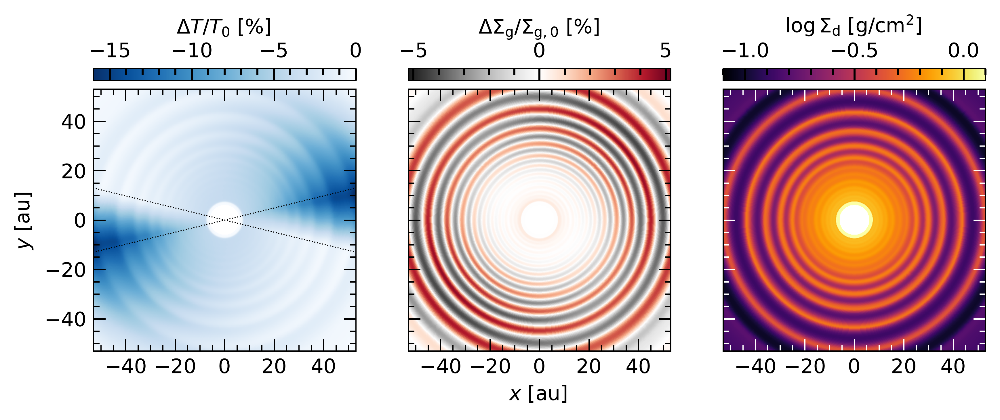
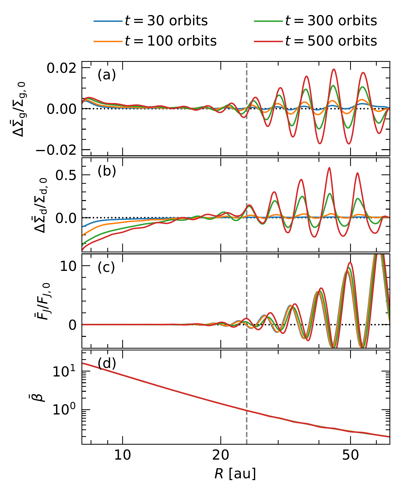
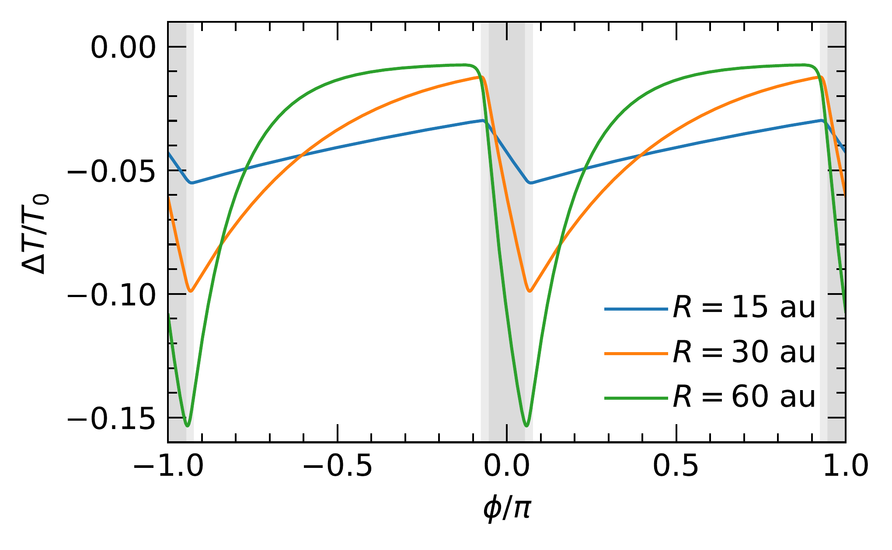

$\newcommand{\ensuremath}{}$
$\newcommand{\xspace}{}$
$\newcommand{\object}[1]{\texttt{#1}}$
$\newcommand{\farcs}{{.}''}$
$\newcommand{\farcm}{{.}'}$
$\newcommand{\arcsec}{''}$
$\newcommand{\arcmin}{'}$
$\newcommand{\ion}[2]{#1#2}$
$\newcommand{\textsc}[1]{\textrm{#1}}$
$\newcommand{\hl}[1]{\textrm{#1}}$
$\newcommand{\footnote}[1]{}$
$\newcommand{\tensor}[1]{\overline{\textbf{#1}}}$
$\newcommand{\tensorGR}[1]{\overline{\bm{{#1}}}}$
$\newcommand{\DP}[2]{\frac{\partial{#1}}{\partial{#2}}}$
$\newcommand{\D}[2]{\frac{\text{d}{#1}}{\text{d}{#2}}}$
$\newcommand{\ep}{e_\mathrm{p}}$
$\newcommand{\ap}{a_\mathrm{p}}$
$\newcommand{\G}{\text{G}}$
$\newcommand{\Mstar}{M_\star}$
$\newcommand{\Lstar}{L_\star}$
$\newcommand{\Rp}{R_\mathrm{p}}$
$\newcommand{\Mp}{M_\mathrm{p}}$
$\newcommand{\hp}{h_\mathrm{p}}$
$\newcommand{\Hp}{H_\mathrm{p}}$
$\newcommand{\Tp}{T_\mathrm{p}}$
$\newcommand{\Pp}{P_\mathrm{p}}$
$\newcommand{\Tb}{T_\mathrm{b}}$
$\newcommand{\Mth}{M_\mathrm{th}}$
$\newcommand{\Msun}{\mathrm{M}_\odot}$
$\newcommand{\Lsun}{\mathrm{L}_\odot}$
$\newcommand{\Mjup}{\mathrm{M}_\mathrm{J}}$
$\newcommand{\Rgas}{\mathcal{R}}$
$\newcommand{\cs}{c_\mathrm{s}}$
$\newcommand{\csiso}{c_\mathrm{s,iso}}$
$\newcommand{\csadb}{c_\mathrm{s}^\mathrm{ad}}$
$\newcommand{\OmegaK}{\Omega_\mathrm{K}}$
$\newcommand{\uK}{u_\mathrm{K}}$
$\newcommand{\mean}[1]{\langle{#1} \rangle}$
$\newcommand{\tauR}{\tau_\mathrm{R}}$
$\newcommand{\tauP}{\tau_\mathrm{P}}$
$\newcommand{\tauReff}{\tau_\mathrm{R}^\mathrm{eff}}$
$\newcommand{\tauPeff}{\tau_\mathrm{P}^\mathrm{eff}}$
$\newcommand{\taueff}{\tau_\mathrm{eff}}$
$\newcommand{\kappaR}{\kappa_\mathrm{R}}$
$\newcommand{\kappaP}{\kappa_\mathrm{P}}$
$\newcommand{\cv}{c_\mathrm{v}}$
$\newcommand{\rhomid}{\rho_\mathrm{mid}}$
$\newcommand{\sigmaSB}{\sigma_\mathrm{SB}}$
$\newcommand{\vel}{\bm{u}}$
$\newcommand{\xh}{{x}_\mathrm{h}}$
$\newcommand{\varpih}{{\varpi}_\mathrm{h}}$
$\newcommand{\tcool}{t_\mathrm{cool}}$
$\newcommand{\bcool}{\beta_\mathrm{cool}}$
$\newcommand{\bsurf}{\beta_\mathrm{surf}}$
$\newcommand{\bmid}{\beta_\mathrm{mid}}$
$\newcommand{\btot}{\beta_\mathrm{tot}}$
$\newcommand{\bcoll}{\beta_\mathrm{coll}}$
$\newcommand{\bbuoy}{\beta_\mathrm{buoy}}$
$\newcommand{\bdiff}{\beta_\text{diff}}$
$\newcommand{\bfld}{\beta_\mathrm{FLD}}$
$\newcommand{\Qvisc}{Q_\mathrm{visc}}$
$\newcommand{\Qcool}{Q_\mathrm{cool}}$
$\newcommand{\Qirr}{Q_\mathrm{irr}}$
$\newcommand{\Qrad}{Q_\mathrm{rad}}$
$\newcommand{\Qrelax}{Q_\mathrm{relax}}$
$\newcommand{\Erad}{E_\mathrm{rad}}$
$\newcommand{\aR}{a_\mathrm{R}}$
$\newcommand{\lrad}{l_\mathrm{rad}}$
$\newcommand{\Sigmag}{\Sigma_\mathrm{g}}$
$\newcommand{\Sigmad}{\Sigma_\mathrm{d}}$
$\newcommand{\velg}{\vel_\mathrm{g}}$
$\newcommand{\veld}{\vel_\mathrm{d}}$
$\newcommand{\St}{\mathrm{St}}$
$\newcommand{\Sc}{\mathrm{Sc}}$
$\newcommand{\ad}{a_\mathrm{d}}$
$\newcommand{\brhod}{\bar{\rho}_\mathrm{d}}$
$\newcommand{\sd}{s_\mathrm{d}}$
$\newcommand{\md}{m_\mathrm{d}}$
$\newcommand{\pluto}{\texttt{PLUTO}}$
$\newcommand{\fargo}{{\texttt{FARGO3D}}}$
$\newcommand{\optool}{\texttt{OpTool}}$
$\newcommand{\radmc}{\texttt{RADMC-3D}}$
$\newcommand{\simio}{\texttt{SIMIO-continuum}}$
$\newcommand{\casa}{\texttt{CASA}}$
$\newcommand{\thebibliography}{\DeclareRobustCommand{\VAN}[3]{##3}\VANthebibliography}$

# Spirals, rings, and vortices shaped by shadows in protoplanetary disks:\\from radiative hydrodynamical simulations to observable signatures

<mark>Appeared on: 2024-10-21</mark> -  _17 pages, 20 figures, 1 table; submitted to MNRAS; suggestions and comments welcome_

A. Ziampras, et al. -- incl., <mark>M. Benisty</mark>

**Abstract:** Numerous protoplanetary disks exhibit shadows in scattered light observations. These shadows are typically cast by misaligned inner disks and are associated with observable structures in the outer disk such as bright arcs and spirals. Investigating the dynamics of the shadowed outer disk is therefore essential in understanding the formation and evolution of these structures. We carry out twodimensional radiation hydrodynamics simulations that include radiative diffusion and dust--gas dynamics to study the formation of substructure in shadowed disks. We find that spiral arms are launched at the edge of each shadow, permeating the entire disk. The local dissipation of these spirals	results in an	angular momentum flux, opening multiple gaps and leading to a series of concentric, regularly-spaced rings	We find that ring formation is favored in weakly turbulent disks where dust growth is taking place. These conditions are met for typical class-II disks, in which bright rings should form well within a fraction of their lifetime ( $\sim$ 0.1--0.2 Myr). For hotter disks gap opening is more efficient, such that the gap edges quickly collapse into vortices that can appear as bright arcs in continuum emission before decaying into rings or merging into massive, long-lived structures. Synthetic observations show that these structures should be observable in scattered light and millimeter continuum emission, providing a new way to probe the presence of substructure in protoplanetary disks. Our results suggest that the formation of rings and gaps is a common process in shadowed disks, and can explain the rich radial substructure observed in several protoplanetary disks.

**Figure 17. -** The perturbed gas temperature (left) and gas surface density (middle) as well as the dust surface density (right) after $1000 P_0$. Two dark wedges are visible in the temperature structure, corresponding to the attenuated heating due to the "shadows" cast by an inner disk. A series of concentric rings is visible in all quantities, forming clearly visible features in the dust surface density. The shadow edges are marked with dashed lines in the left panel. The disk rotates counterclockwise. (*fig:fiducial*)

**Figure 5. -** Azimuthally averaged profiles of the perturbed gas and dust surface densities (panels *a* and *b*), the angular momentum flux $F_J$(panel *c*), and the cooling timescale $\beta$(panel *d*) as a function of radius and for several snapshots. The AMF is approximately constant over time, leading to deeper gaps and sharper features as the disk evolves. The disk is roughly separated into a featureless inner region and a ringed outer region at $R$\ap$prox 24$ au, which corresponds to $\beta$\ap$prox\beta_\text{crit}$(see Eq. \eqref{eq:bcrit}). The AMF is arbitrarily normalized to $F_{J,0}=10^{-10} $\Msun$ \text{au}^2/\text{yr}^2$. (*fig:fiducial-1D*)

**Figure 4. -** Azimuthal profile of the perturbed gas temperature at different radii at $t=1000 P_0$. The temperature perturbation is not symmetric about the shadow exits, and becomes smaller in the slowly-cooling inner disk. Shaded regions mark the two shadows. Gas moves to the right. (*fig:fiducial-T*)

