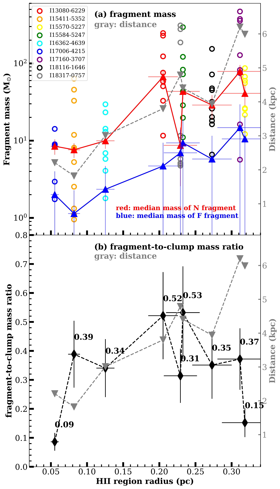

$\newcommand{\ensuremath}{}$
$\newcommand{\xspace}{}$
$\newcommand{\object}[1]{\texttt{#1}}$
$\newcommand{\farcs}{{.}''}$
$\newcommand{\farcm}{{.}'}$
$\newcommand{\arcsec}{''}$
$\newcommand{\arcmin}{'}$
$\newcommand{\ion}[2]{#1#2}$
$\newcommand{\textsc}[1]{\textrm{#1}}$
$\newcommand{\hl}[1]{\textrm{#1}}$
$\newcommand{\footnote}[1]{}$
$\newcommand{\hi}{H~\textsc{i}}$
$\newcommand{\hii}{H~\textsc{ii}}$
$\newcommand{\msun}{\rm M_\odot}$
$\newcommand{\lsun}{\rm L_\odot}$
$\newcommand{\kms}{km~s^{-1}}$
$\newcommand{\jybeam}{Jy beam^{-1}}$
$\newcommand{\mjybeam}{mJy beam^{-1}}$
$\newcommand{\hmole}{H_2}$
$\newcommand{\cm}{cm^{-2}}$
$\newcommand{\cmcube}{cm^{-3}}$
$\newcommand{\pressureunit}{K~cm^{-3}}$
$\newcommand{\hcop}{HCO^+}$
$\newcommand{\hcopone}{HCO^+~J=1-0}$
$\newcommand{\htcop}{H^{13}CO^+}$
$\newcommand{\htcopone}{H^{13}CO^+~J=1-0}$
$\newcommand{\hcn}{HCN}$
$\newcommand{\hcnone}{HCN~J=1-0}$
$\newcommand{\htcn}{H^{13}CN}$
$\newcommand{\htcnone}{H^{13}CN~J=1-0}$
$\newcommand{\cs}{CS}$
$\newcommand{\cstwo}{CS~J=2-1}$
$\newcommand{\sio}{SiO}$
$\newcommand{\siotwo}{SiO~J=2-1}$
$\newcommand{\siofive}{SiO~J=5-4}$
$\newcommand{\hctn}{HC_3N}$
$\newcommand{\hctnele}{HC_3N~J=11-10}$
$\newcommand{\hfourtyalpha}{H40\alpha}$
$\newcommand{\chtoh}{CH_3OH}$
$\newcommand{\chtohline}{CH_3OH 2(1,1)-1(1,0)A}$
$\newcommand{çh}{CCH}$
$\newcommand{çhline}{CCH~N_{J,F}=1_{3/2,2}-0_{1/2,1}}$
$\newcommand{çhhyperfine}{CCH~N_{J,F}=1_{3/2,1}-0_{1/2,0}}$
$\newcommand{\so}{SO}$
$\newcommand{\soline}{SO v =0, 3(2)-2(1)}$
$\newcommand{\nht}{NH_3}$
$\newcommand{\mclump}{M_{\rm clump}}$
$\newcommand{\rclump}{r_{\rm clp}}$
$\newcommand{\RGC}{R_{\rm GC}}$
$\newcommand{\mvir}{M_{\rm vir}}$
$\newcommand{\rvir}{R_{\rm vir}}$
$\newcommand{\mcore}{M_{\rm core}}$
$\newcommand{\sufdenscore}{\Sigma_{\rm core}}$
$\newcommand{\rcoreeff}{r_{\rm core,eff}}$
$\newcommand{\tkin}{T_{\rm kin}}$
$\newcommand{\tex}{T_{\rm ex}}$
$\newcommand{\tbg}{T_{\rm bg}}$
$\newcommand{\tr}{T_{\rm r}}$
$\newcommand{\te}{T_{\rm e}}$
$\newcommand{\pressurei}{P_{\rm i}}$
$\newcommand{\RecRate}{\dot{N}_{\rm rec}}$
$\newcommand{\IonRate}{\dot{N}_{\rm ion}}$
$\newcommand{\nelectron}{n_{\rm e}}$
$\newcommand{\tdyn}{t_{\rm dyn}}$
$\newcommand{\ci}{c_{\rm i}}$
$\newcommand{\nini}{n_{\rm ini}}$
$\newcommand{\ahfourtya}{A_{\rm H40\alpha}}$
$\newcommand{\lhfourtya}{L_{\rm H40\alpha}}$
$\newcommand{\fhfourtya}{\nu_{\rm H40\alpha}}$
$\newcommand{\rhfourtya}{r_{\rm H40\alpha,eff}}$
$\newcommand{\hcopabundance}{\chi(\hcop)}$
$\newcommand{\hncabundance}{\chi(\hnc)}$
$\newcommand{\nthpabundance}{\chi(\nthp)}$
$\newcommand{\nthphcopabundance}{\chi(\hcop)/\chi(\nthp)}$
$\newcommand{\nthphncabundance}{\chi(\hnc)/\chi(\nthp)}$
$\newcommand{\tcoab}{\chi(^{13}CO)}$
$\newcommand{\ceoab}{\chi(C^{18}O)}$
$\newcommand{\htcopab}{\chi_{\rm H^{13}CO^+}}$
$\newcommand{\co}{CO}$
$\newcommand{\tco}{^{13}CO}$
$\newcommand{\ceo}{C^{18}O}$
$\newcommand{\coone}{^{12}CO J=1-0}$
$\newcommand{\cotwo}{^{12}CO J=2-1}$
$\newcommand{\cothr}{^{12}CO J=3-2}$
$\newcommand{\tcoone}{^{13}CO J=1-0}$
$\newcommand{\tcotwo}{^{13}CO J=2-1}$
$\newcommand{\tcothr}{^{13}CO J=3-2}$
$\newcommand{\ceoone}{C^{18}O~J=1-0}$
$\newcommand{\ceotwo}{C^{18}O J=2-1}$
$\newcommand{\ceothr}{C^{18}O J=3-2}$
$\newcommand{◦ee}{^{\circ}}$
$\newcommand{\nhtcd}{N_{\rm H_{2}}}$
$\newcommand{\dustt}{T_{\rm dust}}$
$\newcommand{\nhtnd}{n_{\rm H_{2}}}$
$\newcommand{\nhtcdpeak}{N_{\rm H_{2}}^{\rm peak}}$
$\newcommand{\ncchcd}{N_{\rm CCH}}$
$\newcommand{\nnhtcd}{N_{\rm NH_{3}}}$
$\newcommand{\pnhtcd}{p_{N_{\rm H_{2}}}}$
$\newcommand{\pdustt}{p_{T_{\rm dust}}}$
$\newcommand{\vlsr}{\rm v_{lsr}}$
$\newcommand{\vinfall}{\rm v_{infall}}$
$\newcommand{\mjth}{M_{\rm J}^{\rm th}}$
$\newcommand{\lambdajth}{\lambda_{\rm J}^{\rm th}}$
$\newcommand{\mjthclump}{M_{\rm J, clp}^{\rm th}}$
$\newcommand{\lambdajthclump}{\lambda_{\rm J, clp}^{\rm th}}$
$\newcommand{\mjtotclump}{M_{\rm J, clp}^{\rm tot}}$
$\newcommand{\lambdajtotclump}{\lambda_{\rm J, clp}^{\rm tot}}$
$\newcommand{\mjflowclump}{M_{\rm J, clp}^{\rm com, flow}}$
$\newcommand{\lambdajflowclump}{\lambda_{\rm J, clp}^{\rm com, flow}}$
$\newcommand{\mjthens}{M_{\rm J, ens}^{\rm th}}$
$\newcommand{\lambdajthens}{\lambda_{\rm J, ens}^{\rm th}}$
$\newcommand{\Pex}{P_{\rm ex}}$
$\newcommand{\Pin}{P_{\rm in}}$
$\newcommand{\mach}{\mathcal{M}}$
$\newcommand{\mjtu}{M_{\rm J}^{\rm tu}}$
$\newcommand{\lambdajtu}{\lambda_{\rm J}^{\rm tu}}$
$\newcommand{\av}{A_{\rm v}}$
$\newcommand$
$\newcommand{\arraystretch}{1.0}$
$\newcommand{\arraystretch}{1.0}$
$\newcommand{\arraystretch}{1.0}$
$\newcommand{\arraystretch}{1.0}$
$\newcommand{\thebibliography}{\DeclareRobustCommand{\VAN}[3]{##3}\VANthebibliography}$

# ATOMS: ALMA three-millimeter observations of massive star-forming regions -- XVIII. On the origin and evolution of dense gas fragments in molecular shells of compact $\hii$ regions

<mark>Appeared on: 2024-10-24</mark> -  _Accepted by MNRAS, 24 pages, 14 figures_

S. Zhang, et al. -- incl., <mark>S. Li</mark>

**Abstract:** Fragmentation and evolution for the molecular shells of the compact $\hii$ regions are less explored compared to their evolved counterparts. We map nine compact $\hii$ regions with a typical diameter of 0.4 pc that are surrounded by molecular shells traced by çh. Several to a dozen dense gas fragments probed by $\htcop$ are embedded in these molecular shells. These gas fragments, strongly affected by the $\hii$ region, have a higher surface density, mass, and turbulence than those outside the shells but within the same pc-scale natal clump. These features suggest that the shells swept up by the early $\hii$ regions can enhance the formation of massive dense structures that may host the birth of higher-mass stars.  We examine the formation of fragments and find that fragmentation of the swept-up shell is unlikely to occur in these early $\hii$ regions, by comparing the expected time scale of shell fragmentation with the age of $\hii$ region. We propose that the appearance of gas fragments in these shells is probably the result of sweeping up pre-existing fragments into the molecular shell that has not yet fragmented. Taken together, this work provides a basis for understanding the interplay of star-forming sites with an intricate environment containing ionization feedback such as those observed in starburst regions.

**Figure 6. -** $\htcop$one emission and extracted fragments. The color images show the $\htcop$one moment 0 maps (PB corrected) produced by the technique described in $\ci$tet{Dame2011} with a channel clipping level of $4\times\rm rms$. The red and cyan contours outline the extracted fragments close to and far from the central $\hi$i regions (N and F fragments; see Section \ref{SECTION:INFLUENCE}), respectively. Pink contours indicate the edges of $\hi$i regions. Magenta circles indicate the peaks of angular two-point correlation function (solid: first peak, dashed: second peak) discussed in Section \ref{SUBSECTION:FRAGMENTATION-DISTRIBUTION}. The lime lines are the $\tex$ttt{minimum spanning tree (MST)} connections for the N fragments probably located in shell. The two black circles indicate the 20\% and 30\% power points of PB. (*FIGURE:NORMAL2*)

**Figure 4. -** Fragment mass, fragment-to-clump mass ratio, and their relations with radius of corresponding $\hi$i regions. The distance to the Earth for each region is indicated by gray dashed lines (corresponding to right y-axis) in panels (a) and (b). Panel (a) The red and blue lines indicate the variation of N and F fragments median mass with radius of $\hi$i region, respectively. Dots only show the N fragments. Panel (b) Mass ratio of total N fragments to natal clump (black lines and triangles). The numbers indicate the corresponding values of mass ratio.  (*FIGURE:MASS_GROWTH*)

**Figure 5. -** Compact $\hi$i regions in this work. The color images display the $\hfourtyalpha$ moment 0 maps created using the technique described in $\ci$tet{Dame2011}, with a channel clipping level of $4\times\rm rms$. The black solid contours and the gray dashed contours represent the çh emission and the ATLASGAL 870 \micron emission $\ci$tep{Schuller2009}, respectively. The contour levels start from 20\% of the maximum to the maximum with eight evenly spaced steps on a linear scale and on a logarithmic scale, respectively. The yellow contours and the red circles indicate the edges of $\hi$i regions and their corresponding circular sizes $r_{\rm H40\alpha,eff}$, as described in Section \ref{SECTION:HII-REGION}. All moment 0 maps shown here have been corrected by primary beam (PB). Two black circles indicate the 20\% and 30\% power points of PB, respectively. Note that the çhline line of I15570$-$5227 and I17160$-$3707 is located on the border of the spectral window and therefore only a part of the çhline emission channels are actually integrated. (*FIGURE:NORMAL1*)

