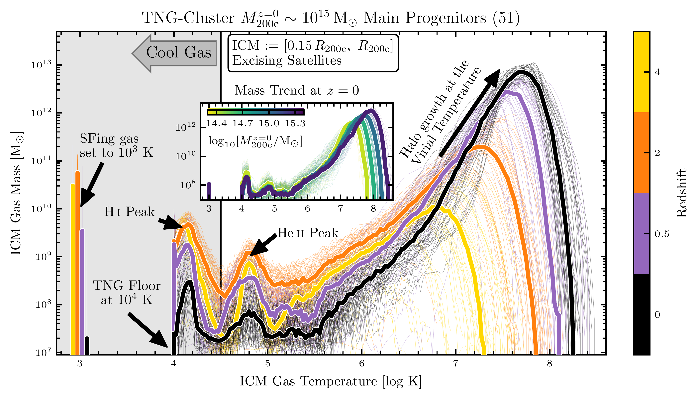

$\newcommand{\ensuremath}{}$
$\newcommand{\xspace}{}$
$\newcommand{\object}[1]{\texttt{#1}}$
$\newcommand{\farcs}{{.}''}$
$\newcommand{\farcm}{{.}'}$
$\newcommand{\arcsec}{''}$
$\newcommand{\arcmin}{'}$
$\newcommand{\ion}[2]{#1#2}$
$\newcommand{\textsc}[1]{\textrm{#1}}$
$\newcommand{\hl}[1]{\textrm{#1}}$
$\newcommand{\footnote}[1]{}$
$\newcommand{\orcid}[1]{\href{https://orcid.org/#1}{\includegraphics[scale=0.08]{ORCID-iD_icon-128x128.png}}}$
$\newcommand$
$\newcommand{\mvir}{M_{\rm 200c}}$
$\newcommand{\mvirhost}{\mvir^{\rm host}}$
$\newcommand{\rvir}{R_{\rm 200c}}$
$\newcommand{\rvirhost}{\rvir^{\rm host}}$
$\newcommand{\mgas}{M_{\rm gas}}$
$\newcommand{\mgassat}{M_{\rm gas}^{\rm sat}}$
$\newcommand{\mcgas}{M_{\rm CoolGas}}$
$\newcommand{\mcgassat}{\mcgas^{\rm sat}}$
$\newcommand{\mcgassub}{\mcgas^{\rm subhalo}}$
$\newcommand{\mcgasicm}{\mcgas^{\rm ICM}}$
$\newcommand{\mcgascgm}{\mcgas^{\rm CGM}}$
$\newcommand{\fcgasicm}{f_{\rm CoolGas}^{\rm ICM}}$
$\newcommand{\mstar}{M_\star}$
$\newcommand{\mstarsat}{\mstar^{\rm sat}}$
$\newcommand{\rhalfstar}{R_{\rm half,\star}}$
$\newcommand{\rgal}{R_{\rm gal}}$
$\newcommand{\dsathost}{d_{\rm sat}^{\rm host}}$
$\newcommand{\sublink}{\textsc{sublink} }$
$\newcommand{\sublinkgal}{\sublink\_\textsc{gal} }$
$\newcommand{\subfind}{\textsc{subfind} }$
$\newcommand{\tcoolgas}{T_{\rm CoolGas}}$
$\newcommand{\tvir}{T_{\rm vir}}$
$\newcommand{\tcool}{t_{\rm cool}}$
$\newcommand{\tff}{t_{\rm ff}}$
$\newcommand{\msun}{{\rm M}_\odot}$
$\newcommand{\kpc}{{\rm kpc}}$
$\newcommand$
$\newcommand$
$\newcommand{\ez}[1]{\textcolor[rgb]{1.0, 0.55, 0}{(#1)}}$
$\newcommand{\reza}[1]{\color{orange}#1\color{black}}$
$\newcommand{\rezac}[1]{\color{orange}\textit{[#1]}\color{black}}$
$\newcommand{\rezas}[1]{\color{orange}\sout{#1} \color{black}}$

# The cooler past of the intracluster medium in TNG-Cluster

<mark>Appeared on: 2024-10-29</mark> -  _Resubmitted to MNRAS after initial positive referee report. See further TNG-Cluster papers from Marine Prunier and Urmila Chadayammuri over the next days and on the TNG-Cluster website: this https URL_

<mark>E. Rohr</mark>, et al. -- incl., <mark>A. Pillepich</mark>

**Abstract:** The intracluster medium (ICM) today is comprised largely of hot gas with clouds of cooler gas of unknown origin and lifespan. We analyze the evolution of cool gas (temperatures $\lesssim10^{4.5}$ K) in the ICM of 352 galaxy clusters from the TNG-Cluster simulations, with present-day mass $\sim10^{14.3-15.4} \msun$ . We follow the main progenitors of these clusters over the past $\sim13$ billion years (since $z\lesssim7$ ) and find that, according to TNG-Cluster, the cool ICM mass increases with redshift at fixed cluster mass, implying that this cooler past of the ICM is due to more than just halo growth. The cool cluster gas at $z\lesssim0.5$ is mostly located in and around satellite galaxies, while at $z\gtrsim2$ cool gas can also accrete via filaments from the intergalactic medium. Lower-mass and higher-redshift clusters are more susceptible to cooling. The cool ICM mass correlates with the number of gaseous satellites and inversely with the central supermassive black hole (SMBH) mass. $\er{The average number of gaseous satellites decreases since $z=2$, correlating with the decline in the cool ICM mass over cosmic time, suggesting a link between the two.}$ Concurrently, kinetic SMBH feedback shifts the ICM temperature distribution, decreasing the cool ICM mass inside-out. At $z\approx0.5$ , the predicted $\ion{Mg}{ii}$ column densities are in the ballpark of recent observations, where satellites and other halos contribute significantly to the total $\ion{Mg}{ii}$ column density. Suggestively, a non-negligible amount of the ICM cool gas forms stars in-situ at early times, reaching $\sim10^{2} \msun{\rm yr^{-1}}$ and an H $\alpha$ surface brightness of $\sim10^{-17} {\rm erg s^{-1} cm^{-2} arcsec^{-2}}$ at $z\approx2$ , detectable with Euclid and JWST.

**Figure 6. -** ** The evolution of the ICM temperatures, cool gas masses, cool ICM to total halo, and cool ICM to total ICM mass fractions in TNG-Cluster since $\mathbf{z=4**$.}
    The ICM is all FoF gas in the aperture $[0.15, 1.0]$\rvir$$, excising satellites. Cool gas has temperatures $\leq 10^{4.5}$ K.
    _Main Panel_: The distribution of ICM temperatures of each cluster of $z=0$ mass $\sim10^{15} $\msun$$(51 clusters) as thin curves and the median of this sample as thick curves, where the color denotes the redshift. In the inset we show how the ICM temperature distribution varies with cluster mass today. We label prominent features in the ICM temperature distribution (see text for details; we offset the star-forming gas temperatures slightly for visibility).
    _Bottom Panels_: \er{The cool ICM mass (left), cool ICM to total cluster (center), and cool ICM to total ICM (right) mass fractions as functions of cluster mass and redshift (color) for all 352 clusters (and cluster-progenitors) in TNG-Cluster}. We plot each cluster as circles and the median trend with mass as thick curves, colored by redshift.
    According to TNG-Cluster, the ICM of cluster progenitors were cooler, having more total cool gas, cooler average temperatures, and a larger ICM mass fraction in cool gas.
     (*fig:ICMGasEvolution*)

**Figure 10. -** ** According to TNG-Cluster, at a fixed cluster mass and redshift, the cool ICM mass correlates with the number of gaseous satellites, and clusters tend to have fewer gaseous satellites today than in the past.**_Top Panels_: At $z=0$ and 2 (black-outlined circles, orange-outlined squares), we demonstrate that at a fixed redshift the cool ICM mass increases with the relative number of satellites, that is, with the percentage difference between the number of satellites in a given cluster and the average number in a corresponding narrow bin of halo mass. Here, we only consider satellites with a stellar mass $>10^9  $\msun$$, a gas to stellar mass fraction $>1$ per cent, and within a cluster-centric distance $<$\rvir$$.
    _Bottom Panel_: We show the evolution of the number of gaseous satellites per cluster over the past $\approx13$ billion years for all 352 clusters (thin curves), colored by their $z=0$ cluster mass (medians within a $z=0$ cluster mass bin as thick curves). Namely for all considered masses today, clusters have fewer gaseous satellites today than in the past at $z\approx1-2$, at least partially explaining why the cool ICM mass decreases with time.
     (*fig:ICMCGM_Nsatellites*)

**Figure 13. -** **Clusters and their progenitors contain $\ion${Mg**{ii} gas in TNG-Cluster.}_Top panels_: We show the evolution of the $\ion${Mg}{ii} column density for an example cluster of $z=0$ mass $\sim 10^{15.3}  $\msun$$, including gas (top: excluding satellites; bottom: including satellites and foreground+background halos) within a line-of-sight velocity $<2000  {\rm km  s^{-1}}$ of the BCG. The annotations and method are as in Fig. \ref{fig:CoolGasSurfaceDensity_mosaic}.
    _Bottom panels_: The $\ion${Mg}{ii} column density radial profiles in clusters of present-day mass $\sim10^{15}  $\msun$$ across cosmic time (left) and for all clusters of mass $\sim10^{13.75-15.25}  $\msun$$ at $z=0.5$. The thin curves show the profiles for individual clusters, including gas within the a line of sight velocity $<2000  {\rm km  s^{-1}}$ of the BCG and excluding satellites, where we include the medians as thick curves. The dashed curves show the median profiles when also including satellites. We include stacked observational comparisons of clusters from \citet[][circle]{Fresco2024}, \citet[][triangles]{Anand2022}, and \citet[][squares]{Mishra2022}, which are colored to match the average redshift (left) and cluster mass (right); see text for details.
     (*fig:mgii_comparison*)

