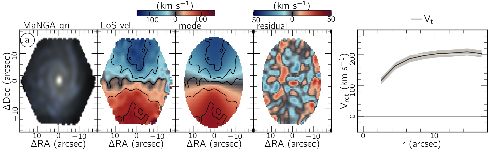
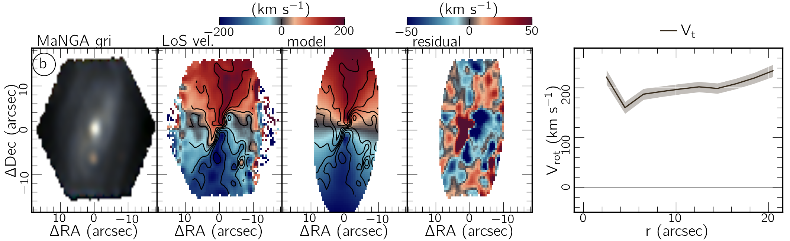
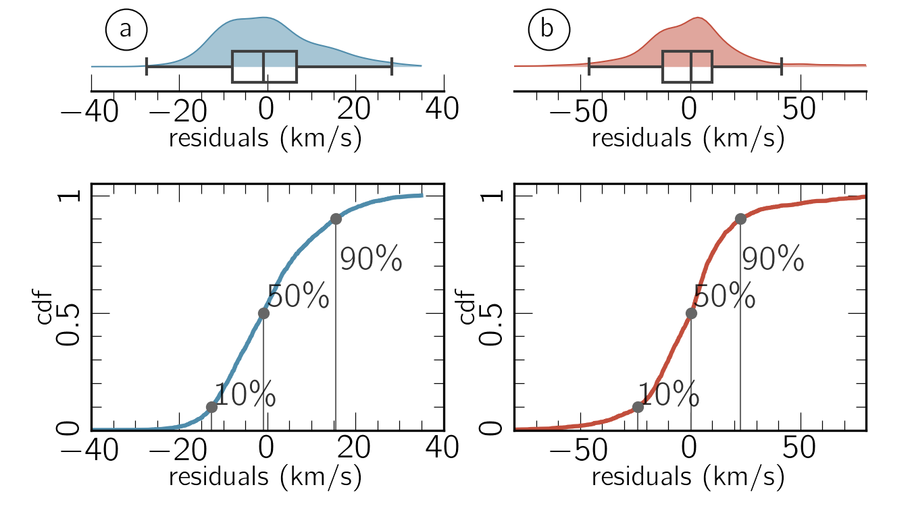
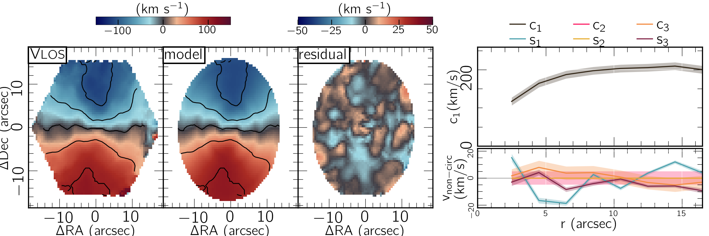
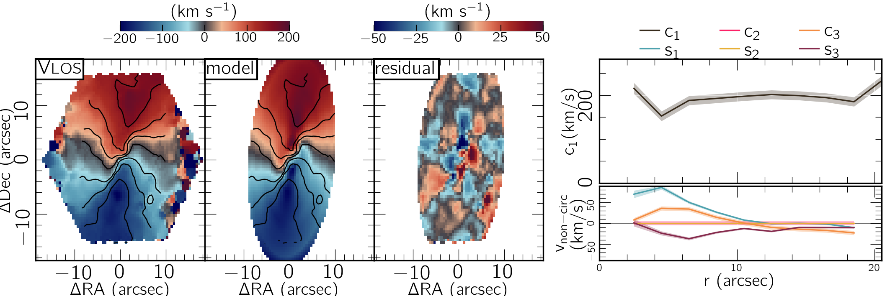
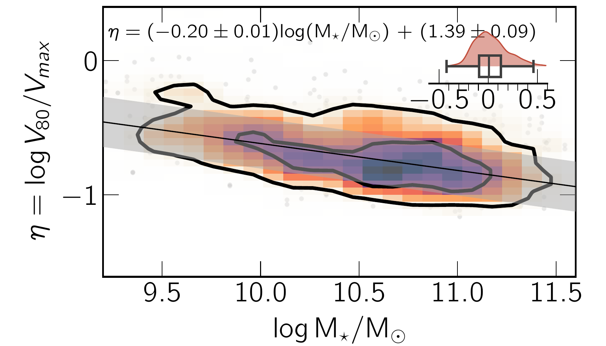
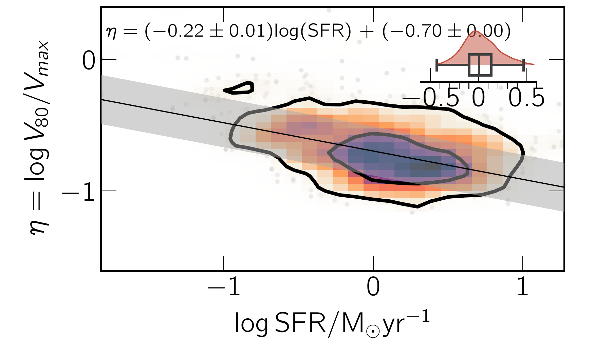

$\newcommand{\ensuremath}{}$
$\newcommand{\xspace}{}$
$\newcommand{\object}[1]{\texttt{#1}}$
$\newcommand{\farcs}{{.}''}$
$\newcommand{\farcm}{{.}'}$
$\newcommand{\arcsec}{''}$
$\newcommand{\arcmin}{'}$
$\newcommand{\ion}[2]{#1#2}$
$\newcommand{\textsc}[1]{\textrm{#1}}$
$\newcommand{\hl}[1]{\textrm{#1}}$
$\newcommand{\footnote}[1]{}$
$\newcommand{\vdag}{(v)^\dagger}$
$\newcommand$
$\newcommand$
$\newcommand{\XS}{{\tt XookSuut}}$
$\newcommand{\xs}{{\tt XS}}$
$\newcommand{\diskfit}{{\tt DiskFit}}$
$\newcommand{\kms}{km s^{-1}}$
$\newcommand{\PAdisk}{\phi_\mathrm{disk}^\prime}$
$\newcommand{\PAbar}{\phi_\mathrm{bar}}$
$\newcommand{\PAbarkin}{\phi_\mathrm{bar,kin}^\prime}$
$\newcommand{\PAbarphot}{\phi_\mathrm{bar,phot}^\prime}$
$\newcommand{\sn}{S/N}$
$\newcommand{\hi}{\ion{H}{1}}$
$\newcommand{\hii}{\ion{H}{2}}$
$\newcommand{\hei}{\ion{He}{i}}$
$\newcommand{\heii}{\ion{He}{ii}}$
$\newcommand{\Ni}{[\ion{N}{i}]}$
$\newcommand{\nii}{[\ion{N}{2}]}$
$\newcommand{\oi}{[\ion{O}{i}]}$
$\newcommand{\OI}{\ion{O}{i}}$
$\newcommand{\oii}{[\ion{O}{ii}]}$
$\newcommand{\nai}{\ion{Na}{i}}$
$\newcommand{\oiii}{[\ion{O}{3}]}$
$\newcommand{\sii}{[\ion{S}{ii}]}$
$\newcommand{\siii}{[\ion{S}{iii}]}$
$\newcommand{\ha}{H\alpha}$
$\newcommand{\ewha}{\mathrm{W_{H\alpha}}}$
$\newcommand{\hb}{H\beta}$
$\newcommand{\feii}{[\ion{Fe}{ii}]}$
$\newcommand{\cliii}{[\ion{Cl}{iii}]}$
$\newcommand{\ariii}{[\ion{Ar}{iii}]}$
$\newcommand{\SiII}{\ion{Si}{ii}}$
$\newcommand{\comm}[1]$

# On the role of non-circular motions in MaNGA galaxies I: global properties

<mark>Appeared on: 2024-10-29</mark> -  _13 pages, 10 figures. Accepted for publication in ApJ_

C. López-Cobá, L. Lin, <mark>J. Neumann</mark>, M. A. Bershady

**Abstract:** Non-circular (NC) motions represent the imprints of non-axisymmetric structures in galaxies, providing opportunities to study the physical properties of gas departing from circular rotation. In this work we have conducted a systematic study of the non-circular motions in a sample of 1624 gas-rich disk galaxies from the MaNGA MPL-11. By using the $\ha$ velocity as a tracer of the disk rotation, we find indications that the amplitude of the non-circular motions is related to the stellar mass, with the low mass and late-type galaxies the most affected. In our sample, we find ratios of circular to non-circular rotation ranging from 5 \% to  20 \% .By implementing harmonic models to include NC motions associated with spiral arms and stellar bars, we find that the rotational curves traced with $\ha$ are barely affected by the NC induced by these structures. Consequently, in our sample, we do not find evidence that NC motions contribute to the scatter of the stellar Tully-Fisher relation. Our results suggest that non-circular motions might have a more localized effect in galaxies rather than a global one.

**Figure 8. -** {  \it Top figures:}  Modeling of the $\ha$ velocity field adopting circular rotation only for the manga object 8147-12703 (tagged with the letter $a$), and for  10842-12704  (tagged with $b$). _ From left to right:_$gri$ colour composite image with filters extracted from the datacube; $\ha$ velocity map; best circular rotation model from $\xs$; residual map obtained from subtracting the best kinematic model to the $\ha$ velocity; rotational curve. {  \it Bottom figures:}
Half-violin plot and box plot of the residual velocities of objects $a$(blue) and $b$(red); bottom plots show the corresponding cumulative distribution function of residuals, with vertical lines showing the 10th, 50th, and 90th percentiles.
 (*fig:circular*)

**Figure 9. -**  Similar as Figure \ref{fig:circular}, but for the harmonic decomposition model. Note that  $s_2(r) = c_2(r) = 0 \forall r$ as required by the model from equation. \ref{Eq:m=3}. (*fig:harmonic*)

**Figure 5. -** _ Top panel:_ 2D histogram showing the distribution of the $\eta$ parameter versus the stellar mass for the objects in the kinematic sample. Colors represent the density of points within each bin, with darker colors representing regions with a larger density of objects. The inner and outer contours enclose 68\% and 95\% percent of the data, respectively.
The black straight line represents the best Bayesian linear fit to these points, with $1\sigma$ scatter shown with gray color; the half violin plot shows the residuals respect the best fit line. _ Middle and bottom panels:_ Similar figures as above but for the integrated $\ha$ based SFR and specific SFR, respectively. (*fig:q95Mstar*)

