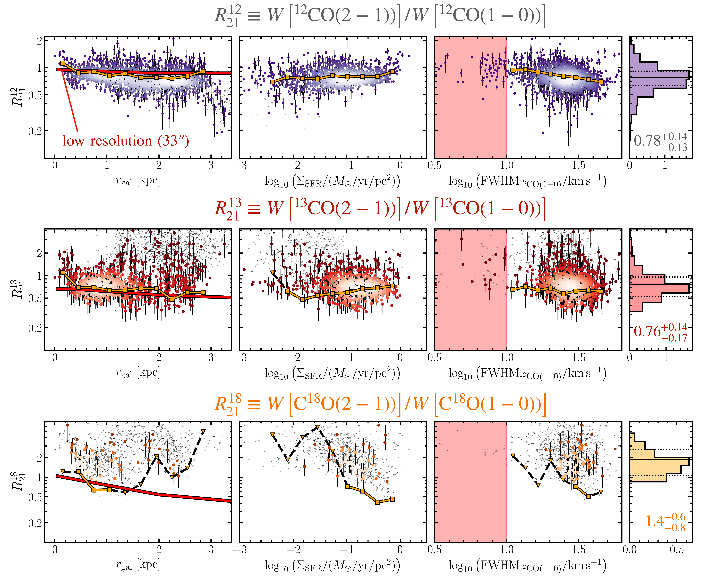
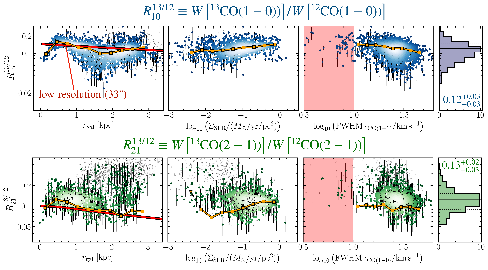

$\newcommand{\ensuremath}{}$
$\newcommand{\xspace}{}$
$\newcommand{\object}[1]{\texttt{#1}}$
$\newcommand{\farcs}{{.}''}$
$\newcommand{\farcm}{{.}'}$
$\newcommand{\arcsec}{''}$
$\newcommand{\arcmin}{'}$
$\newcommand{\ion}[2]{#1#2}$
$\newcommand{\textsc}[1]{\textrm{#1}}$
$\newcommand{\hl}[1]{\textrm{#1}}$
$\newcommand{\footnote}[1]{}$
$\newcommand{\vdag}{(v)^\dagger}$
$\newcommand$
$\newcommand$
$\newcommand{\arraystretch}{1.3}$

# CO isotopologue-derived molecular gas conditions and CO-to-$H_2$ conversion factors in M51

<mark>Appeared on: 2024-10-30</mark> -  _accepted for publication in AJ; 31 pages, 16 figures, 7 tables_

J. d. Brok, et al. -- incl., <mark>E. Schinnerer</mark>, <mark>S. Stuber</mark>

**Abstract:** Over the past decade, several millimeter interferometer programs have mapped the nearby star-forming galaxy M51 at a spatial resolution of ${\le}170$ pc. This study combines observations from three major programs: the $*PdBI Arcsecond Whirlpool Survey*$ (PAWS), the SMA M51 large program (SMA-PAWS), and the $*Surveying the Whirlpool at Arcseconds with NOEMA*$ (SWAN). The dataset includes the (1-0) and (2-1) rotational transitions of $^{12}$ CO, $^{13}$ CO, and C $^{18}$ O isotopologues. ${The observations cover the $r{<}\rm 3 kpc$ region including center and part of the disk, thereby ensuring strong detections of the weaker $^{13}$CO and C$^{18}$O lines.}$ All observations are convolved in this analysis to an angular resolution of 4 $\arcsec$ , corresponding to a physical scale of ${\sim}$ 170 pc. We investigate empirical line ratio relations and quantitatively evaluate molecular gas conditions such as temperature, density, and the CO-to-$H_2$ conversion factor ( $\alpha_{\rm CO}$ ). We employ two approaches to study the molecular gas conditions: (i) assuming local thermal equilibrium (LTE) to analytically determine the CO column density and $\alpha_{\rm CO}$ , and (ii) using non-LTE modeling with \texttt{RADEX} to fit physical conditions to observed CO isotopologue intensities. We find that the $\alpha_{\rm CO}$ values ${in the center and along the inner spiral arm}$ are $\sim$ 0.5 dex (LTE) and ${\sim}$ 0.1 dex (non-LTE) below the Milky Way inner disk value. The average non-LTE $\alpha_{\rm CO}$ is $2.4{\pm}0.5$ M $_\odot$ pc $^{-2}$ (K km s $^{-1}$ ) $^{-1}$ . While both methods show dispersion due to underlying assumptions, the scatter is larger for LTE-derived values. This study underscores the necessity for robust CO line modeling to accurately constrain the molecular ISM's physical and chemical conditions in nearby galaxies.

**Figure 8. -** ** CO Isotopologue Ratio Trends** These panels show the line ratio as a function of galactocentric radius (left), SFR surface density (middle), and FWHM of $^{12}$CO(1-0) (right) panel. Only lines of sight within the NOEMA field-of-view are considered. We show the individual sightlines where both lines have $\rm S/N{\ge}5$ as colored points. The small black triangles indicate 5$\sigma$ upper limits. In addition, the orange line depicts the stacked line ratio trend. We stack all points for which $^{12}$CO(1-0) is significantly detected. The red line in the left panels is the radial trend obtained at low-angular resolution from \citetalias{denBrok2022}. The red shaded region in the right panels indicates where the FWHM is below two times the channel width of our data (10 km s$^{-1}$). The histograms show the distribution of these significantly detected data points per line ratio. The black line represents the weighted average (weighted by the $^{12}$CO(1-0) intensity) and the dotted lines the weighted 16$^{\rm th}$-to-84$^{\rm th}$ percentile range. (*fig:rgal_ratio*)

**Figure 1. -** ** Spatial Coverage of Observations** In this study, we rely on Plateau de Bure Interferometer (PdBI), Northern Extended Millimeter Array (NOEMA), and Submillimeter Array (SMA) observations, each of which covered some extent of the disk of M51. The boxes indicate which lines were observed by each respective program. Background HST image credit: NASA, ESA, S. Beckwith (STScI), and The Hubble Heritage Team (STScI/AURA). (*fig:outline*)

**Figure 9. -** ** CO Isotopologue Ratio Trends (continued).** These panels have the same description as in \autoref{fig:rgal_ratio}. (*fig:rgal_ratio_2*)

