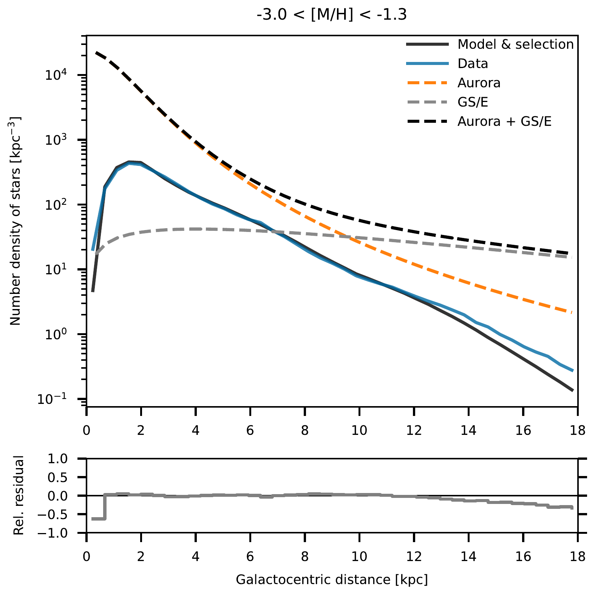
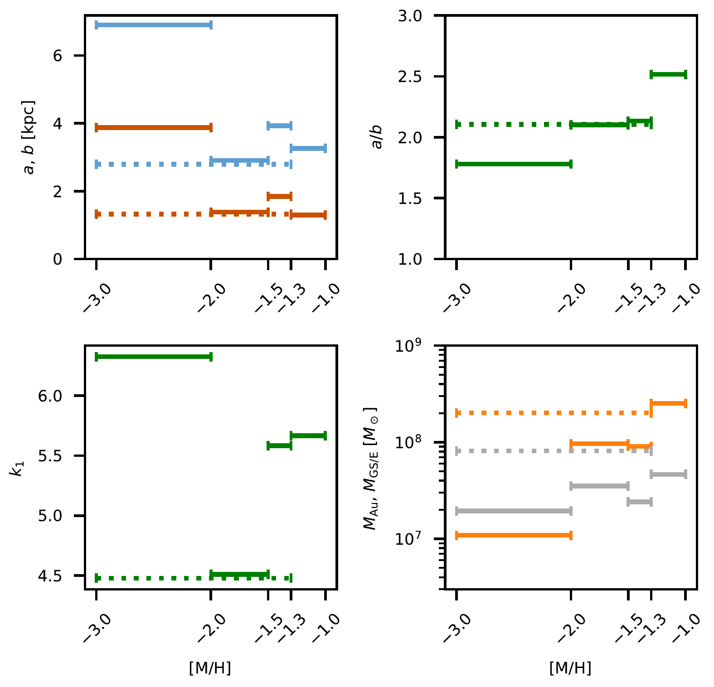
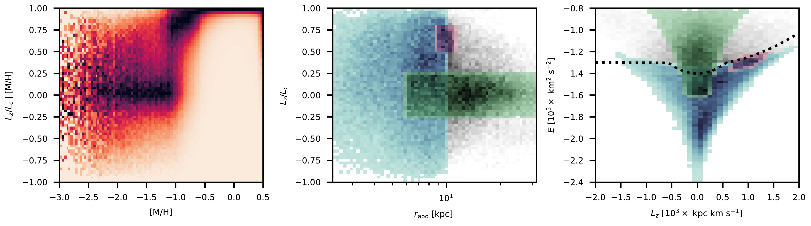

$\newcommand{\ensuremath}{}$
$\newcommand{\xspace}{}$
$\newcommand{\object}[1]{\texttt{#1}}$
$\newcommand{\farcs}{{.}''}$
$\newcommand{\farcm}{{.}'}$
$\newcommand{\arcsec}{''}$
$\newcommand{\arcmin}{'}$
$\newcommand{\ion}[2]{#1#2}$
$\newcommand{\textsc}[1]{\textrm{#1}}$
$\newcommand{\hl}[1]{\textrm{#1}}$
$\newcommand{\footnote}[1]{}$
$\newcommand{\note}[1]{\textit{\textcolor{red}{#1}}}$
$\newcommand{\mathdash}{ \text{---} }$
$\newcommand{\diff}[2]{{\frac{d{#1}}{d{#2}}}}$
$\newcommand{\pdiff}[2]{{\frac{\partial{#1}}{\partial{#2}}}}$
$\newcommand{\vec}[1]{{\bm{\mathrm{#1}}}}$

# The realm of Aurora. Density distribution of metal-poor giants in the heart of the Galaxy

<mark>Appeared on: 2024-10-30</mark> -  _Submitted to MNRAS_

E. P. Kurbatov, et al. -- incl., <mark>T. Cantat-Gaudin</mark>, <mark>M. Fouesneau</mark>, <mark>H.-W. Rix</mark>

**Abstract:** The innermost portions of the Milky Way's stellar halo have avoided scrutiny until recently. The lack of wide-area survey data, made it difficult to reconstruct an uninterrupted view of the density distribution of the metal-poor stars inside the Solar radius. In this study, we utilize red giant branch (RGB) stars from _Gaia_ , with metallicities estimated using spectrophotometry from _Gaia_ Data Release 3. Accounting for _Gaia_ 's selection function, we examine the spatial distribution of metal-poor ( [ M/H ] $<-1.3$ ) RGB stars, from the Galactic center ( $r \approx 1$ kpc) out to beyond the Solar radius ( $r \approx 18$ kpc). Our best-fitting single-component cored power-law model shows a vertical flattening of $\approx 0.5$ and a slope $\approx -3.4$ , consistent with previous studies. Motivated by the mounting evidence for two distinct stellar populations in the inner halo, we additionally test a range of two-component models. One of the components models the tidal debris from the _Gaia_ Sausage/Enceladus merger, while the other captures the Aurora population -- stars that predate the Galactic disk formation. Our best-fit two-component model suggests that both populations contribute equally around the Solar radius, but Aurora dominates the inner halo with a steeper power-law index of $\approx -4.5$ , in agreement with the nitrogen-rich star distribution measured by [ and Horta (2021)](https://ui.adsabs.harvard.edu/abs/2021MNRAS.500.5462H) .

**Figure 7. -** DPL Aurora \& SC GS/E model. Radial density profiles for sample (blue line), for Aurora model (dashed orange line), for GS/E model (dashed grey), for sum of the last two (dashed black), and for total density after selections applied (solid black line). Bottom panel shows the relative residuals between the sample and the model after the selections applied: $(\mathtt{model} - \mathtt{data}) / (\mathtt{model} + \mathtt{data})$. (*fig:model-two-comp-radial*)

**Figure 6. -** A two-component model with DPL Aurora \& SC GS/E. Similar to Figure \ref{fig:model-summary-nogse}, this gives  a summary of the best-fit model parameters in various metallicity bins, see \autoref{tab:summary-dpl}. ** Top left panel:** horizontal (blue) and vertical (red) scales of the model. ** Top right:** Flattening $a/b$. ** Bottom left:** Power-law index of the inner slope.  ** Bottom right:** Estimated stellar mass of the Aurora (orange) and the GS/E (grey) populations. (*fig:model-two-comp-params*)

**Figure 14. -** Orbital properties of the vetted RGB sample in [Andrae, Rix and Chandra (2023)](https://ui.adsabs.harvard.edu/abs/2023ApJS..267....8A). ** Left:** Column-normalized distribution of orbital circularity vs. metallicity. ** Middle:** orbital circularity vs. apocentric distance. ** Right:** energy vs. the vertical component of the angular momentum. In the last two panels, stars are subjected to a metallicity selection $-2.0 < [\mathrm{M}/\mathrm{H}] \leq -1.5$. The approximate locations of two halo populations are marked in colour: the Aurora stars are in blue, and the GS/E stars are in green. The stars likely captured by bar resonances  are shown in magenta. See Section \ref{sec:sample-selection} for further details. The dotted black line in the right panel shows the boundary  separating the in-situ and accreted populations according to [Belokurov and Kravtsov (2023)](https://ui.adsabs.harvard.edu/abs/2023MNRAS.525.4456B). (*fig:data-kinem-all*)

