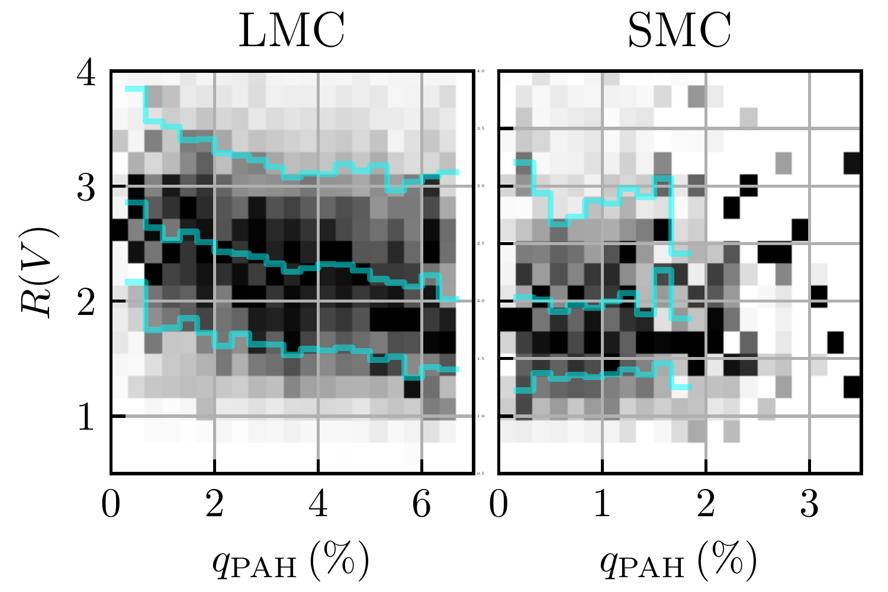
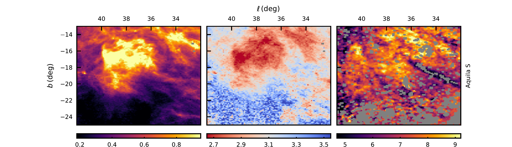
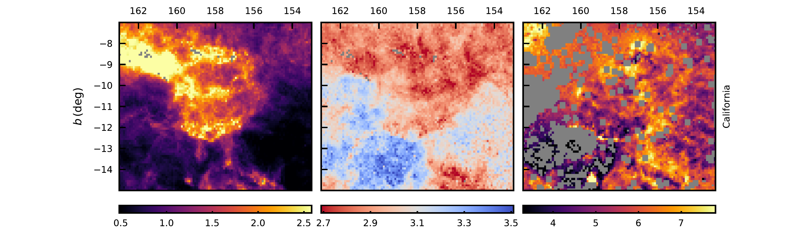
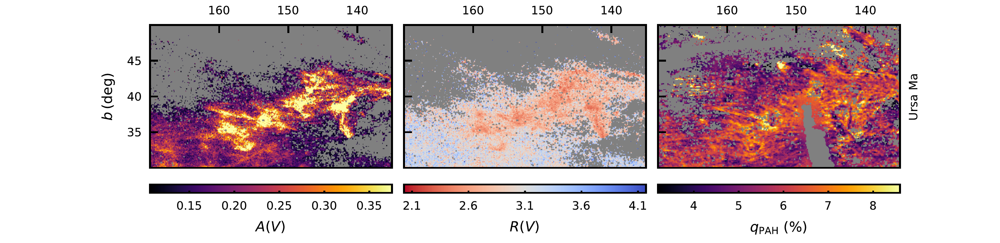
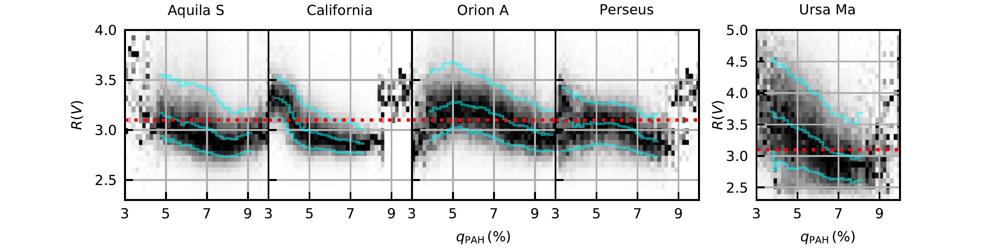

$\newcommand{\ensuremath}{}$
$\newcommand{\xspace}{}$
$\newcommand{\object}[1]{\texttt{#1}}$
$\newcommand{\farcs}{{.}''}$
$\newcommand{\farcm}{{.}'}$
$\newcommand{\arcsec}{''}$
$\newcommand{\arcmin}{'}$
$\newcommand{\ion}[2]{#1#2}$
$\newcommand{\textsc}[1]{\textrm{#1}}$
$\newcommand{\hl}[1]{\textrm{#1}}$
$\newcommand{\footnote}[1]{}$
$\newcommand{\vdag}{(v)^\dagger}$
$\newcommand$
$\newcommand$
$\newcommand$

# Dust extinction-curve variation in the translucent interstellar medium is driven by PAH growth

<mark>Appeared on: 2024-10-31</mark> -  _11 pages, 6 figures, submitted on October 30, 2024_

<mark>X. Zhang</mark>, B. S. Hensley, G. M. Green

**Abstract:** The first all-sky, high-resolution, 3D map of the optical extinction curve of the Milky Way \citep{ZG24a} revealed an unexpected steepening of the extinction curve in the moderate-density, "translucent" interstellar medium (ISM). We argue that this trend is driven by growth of polycyclic aromatic hydrocarbons (PAHs) through gas-phase accretion. We find a strong anti-correlation between the slope of the optical extinction curve -- parameterized by $R(V)$ -- and maps of PAH abundance -- parameterized by $q_{\rm PAH}$ -- derived from infrared emission. The range of observed $q_{\rm PAH}$ indicates PAH growth by a factor of $\sim$ 2 between $A_V \simeq 1$ and 3. This implies a factor-of-two stronger 2175 Å feature, which is sufficient to lower $R(V)$ by the observed amount. This level of PAH growth is possible given rapid accretion timescales and the depletion of carbon in the translucent ISM. Spectral observations by JWST would provide a definitive test of this proposed explanation of $R(V)$ variation.

**Figure 1. -** Quantitative comparison on the per-star basis between $R(V)$ and $q_\mathrm{PAH}$ in LMC (left panel) and SMC (right panel). The median value of $R(V)$ decreases by $0.4$ as $q_\mathrm{PAH}$ increases from $1\%$ to $6\%$ in the LMC. In the SMC, the trend is not clear because of small variation range of $q_\mathrm{PAH}$ as well as the difference in spatial coverage of both maps.
     (*fig:quant_Rv_qPAH*)

**Figure 3. -** Comparison of 2D distribution of $A(V)$, $R(V)$, $q_\mathrm{PAH}$ for dust clouds. For $A(V)$ and $R(V)$ maps, we select high-quality stars from \cite{ZG24a}, and remove lines of sight where only partial extinction is covered by XP. For $q_\mathrm{PAH}$ map, we remove lines of sight where the $q_\mathrm{PAH}$ map is of low quality ($\chi^2/\mathrm{DOF}>3$ or $q_\mathrm{PAH}/\sigma(q_\mathrm{PAH})<3$), or that cross multiple clouds (Equation \ref{eqn:multi_cloud}). The binning method and selection of stars in the 2D maps are described in Appendix \ref{app:binning}. Despite different baselines and finer structures in different maps, all clouds tend to have lower $R(V)$ at high-$q_\mathrm{PAH}$ regions, as indicated quantitatively on the per-star basis in Figure \ref{fig:quant_Rv_qPAH} (*fig:Av_Rv_qPAH*)

**Figure 5. -** Correlation between $R(V)$ and $q_\mathrm{PAH}$ using stars that pass all the cuts in Figure \ref{fig:Av_Rv_qPAH}. 16th, 50th and 84th percentiles are in cyan lines. We also label $R(V)=3.1$, the Milky Way average value, in red dotted lines.  Although different clouds have different baselines of $R(V)$, due to different initial distribution of dust grain size, all dust clouds show anti-correlation between $R(V)$ and $q_\mathrm{PAH}$.  (*fig:quant_Rv_qPAH*)

