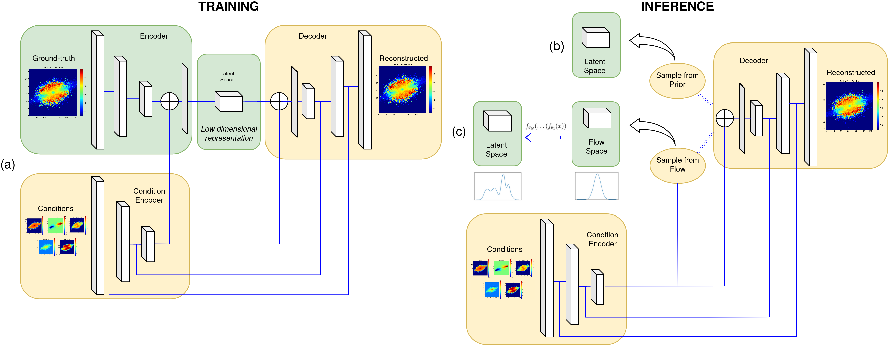
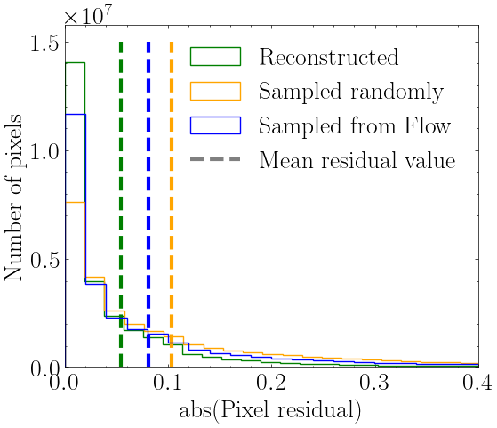
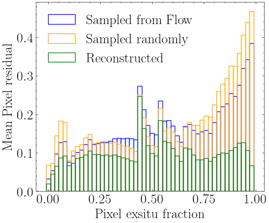
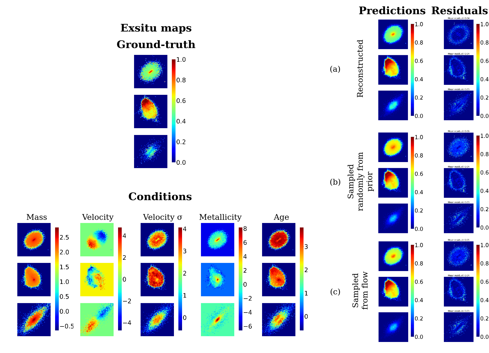

$\newcommand{\ensuremath}{}$
$\newcommand{\xspace}{}$
$\newcommand{\object}[1]{\texttt{#1}}$
$\newcommand{\farcs}{{.}''}$
$\newcommand{\farcm}{{.}'}$
$\newcommand{\arcsec}{''}$
$\newcommand{\arcmin}{'}$
$\newcommand{\ion}[2]{#1#2}$
$\newcommand{\textsc}[1]{\textrm{#1}}$
$\newcommand{\hl}[1]{\textrm{#1}}$
$\newcommand{\footnote}[1]{}$

# Simulation-based inference of the 2D ex-situ stellar mass fraction distribution of galaxies using variational autoencoders

<mark>Appeared on: 2024-11-01</mark> -  _6 pages, 3 figures_

E. Angeloudi, et al. -- incl., <mark>A. Pillepich</mark>

**Abstract:** Galaxies grow through star formation (in-situ) and accretion (ex-situ) of other galaxies. Reconstructing the relative contribution of these two growth channels is crucial for constraining the processes of galaxy formation in a cosmological context. In this on-going work, we utilize a conditional variational autoencoder along with a normalizing flow - trained on a state-of-the-art cosmological simulation -  in an attempt to infer the posterior distribution of the 2D ex-situ stellar mass distribution of galaxies solely from observable two-dimensional maps of their stellar mass, kinematics, age and metallicity. Such maps are typically obtained from large Integral Field Unit Surveys such as MaNGA. We find that the average posterior provides an estimate of the resolved accretion histories of galaxies with a mean $\sim 10\%$ error per pixel. We show that the use of a normalizing flow to conditionally sample the latent space results in a smaller reconstruction error. Due to the probabilistic nature of our architecture, the uncertainty of our predictions can also be quantified. To our knowledge, this is the first attempt to infer the 2D ex-situ fraction maps from observable maps.

**Figure 1. -** The architecture of the model consisting of a cVAE and optionally a normalizing flow. (a) The architecture of the cVAE during training. This model can also be used for inference when the ground truth is supplied as input to the encoder to acquire a lower bound of the reconstruction error the model is capable of. (b) The model during inference using only the trained cVAE. As the encoder part is removed, we sample from the prior of the latent space and along with the conditions, the ex-situ map is predicted from the decoder. (c) The model during inference when a trained normalizing flow on the latent space is included. We sample conditionally from the flow latent space for a vector compliant with the condition vector and the ex-situ map is predicted from the decoder while the observable maps also contribute to all convolution layers. (*fig:architecture*)

**Figure 3. -** Collective results for the model accuracy when the residuals are calculated on the whole test set. (a) The distribution of the pixel residuals when reconstructing the images using the ground-truth (reconstructed), sampling from the flow and sampling randomly from the prior. The mean residual values on the three scenarios are demonstrated as vertical lines colored correspondingly. (b) The correlation of the pixel residuals with the ex-situ fraction of the pixels. (*fig:resultsall*)

**Figure 2. -** The results of the Flow-VAE model predictions when evaluated on 3 galaxies from the test set with the ground-truth ex-situ maps and using the observable condition maps on the left. On the right, we show the posterior average calculated on 100 reconstructions of the decoder when supplied along with the conditions with (a) the latent space vectors the encoder outputs on the ground-truth (reconstruction) (b) latent space vectors sampled randomly from the prior (c) latent space vectors sampled from the normalizing flow mapped from the conditions. (*fig:results*)

