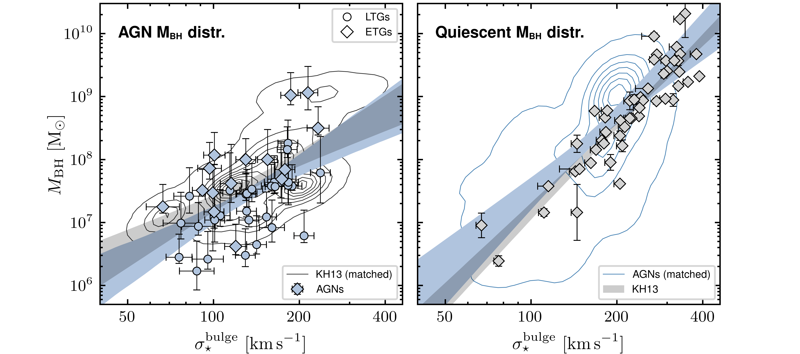
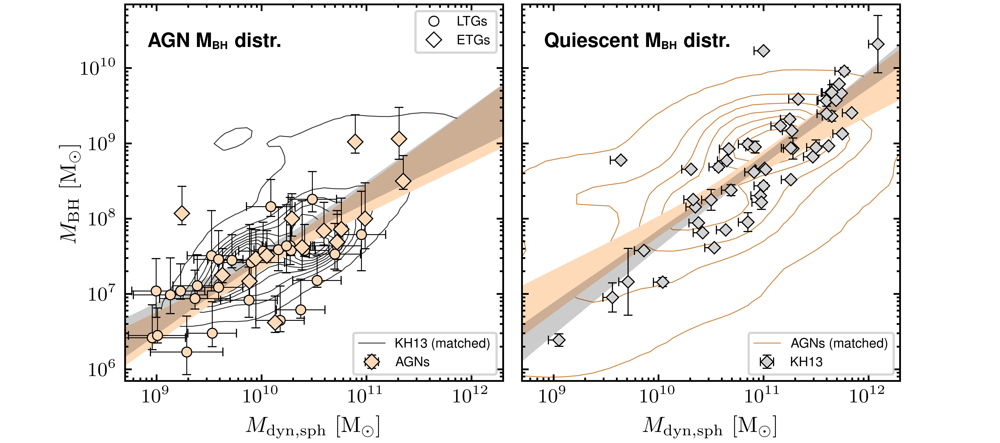
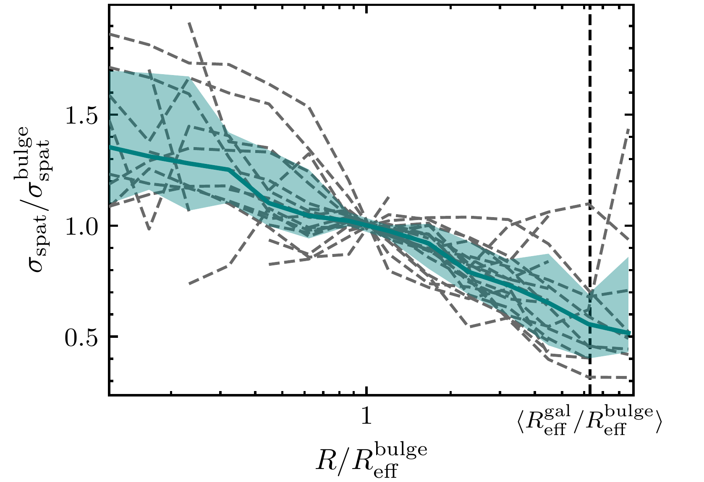
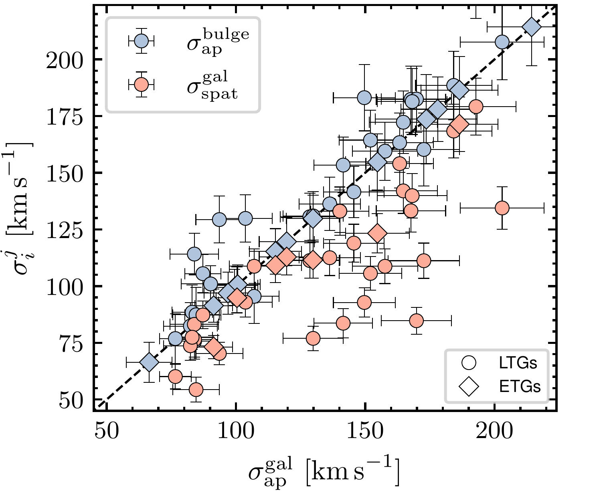

$\newcommand{\ensuremath}{}$
$\newcommand{\xspace}{}$
$\newcommand{\object}[1]{\texttt{#1}}$
$\newcommand{\farcs}{{.}''}$
$\newcommand{\farcm}{{.}'}$
$\newcommand{\arcsec}{''}$
$\newcommand{\arcmin}{'}$
$\newcommand{\ion}[2]{#1#2}$
$\newcommand{\textsc}[1]{\textrm{#1}}$
$\newcommand{\hl}[1]{\textrm{#1}}$
$\newcommand{\footnote}[1]{}$
$\newcommand{\vdag}{(v)^\dagger}$
$\newcommand$
$\newcommand$
$\newcommand$
$\newcommand$
$\newcommand$
$\newcommand$
$\newcommand$
$\newcommand$
$\newcommand$
$\newcommand$
$\newcommand$
$\newcommand$
$\newcommand$
$\newcommand$
$\newcommand$
$\newcommand$
$\newcommand$
$\newcommand$
$\newcommand\aa{@element@tr}$

# Combining Direct Black Hole Mass Measurements and Spatially Resolved Stellar Kinematics to Calibrate the $\mbh$-$\sigstar$ Relation of Active Galaxies

<mark>Appeared on: 2024-11-06</mark> -  _Resubmitted to ApJ after initial positive referee report. 40 pages, 19 figures, 6 tables_

Nico~Winkel, et al.

**Abstract:** The origin of the tight scaling relation between the mass of supermassive black holes (SMBHs; $\mbh$ ) and their host-galaxy properties remains unclear.    Active galactic nuclei (AGNs) probe phases of ongoing SMBH growth and offer the only opportunity to measure $\mbh$ beyond the local Universe. However, determining AGN host galaxy stellar velocity dispersion $\sigstar$ , and their galaxy dynamical masses $\mdyn$ , is complicated by AGN contamination, aperture effects and different host galaxy morphologies.    We select a sample of AGNs for which $\mbh$ has been independently determined to high accuracy by state-of-the-art techniques: dynamical modeling of the reverberation signal and spatially resolving the broad-line region with VLTI/GRAVITY.    Using IFU observations, we spatially map the host galaxy stellar kinematics across the galaxy and bulge effective radii.    We find that that the dynamically hot component of galaxy disks correlates with $\mbh$ ; however, the correlations are tightest for aperture-integrated $\sigstar$ measured across the bulge.    Accounting for the different $\mbh$ distributions, we demonstrate -- for the first time -- that AGNs follow the same $\mbh$ - $\sigstar$ and $\mbh$ - $\mbulgedyn$ relations as quiescent galaxies.    We confirm that the classical approach of determining the virial factor as sample-average, yielding ${\rm log }f= 0.65 \pm 0.18$ , is consistent with the average $\f$ from individual measurements.    The similarity between the underlying scaling relations of AGNs and quiescent galaxies implies that the current AGN phase is too short to have altered BH masses on a population level. These results strengthen the local calibration of $\f$ for measuring single-epoch $\mbh$ in the distant Universe.

**Figure 16. -** *\mbh-host-galaxy scaling relations of AGNs and quiescent galaxies.*(Top Left)
    Colored data points show AGNs hosted by LTGs (circles) and ETGs (squares), with the best-fitting observed relation shown as blue stripe (corresponding to row ii in Table \ref{tbl:Results}).
    For AGNs, no clear distinction between the relations of ETGs and LTGs is observed.
    The gray contours show the KH13 sample that is resampled in \mbh to match the AGNs' \mbh-distribution (see Sect. \ref{SubSec:Controlling_selection_effects}). with the fitted relations shown as shaded gray stripe.
    The relation of the \mbh-matched quiescent sample agrees with the AGNs' observed relation, and is significantly flatter than the observed relation of quiescent galaxies shown in the right panel.
    (Top right)
    After empirically matching the \mbh distribution of AGNs (blue contours) to that of quiescent galaxies (KH13 sample, gray data points), both fall onto the same region of the \mbh-\sigstar plane. The best-fitting relations of AGNs are shown as blue and gray stripes, and correspond to the relations in row corresponds to row (v) and (i) respectively, in Table \ref{tbl:Results}.
    (Bottom left)
    The same for the \mbh-\mbulgedyn relation, with the observed AGN listed in row (xii) of Table \ref{tbl:Results}.
    After matching the \mbh distribution, the relations of AGNs and quiescent galaxies are indistinguishable.
    (Bottom right) Same for matching the AGNs to the distribution of quiescent. The \mbh and \mbulgedyn relation correspond to row (xiv) of Table \ref{tbl:Results}.
     (*fig:MBH-scaling-relations*)

**Figure 1. -** *Radial profile of the spatially resolved stellar velocity dispersion \sigspat across AGN host-galaxy bulges.*
   We measure the spatially resolved stellar dispersion \sigspat in concentric annuli centered on the AGN position.
   Values of \sigspat are normalized to the value measured at the bulge effective radius $R_{\rm eff}^{\rm bulge}$.
   Dashed lines show the spatially resolved \sigspat of individual AGN host galaxies, shaded green regions the 16$^{th}$ to 84$^{th}$ percentile range of the stacked profile.
    (*fig:disp_radial*)

**Figure 2. -** *Comparing methods for measuring stellar velocity dispersion.*
   Aperture-integrated dispersion measured over $R_{\rm eff}^{\rm gal}$ is shown on the x-axis. On the y-axis, we show the aperture integrated dispersion over $R_{\rm eff}^{\rm bulge}$(blue) and the spatially resolved dispersion over $R_{\rm eff}^{\rm gal}$(orange), respectively.
   Compared to the one-to-one correlation, denoted by the dash-dotted line, the mean bulge dispersion is on average slightly higher than the dispersion measured across the galaxy. In contrast, spatially resolving the kinematics results in significantly lower dispersion.
    (*fig:sig_parameters*)

