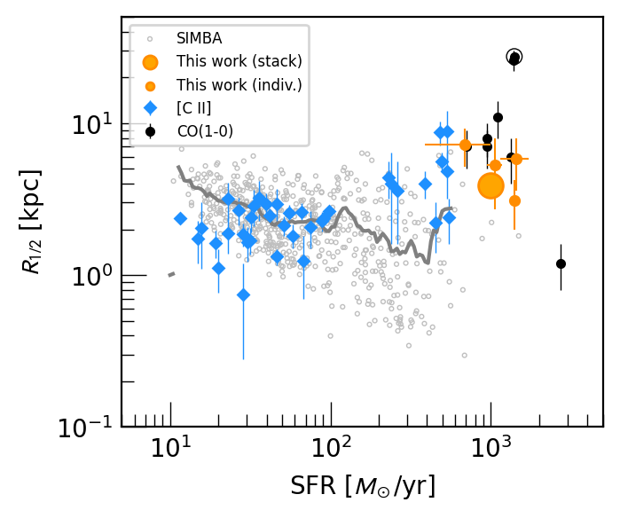
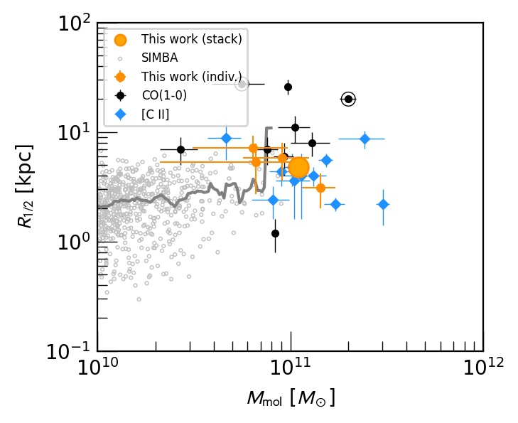
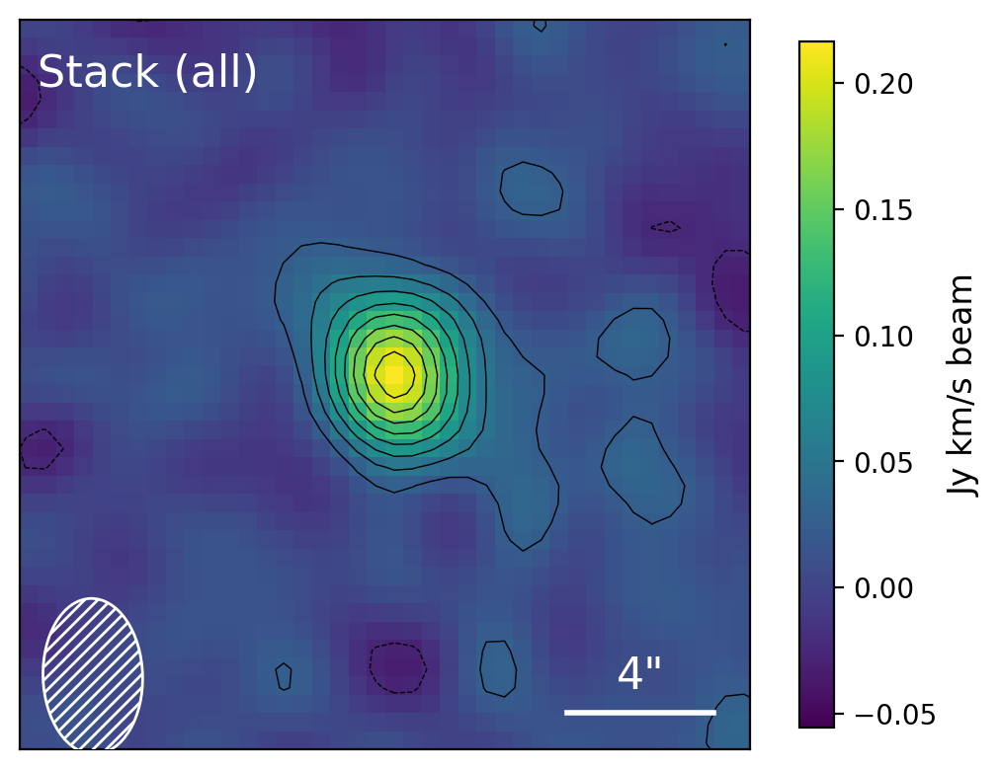
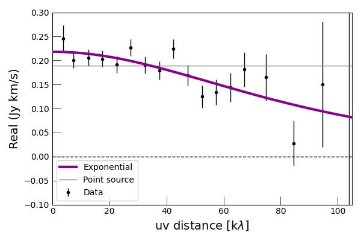
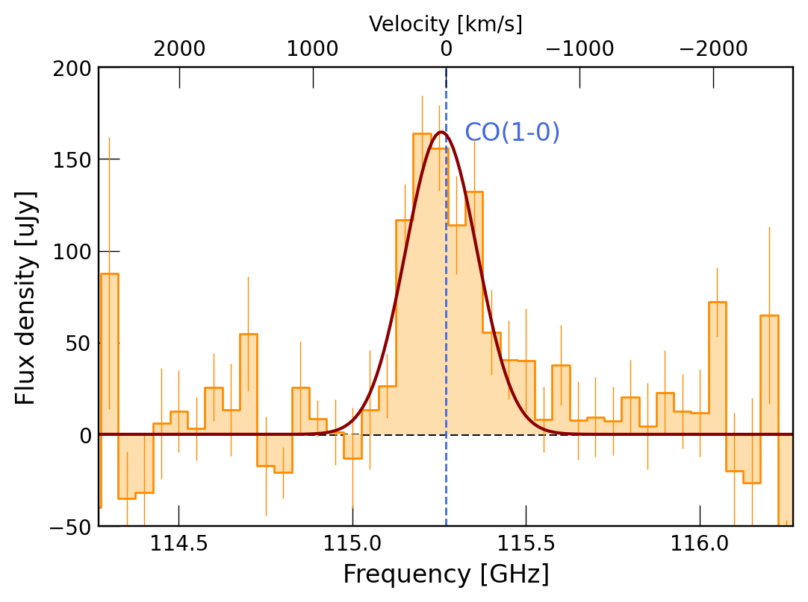

$\newcommand{\ensuremath}{}$
$\newcommand{\xspace}{}$
$\newcommand{\object}[1]{\texttt{#1}}$
$\newcommand{\farcs}{{.}''}$
$\newcommand{\farcm}{{.}'}$
$\newcommand{\arcsec}{''}$
$\newcommand{\arcmin}{'}$
$\newcommand{\ion}[2]{#1#2}$
$\newcommand{\textsc}[1]{\textrm{#1}}$
$\newcommand{\hl}[1]{\textrm{#1}}$
$\newcommand{\footnote}[1]{}$
$\newcommand{\comDS}[1]{\textcolor{blue}{#1} ~}$
$\newcommand{\avgg}[1]{\left< #1 \right>}$

# CO(1--0) imaging reveals 10-kiloparsec molecular gas reservoirs around star-forming galaxies at high redshift

<mark>Appeared on: 2024-11-12</mark> -  _Submitted to A&A. 9 pages, 5 figures_

M. Rybak, et al. -- incl., <mark>F. Walter</mark>

**Abstract:** Massive, intensely star-forming galaxies at high redshift require a supply of molecular gas from their gas reservoirs, replenished by infall from the surrounding circumgalactic medium, to sustain their immense star-formation rates. However, our knowledge of the extent and morphology of their cold-gas reservoirs is still in its infancy.  We present the results of stacking 80 hours of JVLA observations of CO(1--0) emission -- which traces the cold molecular gas -- in 19 $z=2.0-4.5$ dusty, star-forming galaxies from the AS2VLA survey. The visibility-plane stack reveals extended emission with a half-light radius of $3.8\pm0.5$ kpc, 2--3 $\times$ more extended than the dust-obscured star formation and $1.4\pm0.2\times$ more extended than the stellar emission. Similarly, stacking the [ $\ion{C}{i}$ ] (1--0) observations for a subsample of our galaxies yields sizes consistent with CO(1--0). The CO(1--0) size is comparable to the [ $\ion{C}{ii}$ ] halos detected around high-redshift star-forming galaxies.  The bulk (up to 80 \% ) of molecular gas resides outside the star-forming region; only a small part of their molecular gas reservoir directly contributes to their current star formation. Photon-dissociation region modelling indicates that the extended CO(1--0) emission arises from clumpy, dense clouds rather than smooth, diffuse gas.

**Figure 5. -** Half-light radii of CO(1--0) and [$\ion${C}{ii}] emission versus star-formation rate (_left_) and total molecular gas mass (_right_) for galaxies from our sample and literature (see Section \ref{subsec:sizes} references). The protoclusters from [Emonts, Lehnert and Villar-Martín (2016)]() and [Dannerbauer, Lehnert and Emonts (2017)]() are highlighted by circles. We also show predictions for $z=3.1$ galaxies from the SIMBA simulation  ([Davé, Anglés-Alcázar and Narayanan 2019]())  as open grey symbols; {grey lines indicate the running average}. The inferred size of the CO(1--0) emission in our sample is consistent to the extended CO(1--0) and [$\ion${C}{ii}] reservoirs around other high-redshift DSFGs with comparable SFR. (*fig:r_mmol_sigma*)

**Figure 4. -** Stacked CO(1--0) image-plane and $uv$-plane data for 19 sources with robust CO(1--0) detections.
    For the image-plane stack, the contours are drawn at $\pm(2,4,6...)\sigma$; the white ellipses indicate the mean FWHM beam size. The $uv$-plane data are integrated over $\pm$1 FWHM velocity range, radially binned with a step of 5 k$\lambda$. For CO(1--0), the exponential model with $R_\mathrm{1/2}$=$0.49\pm0.07"$(3.8$\pm$0.5 kpc at our median $z=3.1$) is strongly preferred by the evidence. (*fig:stack_image*)

**Figure 1. -** Rest-frame stacked spectrum, extracted from Cleaned cubes and normalised to the median flux-weighted redshift $z=3.1$. The rest-frame frequency resolution is 50 MHz ($\approx$125 km s$^{-1}$). The stacked spectrum is consistent with a Gaussian profile with a FWHM of $640\pm70$ km s$^{-1}$; we do not find any evidence for outflow signatures. The slight positive /negative excess at higher/lower frequencies is likely a weak residual continuum signal and is not associated with the CO(1--0) line. (*fig:spectral_stack*)

