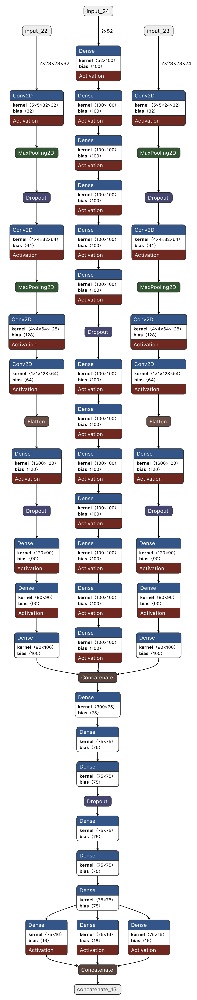

$\newcommand{\ensuremath}{}$
$\newcommand{\xspace}{}$
$\newcommand{\object}[1]{\texttt{#1}}$
$\newcommand{\farcs}{{.}''}$
$\newcommand{\farcm}{{.}'}$
$\newcommand{\arcsec}{''}$
$\newcommand{\arcmin}{'}$
$\newcommand{\ion}[2]{#1#2}$
$\newcommand{\textsc}[1]{\textrm{#1}}$
$\newcommand{\hl}[1]{\textrm{#1}}$
$\newcommand{\footnote}[1]{}$
$\newcommand{\asn}[1]{\textbf{\textcolor{blue}{AS: #1}}}$
$\newcommand{\mbn}[1]{\textbf{\textcolor{red}{MB: #1}}}$
$\newcommand{\adam}[1]{\textbf{\textcolor{green}{MB: #1}}}$

# ${PICZL}$: Image-based photometric redshifts for AGN

<mark>Appeared on: 2024-11-13</mark> -  _Accepted for publication in Astronomy & Astrophysics. 24 pages, 21 figures_

W. Roster, et al. -- incl., <mark>J. Wolf</mark>

**Abstract:** Computing reliable photometric redshifts (photo-z) for active galactic nuclei (AGN) is a challenging task, primarily due to the complex interplay between the unresolved relative emissions associated with the supermassive black hole and its host galaxy. Spectral energy distribution (SED) fitting methods, while effective for galaxies and AGN in pencil-beam surveys, face limitations in wide or all-sky surveys with fewer bands available, lacking the ability to accurately capture the AGN contribution to the SED, hindering reliable redshift estimation. This limitation is affecting the many 10s of millions of AGN detected in existing datasets, e.g., those AGN clearly singled out and identified by SRG/eROSITA. Our goal is to enhance photometric redshift performance for AGN in all-sky surveys while simultaneously simplifying the approach by avoiding the need to merge multiple data sets. Instead, we employ readily available data products from the 10th Data Release of the Imaging Legacy Survey for the Dark Energy Spectroscopic Instrument, which covers > 20,000 deg \textsuperscript{2} of extragalactic sky with deep imaging and catalog-based photometry in the _grizW1-W4_ bands. We fully utilize the spatial flux distribution in the vicinity of each source to produce reliable photo-z. We introduce ${PICZL}$ , a machine-learning algorithm leveraging an ensemble of convolutional neural networks. Utilizing a cross-channel approach, the algorithm integrates distinct SED features from images with those obtained from catalog-level data. Full probability distributions are achieved via the integration of Gaussian mixture models. On a validation sample of 8098 AGN, ${PICZL}$ achieves an accuracy $\sigma_{\mathrm{NMAD}}$ of 4.5 \% with an outlier fraction $\eta$ of 5.6 \% . These results significantly outperform previous attempts to compute accurate photo-z for AGN using machine learning. We highlight that the model's performance depends on many variables, predominantly the depth of the data and associated photometric error. A thorough evaluation of these dependencies is presented in the paper. Our streamlined methodology maintains consistent performance across the entire survey area, when accounting for differing data quality. The same approach can be adopted for future deep photometric surveys such as LSST and Euclid, showcasing its potential for wide-scale realization. With this paper, we release updated photo-z (including errors) for the XMM-SERVS W-CDF-S, ELAIS-S1 and LSS fields.

**Figure 5. -** Vibrational stability equation of state
               $S_{\mathrm{vib}}(\lg e, \lg \rho)$.
               $>0$ means vibrational stability.
              Vibrational stability equation of state
               $S_{\mathrm{vib}}(\lg e, \lg \rho)$.
               $>0$ means vibrational stability.
              Nonlinear Model ResultsNonlinear Model ResultsSpectral types and photometry for stars in the
  region.Spectral types and photometry for stars in the
  region.List of nearby SNe used in this work.Summary for ISOCAM sources with mid-IR excess
(YSO candidates).Summary for ISOCAM sources with mid-IR excess
(YSO candidates). Sample stars with absolute magnitudecontinued. Sample stars with absolute magnitudecontinued.Shown in greyscale is a...Plotted above...Complexes characterisation.Line data and abundances ...Continued. (*FigVibStab*)

**Figure 27. -** Vibrational stability equation of state
               $S_{\mathrm{vib}}(\lg e, \lg \rho)$.
               $>0$ means vibrational stability.
              Nonlinear Model ResultsNonlinear Model ResultsSpectral types and photometry for stars in the
  region.Spectral types and photometry for stars in the
  region.List of nearby SNe used in this work.Summary for ISOCAM sources with mid-IR excess
(YSO candidates).Summary for ISOCAM sources with mid-IR excess
(YSO candidates). Sample stars with absolute magnitudecontinued. Sample stars with absolute magnitudecontinued.Shown in greyscale is a...Plotted above...Complexes characterisation.Line data and abundances ...Continued. (*FigVibStab*)

**Figure 18. -** {PICZL} architecture, showcasing its three-threaded design. Two threads are dedicated to processing image inputs, while the third handles numerical data. The model's output layer generates distinct vectors corresponding to the means, standard deviations, and weights of multiple Gaussian distributions. This design enables the production of full PDFs, allowing the network to capture uncertainties. Question marks as the first dimension per thread input correspond to the (variable) sample size. (*fig:A.1*)

