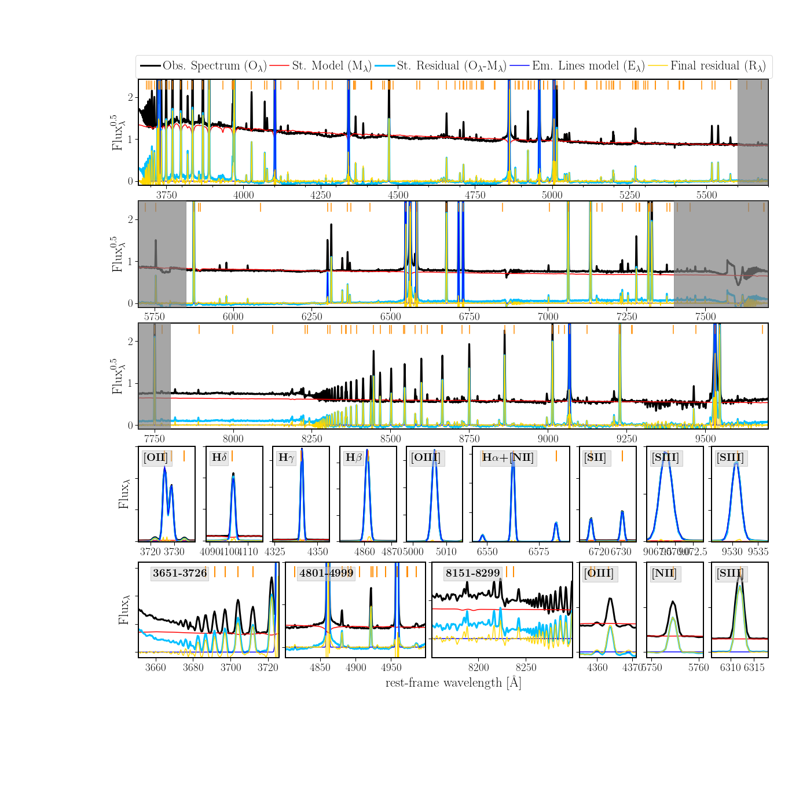
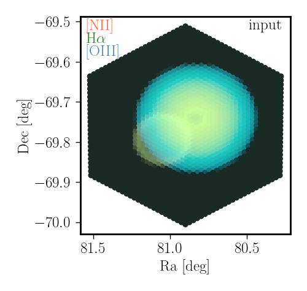
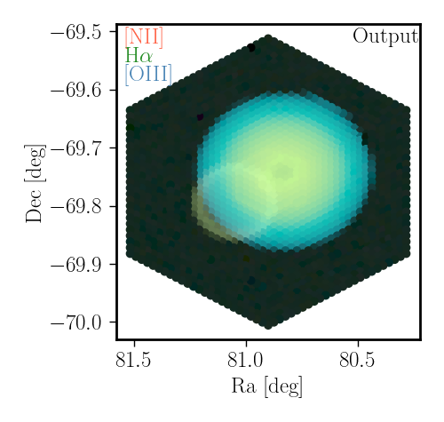
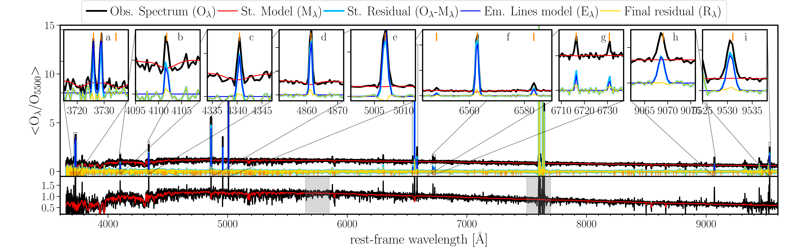
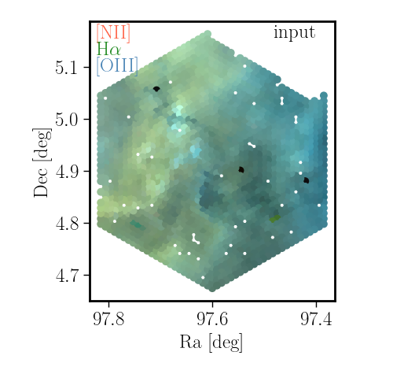
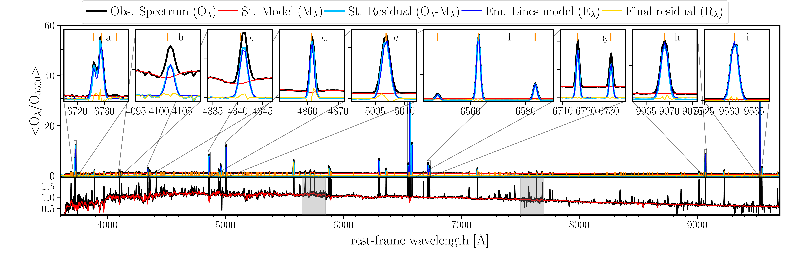

$\newcommand{\ensuremath}{}$
$\newcommand{\xspace}{}$
$\newcommand{\object}[1]{\texttt{#1}}$
$\newcommand{\farcs}{{.}''}$
$\newcommand{\farcm}{{.}'}$
$\newcommand{\arcsec}{''}$
$\newcommand{\arcmin}{'}$
$\newcommand{\ion}[2]{#1#2}$
$\newcommand{\textsc}[1]{\textrm{#1}}$
$\newcommand{\hl}[1]{\textrm{#1}}$
$\newcommand{\footnote}[1]{}$
$\newcommand{\lam}{\lambda}$
$\newcommand{\hi}{\ION{H}{i}}$
$\newcommand{\hii}{\ION{H}{ii}}$
$\newcommand{\hh}{\ION{H}{ii}~}$
$\newcommand{\hei}{\ION{He}{i}}$
$\newcommand{\heii}{\ION{He}{ii}}$
$\newcommand{\nii}{[\ION{N}{ii}]}$
$\newcommand{\oi}{[\ION{O}{i}]}$
$\newcommand{\oii}{[\ION{O}{ii}]}$
$\newcommand{\oiii}{[\ION{O}{iii}]}$
$\newcommand{\sii}{[\ION{S}{ii}]}$
$\newcommand{\siii}{[\ION{S}{iii}]}$
$\newcommand{\caii}{[\ION{Ca}{ii}]}$
$\newcommand{\feii}{[\ION{Fe}{ii}]}$
$\newcommand{\ariii}{[\ION{Ar}{iii}]}$
$\newcommand{\neiii}{[\ION{Ne}{iii}]}$
$\newcommand{\eduardo}[1]{\textbf{\textcolor{blue}{Eduardo: {#1}}}}$
$\newcommand{\ha}{\rm{H}\alpha}$
$\newcommand{\hb}{\rm{H}\beta}$
$\newcommand{\hd}{\rm{H}\delta}$
$\newcommand{\hg}{\rm{H}\gamma}$
$\newcommand{\he}{\rm{H}\epsilon}$
$\newcommand{\mHa}{\rm{H}\alpha}$
$\newcommand{\Ha}{\rm{H}\alpha}$
$\newcommand{\Hb}{\rm{H}\beta}$
$\newcommand{\logU}{\log(\bar U)}$
$\newcommand{\Kdist}{K_{dist}}$
$\newcommand{\EWa}{EW(\Ha)}$
$\newcommand{\fOB}{f(OB)}$
$\newcommand{\QHHe}{Q_{0/1}}$
$\newcommand{\Com}[1]{{\color{red}*** #1}}$
$\newcommand{\Te}{T_{\rm e}}$
$\newcommand{\Ssfr}{\Sigma_{\rm SFR} }$
$\newcommand{\Sst}{\Sigma_{\rm *} }$
$\newcommand{\Sgas}{\Sigma_{\rm mol} }$
$\newcommand{\Srgas}{\Sigma_{\rm gas} }$
$\newcommand{\eSsfr}{\Sigma_{\rm SFR}}$
$\newcommand{\eSst}{\Sigma_{\rm *}}$
$\newcommand{\eSgas}{\Sigma_{\rm mol}}$
$\newcommand{\Rsfr}{\rho_{\rm SFR} }$
$\newcommand{\Rst}{\rho_{\rm *} }$
$\newcommand{\Rgas}{\rho_{\rm gas} }$
$\newcommand{\alf}{[\alpha/Fe]}$
$\newcommand{\oz}{[O/Fe]}$
$\newcommand{\fe}{[Fe/H]}$
$\newcommand{\age}{\mathcal{A}_{\star,L}}$
$\newcommand{\met}{\mathcal{Z}_{\star,L}}$
$\newcommand{\kms}{km s^{-1}}$
$\newcommand{\flux}{erg s^{-1} cm^{-2}}$
$\newcommand{\edr}{Sánchez et al. (submitted)}$
$\newcommand{\edrp}{(Sánchez et al., submitted)}$
$\newcommand{\vdag}{(v)^\dagger}$
$\newcommand$
$\newcommand$
$\newcommand{\OSU}{\label{OSU} Department of Astronomy, The Ohio State University, 140 West 18th Avenue, Columbus, Ohio 43210, USA}$
$\newcommand{\Alberta}{\label{Alberta} Department of Physics, University of Alberta, Edmonton, AB T6G 2E1, Canada}$
$\newcommand{\ANU}{\label{ANU} Research School of Astronomy and Astrophysics, Australian National University, Canberra, ACT 2611, Australia}$
$\newcommand{\IPAC}{\label{IPAC} Caltech-IPAC, 1200 E. California Blvd. Pasadena, CA 91125, USA}$
$\newcommand{\Carnegie}{\label{Carnegie} Observatories of the Carnegie Institution for Science, 813 Santa Barbara Street, Pasadena, CA 91101, USA}$
$\newcommand{ÇAPP}{\label{CCAPP} Center for Cosmology and Astroparticle Physics, 191 West Woodruff Avenue, Columbus, OH 43210, USA}$
$\newcommand{\CfA}{\label{CfA}Harvard-Smithsonian Center for Astrophysics, 60 Garden Street, Cambridge, MA 02138, USA}$
$\newcommand{\CITEVA}{\label{CITEVA} Centro de Astronomía (CITEVA), Universidad de Antofagasta, Avenida Angamos 601, Antofagasta, Chile}$
$\newcommand{\CNRS}{\label{CNRS} CNRS, IRAP, 9 Av. du Colonel Roche, BP 44346, F-31028 Toulouse cedex 4, France}$
$\newcommand{\ESO}{\label{ESO} European Southern Observatory, Karl-Schwarzschild Stra{\ss}e 2, D-85748 Garching bei München, Germany}$
$\newcommand{\ESOChile}{\label{ESOChile} European Southern Observatory, Avenida Alonso de Cordoba 3107, Casilla 19, Santiago 19001, Chile}$
$\newcommand{\HD}{\label{HD} Astronomisches Rechen-Institut, Zentrum für Astronomie der Universität Heidelberg, Mönchhofstra\ss e 12-14, D-69120 Heidelberg, Germany}$
$\newcommand{\ICRAR}{\label{ICRAR} International Centre for Radio Astronomy Research, University of Western Australia, 35 Stirling Highway, Crawley, WA 6009, Australia}$
$\newcommand{\IRAM}{\label{IRAM} Institut de Radioastronomie Millimétrique (IRAM), 300 Rue de la Piscine, F-38406 Saint Martin d'Hères, France}$
$\newcommand{\ITA}{\label{ITA} Universität Heidelberg, Zentrum für Astronomie, Institut für Theoretische Astrophysik, Albert-Ueberle-Str 2, D-69120 Heidelberg, Germany}$
$\newcommand{\IWR}{\label{IWR} Universität Heidelberg, Interdisziplinäres Zentrum für Wissenschaftliches Rechnen, Im Neuenheimer Feld 205, D-69120 Heidelberg, Germany}$
$\newcommand{\JHU}{\label{JHU} Department of Physics and Astronomy, The Johns Hopkins University, Baltimore, MD 21218, USA}$
$\newcommand{\Leiden}{\label{Leiden} Leiden Observatory, Leiden University, P.O. Box 9513, 2300 RA Leiden, The Netherlands}$
$\newcommand{\Maryland}{\label{Maryland} Department of Astronomy, University of Maryland, College Park, MD 20742, USA}$
$\newcommand{\MPE}{\label{MPE} Max-Planck-Institut für extraterrestrische Physik, Giessenbachstra{\ss}e 1, D-85748 Garching, Germany}$
$\newcommand{\MPIA}{\label{MPIA} Max-Planck-Institut für Astronomie, Königstuhl 17, D-69117, Heidelberg, Germany}$
$\newcommand{\Nagoya}{\label{Nagoya} Department of Physics, Nagoya University, Furo-cho, Chikusa-ku, Nagoya, Aichi 464-8602, Japan}$
$\newcommand{\NRAO}{\label{NRAO} National Radio Astronomy Observatory, 520 Edgemont Road, Charlottesville, VA 22903-2475, USA}$
$\newcommand{\OAN}{\label{OAN} Observatorio Astronómico Nacional (IGN), C/Alfonso XII, 3, E-28014 Madrid, Spain}$
$\newcommand{\ObsParis}{\label{ObsParis} Sorbonne Université, Observatoire de Paris, Université PSL, CNRS, LERMA, F-75014, Paris, France}$
$\newcommand{\Princeton}{\label{Princeton} Department of Astrophysical Sciences, Princeton University, Princeton, NJ 08544 USA}$
$\newcommand{\UToledo}{\label{UToledo} University of Toledo, 2801 W. Bancroft St., Mail Stop 111, Toledo, OH, 43606}$
$\newcommand{\Toulouse}{\label{Toulouse} Université de Toulouse, UPS-OMP, IRAP, F-31028 Toulouse cedex 4, France}$
$\newcommand{\UBonn}{\label{UBonn} Argelander-Institut für Astronomie, Universität Bonn, Auf dem Hügel 71, 53121 Bonn, Germany}$
$\newcommand{\UChile}{\label{UChile} Departamento de Astronomía, Universidad de Chile, Camino del Observatorio 1515, Las Condes, Santiago, Chile}$
$\newcommand{\UConn}{\label{UConn} Department of Physics, University of Connecticut, Storrs, CT, 06269, USA}$
$\newcommand{\UCSD}{\label{UCSD}Center for Astrophysics and Space Sciences, Department of Physics,  University of California, San Diego, 9500 Gilman Drive, La Jolla, CA 92093, USA}$
$\newcommand{\UGent}{\label{UGent} Sterrenkundig Observatorium, Universiteit Gent, Krijgslaan 281 S9, B-9000 Gent, Belgium}$
$\newcommand{\ULyon}{\label{ULyon} Univ Lyon, Univ Lyon 1, ENS de Lyon, CNRS, Centre de Recherche Astrophysique de Lyon UMR5574,\ F-69230 Saint-Genis-Laval, France}$
$\newcommand{\UMass}{\label{UMass} University of Massachusetts—Amherst, 710 N. Pleasant Street, Amherst, MA 01003, USA}$
$\newcommand{\UWyoming}{\label{UWyoming} Department of Physics and Astronomy, University of Wyoming, Laramie, WY 82071, USA}$
$\newcommand{\LAM}{\label{LAM} Aix Marseille Univ, CNRS, CNES, LAM (Laboratoire d’Astrophysique de Marseille), Marseille, France}$
$\newcommand{\UHawaii}{\label{UHawaii} Institute for Astronomy, University of Hawaii, 2680 Woodlawn Drive, Honolulu, HI 96822, USA}$
$\newcommand{\UCM}{\label{UCM} Departamento de Física de la Tierra y Astrofísica, Universidad Complutense de Madrid, E-28040, Spain}$
$\newcommand{\IPARC}{\label{IPARC} Instituto de Física de Partículas y del Cosmos IPARCOS, Facultad de Ciencias Físicas, Universidad Complutense de Madrid, E-28040, Spain}$
$\newcommand{\STScI}{\label{STScI} Space Telescope Science Institute, 3700 San Martin Drive, Baltimore, MD 21218, USA}$
$\newcommand{\McMaster}{\label{McMaster} Department of Physics and Astronomy, McMaster University, 1280 Main Street West, Hamilton, ON L8S 4M1, Canada}$
$\newcommand{\INAF}{\label{INAF} INAF -- Osservatorio Astrofisico di Arcetri, Largo E. Fermi 5, I-50157, Firenze, Italy}$
$\newcommand{\Sydney}{\label{Sydney} Sydney Institute for Astronomy, School of Physics A28, The University of Sydney, NSW 2006, Australia}$
$\newcommand{\CITA}{\label{CITA} Canadian Institute for Theoretical Astrophysics (CITA), University of Toronto, 60 St George St, Toronto, ON M5S 3H8, Canada}$
$\newcommand{\ASIAA}{\label{ASIAA} Institute of Astronomy and Astrophysics, Academia Sinica, No. 1, Sec. 4, Roosevelt Road, Taipei 10617, Taiwan}$
$\newcommand{\TKU}{\label{TKU} Department of Physics, Tamkang University, No.151, Yingzhuan Rd., Tamsui Dist., New Taipei City 251301, Taiwan}$
$\newcommand{\PSMA}{\label{PSMA} Penn State Mont Alto, 1 Campus Drive, Mont Alto, PA  17237, USA}$
$\newcommand{\ILL}{\label{ILL} ILL}$
$\newcommand{\stromlo}{\label{stromlo} Research School of Astronomy and Astrophysics, Australian National University, Mt Stromlo Observatory, Weston Creek, ACT 2611, Australia}$
$\newcommand{\UCatolica}{\label{UCatolica} Instituto de Astronomía, Universidad Católica del Norte, Av. Angamos 0610, Antofagasta, Chile}$
$\newcommand{\UT}{\label{UT} McDonald Observatory, The University of Texas at Austin, 1 University Station, Austin, TX 78712-0259, USA}$
$\newcommand{\Vanderbilt}{\label{Vanderbilt} Department of Physics and Astronomy, Vanderbilt University, VU Station 1807, Nashville, TN 37235, USA}$
$\newcommand{\UNF}{\label{UNF} Department of Physics, University of North Florida, 1 UNF Dr. Jacksonville FL 32224}$
$\newcommand{\NAOC}{\label{NAOC} Chinese Academy of Sciences South America Center for Astronomy, National Astronomical Observatories, CAS, Beijing 100101, China}$
$\newcommand{\CASA}{\label{CASA} Center for Astrophysics and Space Astronomy, University of Colorado, 389 UCB, Boulder, CO 80309-0389, USA}$
$\newcommand{\UNAM}{\label{UNAM} Universidad Nacional Autónoma de México, Instituto de Astronomía, AP 106, Ensenada 22800, BC, México}$
$\newcommand{\UDP}{\label{UDP} Instituto de Estudios Astrofísicos, Facultad de Ingeniería y Ciencias, Universidad Diego Portales, Av. Ejército Libertador 441, Santiago, Chile}$
$\newcommand{\Steward}{\label{Steward} Steward Observatory, University of Arizona, 933 N. Cherry Ave., Tucson, AZ 85721-0065, USA}$
$\newcommand{\APO}{\label{APO} Apache Point Observatory and New Mexico State University, P.O. Box 59,$
$Sunspot, NM 88349-0059, USA}$
$\newcommand{\UNAMCU}{\label{UNAMCU} Universidad Nacional Autónoma de México, Instituto de Astronomía, AP 70-264, CDMX 04510, México}$
$\newcommand{\UWash}{\label{UWash}Department of Astronomy, University of Washington, Seattle, WA, 98195}$
$\newcommand{Ç}{\label{CC}Department of Physics, Colorado College, Colorado Springs, CO 80903}$
$\newcommand{\Utah}{\label{Utah}Department of Physics and Astronomy, University of Utah, 115 S. 1400 E., Salt Lake City, UT 84112, USA}$
$\newcommand{\UConcepcion}{\label{UConcepcion}Departamento de Astronomía, Universidad de Concepción, Casilla 160-C, Concepción, Chile}$
$\newcommand{\FCLA}{\label{FCLA}Franco-Chilean Laboratory for Astronomy, IRL 3386, CNRS and Universidad de Chile, Santiago, Chile}$
$\newcommand{\Oklahoma}{\label{Oklahoma}Homer L. Dodge Department of Physics and Astronomy, University of Oklahoma, Norman, OK 73019, USA}$
$\newcommand{\UIUC}{\label{UIUC}Department of Astronomy, University of Illinois, Urbana, IL 61801, USA}$
$\newcommand{\Harvard}{\label{Harvard}Harvard-Smithsonian Center for Astrophysics, Cambridge, MA 02138, USA}$
$\newcommand{\caltech}{\label{caltech}Department of Astronomy, California Institute of Technology, Pasadena, CA 91125, USA}$
$\newcommand{\pyf}{\texttt{pyFIT3D}\xspace}$
$\newcommand{\pyp}{\texttt{pyPipe3D}\xspace}$

# The SDSS-V Local Volume Mapper (LVM): Data Analysis Pipeline

<mark>Appeared on: 2024-11-18</mark> -  _35 pages, 17 figures, 8 tables, accepted for publication in AJ_

S. F. Sánchez, et al. -- incl., <mark>K. Kreckel</mark>

**Abstract:** We introduce the Data Analysis Pipeline (DAP) for the Sloan Digital Sky Survey V (SDSS-V) Local Volume Mapper (LVM) project, referred to as the LVM-DAP. ${ We outline our methods for recovering both stellar and emission line components from the optical integral field spectroscopy, highlighting the developments and changes implemented to address specific challenges of the data set.}$ The observations from the LVM project are unique because they cover a wide range of physical resolutions, from approximately 0.05 pc to 100 pc, depending on the distance to the targets. This, along with the varying number of stars sampled in each aperture (ranging from ${ zero, just one of a few, }$ to thousands), presents challenges in using previous spectral synthesis methods and interpreting the spectral fits. We provide a detailed explanation of how we model the stellar content and separate it from the ionized gas emission lines.  To assess the accuracy of our results, we compare them with both idealized and more realistic simulations, highlighting the limitations of our methods. We find that ${ the DAP}$ robustly correct for stellar continuum features and recover emission line parameters (e.g. flux, equivalent width, systemtic velocity and velocity dispersion) ${ with a precision and accuracy that fulfill the requirements of the primary goal of the analysis. In addition,}$ the recovered stellar parameters are reliable for single stars, the recovery of integrated populations is less precise. We conclude with a description of the data products we provide, instructions for downloading and using our software, and a showcase illustrating the quality of the data and the analysis on a deep exposure taken on the Huygens region at the center of the Orion Nebula.

**Figure 15. -** Integrated spectrum of the central 5'$\times$6' region of the Orion Nebula (black solid line), together with the best-fitted stellar model (red solid line), the model of the strongest emission lines fitted with Gaussian functions (blue solid line), and the residual after subtraction of the stellar model (cyan solid line), and the combination of both models, including a final correction to the shape of the residual (yellow solid line). The first three panels from top to bottom present the wavelength ranges covered by the blue (1st row), green (2nd row), and infrared (3rd row) arms that comprise the LVM spectrograph. Shaded regions correspond to the overlapping regimes between them. Like in the case of figures \ref{fig:lvmsim} and \ref{fig:dapsim}, the insets in the two bottom rows show a set of zoom-ins at certain particular wavelength ranges. The panels in the 4th row illustrate the quality of the modeling of the strongest emission lines, including the same lines already shown in Fig. \ref{fig:lvmsim} and \ref{fig:dapsim}. Finally, the last row of panels includes three wavelength ranges (3651-3726 Å, 4801-4999 Å, and 8151-8299 Å) that illustrate certain particularities of the spectrum discussed in the text. Three additional panels present a zoom around the three auroral lines most frequently used to determine the electron temperature in ionized nebulae: $\oi$ii 4363, $\nii$ 5755, and $\sii$i 6312. The flux ranges in these three last insets are the same to facilitate the comparison between the lines. In the particular case of this very deep spectrum, all three are clearly detected. (*fig:O_spec*)

**Figure 9. -** Upper-panels: Spatial distribution of the input (left panel) and recovered (right panel) fluxes of the $\oi$ii 5007 (blue), H$\alpha$(green) and $\nii$ 6583 (red) emission lines in an arbitrary scale. Lower-panel: Example of the spectral modelling, showing the spectrum integrated across the Field-of-View (FoV) of the simulated IFS dataset (black solid line), together the best model for the stellar component (red solid line) and the set of strong ionized emission lines (blue solid line). The residuals of the subtraction of the stellar model (cyan solid line), and both models (yellow solid line) are also included. All the spectra are presented in the original flux intensities (middle panel), and normalized to one at 5000 Å (bottom panel). The orange vertical marks indicate the wavelengths at which the algorithm would attempt to extract the properties of a predefined set of emission lines using a weighted moment analysis, as described in the text. Shaded regions correspond to the overlapping regimes between the three arms of the spectrographs. The panel insets show zoom-ins in the wavelength range covered by a set of strong emission lines, including the $\oi$i doublet, H$\delta$, H$\gamma$, $\Hb$, $\oi$ii, $\Ha$, $\nii$, $\sii$, and the $\sii$i 9069, 9531 doublet.  (*fig:lvmsim*)

**Figure 10. -** Similar figure as the one shown in Fig. \ref{fig:lvmsim}, adopting the same nomenclature, symbols and color schemes, for the realistic simulation performed using one LVM pointing on the Rosetta nebula. White hexagons inside the IFU corresponds to broken and low-transmission fibers in the input data. (*fig:dapsim*)

