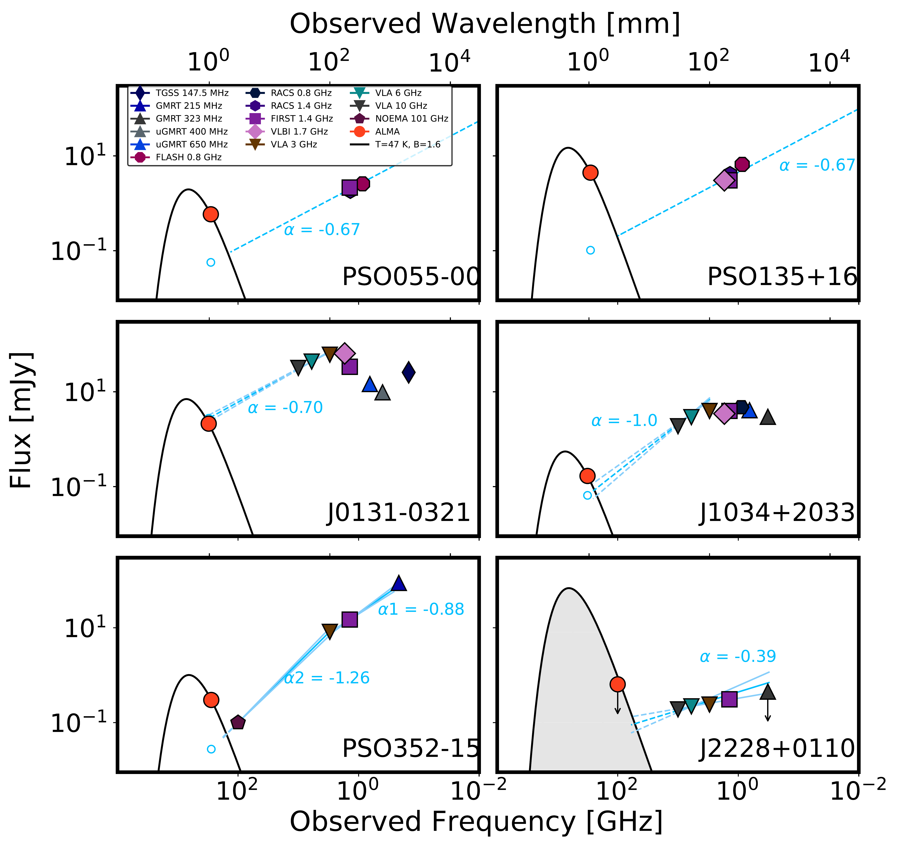
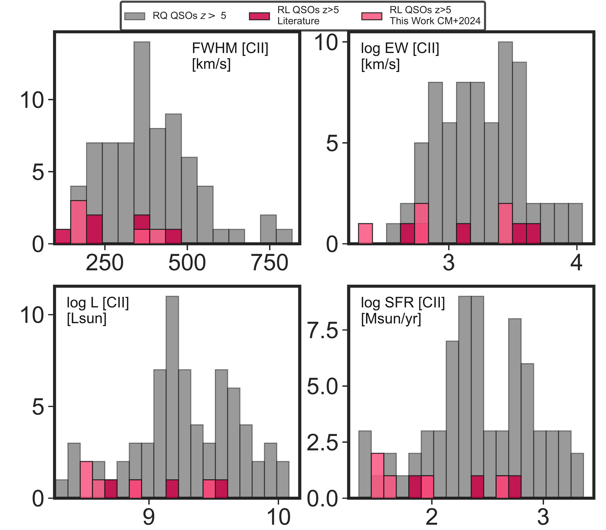
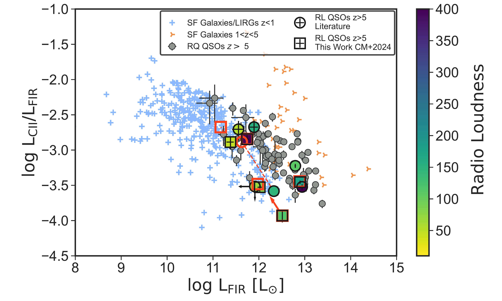

$\newcommand{\ensuremath}{}$
$\newcommand{\xspace}{}$
$\newcommand{\object}[1]{\texttt{#1}}$
$\newcommand{\farcs}{{.}''}$
$\newcommand{\farcm}{{.}'}$
$\newcommand{\arcsec}{''}$
$\newcommand{\arcmin}{'}$
$\newcommand{\ion}[2]{#1#2}$
$\newcommand{\textsc}[1]{\textrm{#1}}$
$\newcommand{\hl}[1]{\textrm{#1}}$
$\newcommand{\footnote}[1]{}$
$\newcommand{\lya}{\mathrm{Ly}\ensuremath{\alpha}}$
$\newcommand{\civ}{C IV}$
$\newcommand{\mgii}{Mg II}$
$\newcommand{\cii}{[C II]}$
$\newcommand{\co}{CO(6-5)}$
$\newcommand{\cp}{C^{+}}$

# The host galaxies of radio--loud quasars at $z>$5 with ALMA

<mark>Appeared on: 2024-11-20</mark> -  _20 pages; 11 figures; accepted for publication in A&A_

C. Mazzucchelli, et al. -- incl., <mark>S. Belladitta</mark>, <mark>E. Bañados</mark>, <mark>Y. Khusanova</mark>, <mark>F. Walter</mark>

**Abstract:** The interaction between radio-jets and quasar host galaxies plays a paramount role in quasar/galaxy co-evolution. However, very little has been known so far about this interaction at very high $-z$ .  Here, we present new Atacama Large Millimeter/submillimeter Array (ALMA) observations in Band 7 and Band 3 of six radio-loud quasars' host galaxies at $z > 5$ . We recover $\cii$ 158 $\mu$ m line and underlying dust continuum emission at $>2\sigma$ for five sources, while we obtain upper limits for the $\co$ emission line and continuum for the remaining source.  At the spatial resolution of our observations ( $\sim$ 1 $\farcs$ 0-1 $\farcs$ 4), we do not recover perturbed/extended morphologies or kinematics, signatures of potential mergers.  These galaxies already host large quantities of gas ( $\sim10^{10}$ M $_{\odot}$ ), with $\cii$ luminosities of $L_{\rm \cii}\sim10^{8-9} L_{\odot}$ and $\cii$ -based star formation rates of $30-400 M_{\odot} $ yr $^{-1}$ .  Building their radio/sub-mm spectral energy distributions (SEDs), we find that in at least four cases the 1mm continuum intensity arises from a combination of synchrotron and dust emission, with an initial estimation of synchrotron contribution at 300 GHz of $\gtrsim$ 10 \% .  Assuming the case in which the continuum emission is due to only cold dust as upper limit, we obtain infrared (IR) luminosities of $L_{\rm IR}\sim10^{11-12} L_{\odot}$ .  We compare the properties of the sources inspected here with a large collection of radio-quiet sources from the literature, as well as a sample of radio-loud quasars from previous studies, at comparable redshift.  We recover a potential mild decrease in $L_{\rm \cii}$ for the radio-loud sources, which might be due to a suppression of the cool gas emission due to the radio-jets.  We do not find any $\cii$ emitting companion galaxy candidate around the five radio-loud quasars observed in Band 7: given the depth of our dataset, this result is still consistent with that observed around radio-quiet quasars.  Further higher-spatial resolution observations, over a larger frequency range, of high $-z$ radio-loud quasars hosts will allow for a better understanding of the physics of such sources.

**Figure 10. -** Radio and (sub-)mm Spectral Energy Distributions (SED) of RL quasars reported in this work. We show the continuum emission at 1mm from our ALMA Band 7 observations (_ orange circles_), and the relative best fit modified black body dust emission (_ black line_). In the case of J2228+0110, we could retrieve only upper-limits from our ALMA Band 3 data, and we show the corresponding limits on its dust emission with a _ shaded grey area_. All modified black-body are calculated with T=47 K and $\beta=$1.6 (see Section \ref{sec:analysis_lum}). For each quasar, we report the radio observations obtained from a collection of literature data (see Section \ref{sec:sed} for references). For J0131-0321, J1034+2033, PSO352-15, J2228+0110 we show (broken) power-law radio emissions, with slopes ($\alpha$) derived from fits in the literature. For PSO055-00, PSO135+16, we assume a median high$-z$ slope value (see Section \ref{sec:sed}). The _ solid light blue lines_ are the measured power-law functions, while we report with _ dashed lines_ the extrapolation to lower/higher frequencies. The _ light cyan_ lines highlight the regions encompassed by the 1$\sigma$ uncertainties on the power-law slopes. We show with _ light blue empty circles_ the flux extrapolated from the synchtrotron power-law functions at the ALMA frequency targeted in this work. (*fig:sed*)

**Figure 2. -**  Distribution of $\cii$  emission line and properties for RL (_pink_), and RQ (_grey_) quasars.  (*fig:distrprop*)

**Figure 3. -** $\cii$-to-FIR luminosity ratio as a function of FIR luminosity. Observations of star-forming galaxies and LIRGs at $z<1$ are shown with _light blue crosses_, while we report star-forming galaxies at $1<z<5$ with _orange arrows_. RQ quasars from the literature are depicted with _grey points_. All references for these data are reported in Section \ref{sec:analysis_sample} and \ref{sec:analysis_lum}. We show in _circles_ RL quasars observations from \cite{khusanova2022}, \cite{venemans2020} and \cite{banados2024b} and in _squares_ the values derived in this work, considering that the total measured ALMA continuum flux is due only to dust, all color-coded for radio loudness parameter. We note that RL quasars occupy a similar parameter space of that of RQ quasars' hosts, with the exception of the sources J0131-0321 and J0410-0139 (with $L_{\rm $\cii$} / L_{\rm FIR} \sim 10^{-3.5-4}$). When considering FIR luminosities accounting for the synchrotron contribution-derived flux (_ red squares_ for sources from this work, _ red circle_ from \citealt{banados2024b}), even the above mentioned outliers move closer to the RQ quasars' hosts location.  (*fig:lfir_lciifir*)

